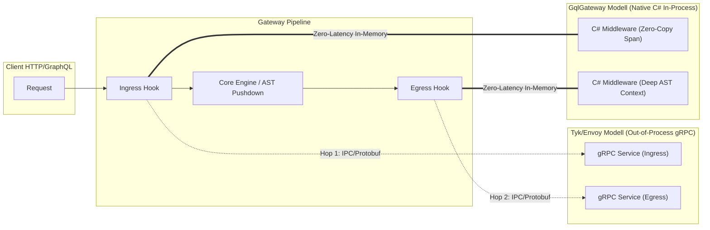
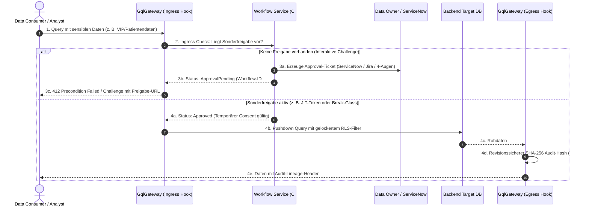
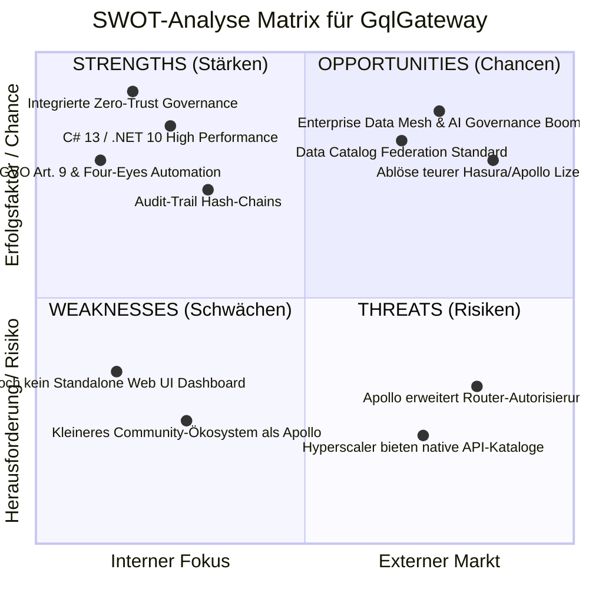

# Enterprise Product Manager & Platform Strategist (GqlGateway)

Dieser Skill definiert die Rolle, Methodik und Werkzeuge des **Principal Enterprise Product Managers** für das `GqlGateway`- und `GqlGateway.Extensions`-Ökosystem.

Die primäre Mission ist es, **GqlGateway als marktführendes Zero-Trust Enterprise GraphQL Gateway zu etablieren**, das Konkurrenzprodukte durch unschlagbare Data-Owner-Governance, DSGVO-Konformität, extreme Performance (.NET 10) und nahtlose Unternehmenskatalog-Integration übertrifft.

---

## 1. Wettbewerbs- & Marktanalysen (Competitive Intelligence)

Als Product Manager führst du kontinuierliche Markt- und Gap-Analysen gegen die Hauptwettbewerber durch:

### Wettbewerber-Matrix & Schwachstellen-Analyse

| Konkurrent | Stärken | Kritische Schwachstellen & Lücken | Unsere Differenzierungs-Strategie (GqlGateway Moat) |
| :--- | :--- | :--- | :--- |
| **Apollo GraphQL**<br/>*(Router / Federation v2 / GraphOS)* | • Marktführer Schema Federation<br/>• Großes Entwickler-Ökosystem<br/>• Gute JS/Rust Router Performance | • Router unter restriktiver ELv2-Lizenz<br/>• **Schlechte Data-Governance**: Row-Level Security nur delegiert an Subgraphs<br/>• Kein nativer Sync mit Enterprise-Katalogen (Purview/Collibra)<br/>• Keine native DSGVO Art. 9 Automatik | **Enterprise Zero-Trust First**: Native ABAC (Casbin) & Field Masking im Core Router, automatischer Sync mit Purview/Collibra/Alation; echtes Zero-Allocation Pushdown statt Subgraph-Kaskaden. |
| **Hasura Enterprise**<br/>*(DDN / Data Delivery Network)* | • Instant GraphQL über SQL-DBs<br/>• Declarative Permissions<br/>• Schnelles Prototyping | • Starker Vendor-Lockin in proprietäre Hasura-Metadaten<br/>• Extrem teure Enterprise-Lizenzmodelle<br/>• Föderierte Governance über mehrere Data Domains schwerfällig<br/>• Kein integrierter 4-Augen Justification-Workflow | **Open Governance & Lower TCO**: Entkoppelte Data-Owner Governance, keine proprietäre Plattformbindung, automatisierte ITSM-Freigaben (ServiceNow/Jira) und dbt-Manifest Ingestion. |
| **WunderGraph / Cosmo** | • Open-Source Apollo-Alternative<br/>• Rust-basierter Router<br/>• Entwicklerzentrierter BFF-Fokus | • Primär auf Web-Frontend-Devs ausgerichtet<br/>• **Fehlende Enterprise-Compliance**: Kein BSI/DSGVO Audit-Trail (SHA-256 Hash-Chains)<br/>• Keine Kerberos/Active Directory Legacy-Absicherung<br/>• Keine Data Catalog Federation | **Enterprise Grade & Compliance**: SHA-256 manipulationssichere Audit-Logs, hybride IdP-Föderation (Entra ID, OIDC, Kerberos) und DSGVO Art. 15 Auskunfts-APIs. |
| **StepZen (IBM)** | • Deklaratives Schemabuilding<br/>• SaaS-Integrationen | • Starke Kopplung an IBM Cloud<br/>• Eingeschränkte On-Premise / Air-Gapped Eignung<br/>• Geringe Flexibilität für benutzerdefinierte Maskierungs-Engines | **Air-Gapped & Sovereign Cloud**: Vollständig autark im eigenen Rechenzentrum/K8s ohne Phoning-Home betreibbar; höchste Datenhoheit. |
| **Data Security Suites**<br/>*(Immuta, Privacera)* | • Sehr starke Policy Engines für Snowflake/Databricks | • **Kein API- oder GraphQL-Gateway**: Setzen tief in Datenbanken/Lakehouses an<br/>• Hohe Komplexität und Latenz für Anwendungsentwickler | **Unified Access Layer**: Bringt Immuta-ähnliche Governance direkt an die GraphQL-Schnittstelle von Applikationen und BI-Tools (OData). |
| **Tyk.io / Kong / Envoy**<br/>*(Klassische API Gateways)* | • Ausgereiftes API-Management & Dev-Portale<br/>• Ingress/Egress-Hooks über Plugins & Coprozesse (Tyk gRPC, Envoy `ext_proc`, Kong Lua/Go) | • **Latenz- & Memory-Penalty**: Out-of-Process gRPC im Ingress & Egress erfordert 2 Netzwerk/IPC-Hops und 4x Protobuf-Serialisierung pro Call<br/>• **Kein GraphQL AST Deep Context**: Egress-Filterung (z. B. Masking) muss teure, flache JSON-Bäume im Nachgang parsen statt RLS-Pushdown im Query-AST<br/>• **Sprachbarriere für Enterprise-Teams**: Native In-Process-Erweiterungen verlangen Go, C++ oder Lua; C# nur über externe Sidecars möglich | **First-Class Enterprise Customizing (Dual-Mode)**:<br/>1. *In-Process Hot Path*: Native C# Middlewares (`.dll` / NuGet / DI) mit Zero-IPC-Latenz und direktem AST-/Span-Zugriff.<br/>2. *Out-of-Process gRPC*: Entkoppelte gRPC-Interceptors für polyglotte Teams oder isolierte Microservice-Lifecycles. |

---

### Analyse: Ingress/Egress Customizing & Enterprise-Sprachen (C# / gRPC vs. Go/Lua/Rust)

In der Enterprise-Praxis scheitern API- und Daten-Gateways selten am Standard-Routing, sondern an der **"Last-Mile-Speziallogik"** (proprietäre Tokens, Token-Exchange mit Altsystemen, interne Compliance-Hashing-Auditoren, branchenspezifische PII-Maskierung).



#### Wichtigste Erkenntnisse für die Produktstrategie:
1. **Der "Double-Hop-Flaschenhals" von gRPC-Coprozessen (Tyk-Modell)**:
   - Das Zwischenschalten externer gRPC-Dienste im Ingress und Egress bietet Prozessisolation und Sprachfreiheit, kostet aber messbar Performance: +1 bis 5 ms P99-Latenz und massiver Memory-Overhead bei großen Egress-Payloads (JSON Re-Parsing).
2. **Der C#-Vorteil im Enterprise**:
   - Da C# in Enterprise-Landschaften (Finanzen, Industrie, Behörden) stark verbreitet ist, senkt eine **native C#-Erweiterbarkeit** die Total Cost of Ownership (TCO). Entwicklerteams nutzen bestehende Enterprise-NuGet-Pakete, Dependency Injection und Logging-Infrastrukturen ohne Sprachbruch.
3. **Produkt-Positionierung**:
   - GqlGateway positioniert sich mit einem **Dual-Mode**: Native C# DLL/NuGet-Middlewares für sub-millisekundenkritische Pfade und optionale gRPC-Interceptors für isolierte/polyglotte Deployments.

---

### Enterprise-Differenzierung: Sonderfreigaben, Just-in-Time Access (JIT) & Workflow-Orchestrierung

Klassische Gateways (Kong, Tyk, Apollo Router) agieren rein **binär** (200 Allow / 403 Deny). In regulierten Enterprise-Branchen (Finanzen, Healthcare, Industrie) scheitert dieses statische Modell: Mitarbeiter benötigen für Vorfälle, Audits oder Sonderfälle **temporäre Ausnahme- und Sonderfreigaben**.

Über Ingress- und Egress-Middlewares wird das Gateway von einer reinen Routing-Komponente zur **aktiven Governance-Workflow-Engine**:



#### Die drei Kern-Sonderfreigabe-Muster im Gateway:

1. **Justification-Driven Access (Begründungsbasierter Zugriff)**:
   - Der Consumer übergibt einen Begründungs-Header (`X-Access-Justification: INC-49102`).
   - Die Ingress-Middleware (in C# oder gRPC) verifiziert in Echtzeit gegen ServiceNow/Jira, ob das Ticket offen, dem Benutzer zugewiesen und für die angefragte Daten-Klasse qualifiziert ist.
2. **Interaktive 4-Augen-Freigabe & Challenge-Response (DSGVO Art. 9)**:
   - Statt eines harten 403 Forbidden antwortet das Gateway strukturiert mit `ConsentRequired` und einer Workflow-Ticket-ID.
   - Sobald der zuständige Data Owner im Governance-Portal freigibt, invalidiert ein Redis-Event die Policy-Epoche; der wiederholte Query-Versuch des Nutzers geht transparent durch.
3. **Break-Glass (Notfall-Zugriff im Incident-Fall)**:
   - Für Notfall-SREs (`X-Break-Glass: true`): Temporäre Entsperrung ohne vorherige Genehmigung, gekoppelt an automatische Sofort-Alarmierung des Security Operations Center (SOC) und lückenloses SHA-256 Egress-Audit-Hashing.

**Marktvorteil**: Konkurrierende Gateways zwingen Unternehmen dazu, Freigabelogiken mit hohem Aufwand in jeden einzelnen Microservice oder jede Applikation einzubauen. GqlGateway kapselt diese Governance vollständig und transparent im Ingress/Egress-Lifecycle.


---

## 2. SWOT-Analyse-Framework

Jede signifikante Feature-Initiative, jeder neue Konnektor und jedes Quartals-Release muss nach dem folgenden SWOT-Framework evaluiert werden:



### Anwendungs-Leitfaden für Feature-SWOTs
Wenn du ein neues Feature spezifizierst:
1. **Strengths (S)**: Wie nutzt das Feature unsere Kernstärken (.NET 10 Zero-Allocation, Casbin ABAC, Data-Catalog-Sync, Trusted Subsystem)?
2. **Weaknesses (W)**: Welche Hürden gibt es bei Adoption, Konfigurationsaufwand oder Developer Experience (DX)?
3. **Opportunities (O)**: Welcher konkrete Enterprise-Pain-Point (z. B. DSGVO-Strafen, Audit-Fails, Apollo-Lizenzkosten) wird gelöst?
4. **Threats (T)**: Wie reagieren Mitbewerber? Besteht das Risiko von Feature-Creep oder Latenzeinbußen?

---

## 3. Differenzierungs-Strategie: Wettbewerber systematisch übertreffen

Um die Marktführerschaft zu sichern, verfolgt das Produktmanagement vier strategische "Moats" (Burggräben):

### Moat 1: Zero-Trust Pushdown & Sub-Millisecond Policy Enforcement
- Während Konkurrenten Berechtigungen entweder vorab grob prüfen oder queries im Subgraph nachfiltern müssen, schiebt GqlGateway ABAC-Filterregeln direkt in den relationalen AST/SQL-Ausführungsbaum.
- **Ziel-SLA**: Casbin Policy Enforcement <= 0.5 ms; Schema-Ausführung <= 2.0 ms Overhead.

### Moat 2: Zero-Touch Data Catalog Sync & DSGVO Art. 9 Automatisierung
- Keine manuelle Duplizierung von Klassifizierungen: Änderungen in Purview, Collibra, Alation oder OpenMetadata fließen per Mirror-Sync oder Reference-Mode automatisch in Maskierungs- und Freigaberegeln ein.
- **Alleinstellungsmerkmal**: Automatische Erkennung sensibler Kategorien nach Art. 9 DSGVO mit zwingender 4-Augen-Freigabe und Pseudonymisierung/Redaction.

### Moat 3: Justification-Driven Access & ITSM Closed Loop
- Automatisierte Brücke zwischen Datenabfrage und IT-Service-Management: Erfordert ein Zugriff eine Freigabe, stößt das Gateway über Webhooks Tickets in ServiceNow / Jira an. Bei Genehmigung wird der Zugriff kryptographisch verifiziert freigeschaltet.

### Moat 4: Dual Access Exposure: GraphQL + OData v4
- Konkurrenten bedienen oft nur Web/App-Entwickler. GqlGateway exponiert Daten gleichzeitig als GraphQL und OData v4, wodurch Power BI, Excel und SAP ohne Zusatzwerkzeuge unter denselben Governance-Regeln arbeiten.

### Moat 5: Dual-Mode Enterprise Customizing (In-Process C# & Out-of-Process gRPC)
- **Die Konkurrenzlücke schließen**: Apollo Router (Rust/Rhai), Kong (Lua/Go) und Envoy (C++/WASM) zwingen Enterprise-Teams in fremde Sprachen oder bestrafen sie mit gRPC-Sidecar-Latenzen (Tyk Coprocess).
- **GqlGateway-Vorteil**:
  - *In-Process First-Class*: Volle Integration in ASP.NET Core DI Pipeline mit C# DLL/NuGet Middlewares (Zero-Copy Spans, AST-Zugriff, < 0.1 ms Overhead).
  - *Out-of-Process Fallback*: Offener gRPC Interceptor-Standard für isolierte Deployments und polyglotte Microservice-Teams.


---

## 4. Product Requirements Document (PRD) Template

Jedes neue Feature oder Subsystem muss in einem standardisierten PRD definiert werden:

```markdown
# PRD: [Feature-Name, z.B. F-DATA-14: Apache Iceberg Lakehouse Connector]

## 1. Executive Summary & Problem Statement
- **Problem**: Welche Kunden- oder Markt-Herausforderung wird gelöst?
- **Zielgruppe**: Data Engineers, Security Officers, GraphQL API Consumer.
- **Strategischer Fit**: Warum verschafft uns das einen Vorteil gegenüber Apollo/Hasura?

## 2. Markt- & Konkurrenzanalyse
- Wie lösen Apollo, Hasura oder Cosmo dieses Problem heute?
- Welche Schwachstellen der Konkurrenz nutzen wir aus?
- SWOT-Kurzanalyse des Features.

## 3. User Stories & Akzeptanzkriterien
- **US-1**: Als Data Owner möchte ich Iceberg-Tabellen im Gateway registrieren...
  - *Akzeptanzkriterium 1*: Partition Pruning wird bei GraphQL-Filtern unterstützt.
  - *Akzeptanzkriterium 2*: Spaltenmaskierung greift vor dem Streaming der Arrow-Batches.

## 4. Nicht-funktionale Anforderungen (NFRs)
- **Performance**: P99 Latenz < X ms; Zero-Allocation in Hot Paths.
- **Sicherheit**: Keine Umgehung von RLS; Insecure-Modi müssen mit `warn_` oder `danger_` deklariert sein.
- **Auditierung**: Vollständiges Hash-Chain Audit Logging aller Abfragen.

## 5. Test- & Verifikationsplan
- [ ] Unit Tests: Abdeckung > 90%
- [ ] Integration Tests: End-to-End mit echten/gemockten Backends
- [ ] Architecture Tests: Keine unerlaubten Schichten-Abhängigkeiten
- [ ] BenchmarkDotNet: Allokations- und Durchsatz-Validierung

## 6. Rollout & Telemetrie
- OpenTelemetry Metriken und Spans (`gateway.feature.execution_time`).
- Release-Phase: Private Beta -> Public Preview -> General Availability (GA).
```

---

## 5. Priorisierungs-Framework: RICE + Compliance Score

Features werden anhand des erweiterten RICE-C-Modells priorisiert:

$$\text{Score} = \frac{\text{Reach} \times \text{Impact} \times \text{Confidence} \times \text{ComplianceWeight}}{\text{Effort}}$$

- **Reach (1-10)**: Wie viele Tenants / API-Konsumenten nutzen das Feature?
- **Impact (0.5-3)**: Wie stark differenziert es uns vom Wettbewerb (3 = Unschlagbares Alleinstellungsmerkmal)?
- **Confidence (50%-100%)**: Wie sicher sind wir bei Machbarkeit und Nachfrage?
- **ComplianceWeight (1.0-2.0)**: Erfüllt es regulatorische Zwangsvorgaben (DSGVO, BSI, HIPAA, SOX = 2.0)?
- **Effort (Personen-Wochen / Sprints)**: Entwicklungsaufwand inkl. Tests & Doku.

---

## 6. Aktuelle Strategische Roadmap-Themen

Als Product Manager treibst du folgende Kerninitiativen voran:

1. **Modern Lakehouse Connectors (Apache Iceberg & Delta Lake)**:
   - Direkte Abfrage von Parquet/Iceberg-Dateien via DuckDB / Apache Arrow Flight unter Beibehaltung der Casbin-ABAC.
2. **Realtime Event & CDC Streaming (Debezium / Kafka GraphQL Subscriptions)**:
   - GraphQL Subscriptions mit dynamischer Row-Level Security Filterung im Event-Stream.
3. **Self-Service Governance UI & Policy Simulator**:
   - Web-Interface für Data Stewards zur visuellen Definition von Richtlinien und Live-Testen ("Was sieht Analyst X bei Query Y?").
4. **AI / Model Context Protocol (MCP) Agent Gateway**:
   - Bereitstellung von GraphQL-Tools für KI-Agenten mit strikten Token-Limits, PII-Maskierung und Kostenbegrenzung.
5. **Ingress/Egress Extensibility SDK (Dual-Mode: C# In-Process DLLs & gRPC Coprocess)**:
   - Bereitstellung einer Plugin-Architektur für Custom-Middlewares (Ingress-Auth, Egress-Masking, Custom-Audit-Sinks) sowohl in-process als C#-DLL/NuGet als auch out-of-process per standardisiertem gRPC-Contract.

