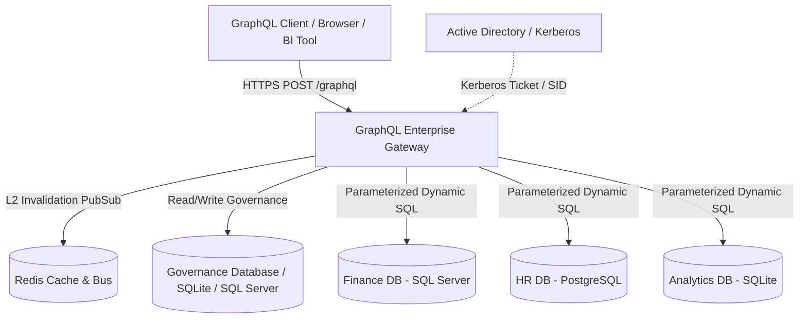
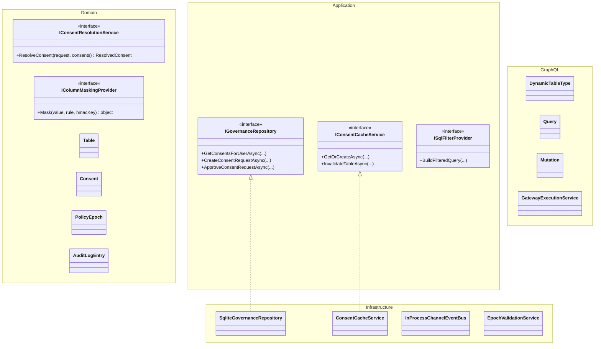
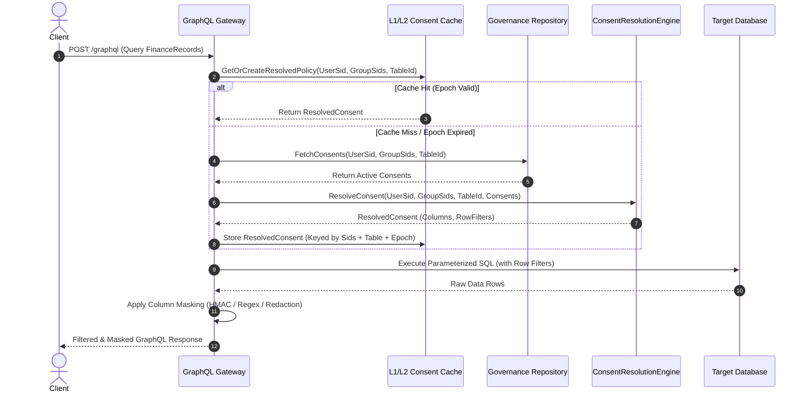
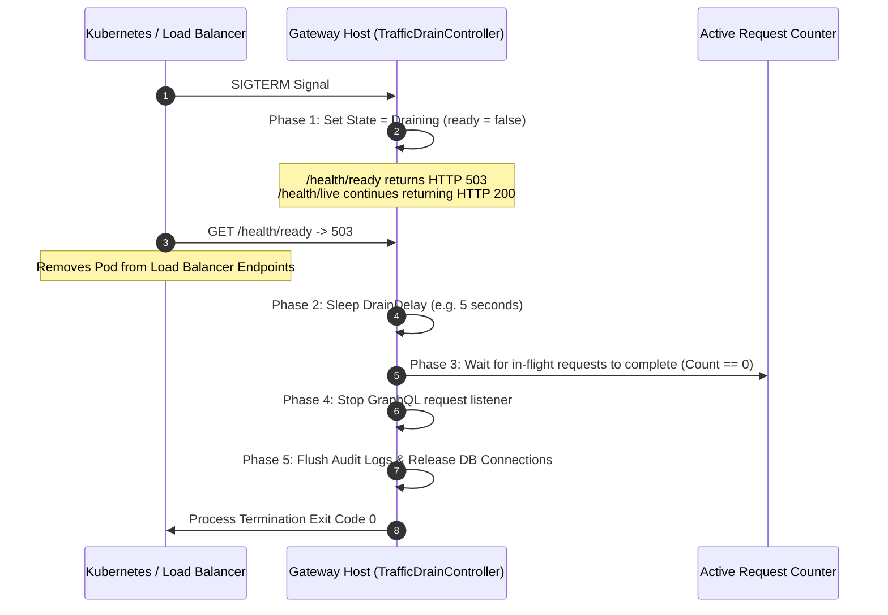

# Architecture Documentation (arc42) - GraphQL Enterprise Gateway with Data-Owner-Consent

## 1. Introduction and Goals

### 1.1 Requirements Overview
The GraphQL Enterprise Gateway acts as a centralized, secure data access layer across diverse enterprise databases (SQL Server, PostgreSQL, SQLite). In contrast to conventional role-based access control, this gateway enforces **Data-Owner-Consent**:
- Data Owners hold sovereign governance over their tables and schemas.
- Access requires explicit, approved consents granted to users or Active Directory security groups (SIDs).
- Granular column-level access controls (PLAIN, MASKED with format preservation / HMAC pseudonymization, NULLIFIED, REDACTED) and row-level SQL filters.
- Zero-Trust default: Any access without an active, non-expired, non-revoked consent results in immediate `FORBIDDEN` rejection.

### 1.2 Quality Goals
1. **Security & Zero Trust**: Strict least-privilege, tamper-evident audit logging (SHA-256 hash chaining), out-of-process credential protection.
2. **Performance & Low Latency**: P99 consent resolution latency < 15ms via two-tier caching (L1 MemoryCache + L2 Redis) with policy epoch invalidation.
3. **High Availability & Zero-Downtime**: Seamless rolling deployments with a 6-phase graceful drain protocol and dual-probe Kubernetes health checks (`/health/live`, `/health/ready`).
4. **Developer Experience**: Zero-external-dependency local development via in-memory SQLite governance catalog and test authentication simulation.

### 1.3 Stakeholders
- **Data Owners**: Define security policies, approve or reject access requests, delegate authority.
- **Data Consumers / Analysts**: Request access and query unified GraphQL schemas.
- **Security Officers & Auditors**: Inspect tamper-evident audit logs and monitor policy changes.
- **Operations / DevOps**: Manage gateway lifecycle, rolling updates, monitoring, and Redis/database connectivity.

---

## 2. Architecture Constraints

- **Platform**: .NET 10 / C# 13, ASP.NET Core Minimal API.
- **GraphQL Engine**: Hot Chocolate 14.1.0 with dynamic schema generation and dynamic type projection.
- **Authentication**: Windows Integrated Authentication / Negotiate (Kerberos / NTLM) extracting Windows Security Identifiers (`Sid`), with development fallback header simulation (`X-Test-User-Sid`).
- **Database Dialects**: Microsoft SQL Server (T-SQL, `@p1`), PostgreSQL (PL/pgSQL, `$1`), and SQLite (`@p1`).
- **Zero External Dependencies in Dev**: Fully functional offline development and CI without requiring running Redis or external DB instances.

---

## 3. Context and Scope

### 3.1 Business Context
The Gateway mediates all queries to enterprise data stores. The user identity (SID and group SIDs) is authenticated at the transport layer, mapped against active consents in the governance database, and combined into a resolved access policy for the requested target entity.

### 3.2 Technical Context
- Inbound: HTTP/HTTPS GraphQL queries, mutations, and health probes.
- Outbound: ADO.NET / DbConnection execution against target databases using parameterized queries with whitelisted identifiers.

---

## 4. Solution Strategy

1. **Clean Architecture Separation**: Pure domain core (`GqlGateway.Domain`) with no external dependencies, application use cases (`GqlGateway.Application`), infrastructure integrations (`GqlGateway.Infrastructure`), and presentation (`GqlGateway.GraphQL`, `GqlGateway.WebHost`).
2. **Consent Resolution Engine (F-CONS-07 Truth Table)**:
   - Evaluates direct user consents and all transitive group memberships.
   - Enforces Hard DENY: Any explicit DENY immediately revokes access.
   - Computes column access levels as maximum privilege over all active ALLOW consents.
   - Combines row filters using disjunction (`OR`) across ALLOW consents, constrained by conjunction with any DENY row filters (`AND NOT`).
3. **Tamper-Evident Audit Hash Chaining (F-DATA-09)**:
   - Every mutation and policy transition generates an audit record whose SHA-256 hash incorporates the previous record's hash, forming an unbroken cryptographic chain.
4. **Policy Epoch Cache Invalidation (F-CONS-08)**:
   - Changes to consents or delegations increment the table's policy epoch in the governance catalog.
   - Cached entries are validated against the current epoch or invalidated via pub/sub events.
5. **Composite Keys & Dynamic Parameter Budgeting (ADR-008)**:
   - Supports multi-column primary and foreign keys up to 8 levels deep.
   - Dynamically budgets SQL parameters based on target database limits (SQLite 999, SQL Server 2100, PostgreSQL 10000) and partitions batch queries into chunks.
   - Implements dialect-specific predicates: ANSI Tuple-IN for PostgreSQL/SQLite/Databricks and disjunctive OR / VALUES-joins for SQL Server.
6. **Enforced Four-Eyes Lifecycle & Separation of Duties (F-CONS-05)**:
   - High-sensitivity tables require two distinct approvers (`RequiresFourEyes = true`).
   - Self-approval by requesters and duplicate approvals by the same approver are strictly prohibited.
   - Active consents are generated exclusively upon final approval.
7. **Production Security Guardrails & Denial-of-Service Defense**:
   - Query execution depth limits (`MaxAllowedExecutionDepth`) and schema introspection control (`DisableIntrospection`).
   - Bounded, TTL-evicted rate-limiting buckets and idempotency stores preventing memory exhaustion attacks.

---

## 5. Building Block View

### 5.1 GqlGateway.Domain
Contains domain models (`Table`, `Consent`, `AuditLogEntry`, `PolicyEpoch`), value objects (`Sid`, `TableIdentifier`, `ColumnAccessLevel`), and pure domain services (`ConsentResolutionService`, `ColumnMaskingProvider`).

### 5.2 GqlGateway.Application
Defines repository and cache contracts (`IGovernanceRepository`, `IConsentCacheService`, `ISqlFilterProvider`, `IEventBus`, `ITrafficDrainController`).

### 5.3 GqlGateway.Infrastructure
Implements persistence using ADO.NET (`SqliteGovernanceRepository`), in-memory and Redis caching (`ConsentCacheService`), pub/sub event channels (`InProcessChannelEventBus`), and policy epoch validation (`EpochValidationService`).

### 5.4 GqlGateway.GraphQL & WebHost
Configures Hot Chocolate schema, dynamic query resolvers, mutations, rate-limiting middlewares, error sanitization, and traffic drain lifecycle.

---

## 6. Runtime View

### 6.1 Consent Resolution Workflow

### 6.2 Zero-Downtime HA Traffic Drain Protocol

---

## 7. Deployment View

### 7.1 Kubernetes Pod Architecture
- **Replicas**: Multi-node deployment behind Kubernetes Service or Ingress Controller.
- **Readiness Probe**: HTTP GET `/health/ready` (InitialDelay: 5s, Period: 3s).
- **Liveness Probe**: HTTP GET `/health/live` (InitialDelay: 10s, Period: 10s).
- **Termination Grace Period**: Set to 60s, allowing `DrainDelay` (5s) + `ShutdownTimeout` (30s) + safety margin.

---

## 8. Cross-Cutting Concepts

### 8.1 Security & Authentication
- Authenticated SID extraction from `WindowsIdentity` with strict validation.
- Dual-layer rate limiting: Pre-Auth by Client IP, Post-Auth by User SID using Token Bucket algorithms.
- AST query depth and complexity limits to defend against denial-of-service GraphQL queries.

### 8.2 Error Sanitization
- `ErrorSanitizingFilter` prevents database connection strings, internal stack traces, and SQL syntax details from leaking to clients.
- Sanitized responses return standardized domain codes: `FORBIDDEN`, `UNAUTHENTICATED`, `NOT_FOUND`, `INVALID_REQUEST`.

---

## 9. Architecture Decisions
- [ADR-001: Trusted Subsystem Pattern](../adr/ADR-001-trusted-subsystem.md)
- [ADR-002: Multi-Tier Consent Caching with Policy Epochs](../adr/ADR-002-epoch-cache-validation.md)
- [ADR-003: Dynamic Object Type Mapping](../adr/ADR-003-dynamic-object-type-mapping.md)
- [ADR-004: Parameterized SQL Translation with Whitelisting](../adr/ADR-004-ast-to-sql-provider.md)
- [ADR-005: Tamper-Evident SHA-256 Audit Log Hash Chain](../adr/ADR-005-sha256-hash-chain-audit.md)
- [ADR-006: Kerberos-Only HA Cluster Traffic Drain](../adr/ADR-006-kerberos-only-ha-cluster.md)
- [ADR-007: Permissive Union Semantics](../adr/ADR-007-permissive-union-semantics.md)
- [ADR-008: Composite Keys, Parameter Budgeting & Four-Eyes Governance Workflow](../adr/ADR-008-composite-keys-and-four-eyes.md)
- [ADR-009: Advanced RLS Subqueries, Multi-Hop Joins & Temporal Validity Predicates](../adr/ADR-009-advanced-rls-subqueries-and-temporal-intervals.md)

---

## 10. Quality Requirements
- **Quality Gate 1 (Zero Warnings & Strict Typing)**: Solution compiles with zero warnings under `<TreatWarningsAsErrors>true</TreatWarningsAsErrors>`.
- **Quality Gate 2 (Architecture Integrity)**: NetArchTest asserts Domain has zero outward dependencies.
- **Quality Gate 3 (TDD Verification)**: 100% truth table compliance tested via xUnit and FsCheck property-based testing.
- **Quality Gate 4 (Walking Skeleton End-to-End)**: Integration tests verify full request pipeline, authentication simulation, consent resolution, and graceful drain.

---

## 11. Risks and Technical Debt
- **Direct ADO.NET vs ORM**: Handled via typed parameter mapping and whitelisting to maximize performance and avoid ORM impedance mismatches.
- **Redis High Availability**: If Redis fails, gateway automatically falls back to in-memory caching and direct epoch checks against the database without dropping client requests.

---

## 12. Glossary
- **SID**: Windows Security Identifier representing a user or security group.
- **Data Owner**: The authoritative user or security group accountable for data access governance on a table.
- **Consent**: A grant or denial record authorizing access to specific columns and rows of a table.
- **Policy Epoch**: A monotonically increasing integer tracking policy revisions per table to invalidate stale caches.
