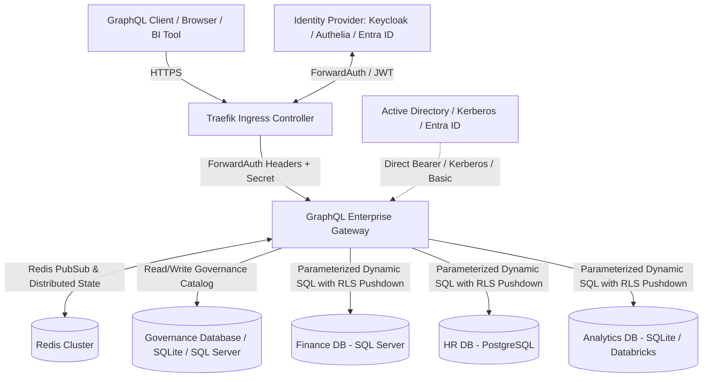
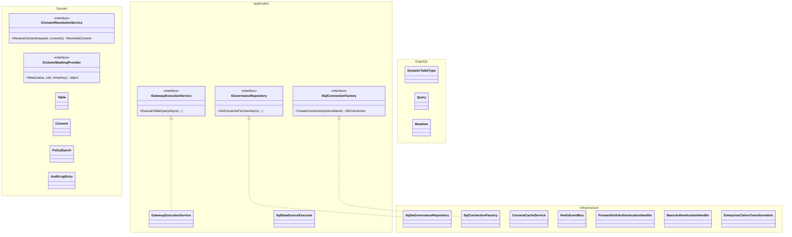
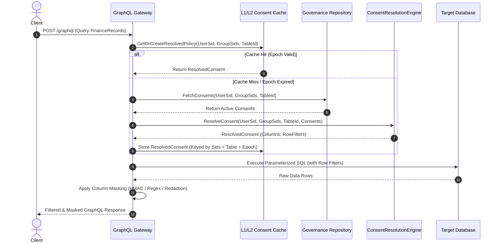
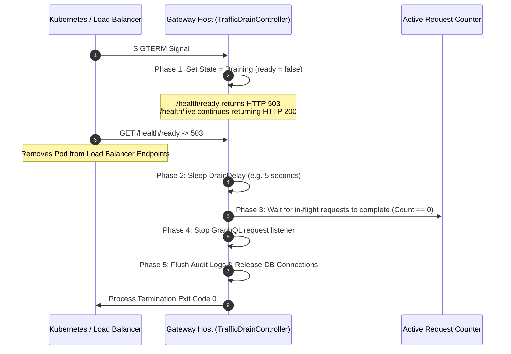

# Architecture Documentation (arc42) - GraphQL Enterprise Gateway with Data-Owner-Consent

## 1. Introduction and Goals

### 1.1 Requirements Overview
The GraphQL Enterprise Gateway acts as a centralized, secure data access layer across diverse enterprise databases (SQL Server, PostgreSQL, SQLite). In contrast to conventional role-based access control, this gateway enforces **Data-Owner-Consent**:
- Data Owners hold sovereign governance over their tables and schemas.
- Access requires explicit, approved consents granted to users or Active Directory security groups (SIDs).
- Granular column-level access controls (PLAIN, MASKED with format preservation / HMAC pseudonymization, NULLIFIED, REDACTED) and row-level SQL filters.
- Zero-Trust default: Any access without an active, non-expired, non-revoked consent results in immediate `FORBIDDEN` rejection.

### 1.2 Quality Goals
1. **Security & Zero Trust**: Strict least-privilege, tamper-evident audit logging (SHA-256 hash chaining), out-of-process credential protection.
2. **Performance & Low Latency**: P99 consent resolution latency < 15ms via two-tier caching (L1 MemoryCache + L2 Redis) with policy epoch invalidation.
3. **High Availability & Zero-Downtime**: Seamless rolling deployments with a 6-phase graceful drain protocol and dual-probe Kubernetes health checks (`/health/live`, `/health/ready`).
4. **Developer Experience**: Zero-external-dependency local development via in-memory SQLite governance catalog and test authentication simulation.

### 1.3 Stakeholders
- **Data Owners**: Define security policies, approve or reject access requests, delegate authority.
- **Data Consumers / Analysts**: Request access and query unified GraphQL schemas.
- **Security Officers & Auditors**: Inspect tamper-evident audit logs and monitor policy changes.
- **Operations / DevOps**: Manage gateway lifecycle, rolling updates, monitoring, and Redis/database connectivity.

---

## 2. Architecture Constraints

- **Platform**: .NET 10 / C# 14, ASP.NET Core Minimal API.
- **GraphQL Engine**: Hot Chocolate 14.1.0 with dynamic schema generation and dynamic type projection.
- **Multi-Protocol Authentication**:
  - **Kubernetes Ingress ForwardAuth**: Offloaded authentication via Traefik Ingress (Authelia, Keycloak, Authentik, OAuth2-Proxy) with proxy CIDR filtering and pre-shared secrets (`X-Forwarded-Secret`).
  - **Enterprise Identity Providers**: Microsoft Entra ID (Azure AD) and AD FS JWT Bearer tokens with normalized claims transformation (`EnterpriseClaimsTransformation`).
  - **HTTP Basic Authentication**: Direct Basic Auth headers on queries and dedicated verification endpoint (`/api/auth/login`).
  - **Kerberos / SPNEGO Negotiate**: Windows Integrated Authentication extracting Windows Security Identifiers (`Sid`).
  - **Development Simulation**: Header-based SID simulation (`X-Test-User-Sid`), strictly restricted to `Development` mode.
- **Database Dialects & Real Execution**: Native ADO.NET execution with RLS pushdown across Microsoft SQL Server (T-SQL), PostgreSQL (PL/pgSQL), SQLite, Oracle, and Databricks.
- **Zero External Dependencies in Dev**: Fully functional offline development and CI without requiring running Redis or external DB instances.

---

## 3. Context and Scope

### 3.1 Business Context
The Gateway mediates all queries to enterprise data stores. The caller's identity (SID and group SIDs) is authenticated at the transport or ingress layer, mapped against active consents in the governance database, and combined into a resolved access policy for the requested target entity.

### 3.2 Technical Context
- Inbound: HTTP/HTTPS GraphQL queries, mutations, Basic Auth login (`/api/auth/login`), OpenMetadata webhooks, and health probes.
- Outbound: Direct parameterized SQL queries with RLS pushdown against target databases (`ISqlConnectionFactory`), OpenMetadata REST API, and Redis Pub/Sub.

---

## 4. Solution Strategy

1. **Clean Architecture Separation**: Pure domain core (`GqlGateway.Domain`) with no external dependencies, application use cases and execution engine (`GqlGateway.Application`), infrastructure persistence and security handlers (`GqlGateway.Infrastructure`), Hot Chocolate GraphQL mapping (`GqlGateway.GraphQL`), and ASP.NET Core API host (`GqlGateway.Api`).
2. **Multi-Protocol Authentication & Ingress Trust**:
   - Traefik Kubernetes ForwardAuth Handler validates proxy IP addresses against CIDR ranges (`TrustedNetworks`) and verifies HMAC pre-shared secrets (`X-Forwarded-Secret`).
   - `EnterpriseClaimsTransformation` maps heterogeneous token claims (Entra ID `oid`, AD FS `primarygroupsid`, etc.) into unified `Sid` value objects.
   - Dynamic Scheme Selector routes requests to ForwardAuth, Bearer, Basic, or Negotiate schemes.
3. **Real SQL Execution & RLS Pushdown**:
   - `SqlDataSourceExecutor` leverages `ISqlConnectionFactory` to execute real parameterized queries against backend databases.
   - Row-level security rules are combined into SQL WHERE fragments (`CombinedRowFilterSql`) and pushed directly into the database engine.
4. **Consent Resolution Engine (F-CONS-07 Truth Table)**:
   - Evaluates direct user consents and all transitive group memberships.
   - Enforces Hard DENY: Any explicit DENY immediately revokes access.
   - Computes column access levels as maximum privilege over all active ALLOW consents.
   - Combines row filters using disjunction (`OR`) across ALLOW consents, constrained by conjunction with any DENY row filters (`AND NOT`).
5. **Multi-Instance Redis Clustering**:
   - `RedisEventBus` propagates monotonic table policy epoch increments across pods to invalidate local L1 memory caches.
   - Distributed sliding-window rate limiters and token buckets protect against cluster-wide DoS attacks.
   - Distributed mutation idempotency deduplicates governance operations across replicas.
6. **Tamper-Evident Audit Hash Chaining (F-DATA-09)**:
   - Every mutation and policy transition generates an audit record whose SHA-256 hash incorporates the previous record's hash, forming an unbroken cryptographic chain.
7. **Enforced Four-Eyes Lifecycle & Separation of Duties (F-CONS-05)**:
   - High-sensitivity tables require two distinct approvers (`RequiresFourEyes = true`).
   - Self-approval by requesters and duplicate approvals by the same approver are strictly prohibited.

---

## 5. Building Block View

### 5.1 GqlGateway.Domain
Contains domain models (`Table`, `Consent`, `AuditLogEntry`, `PolicyEpoch`), value objects (`Sid`, `TableIdentifier`, `ColumnAccessLevel`), and pure domain services (`ConsentResolutionService`, `ColumnMaskingProvider`).

### 5.2 GqlGateway.Application
Defines repository and cache contracts (`IGovernanceRepository`, `IConsentCacheService`, `ISqlFilterProvider`, `IEventBus`, `ITrafficDrainController`).

### 5.3 GqlGateway.Infrastructure
Implements persistence using ADO.NET (`SqliteGovernanceRepository`), in-memory and Redis caching (`ConsentCacheService`), pub/sub event channels (`InProcessChannelEventBus`), and policy epoch validation (`EpochValidationService`).

### 5.4 GqlGateway.GraphQL & WebHost
Configures Hot Chocolate schema, dynamic query resolvers, mutations, rate-limiting middlewares, error sanitization, and traffic drain lifecycle.

---

## 6. Runtime View

### 6.1 Consent Resolution Workflow

### 6.2 Zero-Downtime HA Traffic Drain Protocol

---

## 7. Deployment View

### 7.1 Kubernetes Pod Architecture
- **Replicas**: Multi-node deployment behind Kubernetes Service or Ingress Controller.
- **Readiness Probe**: HTTP GET `/health/ready` (InitialDelay: 5s, Period: 3s).
- **Liveness Probe**: HTTP GET `/health/live` (InitialDelay: 10s, Period: 10s).
- **Termination Grace Period**: Set to 60s, allowing `DrainDelay` (5s) + `ShutdownTimeout` (30s) + safety margin.

---

## 8. Cross-Cutting Concepts

### 8.1 Security & Authentication
- Authenticated SID extraction from `WindowsIdentity`, Traefik Ingress ForwardAuth headers, Entra ID / AD FS Bearer JWTs, and Basic Authentication.
- **Enterprise Basic Auth**: Salted PBKDF2 (`$pbkdf2$...`) enforced in production; plaintext and unsalted SHA-256 strictly rejected outside Development; dummy-PBKDF2 iteration parity to thwart username enumeration timing attacks.
- **SSRF Defense for REST Data Sources**: Destination hostname DNS resolution checking against RFC 1918 private IP subnets, loopback, link-local, and cloud metadata endpoints; hop-by-hop HTTP redirect re-validation (`AllowAutoRedirect = false`).
- **Tamper-Evident HMAC-SHA256 Audit Hash Chain**: Transactional audit logging chained with keyed `HMACSHA256` and verified via `CryptographicOperations.FixedTimeEquals`.
- **Webhook Replay Defense**: OpenMetadata webhook ingestion (`/api/webhooks/openmetadata`) verifies HMAC-SHA256 signatures, deduplicates event IDs, and enforces a 5-minute replay window on timestamps fail-closed.
- Dual-layer rate limiting: Pre-Auth by Client IP, Post-Auth by User SID using Token Bucket algorithms. Redis rate limiter fails over automatically to local in-memory token bucket if Redis is degraded.
- AST query depth and complexity limits to defend against denial-of-service GraphQL queries.

### 8.2 Error Sanitization & Table Oracle Defense
- `ErrorSanitizingFilter` prevents database connection strings, internal stack traces, and SQL syntax details from leaking to clients.
- Masks `TableNotFoundException` as generic `FORBIDDEN` in non-development environments to prevent schema probing and table oracle attacks.
- Sanitized responses return standardized domain codes: `FORBIDDEN`, `UNAUTHENTICATED`, `NOT_FOUND`, `INVALID_REQUEST`.

### 8.4 Enterprise Data Catalog Federation & Lineage Analysis
- **Multi-Catalog Provider Integration**: Pluggable `IDataCatalogClient` architecture integrating **Microsoft Purview**, **Collibra**, **Alation**, and **OpenMetadata**.
- **Mirror vs Reference Mode**: Mirroring ingests metadata, descriptions, and classifications into local governance storage; Reference mode queries external catalogs on-demand.
- **Automated GDPR Art. 9 & PII Tagging**: Automatic detection of special categories of data under GDPR Art. 9 (health, biometrics, genetics, religious, political) enforcing `HIGH` sensitivity, mandatory four-eyes approval (`RequiresFourEyes = true`), and `REDACT` masking.
- **Static & Operational Lineage Traversal**: Iterative BFS graph traversal over BI Dashboards, ETL Pipelines, and External Services combined with cryptographic audit log correlation to assess breaking change blast radius before schema modifications.
- **GDPR Art. 15 Right of Access Reporting**: Aggregates all disclosed recipients, access timestamps, purposes, and masking rules over up to 365 days.

### 8.5 Modern Identity Abstraction, M2M Service Principals & Insecure Modes
- **Hybrid Identity Provider Abstraction (`IIdentityProvider`)**: Allows simultaneous operation of on-prem Active Directory (Kerberos) and cloud-native Microsoft Entra ID (Azure AD / OIDC) without coupling domain components to concrete IdPs.
- **Machine-to-Machine (M2M) Service Principals**: Client-credentials and mTLS authentication for background batch jobs and downstream services, issuing dedicated service principal consents (`SP-<client_id>` SIDs).
### 8.6 Apache Iceberg Lakehouse Connector & Parquet Metadata Pruning
- **Apache Iceberg v2 Lakehouse Engine**: Direct querying of tabular datasets stored in open table formats on object storage (Amazon S3 with SigV4, Azure Blob, and local filesystems).
- **Vectorized Partition & Stats Pruning**: Evaluates table snapshot manifests and column min/max statistics to prune unneeded Parquet files prior to data loading.
- **Lakehouse Metadata Caching**: Two-tier caching of table metadata and manifest lists with configurable TTL (`MetadataCacheTtlMinutes`).
- **Pushdown Zero-Trust Governance**: Applies column-level masking and Casbin ABAC row-level security pushdown directly to lakehouse execution plans.

### 8.7 Realtime Event Subscriptions & In-Stream Casbin RLS
- **GraphQL Subscriptions Engine**: WebSocket (`graphql-transport-ws`) and Server-Sent Events (SSE) streaming.
- **In-Stream Casbin RLS Policy Enforcement**: `StreamRlsPolicyEnforcer` evaluates dynamic ABAC rules per emitted event; unconsented events are dropped in real-time.
- **Debezium & Kafka CDC Ingestion**: `DebeziumCdcParser` decodes relational change-data-capture payloads (`op: c, u, d`) into typed subscription channels with strict tenant isolation.

### 8.8 Hot Chocolate Fusion Subgraph Federation
- **Federated Query Router**: Composes distributed microservice subgraphs into a unified supergraph schema.
- **Zero-Trust Context Forwarding**: `SubgraphSecurityDelegatingHandler` securely forwards caller identity and SIDs to downstream subgraphs.
- **In-Memory Result Masking**: `SubgraphResultMaskingMiddleware` enforces masking rules across aggregated federated response trees.

### 8.9 Model Context Protocol (MCP) AI Gateway & Semantic Guardrails
- **Model Context Protocol Server**: Exposes GraphQL schemas and parameterized queries as AI Agent Tools via Stdio and Streamable HTTP/SSE (`/mcp`, `/mcp/sse`).
- **Semantic Prompt Injection Defense**: `SemanticPromptGuardrail` inspects tool arguments against OWASP LLM01 prompt injection patterns, ChatML delimiters, and Base64 evasion techniques.
- **AI Data Guardrail Engine**: Dynamic PII scrubbing, token consumption budgeting, query cost limits, and session ownership enforcement.

### 8.10 dbt Data Mesh & Contract Governance
- **Streaming Artifact Parsing**: High-throughput zero-buffer parser for `manifest.json`, `catalog.json`, and `run_results.json`.
- **Data Health Circuit Breaker**: Tables with failing upstream `dbt test` executions are quarantined (`CircuitBreaker: Open`) to prevent serving dirty data.
- **Model Contract Breaking-Change CI Gate**: Validates dbt model contracts against active schemas before deployment.

### 8.11 Dual-Mode Enterprise Extensibility Framework
- **In-Process C# Middlewares**: High-performance `.dll` / NuGet middlewares plugged into ASP.NET Core DI pipeline with direct AST access, zero IPC latency (< 0.1ms), and zero-copy `ReadOnlySpan<T>`.
- **Out-of-Process gRPC Coprocess**: Polyglot gRPC interceptors for isolated microservice lifecycles.

---

## 9. Architecture Decisions
- [ADR-001: Trusted Subsystem Pattern](../adr/ADR-001-trusted-subsystem.md)
- [ADR-002: Multi-Tier Consent Caching with Policy Epochs](../adr/ADR-002-epoch-cache-validation.md)
- [ADR-003: Dynamic Object Type Mapping](../adr/ADR-003-dynamic-object-type-mapping.md)
- [ADR-004: Parameterized SQL Translation with Whitelisting](../adr/ADR-004-ast-to-sql-provider.md)
- [ADR-005: Tamper-Evident HMAC-SHA256 Audit Log Hash Chain](../adr/ADR-005-sha256-hash-chain-audit.md)
- [ADR-006: Kerberos-Only HA Cluster Traffic Drain](../adr/ADR-006-kerberos-only-ha-cluster.md)
- [ADR-007: Permissive Union Semantics](../adr/ADR-007-permissive-union-semantics.md)
- [ADR-008: Composite Keys, Parameter Budgeting & Four-Eyes Governance Workflow](../adr/ADR-008-composite-keys-and-four-eyes.md)
- [ADR-009: Advanced RLS Subqueries, Multi-Hop Joins & Temporal Validity Predicates](../adr/ADR-009-advanced-rls-subqueries-and-temporal-intervals.md)
- [ADR-010: Enterprise Data Catalog Abstraction & GDPR Art. 9 Sensitivity](../adr/ADR-010-data-catalog-abstraction-and-sensitivity-classification.md)
- [ADR-011: Modern Hybrid Identity Abstraction & M2M Service Principals](../adr/ADR-011-modern-identity-abstraction-and-service-principals.md)
- [ADR-012: Insecure Modes & Pragmatic Onboarding Governance](../adr/ADR-012-insecure-modes-and-getting-started-governance.md)
- [ADR-013: Graph Lineage Downstream Impact & GDPR Art. 15 Disclosure](../adr/ADR-013-data-lineage-and-gdpr-art15-disclosure.md)
- [ADR-014: Enterprise Model Context Protocol & AI Data Guardrails](../adr/ADR-014-enterprise-model-context-protocol-and-ai-data-guardrails.md)
- [ADR-015: Apache Iceberg Lakehouse Connector & Zero-Trust Pushdown](../adr/ADR-015-apache-iceberg-lakehouse-connector-and-zero-trust-pushdown.md)
- [ADR-016: Security Findings Remediation & Hardening](../adr/ADR-016-security-findings-remediation.md)

---

## 10. Quality Requirements
- **Quality Gate 1 (Zero Warnings & Strict Typing)**: Solution compiles with zero warnings under `<TreatWarningsAsErrors>true</TreatWarningsAsErrors>`.
- **Quality Gate 2 (Architecture Integrity)**: NetArchTest asserts Domain and Application have zero inward or improper dependencies, isolating Hot Chocolate to GraphQL.
- **Quality Gate 3 (TDD Verification)**: 100% test pass rate (735 / 735 tests green across 589 Unit, 5 Architecture, 98 Integration, and 43 Extensions tests).
- **Quality Gate 4 (Walking Skeleton End-to-End)**: Integration tests verify full request pipeline, Traefik ForwardAuth Ingress, Basic Auth login, consent resolution, and graceful drain.

---

## 11. Risks and Technical Debt
- **Direct ADO.NET vs ORM**: Handled via typed parameter mapping and whitelisting to maximize performance and avoid ORM impedance mismatches.
- **Redis High Availability & Resilience**: If Redis fails, gateway automatically falls back to in-memory caching and in-memory rate limiting without dropping client requests or sacrificing protection.

---

## 12. Glossary
- **SID**: Windows Security Identifier representing a user or security group.
- **Data Owner**: The authoritative user or security group accountable for data access governance on a table.
- **Consent**: A grant or denial record authorizing access to specific columns and rows of a table.
- **Policy Epoch**: A monotonically increasing integer tracking policy revisions per table to invalidate stale caches.
