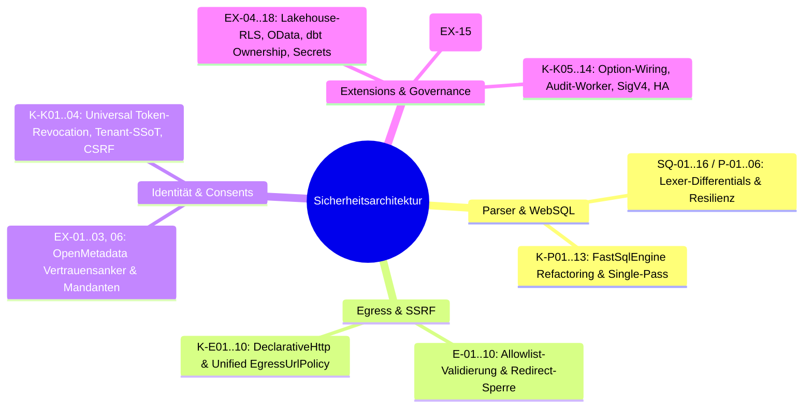
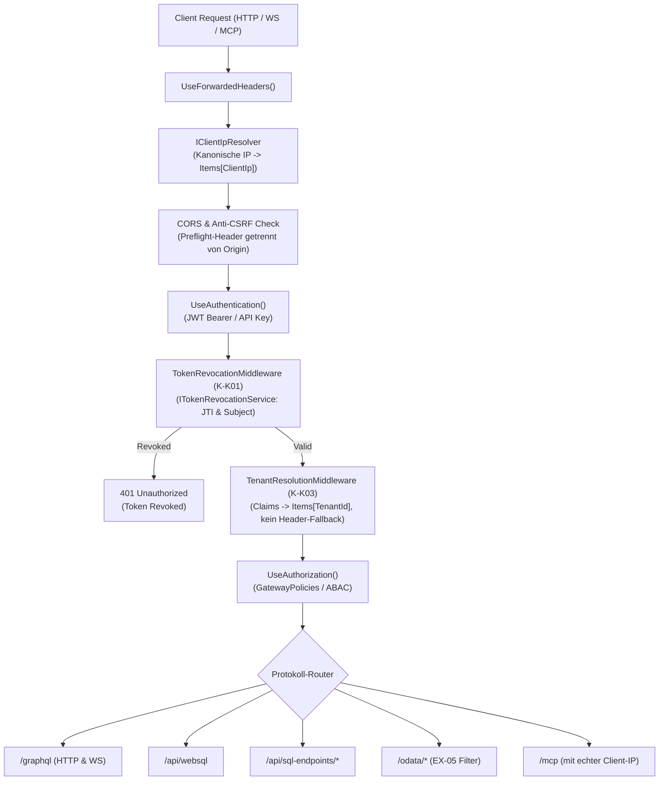

# Architektur- und Implementierungsplan: Sicherheitskonsolidierung & Härtung 2026-10-02

> **Dokumenten-ID:** PLAN-SEC-2026-10-02-MASTER  
> **Status:** Genehmigt & Lückenlos Verifiziert (Master-Architekturentwurf)  
> **Ziel-Branches:** `security/review-2026-10-02` in Repositories `gql`, `gql_extensions`, `gql_sqlparser`  
> **Referenzierte Reviews:**
> - [Konsolidierungs-Review 2026-10-02 (Runde 5)](file:///root/lis-git/gql/gql/security-review-2026-10-02-konsolidierung.md)
> - [Security Review – gql_sqlparser (FastSqlEngine / RLS-Rewriter), Stand 2026-10-02](file:///root/lis-git/gql/gql/security-review-2026-10-02-nachpruefung.md)
> - [Security Review – gql_extensions, Stand 2026-10-02](file:///root/lis-git/gql/gql/security-review-2026-10-02-nachpruefung.md)
> - [Security-Nachprüfung Stand 2026-10-02 (SQ-Fixes, EX-01/13, Extension-Umbau)](file:///root/lis-git/gql/gql/security-review-2026-10-02-nachpruefung.md)
> - [Sicherheits-Review 2026-10-02 (Original)](file:///root/lis-git/gql/gql/security-review-2026-10-02.md)

---

## 1. Architektonische Bewertung (Architect's & Product Management Assessment)

Die Zusammenführung aller Sicherheitsreviews (`gql_sqlparser`, `gql_extensions`, Kernkonsolidierung Runde 5) offenbart ein lückenloses Bild der verbleibenden Risiken, architektonischen Schwachstellen und Konsolidierungspotenziale:

### 1.1 Domäne Parser & SQL-Engine (SQ-01..16, P-01..06, K-P01..13)
- **Das zentrale architektonische Restrisiko (Dialekt-Differential):** Grammatik und Lexer bilden den **Trino-Dialekt** ab. Das umgeschriebene SQL wird jedoch Token für Token (inkl. Kommentaren) unverändert an PostgreSQL, SQL Server oder SQLite geschickt:
  - **SQ-01 (Kritisch - String-Literale):** Der Trino-Lexer kennt nur `''` als Escape. PostgreSQL wertet in `E'...'`-Strings Backslash-Escapes aus. Gateway und DB sehen das String-Ende an unterschiedlichen Stellen -> SQL-Injection und RLS-Bypass.
  - **SQ-02 (Kritisch - Block-Kommentare):** Trino beendet Kommentare beim ersten `*/`. PostgreSQL und SQL Server verschachteln `/* /* ... */ */`. Durchgereichte Kommentare erlauben das "Verstecken" von SQL vor dem Gateway bzw. das Einschleusen von Code an der DB. Für SQL Server ist zudem `DOLLAR_STRING` (`$$...$$`) unzulässig.
  - *Entscheidung:* Kommentare in WebSQL grundsätzlich ablehnen. `E'...'` und Backslashes ablehnen; `SET standard_conforming_strings = on` bei Session-Start für Postgres erzwingen (P-05). Für T-SQL `$$` ablehnen.
- **MethodCall & Funktions-Policy (P-01, K-P01, SQ-06, P-02, K-P02):** Unbedingtes Verbot von `methodCall`/`staticMethodCall` in Listener und Analyzer (P-01 / K-P01). Beseitigung der dreifachen Funktionsprüfung (K-P02). Strikte dialektspezifische Allowlists im Gateway (SQ-06 / P-02); Denylist als zweite Verteidigungslinie.
- **DML-Integrität & Whole-Row Referenzen (SQ-03, SQ-07):** In PostgreSQL ist der Tabellenname im Ausdruck eine Whole-Row-Referenz (`SET x = tbl::text`), wodurch maskierte Spalten geleckt werden. INSERT prüfte bisher nur Tenant-Spalten. *Entscheidung:* Whole-Row Referenzen in DML sperren (SQ-03); INSERT gegen `CombinedRowFilterSql` prüfen (SQ-07).
- **FQN Policy-Lookup & Kurznamen-Kollision (SQ-04, K-P11):** Unqualifizierte Schlüsselung führt zu RLS-Wegfall (`tablesWithoutRls`). *Entscheidung:* Policy-Maps strikt nach FQN; Kurznamen-Fallback entfernen; Helper `SqlIdentifierHelper.GetSimpleName` vereinheitlichen (K-P11).
- **T-SQL Rewriter & Dialekt-Mapping (SQ-05, K-P06):** Dialektbewusster Rewrite für SQL Server (`TOP`, `OFFSET ... FETCH`, gequotete Kurzaliase; SQ-05). Einheitliches Mapping `DatabaseDialectExtensions.TryParseConnectionProvider` (K-P06).
- **Engine-Zustand, Lifecycle & Performance (P-03, P-04, P-06, SQ-08, K-P03, K-P04, K-P05, K-P07, K-P08, K-P12, K-P13):**
  - Entkopplung der Lexer-Sperren von `MaxNestingDepth` via unbedingtem `EnsureTokensAreSafe` (P-03).
  - Beseitigung mutierbarer Engine-Properties zugunsten von Parameter-Passing (`SqlTokenSecurityOptions.Strict`; P-04, K-P03).
  - Beseitigung des redundanten Kommentar-Checks im `RlsListener`-Konstruktor und des ungenutzten Feldes `_tokens` (K-P04).
  - Löschung von `Program.RunDemo` und fixture-lastigem `TrinoTestExtractor` aus dem Produktions-Assembly (K-P05).
  - Parser Stack-Isolation via Worker-Task mit 4 MB Stack und `ParseTimeout` (SQ-08).
  - Zerlegung des 1333-Zeilen-Monolithen `GovernedSqlExecutionService` in 6 modulare Komponenten (K-P07).
  - `FastSqlEngine` als threadsicheres DI-Singleton registrieren; Beseitigung doppelter ANTLR-AST-Parses pro Request (K-P08).
  - Beseitigung von Demo-Defaults (`tenant_id = 42`, `FallbackToSimpleName = true`) in der Bibliothek (K-P12).
  - Bereinigung des redundanten `SharedParserCache` (K-P13).
- **WebSQL Endpoints Härtung (K-P09, K-P10):**
  - Kanonische Tenant-Auflösung via `EndpointSecurity.GetRequestTenant` und Body-Größenbegrenzung via `RequestSizeLimit` (K-P09).
  - Konsolidierung der 6 kopierten Catch-Blöcke in `WriteWebSqlErrorAsync` (K-P10).
- **Identifier- & Token-Härtung (SQ-09, SQ-10, SQ-11, SQ-12, SQ-13, SQ-14, SQ-15, SQ-16):**
  - 3-teilige Namen: DB-Teil gegen Datenquelle prüfen (SQ-09).
  - Nicht-ASCII im Lexer außerhalb von Strings sperren (SQ-10).
  - Punkte in quotierten Bezeichnern ablehnen (SQ-11).
  - Dialektgerechtes Case-Folding im Identifier-Resolver (SQ-12).
  - Time-Travel (`FOR TIMESTAMP AS OF`) ablehnen (SQ-13).
  - Gepoolten Parser-TokenStream nullen (SQ-14).
  - `MaxAffectedRows = 0` als DANGER einstufen (SQ-15).
  - String-bewusste Parameter-Extraktion (SQ-16).

### 1.2 Domäne Egress & SSRF (E-01..10, K-E01..10, EX-12)
- **Egress-Allowlist Härtung (E-01, K-E01, E-02, K-E10):**
  - CIDR-Validierung: IPv4 mindestens `/8`, IPv6 mindestens `/32`.
  - Sperre überdeckender Netze wie `::fff0:0:0/92` via `parsed.Contains(IPAddress.Any.MapToIPv6())` (E-01 / K-E01).
  - Metadaten-Sperre im Trusted-Pfad (100.100.100.200, fd00:ec2::254, 168.63.129.16).
  - Integrationsspezifischer Allowlist-Scope (`Egress:Integrations:<Name>`), Lakehouse strikt ausgeschlossen (E-02, K-E10).
- **Primary Handler, Redirects & DNS-Rebinding (E-03, E-04, EX-12, K-E02, K-E03, K-E04):**
  - Alle HTTP-Clients (auch in `gql_extensions` und `DeclarativeHttp`) erhalten `SocketsHttpHandler` mit `AllowAutoRedirect = false` und `ConnectCallback` mit IP-Pinning (E-03, E-04, K-E02).
  - Umstellung auf zentrale `EgressAddressRules` und `EgressUrlPolicy` (K-E03). Sperre von Azure WireServer `168.63.129.16`, NAT64 (`64:ff9b::/96`), Multicast und `240/4`.
  - `SsrfProtectionHandler` auf schlanke Entscheidungsfunktion mit Proxy-Support reduzieren (K-E04).
  - Typed Client `IOpenMetadataClient` verbindlich über den SSRF-Handler führen (EX-12).
- **Code-Bereinigung & Entlastung (K-E05, K-E06, K-E07, K-E08, K-E09):**
  - Entfernung redundanter Inline-`ValidateUrl` in Katalog-/Audit-Clients, die freigegebene IP-Literale blockierten (K-E05).
  - Subgraph-HttpClients härten via `AddSecureOutboundHandlers(Federation)` oder bereinigen (K-E06).
  - 8 tote DI-Registrierungen (`TryAddTransient<SsrfProtectionHandler>`, Default-HttpClient) löschen (K-E07).
  - Konfigurierter `S3Endpoint`-Host für On-Prem MinIO im Firmennetz als vertraut zulassen (K-E08).
  - Lokales NAT64-Präfix `64:ff9b:1::/48` und 6to4 `2002::/16` absichern (K-E09).

### 1.3 Domäne Identität, Consents & OpenMetadata (EX-01..03, EX-06, K-X01, K-X02, K-X11, K-X12, K-K01..04, K-K07, E-05..10)
- **OpenMetadata Vertrauensanker & Privilegienerweiterung (EX-01, E-05, K-X01, K-X02):**
  - `AutoCreateConsents` bleibt strikt **DANGER**. S-1-Fallback und Namenslookup entfallen; Einführung von `RoleToGatewayRoleMap`. Tabellen mit `RequiresFourEyes`, `HIGH` oder Art. 9 erhalten niemals automatische Freigaben, sondern erzeugen einen `ConsentRequest` im Workflow (EX-01).
  - Reconcile darf Deny-Consents bei übersprungenen Tabellen niemals widerrufen (K-X01). Paging-Abbrüche fail-closed.
  - Verwaiste Auto-Consents nach Deaktivierung von `AutoCreateConsents` widerrufen; TTL auf 2× Sync-Intervall verkürzen (E-05, EX-02).
  - Einheitlicher `CatalogTagClassifier` für Art. 9 und PII auf Spaltenebene (K-X02, E-06).
- **Mandantenintegrität & Tabellenidentität (EX-03, EX-06, K-X12, E-07, E-09):**
  - OM-Consents zwingend mit `TenantId` mappen; Reconcile mandantenisoliert (EX-03).
  - Datenbank in Identität aufnehmen (`service.database.schema.table`), um Kollisionen zwischen Sandbox und Produktion zu verhindern (EX-06, E-09).
  - FQN-Parsing und Domain-Mapping vereinheitlichen (`OpenMetadataTableIdentity.ResolveAll`; K-X12).
  - Getrennte Maps je Schlüsselart für SIDs in OM (E-07).
- **Dekomposition OM-Sync-Service (K-X11):** Zerlegung des 1080-Zeilen-Monolithen in `Mapper`, `PrincipalIndex`, `ConsentReconciler`, `WebhookHandler` und `Orchestrator`.
- **Universeller Token-Widerruf & Anti-CSRF (K-K01, K-K04):**
  - `TokenRevocationMiddleware` unmittelbar nach `UseAuthentication()` für sofortige 401-Abweisung widerrufener Tokens über alle HTTP-Endpunkte (K-K01).
  - `warn_allow_all_cors_origins` lockert nur Origins; Preflight-Header bleiben Pflicht zur Abwehr von CSRF (K-K04).
- **Kanonische Client-IP & Tenant-Ermittlung (K-K02, K-K03):**
  - `IClientIpResolver` als SSoT (nach ForwardedHeaders; MCP-Sessions erhalten echte IP; K-K02).
  - `EndpointSecurity.GetRequestTenant` verbindlich in der API; Beseitigung des `X-Tenant-ID`-Header-Bypasses und der "default"-Fallbacks in SQL-Endpoints (K-K03).
- **Tabellengesteuerte Schalter & Per-System Webhooks (K-K07, E-10):**
  - `SecuritySwitch`-Tabelle mit festem Format `<LEVEL>:<name>`.
  - Aufspaltung des Webhook-Sammel-Bypass in per-System Schalter (`IsWebhookSignatureBypassed(WebhookSource)`).
  - Wiederherstellung der Test-Theory `SEM_ReclassifiedSwitches_AreDanger`.

### 1.4 Domäne Extensions-Architektur, Lakehouse, dbt & Governance (EX-04, 05, 07..11, 13..18, K-X03..10, K-X13, K-K05, K-K06, K-K08..14)
- **Beseitigung geschatteten Codes (EX-15):** Mehr als die Hälfte des Codes in `gql_extensions` wird durch den Kern überschrieben (`DataCatalogSyncService`, Collibra/Purview/Alation-Clients, OM-Adapter, Jira/ServiceNow-Clients). Löschen des duplizierten Altcodes in Phase 3.
- **Lakehouse-Sicherheit (EX-04, EX-09..11, EX-17, EX-18, K-X13):**
  - RLS-Zeilenfilterung zwingend vor Spaltenmaskierung durchführen (`FilterRows` auf Rohwerten; EX-04).
  - Ordinaler Bounds-Vergleich; Tenant-Spalte prüfen statt überschreiben (EX-09).
  - Ablehnung von `?`, `#` und `%` in S3- und Azure-Keys (EX-10).
  - Leere Präfixe in `IcebergMetadataReader` ablehnen (EX-11).
  - Filter-Orakel über unkatalogisierte Partitionsspalten sperren (EX-17).
  - `MaxScanRowsLimit` in `ScanCoreAsync` durchsetzen; dbt Rule Approval Statusprüfung; LocalStorage Größenlimit (EX-18).
  - Lakehouse-Executor nur bei `Lakehouse.Enabled` registrieren; Beispieldaten-Stub absichern (K-X13).
- **OData & dbt Governance (EX-05, EX-08, EX-13, K-X04):**
  - OData `$metadata` filtert Tabellen/Spalten nach Rechten des Aufrufers (EX-05).
  - dbt `/sync` verlangt Prüfung der Domain-Ownership (EX-08).
  - dbt-Webhook-Bypass in DANGER-Liste aufnehmen (EX-13).
  - Funktionslosen dbt-Webhook-Receiver löschen (K-X04).
- **Webhooks & Replay-Schutz (EX-14, K-X03, K-X07, K-X08):**
  - Endpunkte nur bei aktivierter Integration mappen (`WebhookEndpoints`; K-X03).
  - Legacy-Payload-Only Signaturmodus entfernen (K-X07).
  - Zentrale `WebhookSignature.VerifyHmacSha256` und verteilter `WebhookReplayCache` mit Two-Phase-Commit („Reserve -> Commit bei Erfolg / Release bei Fehler“; EX-14, K-X08).
- **Secrets & Begrenztes Lesen (EX-16, K-X09, K-X10, K-K12):**
  - `SecretReferenceResolver`: Unterdrückung von Secret-Strings in Exception-Logs; fail-closed (EX-16, K-X09).
  - Standardisiertes `BoundedHttpContent` für alle Clients (K-X10).
  - Konsolidierter `AwsSigV4Signer` mit konfigurierbarer `S3Region` (K-K12).
- **Audit, Puffer & Kern-Härtung (K-K05, K-K06, K-K08, K-K09, K-K10, K-K11, K-K13, K-K14):**
  - Verdrahtung relevanter Schalter (`Mcp.MaxResultRows`, `Mcp.RequirePiiMasking`); Löschen von ~30 toten Optionen (K-K05, K-X06).
  - `AuditIntegrityBackgroundService` für Hash-Kette & WORM-Export (K-K06).
  - Beseitigung des Dummy-Endpoints `/api/export/parquet/...` und synchroner Methoden (K-K08).
  - Extensibility-Puffergrenzen (16 MB) und Parquet (64 MB) harmonisieren; `StreamingRequestClassifier` (K-K09).
  - Rollenprüfungen auf `GatewayPolicies` vereinheitlichen (K-K10).
  - `DynamicPluginAssemblyLoadContext` löschen (K-K11).
  - `ISecurityEvaluationContextFactory` statt 6× Copy-Paste (K-K13).
  - Multi-Node HA-Resilienz für HitL und MCP prüfen (K-K14).
- **Alation Härtung (E-08):** Paging, saubere Domain-Map, keine Token-Logs.

---

## 2. Zielarchitektur & Leitprinzipien

### 2.1 Leitprinzipien
1. **Fail-Closed by Design:** Bei Fehlern, Paging-Abbrüchen oder Mehrdeutigkeiten wird der Zugriff verweigert; Deny-Consents überleben Teilausfälle.
2. **Single Source of Truth:** Zentrale Token-Revocation-Middleware; einheitlicher Client-IP/Tenant-Resolver; eine Egress-Engine; tabellengesteuerte Schalter.
3. **Immutability & Thread-Safety:** Keine mutierbaren Instanzfelder in Shared Services (FastSqlEngine).
4. **Zero Dead / Shadowed Code:** Löschung toter Klassen, doppelter DI-Registrierungen und ungenutzter Endpoints.

### 2.2 Zielarchitektur-Diagramme

#### A. Ingress Security & Universeller Token-Widerruf

#### B. Einheitlicher Egress & SSRF-Schutz

```mermaid
flowchart LR
    subgraph OutboundCallers ["Outbound HTTP Clients"]
        Declarative["DeclarativeHttpDataSource"]
        Plugins["HttpPlugins"]
        Catalog["Catalog Clients (Purview, Collibra, Alation)"]
        OM["OpenMetadataClient (EX-12 Typed Client)"]
        Itsm["ITSM Clients (Jira, ServiceNow)"]
        Worm["AuditWorm / CDN"]
    end

    subgraph SecurityLayer ["Application / Security Layer"]
        Policy["EgressUrlPolicy (K-E03)\n- Scheme = HTTPS\n- Host != localhost / metadata\n- IP != AlwaysForbidden"]
        Handler["SsrfProtectionHandler\n(DNS Pre-flight & Proxy Support)"]
        Primary["SecureOutboundHttp.CreatePrimaryHandler()\n- SocketsHttpHandler\n- AllowAutoRedirect = false\n- ConnectCallback: IP Normalization & Pinning"]
    end

    OutboundCallers --> Policy
    Policy --> Handler
    Handler --> Primary
    Primary --> RemoteDestination["Remote Target Endpoint"]
```

---

## 3. Phasenplan (Phasierungs-Roadmap)

| Phase | Handlungsfokus | Enthaltene Befunde | Aufwand | Risiko | Quality Gate |
|---|---|---|---|---|---|
| **Phase 1** | **Sofortige Sicherheitsmaßnahmen (Kritisch)** | **SQ-01**, **SQ-02**, **SQ-10**, **P-01/K-P01**, **P-03**, **EX-01**, **EX-13**, **E-01/K-E01**, **E-05/K-X01**, **K-K01**, **K-E02/03**, **K-X02**, **K-K04** | M | Gering–Mittel | Alle Unit- & Integrations-Tests grün; Kommentare & Backslashes blockiert; OM-Auto-Consents DANGER; Token-Revocation aktiv |
| **Phase 2** | **Kurzfristige Härtung & Fundament** | **SQ-03**, **SQ-04**, **SQ-06/P-02**, **SQ-07**, **SQ-08**, **SQ-09**, **P-05**, **EX-02**, **EX-03**, **EX-04**, **EX-06**, **EX-12**, **E-02**, **E-03/04**, **K-E04**, **K-E08/09/10**, **K-K02/03**, **K-K07/E-10**, **K-K06**, **K-K05** (Wiring), **K-X03**, **K-X06** (Wiring), **K-X13**, **K-P09/10** | M–L | Mittel | DML Whole-Row gesperrt; Policy-Maps nach FQN; Parser Stack-Isolation; Lakehouse RLS vor Maskierung; ConnectCallback an allen Clients; SSoT für Tenant/IP |
| **Phase 3** | **Beseitigung von totem & geschattetem Code** | **EX-15** (geschatteter Extension-Code), **K-X04** (dbt Webhook), **K-X05** (tote Katalog-Methoden), **K-K08** (Parquet Dummy), **K-K11** (DynamicPluginContext), **K-E05/07**, **K-E06**, **K-X07**, **K-K05 / K-X06** (~30 Optionen), **K-P02/03/04/05/11** | S–M | Gering | Bereinigung doppelter DI-Registrierungen; schlankere Angriffsfläche; keine toten Endpoints und ungenutzten Optionen |
| **Phase 4** | **Strukturelle Refaktorisierung & Modularisierung** | **EX-14/K-X08** (Webhook Replay Two-Phase Commit), **EX-16/K-X09** (SecretResolver ohne Token-Log), **K-X10** (BoundedHttpContent), **K-X11** (OM-Sync Zerlegung), **K-P06** (Provider-Dialekt Mapping), **K-P07** (GSES Zerlegung), **K-P08/P13** (DI-Singleton Parser), **K-K12** (AwsSigV4), **K-K13** (SecurityEvaluationContext Factory), **K-K09** (Puffer & Streaming Classifier) | L | Mittel | GSES & OM-Sync modularisiert; FastSqlEngine thread-safe Singleton; saubere Replay-Architektur; Factory-Konsolidierung |
| **Phase 5** | **Abschluss offener Domänen-Befunde** | **SQ-05**, **SQ-11**, **SQ-12**, **SQ-13**, **SQ-14**, **SQ-15**, **SQ-16**, **P-04**, **P-06**, **K-P12**, **EX-05** (OData $metadata), **EX-07** (MCP Injection Schutz), **EX-08** (dbt Ownership), **EX-09..11** (Lakehouse Pfad-/Präfix-Härtung), **EX-17..18** (Partitions-Orakel, MaxScanRows, dbt Rule Approval), **K-X12**, **E-06..09**, **K-K10**, **K-K14** | M | Gering–Mittel | T-SQL Rewriter gefixt; Case-Folding; OData $metadata gefiltert; vollständige Schließung aller Befunde |

---

## 5. Traceability-Matrix aller Befunde (Vollständige Abdeckung)

| Befund-ID | Domäne | Phase | Status | Primäre Datei | Lösung / Zielzustand | Test-Verifikation |
|---|---|:---:|:---:|---|---|---|
| **SQ-01** | Parser | 1 | Geplant | `FastSqlEngine.cs` | E'...' & Backslash ablehnen; Postgres Session standard_conforming_strings | `LexerStringEscapingTests` |
| **SQ-02** | Parser | 1 | Geplant | `FastSqlEngine.cs` | Kommentare ablehnen; verschachtelte Kommentare verbieten; $$ sperren | `LexerCommentSecurityTests` |
| **SQ-03** | Parser / DML | 2 | Geplant | `RlsListener.cs` | Whole-Row Referenzen (tbl::text) in DML sperren | `DmlWholeRowReferenceTests` |
| **SQ-04** | Parser / SQL | 2 | Geplant | `GovernedSqlExecutionService.cs` | Policy-Maps strikt nach FQN; mehrdeutige Kurznamen abweisen | `QualifiedPolicyLookupTests` |
| **SQ-05** | Parser / SQL | 5 | Geplant | `FastSqlEngine.Rewrite.cs` | T-SQL Rewrite (TOP / OFFSET FETCH; gequotete Kurzaliase) | `TsqlRewriteComplianceTests` |
| **SQ-06** | Parser | 2 | Geplant | `SqlFunctionAllowlists.cs` | Dialektspezifische Allowlists im Gateway | `FunctionAllowlistPerDialectTests` |
| **SQ-07** | Parser / DML | 2 | Geplant | `RlsListener.cs` | INSERT gegen Consent-Zeilenfilter prüfen | `InsertConsentRowFilterTests` |
| **SQ-08** | Parser | 2 | Geplant | `FastSqlEngine.cs` | Worker-Task mit 4 MB Stack & Timeout | `ParserStackOverflowProtectionTests` |
| **SQ-09** | Parser / SQL | 2 | Geplant | `GovernedSqlExecutionService.cs` | 3-teilige Namen: Katalog/DB gegen Datenquelle prüfen | `ThreePartNameBindingTests` |
| **SQ-10** | Parser | 1 | Geplant | `ZeroCopyCaseInsensitiveStream.cs` | Nicht-ASCII außerhalb von Strings ablehnen | `NonAsciiTokenRejectionTests` |
| **SQ-11** | Parser | 5 | Geplant | `RlsListener.cs` | Punkte & Steuerzeichen in quotierten Bezeichnern sperren | `QuotedIdentifierSecurityTests` |
| **SQ-12** | Parser | 5 | Geplant | `IdentifierResolver.cs` | Dialektgerechtes Case-Folding im Resolver | `DialectCaseFoldingTests` |
| **SQ-13** | Parser | 5 | Geplant | `FastSqlEngine.cs` | Time-Travel (FOR TIMESTAMP AS OF) explizit ablehnen | `TimeTravelRejectionTests` |
| **SQ-14** | Parser | 5 | Geplant | `ParserPooledObjectPolicy.cs` | parser.TokenStream = null in Return | `ParserPoolingMemoryLeakTests` |
| **SQ-15** | Parser | 5 | Geplant | `GatewayOptions.cs` | MaxAffectedRows = 0 als DANGER einstufen | `BypassSemanticsTests` |
| **SQ-16** | Parser | 5 | Geplant | `SqlParameterExtractor.cs` | Parameter-Extraktion string-bewusst über Lexer | `ParameterExtractorTests` |
| **P-01** | Parser | 1 | Geplant | `RlsListener.cs` | Unbedingte Ablehnung von methodCall / staticMethodCall | `R4_P01_QualifiedFunctionCalls_StillWork` |
| **P-02** | Parser | 2 | Geplant | `SqlFunctionPolicy.cs` | Denylist um fehlende Funktionen ergänzen | `SqlFunctionPolicyTests` |
| **P-03** | Parser | 1 | Geplant | `FastSqlEngine.cs` | EnsureTokensAreSafe unabhängig von NestingDepth | `P03_TokenSecurity_AlwaysEnforced` |
| **P-04** | Parser | 5 | Geplant | `FastSqlEngine.cs` | Zustandslose Engine; Parameter-Passing | `EngineThreadSafetyTests` |
| **P-05** | Parser | 2 | Geplant | `GovernedSqlExecutionService.cs` | Dialekt aus Verbindung; standard_conforming_strings | `PostgresSessionSecurityTests` |
| **P-06** | Parser | 5 | Geplant | `IRlsPolicyProvider.cs` | Sichere Defaults in Bibliothek; SQ-11/13 aktiv | `TokenSecurityDefaultsTests` |
| **E-01** | Egress | 1 | Geplant | `EgressAllowlist.cs` | CIDR-Validierung, Überdeckung, Metadaten-Block | `E01_InvalidOrTooBroadTrustedNetwork` |
| **E-02** | Egress | 2 | Geplant | `EgressAllowlist.cs` | Allowlist pro Integration; Lakehouse ausgenommen | `LakehouseEgressIsolationTests` |
| **E-03** | Egress | 2 | Geplant | `ExtensionsServiceCollectionExtensions.cs` | AllowAutoRedirect=false & ConnectCallback überall | `RedirectAndRebindingProtectionTests` |
| **E-04** | Egress | 2 | Geplant | `AlationCatalogClient.cs` | Kein Header-Leck bei Redirects (Redirects aus) | `AlationRedirectTests` |
| **E-05** | Consents | 1 | Geplant | `OpenMetadataSyncService.cs` | Widerruf verwaister Auto-Consents; Migration | `AutoConsentRevocationTests` |
| **E-06** | Katalog | 5 | Geplant | `CatalogTagClassifier.cs` | Art. 9 / PII auf Spaltenebene zu HIGH + FourEyes | `CatalogArticle9ClassificationTests` |
| **E-07** | OM-Sync | 5 | Geplant | `OpenMetadataSyncService.cs` | Getrennte Maps je Schlüsselart für SIDs | `PrincipalIndexResolutionTests` |
| **E-08** | Alation | 5 | Geplant | `AlationCatalogClient.cs` | Kein Secret im Log, Paging, Domain-Map | `AlationHardeningTests` |
| **E-09** | OM-Sync | 5 | Geplant | `OpenMetadataCatalogAdapter.cs` | DB in Identität; ServiceFilter; inaktive Tabellen | `OpenMetadataIdentityTests` |
| **E-10** | Security | 2 | Geplant | `GatewayOptions.cs` | Tabellengesteuerte Schalter; Per-System Bypass | `SEM_ReclassifiedSwitches_AreDanger` |
| **EX-01** | OM / AuthZ | 1 | Geplant | `OpenMetadataSyncService.cs` | DANGER-Schalter; S-1 weg; RoleMap; FourEyes-Workflow | `EX01_OMAutoConsents_DangerAndFourEyes` |
| **EX-02** | OM / Sync | 2 | Geplant | `OpenMetadataSyncService.cs` | Reconcile für alle Marker-Consents; TTL 2x Intervall | `ReconcileFailClosedTests` |
| **EX-03** | OM / Tenant | 2 | Geplant | `OpenMetadataSyncService.cs` | OM-Consents mit TenantId; isolierter Reconcile | `EX03_TenantConsentTests` |
| **EX-04** | Lakehouse | 2 | Geplant | `LakehouseDataSourceExecutor.cs` | RLS vor Spaltenmaskierung evaluieren | `EX04_LakehouseRlsTests` |
| **EX-05** | OData | 5 | Geplant | `ODataHandler.cs` | $metadata nach Rechten/Consents filtern | `ODataMetadataSecurityTests` |
| **EX-06** | OM / Identity | 2 | Geplant | `OpenMetadataTableIdentity.cs` | Datenbank in Identität; ServiceFilter im Webhook | `OpenMetadataIdentityTests` |
| **EX-07** | Katalog / MCP | 5 | Geplant | `CatalogGovernanceRatchet.cs` | Metadaten-Sanitisierung gegen Prompt-Injection | `MetadataSanitizationTests` |
| **EX-08** | dbt | 5 | Geplant | `DbtEndpoints.cs` | /sync verlangt Domain-Ownership-Prüfung | `DbtOwnershipTests` |
| **EX-09** | Lakehouse | 5 | Geplant | `IcebergPartitionPruner.cs` | Ordinal Bounds-Vergleich; Tenant prüfen | `PartitionPrunerTests` |
| **EX-10** | Lakehouse | 5 | Geplant | `S3LakehouseStorageProvider.cs` | Ablehnung von ?/#/% in Storage-Keys | `StorageKeySanitizationTests` |
| **EX-11** | Lakehouse | 5 | Geplant | `IcebergMetadataReader.cs` | Leere Präfixe ablehnen; Verzeichnisprüfung | `IcebergPrefixTests` |
| **EX-12** | Egress | 2 | Geplant | `ExtensionsServiceCollectionExtensions.cs` | IOpenMetadataClient mit SSRF; S3-Regex | `TypedClientSsrfTests` |
| **EX-13** | dbt | 1 | Geplant | `GatewayOptions.cs` | Dbt Webhook Bypass in DANGER-Liste | `BypassSemanticsTests` |
| **EX-14** | Webhooks | 4 | Geplant | `WebhookReplayCache.cs` | Replay Two-Phase Commit; dedizierte Secrets | `WebhookReplayTests` |
| **EX-15** | Architektur | 3 | Geplant | `gql_extensions/DataCatalog` | Geschatteten Extension-Code löschen | Regression & Build-Tests |
| **EX-16** | Secrets | 4 | Geplant | `SecretReferenceResolver.cs` | Keine Secrets/Tokens in Exception-Logs | `SecretLoggingSecurityTests` |
| **EX-17** | Lakehouse | 5 | Geplant | `LakehouseDataSourceExecutor.cs` | Unkatalogisierte Partitionsfilter abweisen | `LakehousePartitionOracleTests` |
| **EX-18** | Governance | 5 | Geplant | `DbtMetadataIngestionService.cs` | dbt Approval Statusprüfung; MaxScanRowsLimit | `DbtRuleApprovalTests` |
| **K-P01** | Parser | 1 | Geplant | `RlsListener.cs` | Revert methodCall Heuristik; Quoted Identifier Test | `R4_P01_QualifiedFunctionCalls_StillWork` |
| **K-P02** | Parser | 3 | Geplant | `GovernedSqlExecutionService.cs` | Frühen redundanten Denylist-Check streichen | `FunctionCheckSimplificationTests` |
| **K-P03** | Parser | 3 | Geplant | `FastSqlEngine.cs` | 7 tote Engine-Properties entfernen; Strict Preset | `EngineOptionsCleanupTests` |
| **K-P04** | Parser | 3 | Geplant | `RlsListener.cs` | Redundanten Kommentar-Check & _tokens entfernen | `RlsListenerCleanupTests` |
| **K-P05** | Parser | 3 | Geplant | `TrinoSqlEngine.csproj` | Program.RunDemo & TrinoTestExtractor löschen | Build- & Clean-Tests |
| **K-P06** | Parser | 4 | Geplant | `DatabaseDialectExtensions.cs` | Ein einziges TryParseConnectionProvider | `ProviderDialectMappingTests` |
| **K-P07** | Parser | 4 | Geplant | `GovernedSqlExecutionService.cs` | GSES in 6 Komponenten zerlegen | `GovernedSqlExecutionServiceTests` |
| **K-P08** | Parser | 4 | Geplant | `GatewayServiceCollectionExtensions.cs` | FastSqlEngine als DI-Singleton registrieren | `EngineThreadSafetyTests` |
| **K-P09** | Parser / WebSQL| 2 | Geplant | `WebSqlEndpoints.cs` | Tenant via EndpointSecurity; Body RequestSizeLimit | `WebSqlEndpointSecurityTests` |
| **K-P10** | Parser / WebSQL| 2 | Geplant | `WebSqlEndpoints.cs` | 6 Catch-Blöcke zu WriteWebSqlErrorAsync bündeln | `WebSqlErrorMappingTests` |
| **K-P11** | Parser | 3 | Geplant | `SqlIdentifierHelper.cs` | GetSimpleName vereinheitlichen (8 Kopien weg) | `IdentifierHelperTests` |
| **K-P12** | Parser | 5 | Geplant | `IRlsPolicyProvider.cs` | FallbackToSimpleName=false; Demo-Werte weg | `PolicyProviderDefaultsTests` |
| **K-P13** | Parser | 4 | Geplant | `SharedParserCache.cs` | Redundanten Parser-Cache entfernen | `ParserPoolingTests` |
| **K-E01** | Egress | 1 | Geplant | `EgressAllowlist.cs` | Überdeckende Netze (::fff0:0:0/92) via MapToIPv6 sperren | `E01_InvalidOrTooBroadTrustedNetwork` |
| **K-E02** | Egress | 1 | Geplant | `DeclarativeHttpDataSourceExecutor.cs` | PrimaryHandler via SecureOutboundHttp (WireServer gesperrt) | `DeclarativeHttp_BlocksWireServer` |
| **K-E03** | Egress | 1 | Geplant | `EgressAddressRules.cs` | Zentrale EgressUrlPolicy (IsAlwaysForbidden & IsPrivate) | `EgressUrlPolicyTests` |
| **K-E04** | Egress | 2 | Geplant | `SsrfProtectionHandler.cs` | Auf schlanke Entscheidungsfunktion mit Proxy reduzieren | `SsrfProtectionHandlerTests` |
| **K-E05** | Egress | 3 | Geplant | Catalog & AuditWorm Clients | Redundante Inline-ValidateUrl Aufrufe löschen | `LiteralIpEgressTests` |
| **K-E06** | Egress | 3 | Geplant | `FusionGatewayExtensions.cs` | Ungehärtete Subgraph-HttpClients härten/löschen | `FederationSecurityTests` |
| **K-E07** | Egress | 3 | Geplant | `GatewayServiceCollectionExtensions.cs` | 8 tote DI-Registrierungen (SsrfHandler/HttpClient) löschen | `ExtensionsRegistrationTests` |
| **K-E08** | Egress | 2 | Geplant | `S3LakehouseStorageProvider.cs` | MinIO Host-Pinning Allowlist für On-Prem | `MinioEgressTests` |
| **K-E09** | Egress | 2 | Geplant | `EgressAddressRules.cs` | Lokales NAT64 (64:ff9b:1::/48) & 6to4 sperren | `EmbeddedIpv4RulesTests` |
| **K-E10** | Egress | 2 | Geplant | `GatewayOptions.cs` | Egress:Integrations:<Name> per Integration | `ScopedEgressAllowlistTests` |
| **K-X01** | OM-Sync | 1 | Geplant | `OpenMetadataSyncService.cs` | Deny-Consents bei Teilausfällen nie widerrufen | `KX01_PreservesDenyConsents` |
| **K-X02** | Katalog | 1 | Geplant | `CatalogTagClassifier.cs` | Gemeinsamer CatalogTagClassifier für Art. 9 & PII | `CatalogArticle9ClassificationTests` |
| **K-X03** | Webhooks | 2 | Geplant | `WebhookEndpoints.cs` | Endpunkte nur bei Enabled-Option mappen | `WebhookEndpoints_GatingTests` |
| **K-X04** | dbt | 3 | Geplant | `DbtEndpoints.cs` | Funktionslosen dbt-Webhook-Receiver komplett löschen | `DbtWebhookCleanupTests` |
| **K-X05** | Katalog | 3 | Geplant | `DataCatalogSyncService.cs` | Toter Katalog-Code (Enrich, GetTable) löschen | `CatalogWebhookHandlerTests` |
| **K-X06** | Optionen | 3 | Geplant | `GatewayOptions.cs` | Ungenutzte Optionen ohne Leser löschen; ScanLimit verdrahten | `OptionsValidationTests` |
| **K-X07** | Webhooks | 3 | Geplant | `CatalogWebhookHandler.cs` | Legacy-Payload-Only Signaturmodus löschen | `WebhookSecurityStrictTests` |
| **K-X08** | Webhooks | 4 | Geplant | `WebhookReplayCache.cs` | Replay Two-Phase Commit & gemeinsamer Verifier | `WebhookReplayTests` |
| **K-X09** | Secrets | 4 | Geplant | `SecretReferenceResolver.cs` | Fail-closed SecretResolver für alle Clients | `SecretReferenceResolverTests` |
| **K-X10** | Extensions | 4 | Geplant | `BoundedHttpContent.cs` | BoundedHttpContent für alle Clients | `BoundedHttpContentTests` |
| **K-X11** | OM-Sync | 4 | Geplant | `OpenMetadataSyncService.cs` | OM-Sync in 5 Klassen zerlegen | `OpenMetadataSyncServiceTests` |
| **K-X12** | Identität | 5 | Geplant | `OpenMetadataTableIdentity.cs` | FQN-Parsing und Domain-Mapping vereinheitlichen | `TableIdentityResolutionTests` |
| **K-X13** | Lakehouse | 2 | Geplant | `LakehouseDataSourceExecutor.cs` | Executor nur bei Lakehouse.Enabled registrieren | `LakehouseRegistrationTests` |
| **K-K01** | AuthN | 1 | Geplant | `TokenRevocationMiddleware.cs` | Token-Widerruf auf allen HTTP-Protokollen (401) | `KK01_TokenRevocation_BlocksAll` |
| **K-K02** | Identität | 2 | Geplant | `HttpContextClientIpResolver.cs` | SSoT für Client-IP; MCP-IP gesetzt | `ClientIpResolver_CanonicalRemoteIp` |
| **K-K03** | Identität | 2 | Geplant | `EndpointSecurity.cs` | SSoT für Tenant; kein X-Tenant-ID Header-Bypass | `TenantResolutionCanonicalTests` |
| **K-K04** | Security | 1 | Geplant | `GatewayApplicationBuilderExtensions.cs` | Anti-CSRF bleibt bei CORS-All aktiv | `CorsCsrf_PreflightEnforced` |
| **K-K05** | Optionen | 2/3 | Geplant | `GatewayOptions.cs` | Sicherheitsoptionen verdrahten; tote löschen | `OptionsCompletenessTests` |
| **K-K06** | Audit | 2 | Geplant | `AuditIntegrityBackgroundService.cs` | Periodische Hash-Kette & WORM-Export | `AuditIntegrityWorkerTests` |
| **K-K07** | Security | 2 | Geplant | `GatewayOptions.cs` | Tabellengesteuerte Schalter; Per-System Bypass | `SEM_ReclassifiedSwitches_AreDanger` |
| **K-K08** | Parquet | 3 | Geplant | `ExportEndpoints.cs` | Parquet Dummy-Endpoint & ExportToParquet löschen | `ParquetNegotiationTests` |
| **K-K09** | Puffer | 4 | Geplant | `GatewayExtensibilityMiddleware.cs` | Puffer-Grenzen harmonisieren; StreamingClassifier | `BufferLimitStreamingTests` |
| **K-K10** | Autorisierung | 5 | Geplant | `GatewayPolicies.cs` | Rollenprüfungen auf GatewayPolicies vereinheitlichen | `PolicyRoleEnforcementTests` |
| **K-K11** | Plugins | 3 | Geplant | `DynamicPluginAssemblyLoadContext.cs` | DynamicPluginAssemblyLoadContext löschen | `PluginAssemblyTests` |
| **K-K12** | Krypto | 4 | Geplant | `AwsSigV4Signer.cs` | Konsolidierter AwsSigV4Signer mit Region | `AwsSigV4SignerTests` |
| **K-K13** | Kontext | 4 | Geplant | `ISecurityEvaluationContextFactory.cs` | SecurityEvaluationContext Factory statt Copy-Paste | `SecurityEvaluationContextTests` |
| **K-K14** | HA-Resilienz | 5 | Geplant | `HitLStepUpApprovalService.cs` | Multi-Node Prüfung für HitL & MCP Sessions | `ClusterHaResilienceTests` |

---

## 6. Test- und Verifikationsstrategie

1. **Quality Gates je Phase:**
   - Jede Phase wird separat implementiert und mit der gesamten Test-Suite (`gql_sqlparser`: 969, `gql_extensions`: 116, `gql`: 1.500) verifiziert.
2. **Sicherheits-Regressionstests:**
   - Explizite Verifikationstests für SQ-01/02 (Lexer-Differentials), SQ-03 (Whole-Row Referenz), SQ-04 (FQN Policy-Lookup), EX-01 (DANGER-Abbruch & FourEyes), EX-04 (RLS vor Maskierung), K-K01 (Token-Revocation) und K-E01 (Überdeckende Netze).
3. **Betriebliche Leitplanken:**
   - Betreiber-Empfehlung: WebSQL-DB-Login mit Least-Privilege betreiben (nur SELECT/DML auf freigegebene Tabellen, keine Superuser-, File- oder Server-State-Rechte).
