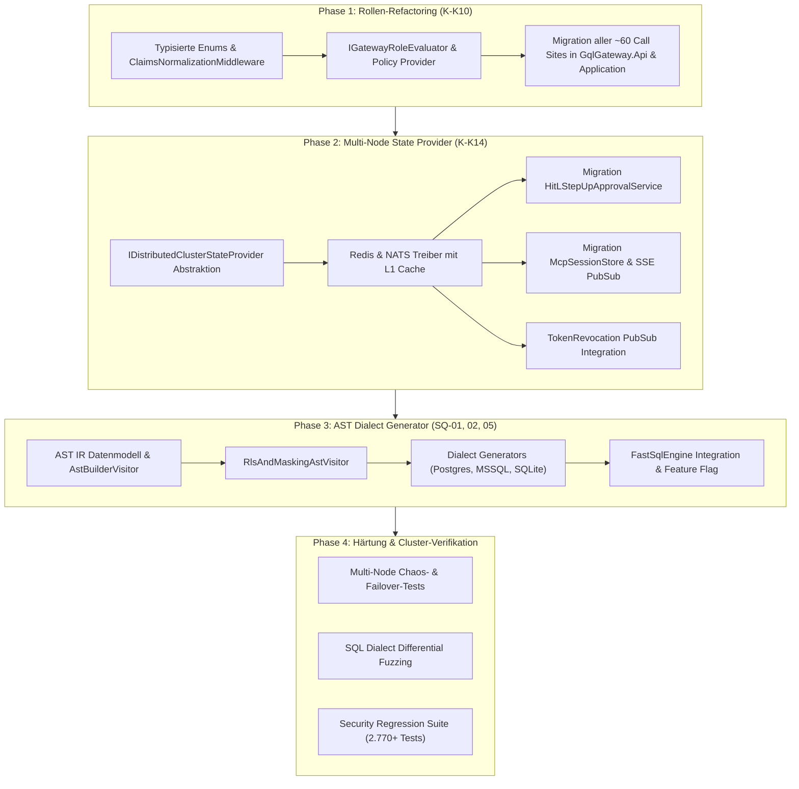

# Architektur- und Implementierungsplan: HA-Cluster, AST-Generator & RBAC-Konsolidierung

**Dokument-ID:** `ARCH-PLAN-2026-10-02-EVOLUTION`  
**Datum:** 2026-10-02  
**Status:** In Begutachtung (Entwurf)  
**Autor:** Enterprise Software & Security Architect  
**Geltungsbereich:** `gql` (Core Gateway), `gql_sqlparser` (FastSqlEngine), `gql_extensions`  

---

## 1. Executive Summary & Zielsetzung

Mit dem Abschluss der Runden 4 und 5 wurden alle 100 konkreten Sicherheitsbefunde (`SQ-01..16`, `P-01..06`, `E-01..10`, `EX-01..18`, etc.) im Code behoben und durch 2.770 automatisierte Tests abgesichert. Um das Enterprise GraphQL & SQL Gateway langfristig auf Enterprise-Niveau (Fortune-500, Multi-Region, Multi-Tenant, Zero-Trust) zu betreiben, adressiert dieser Architekturplan die drei verbleibenden strategischen Architekturthemen:

1. **`K-K14` Multi-Node Redis/NATS State Provider:** Ablösung prozesslokaler Speicher (`HitLStepUpApprovalService`, `McpSessionStore`, `TokenRevocationService`) durch eine hochverfügbare, pluggbare State- und Pub/Sub-Synchronisation mit Hybrid-Caching (L1 Memory + L2 Distributed Store) und Fail-Closed-Semantik.
2. **AST Target Dialect Generator (`SQ-01`, `SQ-02`, `SQ-05`):** Umstellung des SQL-Parsers vom heuristischen Token-Rewriting (`TokenStreamRewriter`) auf eine vollständige Compiler-Pipeline (AST-IR -> Security Policy Visitor -> Dialekt-spezifischer Code-Generator für PostgreSQL, SQL Server und SQLite), um Lexer- und Dialekt-Differentials konstruktiv auszuschließen.
3. **Rollen- und Rechte-Refactoring (`K-K10`):** Konsolidierung der historisch gewachsenen, redundanten Autorisierungsprüfungen (`GatewayPolicies`, `Sid.GetUserRoles`, `IsInRole`) zu einem einheitlichen, typisierten Enterprise-RBAC/ABAC-Modell mit Claims-Normalisierung und Mandantenisolierung.

---

## 2. Teilprojekt 1: Multi-Node Redis/NATS Provider (`K-K14`)

### 2.1 Problemstellung & Ist-Zustand
Im aktuellen Zustand arbeiten kritische Sicherheits- und Session-Komponenten zustandsbehaftet im lokalen Arbeitsspeicher der Gateway-Instanz:
- `HitLStepUpApprovalService`: Verwendet eine lokale `ConcurrentDictionary<string, TicketEntry>`. Wird ein HitL-Genehmigungsticket auf Knoten A angefragt, ein ITSM-Webhook trifft Knoten B und die Weiterverarbeitung erfolgt auf Knoten C, verfällt der Genehmigungsfluss im Timeout.
- `McpSessionStore`: Speichert Session-Zustände und Push-Notifier (`_sseSenders`) prozesslokal (`ConcurrentDictionary<string, McpSessionContext>`). Folgerequests eines LLM-Clients auf andere Knoten schlagen mit `404 Session Not Found` fehl.
- `TokenRevocationService`: Redis-Anbindung ist als Prototyp vorhanden (`RedisTokenRevocationService`), besitzt jedoch keinen Pub/Sub-Invalidierungsmechanismus für den lokalen L1-Cache, wodurch Widerrufe bis zu mehreren Sekunden verzögert erkannt werden können.

### 2.2 Zielarchitektur: Hybrid L1/L2 Distributed State & Pub/Sub
```
+---------------------------------------------------------------------------------+
|                               API / Middleware Layer                            |
|    TokenRevocationMiddleware | McpEndpoints | HitLApprovalEndpoints             |
+---------------------------------------------------------------------------------+
         |                                |                               |
         v                                v                               v
+------------------+             +------------------+            +------------------+
| ITokenRevocation |             | IMcpSessionStore |            | IHitLApprovalSvc |
+------------------+             +------------------+            +------------------+
         |                                |                               |
         +--------------------------------+-------------------------------+
                                          |
                                          v
                +---------------------------------------------------+
                |       IDistributedClusterStateProvider            |
                |  (L1 InMemory Cache + Pub/Sub Eviction Watcher)  |
                +---------------------------------------------------+
                                          |
                        +-----------------+-----------------+
                        |                                   |
                        v                                   v
             [ RedisClusterDriver ]                [ NatsKvJetStreamDriver ]
             - StackExchange.Redis                 - NATS.Client.Core
             - Redis Strings/Hashes/PubSub         - JetStream KV / PubSub
             - Sentinel / Cluster Support          - Leaf Nodes / Supercluster
```

### 2.3 Schnittstellen-Design & Datenmodelle

```csharp
namespace GqlGateway.Application.State;

public interface IDistributedClusterStateProvider
{
    ValueTask<T?> GetAsync<T>(string key, CancellationToken ct = default);
    ValueTask SetAsync<T>(string key, T value, TimeSpan ttl, CancellationToken ct = default);
    ValueTask<bool> RemoveAsync(string key, CancellationToken ct = default);
    
    // Pub/Sub für L1-Cache-Invalidierung & SSE-Event Routing
    ValueTask PublishEventAsync<T>(string channel, T payload, CancellationToken ct = default);
    IAsyncDisposable SubscribeAsync<T>(string channel, Func<T, ValueTask> handler, CancellationToken ct = default);
    
    // Verteilter Lock für Race-Condition-freie Ticket-Übernahme (HitL Four-Eyes)
    ValueTask<IAsyncDisposable?> TryAcquireLockAsync(string resourceKey, TimeSpan expiry, CancellationToken ct = default);
}
```

### 2.4 Domänenspezifische Umsetzung

1. **Token-Revocation (`K-K01` / `K-K14`):**
   - L1: Lokale `ConcurrentDictionary<string, DateTimeOffset>` mit ultrakurzer Zugriffszeit (< 100 ns).
   - L2: Redis Key `revoked:{jti|sub}` mit TTL = Restlebensdauer des Tokens.
   - Pub/Sub: Kanal `gateway:events:token-revoked`. Bei Eingang eines Widerrufs pusht der ausführende Knoten das Event in den Kanal; alle Knoten invalidieren sofort ihren lokalen L1-Cache.
   - *Fail-Closed:* Ist der Cluster-Treiber getrennt, gilt: Lokale Einträge greifen; neue Abfragen auf unbekannte Tokens werden im Hochsicherheitsmodus abgewiesen oder mit Warning auditiert.

2. **HitL Step-Up Approvals:**
   - Ticket-State liegt im Distributed KV-Store: Key `hitl:ticket:{approvalId}`.
   - State Machine: `Requested` -> `Approved` / `Rejected` / `Expired`.
   - Bei Genehmigung über Webhook/Admin-UI erwirbt der Knoten einen verteilten Lock `lock:hitl:{approvalId}`, validiert Four-Eyes (Genehmiger != Antragsteller) und setzt den Status atomar.
   - Pub/Sub-Kanal `hitl:channel:{approvalId}` weckt den wartenden Requestor-Knoten sofort auf (`TaskCompletionSource`).

3. **MCP Session & SSE-Routing:**
   - Session-Metadaten (Tenant, Principal, Granted Scopes) im Distributed KV mit Sliding Expiry (30 Minuten).
   - SSE-Push-Routing: Wenn MCP-Events für Client X anstehen, aber der SSE-Stream auf Knoten B terminiert ist, publiziert Knoten A die Nachricht auf `mcp:stream:{sessionId}`, und Knoten B reicht den Frame über HTTP-Response weiter.

### 2.5 Konfiguration & Failover
```json
{
  "Gateway": {
    "Cluster": {
      "Provider": "Redis", // "Redis", "Nats", "InMemory"
      "FailClosedOnPartition": true,
      "Redis": {
        "ConnectionString": "redis-cluster.prod:6379,abortConnect=false,ssl=true",
        "InstancePrefix": "gql_gw_prod:",
        "SyncTimeoutMs": 1000
      },
      "Nats": {
        "Url": "nats://nats-cluster.prod:4222",
        "Bucket": "gql_gateway_state",
        "Stream": "GQL_GATEWAY_EVENTS"
      }
    }
  }
}
```

---

## 3. Teilprojekt 2: AST Target Dialect Generator (`SQ-01`, `SQ-02`, `SQ-05`)

### 3.1 Problemstellung & Ist-Zustand
- Der bisherige SQL-Rewriter (`FastSqlEngine.Rewrite.cs` / `RlsListener.cs`) basiert auf dem ANTLR4 `TokenStreamRewriter`.
- Der Parser liest Trino-SQL, der Rewriter fügt Subqueries und Spaltenmaskierungen als String-Fragmente in den Token-Stream ein, und der resultierende String wird an PostgreSQL, SQL Server oder SQLite gesendet.
- **Architektonisches Risiko:** Wenn die Zieldatenbank Strings, Kommentare oder Schlüsselwörter anders interpretiert als der Trino-Lexer (z. B. T-SQL `TOP` statt `LIMIT`, SQLite dynamische Typisierung, PostgreSQL `E'...'`), entstehen Lexer-Differentials. Aktuell werden diese durch eine Vielzahl restriktiver Guards (z. B. Verbot aller Kommentare, Verbot von Backslashes, Verbot von `$$`) abgewehrt.
- **Konstruktive Lösung:** Anstatt Tokens per Suchen/Ersetzen zu modifizieren, wird die Query in einen typisierten, dialektneutralen AST (Intermediate Representation) überführt. Die Ziel-Query wird anschließend durch einen **Dialect Code Generator** vollständig neu synthetisiert.

### 3.2 Compiler-Pipeline-Architektur

```
+---------------------------------------------------------------------------------+
| 1. Lexing & Parsing (SqlBase.g4 / Trino Grammar)                                |
|    Input SQL -> TokenStream -> ParseTree Context                                |
+---------------------------------------------------------------------------------+
                                      |
                                      v
+---------------------------------------------------------------------------------+
| 2. AST Transformation (AstBuilderVisitor)                                       |
|    ParseTree -> Typisierter dialektneutraler AST (AstNode Hierarchy)            |
+---------------------------------------------------------------------------------+
                                      |
                                      v
+---------------------------------------------------------------------------------+
| 3. Security & Governance Visitor (RlsAndMaskingAstVisitor)                      |
|    - Table Whitelist Validation (Catalog Metadata)                              |
|    - RLS Injection: TableNode -> SubqueryNode(SELECT * FROM Table WHERE <rls>)  |
|    - Column Masking: ColumnReferenceNode -> MaskingFunctionExpressionNode       |
|    - DML Guards: Validierung von UPDATE/DELETE Where-Clauses                    |
+---------------------------------------------------------------------------------+
                                      |
                                      v
+---------------------------------------------------------------------------------+
| 4. Target Dialect Code Emission (ISqlDialectGenerator)                          |
|    Traversiert den geschützten AST und erzeugt sauberes Target-SQL             |
+---------------------------------------------------------------------------------+
         |                                |                               |
         v                                v                               v
[ PostgreSqlGenerator ]         [ SqlServerGenerator ]          [ SqliteGenerator ]
- Quoting: "table"."col"        - Quoting: [table].[col]        - Quoting: "table"."col"
- Params: $1, $2, $3            - Params: @p1, @p2, @p3         - Params: @p1, @p2
- Paging: LIMIT N OFFSET M      - Paging: TOP (N) / OFFSET M    - Paging: LIMIT N OFFSET M
- Bool: TRUE / FALSE            - Bool: 1 / 0                   - Bool: 1 / 0
- String: 'text' (kein E'')     - String: N'text'               - String: 'text'
```

### 3.3 AST Intermediate Representation (IR) Kernklassen

```csharp
namespace GqlGateway.SqlParser.Ast;

public abstract record AstNode;

public record SelectStatementNode(
    SelectClauseNode Select,
    FromClauseNode? From,
    WhereClauseNode? Where,
    GroupByClauseNode? GroupBy,
    HavingClauseNode? Having,
    OrderByClauseNode? OrderBy,
    LimitClauseNode? Limit) : AstNode;

public record TableSourceNode(
    string? Catalog,
    string? Schema,
    string TableName,
    string? Alias) : AstNode;

public record SubquerySourceNode(
    SelectStatementNode Subquery,
    string Alias) : AstNode;

public abstract record ExpressionNode : AstNode;

public record BinaryExpressionNode(
    ExpressionNode Left,
    BinaryOperator Operator,
    ExpressionNode Right) : ExpressionNode;

public record ColumnReferenceNode(
    string? TableOrAlias,
    string ColumnName) : ExpressionNode;

public record ParameterPlaceholderNode(string ParameterName) : ExpressionNode;
```

### 3.4 Target Generator Implementierung am Beispiel T-SQL
Der `SqlServerDialectGenerator` transformiert AST-Knoten zielsystemkonform:
- Erkennt `LimitClauseNode(Count: 100, Offset: 0)` im `SelectStatementNode`.
- Besitzt die Query kein `OrderBy`, generiert er `SELECT TOP (100) ...`.
- Besitzt die Query ein `OrderBy`, generiert er am Ende `OFFSET 0 ROWS FETCH NEXT 100 ROWS ONLY`.
- Tabellenbezeichner werden zwingend mit `[schema].[table]` quotiert; Punkte innerhalb von Aliasen oder Namen werden physisch durch die AST-Struktur entkoppelt (keine String-Konkatenation).
- **Sicherheitsgewinn:** Kommentare, Escapes oder unberechtigte Token-Sequenzen der Quellabfrage können physisch nicht im generierten SQL auftauchen, da sie nicht Teil des ASTs sind.

---

## 4. Teilprojekt 3: Rollen- und Rechte-Refactoring (`K-K10`)

### 4.1 Problemstellung & Ist-Zustand
Historisch gewachsen existieren im Core-Gateway drei parallele Prüfpfade:
1. `GatewayPolicies.HasAnyRole(principal, ...)`: Prüft `ClaimTypes.Role`, `"role"`, `"roles"`.
2. `Sid.GetUserRoles(principal)`: Liest Active Directory Windows-Gruppen-SIDs aus Kerberos-Tickets und mappt diese auf Gateway-Rollen.
3. Direkte `context.User.IsInRole("Admin")` oder `[Authorize(Roles = "...")]` Aufrufe an Controllern und Endpunkten.

**Defizite:**
- Inkonsistenz: Ein Benutzer mit Kerberos-Gruppen-SIDs wird an Endpunkt A autorisiert, schlägt aber an Endpunkt B fehl, weil dort nur ClaimTypes.Role geprüft wird.
- Hardcodierte Rollen-Strings: `"DataSteward"`, `"GovernanceAdmin"`, `"PlatformAdmin"` sind über ~60 Code-Stellen verteilt.
- Fehlende Mandantentrennung: Rollen wie `DataOwner` galten bisher potenziell gatewayweit statt pro Mandant.

### 4.2 Zielarchitektur: Einheitliche Enterprise RBAC/ABAC Engine

```
[ Inbound Request (JWT / Kerberos Negotiate / mTLS) ]
                       |
                       v
    +---------------------------------------------------------+
    |   ClaimsNormalizationMiddleware                         |
    |   - Extrahiert Kerberos SIDs, OIDC Claims, mTLS Certs   |
    |   - Löst External Identity -> Canonical Identity auf    |
    |   - Mappt Gruppen via RoleMappingService                |
    +---------------------------------------------------------+
                       |
                       v
         [ ClaimsPrincipal mit kanonischen Claims ]
         - ClaimTypes.NameIdentifier = "user@corp.local"
         - ClaimTypes.Role = "GatewayRole.DataSteward"
         - "tenant_id" = "tenant-emea"
         - "tenant_role" = "tenant-emea:DataOwner"
                       |
                       v
    +---------------------------------------------------------+
    |   IGatewayAuthorizationService                          |
    |   - EvaluatePolicy(principal, policy, resourceContext)  |
    |   - Prüft Mandantenkontext & Hierarchie                 |
    +---------------------------------------------------------+
                       |
                       +-----------------------+
                       |                       |
                       v                       v
          [ ASP.NET Core Policies ]   [ Endpoint Security Helpers ]
          .RequireAuthorization(       EndpointSecurity.EnsureRole(
             GatewayPolicies.Approver)    principal, GatewayRole.DataOwner)
```

### 4.3 Typisierte Rollenhierarchie & Interfaces

```csharp
namespace GqlGateway.Domain.Security;

public enum GatewayRole
{
    // Globale Rollen
    ClusterAdmin = 1,
    GovernanceAdmin = 2,
    SecurityAuditor = 3,
    
    // Mandanten- / Daten-Rollen
    DataOwner = 10,
    DataSteward = 11,
    SchemaPublisher = 12,
    Consumer = 20
}

public interface IGatewayRoleEvaluator
{
    bool HasRole(ClaimsPrincipal principal, GatewayRole role, string? tenantId = null);
    bool HasAnyRole(ClaimsPrincipal principal, IEnumerable<GatewayRole> roles, string? tenantId = null);
    IReadOnlySet<GatewayRole> GetEffectiveRoles(ClaimsPrincipal principal, string? tenantId = null);
}
```

### 4.4 Rollenhierarchie & Vererbung
Um die Konfiguration in Großkonzernen zu vereinfachen, implementiert der Evaluator eine definierte Vererbung:
- `ClusterAdmin` erbt implizit alle Rechte von `GovernanceAdmin`, `SecurityAuditor`, `SchemaPublisher`.
- Innerhalb eines Mandanten erbt `DataOwner` alle Rechte von `DataSteward` und `Consumer`.
- Alle Prüfungen an Endpunkten werden über Extension-Methods standardisiert:
  ```csharp
  app.MapPost("/api/governance/approve", ...)
     .RequireGatewayRole(GatewayRole.DataSteward);
  ```

---

## 5. Implementierungs-Roadmap & Arbeitspakete

Die Umsetzung ist in 4 aufeinanderfolgende Phasen unterteilt:



### Detaillierter Termin- und Meilensteinplan

| Phase | Sprint / Tag | Aufgabenpaket | Betroffene Repos | Deliverable |
|---|:---:|---|---|---|
| **Phase 1** | T1 – T2 | **Rollen-Refactoring (`K-K10`)**<br>- `GatewayRole` Enum & `IGatewayRoleEvaluator`<br>- `ClaimsNormalizationMiddleware` (AD SIDs + OIDC Claims)<br>- Migration von `GatewayPolicies.cs` und Endpunkten | `gql` | Einheitliche Rollenauflösung, 100% abwärtskompatibel zu bestehenden JWTs |
| **Phase 2** | T3 – T5 | **Multi-Node State & Pub/Sub (`K-K14`)**<br>- `IDistributedClusterStateProvider` Kern & In-Memory Fallback<br>- Redis (StackExchange.Redis) + NATS Treiber<br>- HitL-Tickets verteilen & verteilte Locks einbinden<br>- MCP Session Store & SSE Routing verteilen | `gql` | Stateless Multi-Node Clusterbetrieb für HitL und MCP; kein Session-Loss bei Node-Ausfall |
| **Phase 3** | T6 – T9 | **AST Target Dialect Generator**<br>- AST IR Knoten in `gql_sqlparser`<br>- ANTLR ParseTree -> AST Visitor<br>- Security/RLS Transformation auf AST-Knoten<br>- Dialekt-Emitter für Postgres (`"..."`, `$1`), MSSQL (`[...]`, `TOP/OFFSET`), SQLite | `gql_sqlparser`, `gql` | Konstruktiver Ausschluss von Lexer-Differentials; T-SQL Rewrite ohne Heuristiken |
| **Phase 4** | T10 – T11 | **Verifikation, Fuzzing & Dokumentation**<br>- Multi-Instance Integrationstests (Docker-Compose mit 2 Gateways + Redis + NATS)<br>- Dialekt-Differential Fuzzing Tests<br>- ADR-Aktualisierung (ADR-004, ADR-006, ADR-017) | Alle 3 Repos | Abnahme-Report, vollständige Testabdeckung, Clean Production Readiness |

---

## 6. Risiken, Abhängigkeiten & Migrationspfad

1. **Abwärtskompatibilität:**
   - Die `ClaimsNormalizationMiddleware` mappt bestehende Claims (`roles`, `role`, Windows SID Claims) transparent auf kanonische Rollen. Externe Client-Tokens müssen nicht geändert werden.
   - Der AST-Generator wird zunächst über das Konfigurationsflag `SqlParser:Engine:UseAstDialectGenerator = true` ausgeliefert (Opt-in in Staging, Default in Produktion nach Bestehen der Fuzzing-Tests).
2. **Resilienz & Cluster-Partitionierung:**
   - Sollte der Redis- oder NATS-Cluster ausfallen, greift der konfigurierbare `FailClosedOnPartition`-Modus:
     - Im regulären Betrieb: Read-Fallback auf lokalen L1-Cache, Ablehnung von schreibenden Genehmigungen (HitL) mit HTTP 503.
     - Im Hochsicherheitsmodus: Sofortiges Fail-Closed bei Token-Prüfungen.
3. **Performance-Ziele:**
   - L1-Cache Hit-Rate für Rollen und Token-Prüfungen: > 99,5 %.
   - L1-Invalidierungslatenz über Pub/Sub im Cluster: < 5 ms.
   - AST Generation Overhead: < 0,2 ms zusätzlich gegenüber bisherigem Token-Rewriting durch Node-Pooling.
