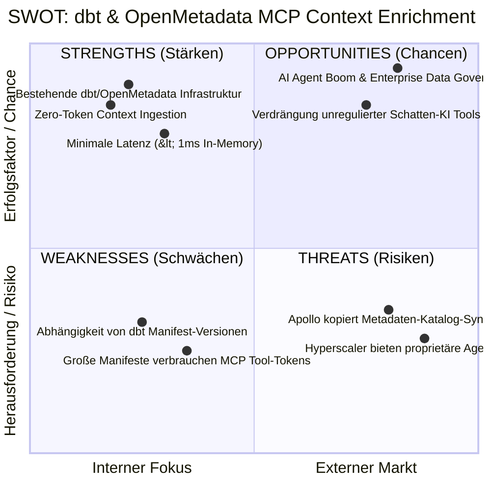
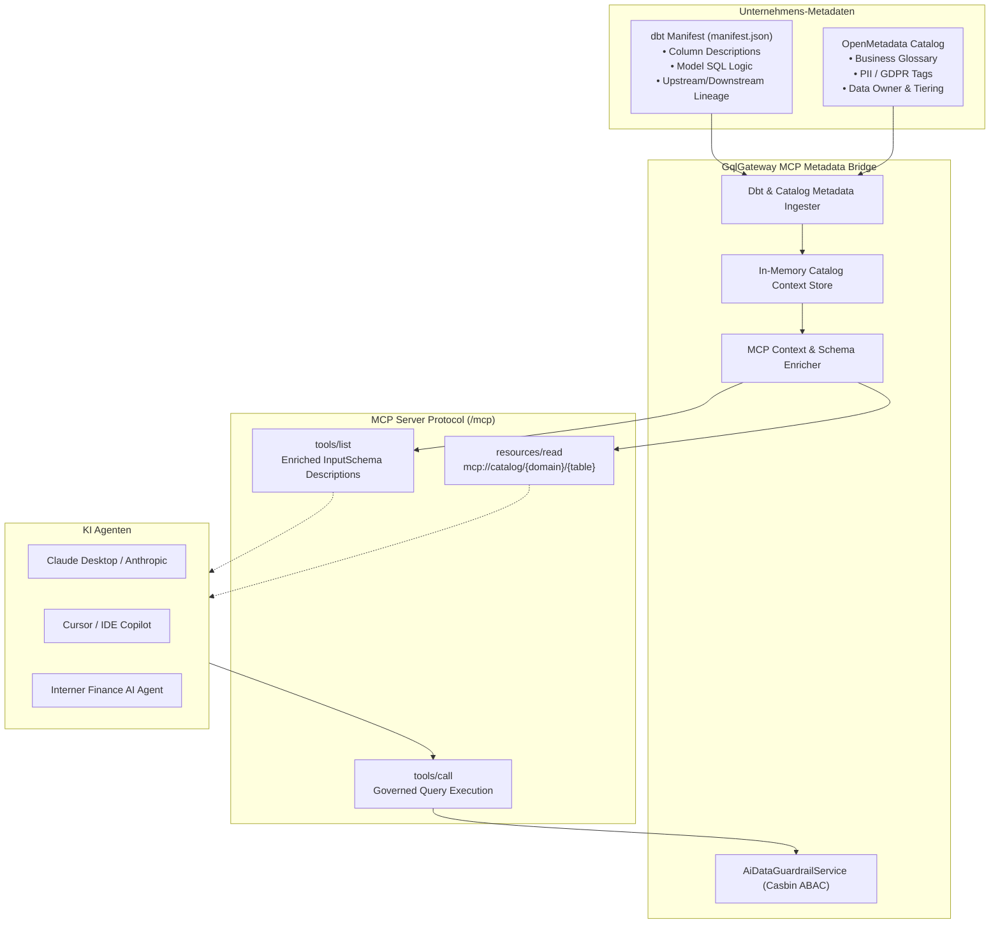

# PRD: Context-Aware MCP AI Agent Gateway (dbt + OpenMetadata Metadata Bridge)

**Feature-ID:** F-AI-02  
**Status:** In Review / Strategic Roadmap (P0)  
**Author:** Principal Enterprise Product Manager & Platform Strategist  
**Target Release:** GqlGateway v2.4  
**Impact Level:** High Strategic Moat (Competitive Advantage vs. Apollo/Hasura)

---

## 1. Executive Summary & Problem Statement

### Das Problem: Die "Naked Schema"-Krise für LLMs und MCP-Agenten
Autonome KI-Agenten (Claude Desktop, Cursor, Custom Enterprise LLM Agents via Model Context Protocol) greifen heute über MCP-Tools auf Unternehmensdatenbanken und APIs zu. Nahezu alle bestehenden Lösungen (Apollo GraphOS, Hasura DDN, generische SQLite/Postgres-MCP-Server) leiden jedoch unter dem **"Naked Schema"-Problem**:
* **Keine Semantik:** Der Agent sieht lediglich Typen wie `cust_cst_amt: Float` oder `status_id: Int`.
* **Halluzinationen & Fehl-Queries:** LLMs raten die Bedeutung von Abkürzungen (`arr`, `ebitda_adj`, `churn_flg`) oder filtern auf falsche Spalten.
* **Datenschutz-Blindflug:** Der Agent weiß im Vorfeld nicht, ob eine Spalte DSGVO-relevant (Art. 9) oder PII ist. Erst nach Ausführung wird der Call blockiert oder maskiert, was zu Frustration und hohen Token-Kosten durch Retry-Loops führt.

### Die Lösung: Automatische dbt- & OpenMetadata-Kontextinjektion
Im Unternehmen existiert dieses Wissen bereits:
1. **dbt**: Enthält im `manifest.json` präzise Spaltenbeschreibungen, Berechnungslogiken (`SQL models`), Data Tests und Beziehungsmetriken.
2. **OpenMetadata**: Pflegt das zentrale **Business Glossary** (Fachbegriffe), Tiering (z.B. Tier-1 Core Financials), Data Owner und Klassifizierungs-Tags (`PII.Sensitive`, `Confidentiality: Strict`).

Das GqlGateway fusioniert diese Metadaten **vollautomatisch und zur Laufzeit** in die MCP-Schnittstelle:
* **Tool-Parameter-Beschreibungen** enthalten die dbt-Dokumentation und OpenMetadata-Glossarbegriffe.
* **MCP Resources (`resources/list`, `resources/read`)** exponieren interaktive Data Dictionaries für Data Meshes.
* **Proaktive Guardrail-Hinweise:** Das Tool-Schema signalisiert dem Agenten vorab, wenn eine Spalte eine 4-Augen-Freigabe (ITSM-Ticket) erfordert.

---

## 2. Markt- & Konkurrenzanalyse

| Kriterium | Apollo GraphOS / Router | Hasura DDN | Generische MCP Server | **GqlGateway (mit dbt/OpenMetadata)** |
| :--- | :--- | :--- | :--- | :--- |
| **Metadaten-Quelle** | Nur GraphQL SDL Docstrings | Proprietäre Hasura-Metadaten | Flache DB Information_Schema | **Offene Standards (dbt manifest.json & OpenMetadata REST)** |
| **Business Glossary** | ❌ Nein | ❌ Nein | ❌ Nein | **✅ Nativ über OpenMetadata Glossar & Tags** |
| **Lineage im Agenten** | ❌ Nein | ❌ Nein | ❌ Nein | **✅ dbt Model Lineage als MCP Resource abrufbar** |
| **Kosten / Token-Effizienz** | Mittel (viele Retry-Loops) | Mittel | Schlecht (ständige Schema-Exploration) | **Exzellent: Präzise Einmal-Queries durch maximalen Kontext** |
| **Governance & Zero-Trust** | Nur Gateway-Auth | Eigene RBAC | Keine Guardrails | **Zero-Trust ABAC + Casbin + Audit-Hash-Chain** |

### SWOT-Analyse

---

## 3. Architektur & Datenfluss

---

## 4. User Stories & Akzeptanzkriterien

### US-1: dbt Column-Descriptions in MCP Tool-Schemas
* **Als** AI-Agent-Entwickler
* **Möchte ich**, dass jedes via MCP exponierte Tool (`query_table`, `execute_graphql`) detaillierte Beschreibungen aus `dbt` enthält,
* **Damit** der Agent exakt versteht, welche Spalte welche betriebswirtschaftliche Bedeutung hat, ohne zu halluzinieren.
  * *Akzeptanzkriterium 1*: Wenn `manifest.json` für eine Tabelle Spaltenbeschreibungen enthält, werden diese 1:1 in das `properties.<column>.description`-Attribut des MCP Tool-Schemas gemappt.
  * *Akzeptanzkriterium 2*: Enthält dbt Tests (z.B. `accepted_values: ['EUR', 'USD']`), werden diese als Enum-Werte im Tool-Schema deklariert.

### US-2: OpenMetadata Glossar & Tagging Injection
* **Als** Data Governance Officer
* **Möchte ich**, dass Klassifizierungen wie `PII.Sensitive` und Business-Glossar-Definitionen im MCP-Kontext mitgeführt werden,
* **Damit** der Agent datenschutzkonform agiert und dem Nutzer proaktiv Erklärungen liefert.
  * *Akzeptanzkriterium 1*: Glossar-Synonyme (z.B. "Umsatz" = `revenue_gross`) werden in Tool-Descriptions aufgenommen.
  * *Akzeptanzkriterium 2*: PII-markierte Felder erhalten im Schema den Hinweis: `[SENSITIVE - Requires Department Clearance]`.

### US-3: MCP Resources für Data Dictionaries (`resources/list`, `resources/read`)
* **Als** autonomer Data-Analyst-Agent
* **Möchte ich** vor dem Ausführen teurer Queries das Datenmodell über Standard-MCP-Ressourcen inspizieren (`mcp://catalog/models/{name}`),
* **Damit** ich komplexe Multi-Tabellen-Joins planen kann.
  * *Akzeptanzkriterium 1*: `/mcp` implementiert `resources/list` und listet alle freigegebenen dbt-Modelle und Tabellen.
  * *Akzeptanzkriterium 2*: `resources/read` liefert Markdown-formatierten Kontext (Description, Lineage, Schema, Owner).

---

## 5. RICE-C Priorisierung

$$\text{Score} = \frac{8 \times 3.0 \times 90\% \times 1.8}{2 \text{ Sprints}} = 19.44 \quad (\text{Höchste Prioritätsstufe / Top-Performer})$$

* **Reach (8/10):** Nahezu alle Enterprise-Kunden mit dbt und AI-Initiativen profitieren sofort.
* **Impact (3.0 - Maximum):** Wettbewerber besitzen keinen vergleichbaren integrierten Kontext-Layer.
* **Confidence (90%):** Sowohl dbt-Ingestion als auch OpenMetadata-Client und MCP-Server sind im Gateway bereits lauffähig implementiert.
* **Compliance Weight (1.8):** Adressiert EU AI Act & DSGVO Art. 25 ("Privacy by Design").
* **Effort (2 Sprints):** Reine Verknüpfungs- und Formatting-Logik im bestehenden `McpToolRegistry` und `AiDataGuardrailService`.

---

## 6. NFRs (Nicht-funktionale Anforderungen)

1. **Performance / Zero-Latency**: 
   - Das Ingestion-Mapping erfolgt asynchron im Hintergrund oder beim Deployment.
   - `tools/list` muss aus dem In-Memory-Cache innerhalb von **< 1.0 ms** antworten.
2. **Token-Budget-Optimierung**:
   - Tool-Beschreibungen werden auf maximal 200 Zeichen pro Spalte gekürzt, um das System-Prompt-Token-Budget des LLMs nicht zu überlasten.
3. **Sicherheit & Isolation**:
   - Metadaten werden strikt mandantenspezifisch gefiltert (Tenant A sieht keine dbt-Modelle von Tenant B).
