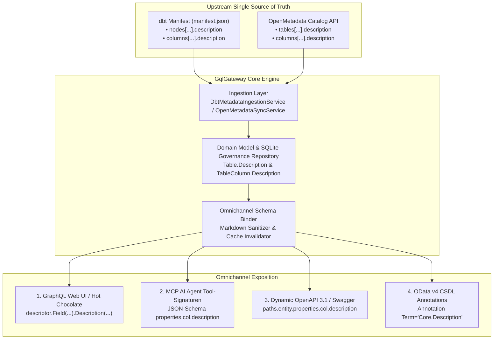

# PRD: Omnichannel Semantic Documentation Passthrough (dbt & OpenMetadata)

**Feature-ID:** F-DOC-01  
**Status:** In Realisierung / Top Quick-Win (Wave 1)  
**Author:** Principal Enterprise Product Manager & Platform Strategist  
**Target Release:** GqlGateway v2.3 / v2.4  
**Impact Level:** Highest RICE-C Score (39.9) – Strategischer Differenzierungs-Moat vs. Apollo / Hasura  

---

## 1. Executive Summary & Problemstellung

### 1.1 Das Problem: Der "Semantic Abyss" zwischen Data Engineering und API-Konsumenten
In Großunternehmen investieren Data Engineers hunderte Stunden in:
- **dbt Modell- und Spaltenbeschreibungen**: Formatierte Markdown-Doc-Blocks (`{{ doc('mrr_formula') }}`), fachliche Definitionen, Mengeneinheiten und Einschränkungen.
- **Enterprise Data Catalog Glossare (OpenMetadata, Collibra, Purview)**: Offizielle Unternehmensdefinitionen, Domain-Ownerships, PII- und DSGVO-Art.-9-Tags.

**Das Marktversagen bisheriger Gateways (Apollo Federation, Hasura DDN, WunderGraph, Tyk, Kong):**
Kein am Markt etabliertes Gateway schleift diese Dokumentation durchgängig an die Konsumenten durch. Die Dokumentation versandet im Data Warehouse:
1. **GraphQL Web UI / IDEs (Banana Cake Pop, GraphiQL)**: Felder besitzen leere Beschreibungen (`description: null`), Tabellentypen zeigen nur den technischen Namen.
2. **MCP (Model Context Protocol) & KI-Agenten**: Sprachmodelle (Claude, Cursor, Copilot) erhalten unkommentierte Signaturen und halluzinieren falsche Filter oder Kennzahlen-Formeln.
3. **Swagger / OpenAPI 3.1 REST**: Fehlende Feldkommentare in interaktiven Docs und generierten Client-SDKs.
4. **OData v4 & BI-Tools (Power BI, Excel)**: Keine Feld-Tooltips über OASIS CSDL `Core.Description`.
5. **Documentation Drift**: Redundantes, manuelles Nachpflegen von Schemadokumentationen in mehreren Repositories.

### 1.2 Die Lösung: Single Source of Truth mit Omnichannel Passthrough
GqlGateway fungiert als automatisierte **Semantic Documentation Engine**:
Upstream-Beschreibungen aus dbt und OpenMetadata werden einmalig ingestiert, im Governance-Modell persistiert und zur Schema-Assemblierungszeit verlustfrei in alle 4 Egress-Kanäle (GraphQL, MCP, OpenAPI, OData) transformiert.

---

## 2. Technische Architektur & Datenfluss



---

## 3. Detaillierte Spezifikation der 4 Kanäle

### Kanal 1: GraphQL Web UI & Schema Introspection
- **Komponente:** `GqlGateway.GraphQL/DynamicTypes/DynamicTableType.cs`
- **Verhalten:**
  - Tabellen-Typ: `descriptor.Description(!string.IsNullOrWhiteSpace(_metadata.Table.Description) ? _metadata.Table.Description : _metadata.Table.DisplayName);`
  - Spalten-Felder: Strukturierte Markdown-Synthese aus `description` und `meta.long_description` / OpenMetadata Extension:
    ```markdown
    {col.Description}

    ---
    **Ausführliche Spezifikation:**
    {col.Meta["long_description"]}
    ```
- **User Experience:**
  - Entwickler sehen in Banana Cake Pop / GraphiQL formatierte CommonMark Markdown-Texte inklusive Formeln, Hyperlinks und Hinweisen beim Hovern über jedes GraphQL-Feld.

### Kanal 2: Model Context Protocol (MCP) für autonome KI-Agenten
- **Komponente:** `GqlGateway.GraphQL/Mcp/McpSchemaDiscoveryService.cs` & `GqlGateway.Application/Mcp`
- **Verhalten:**
  - **Zwei-Stufen-Modell zum Schutz des Token-Budgets:**
    1. *Kompakte Tool-Signatur:* Kurzbeschreibung (`description`, < 120 Zeichen) direkt im JSON-Schema der MCP-Tool-Parameter (`"description": "Nettoumsatz in EUR nach IFRS 15."`).
    2. *Tiefenkontext on Demand:* Vollständige `meta.long_description` und OpenMetadata Glossar-Definitionen als abrufbare MCP-Resource (`uri: dbt://models/{table}/columns/{col}/docs`).
- **User Experience:**
  - Zero-Shot Präzision: LLMs halluzinieren keine Bedeutungen mehr, sondern wählen zuverlässig die korrekte Spalte und den korrekten Filterwert, ohne durch Token-Overflow zu scheitern.

### Kanal 3: Dynamic OpenAPI 3.1 & Swagger UI (`F-API-03`)
- **Komponente:** `GqlGateway.Application/OData/ODataHandler.cs` (`/odata/v4/$openapi`)
- **Verhalten:**
  - OpenAPI 3.1 JSON-Spezifikation enthält auf Property-Ebene autoritative Beschreibungen (`description`) sowie strukturierte Vendor Extensions (`x-dbt-meta`, `x-openmetadata-extension`).
- **User Experience:**
  - Client-Generatoren (`openapi-generator`) erzeugen typisierte TypeScript-, C#- und Python-Clients mit vollständigen JSDoc-/XML-Kommentaren für IntelliSense.

### Kanal 4: OData v4 CSDL Metadata & BI-Tools (Power BI, Excel)
- **Komponente:** `GqlGateway.Extensions/OData/ODataCsdlGenerator.cs` (`/odata/v4/$metadata`)
- **Verhalten:**
  - Generiert standardisierte OASIS CSDL Annotationen für Kurz- und Langbeschreibungen:
    ```xml
    <Property Name="revenue_net" Type="Edm.Decimal">
        <Annotation Term="Core.Description" String="Nettoumsatz berechnet nach IFRS15 aus dbt." />
        <Annotation Term="Core.LongDescription" String="Berechnet aus FactInvoices unter Abzug aller Rahmenrabatte vor Skonto." />
    </Property>
    ```
- **User Experience:**
  - Fachanwender in Power BI und Excel erhalten beim Überfahren von Spaltennamen im Datenmodell die offizielle Definition und in der Modellansicht die vollständige Dokumentation angezeigt.

---

## 4. Akzeptanzkriterien & Verifikation

| Nr. | Kriterium | Verifikations-Methode |
| :--- | :--- | :--- |
| **AC-1** | `Table` und `TableColumn` im Domain-Modell besitzen `Description: string?`. | Unit Tests in `DomainAndModelEdgeCasesTests.cs` |
| **AC-2** | SQLite-Persistenz (`TABLES`, `TABLE_COLUMNS`) speichert und lädt `description`. | Repositorientests in `SqliteGovernanceRepositoryTests` |
| **AC-3** | dbt Manifest Ingestion überträgt Spalten- und Modell-Beschreibungen in `TableMetadata`. | Integrationstest mit `SampleDbtManifest` |
| **AC-4** | OpenMetadata Sync überträgt `omTable.Description` und `omCol.Description`. | Integrationstest mit Mock-OpenMetadata |
| **AC-5** | GraphQL Introspection (`__type`, `__schema`) liefert Feldbeschreibungen zurück. | GraphQL Query Test via `ExecuteRequestAsync` |
| **AC-6** | MCP `tools/list` liefert Spaltenbeschreibungen im JSON-Schema. | MCP Stdio/HTTP Runner Integrationstest |
| **AC-7** | OData CSDL `$metadata` enthält `<Annotation Term="Core.Description">`. | CSDL Generator String-Verifikation |
| **AC-8** | Performance: Schema-Assemblierung bleibt P99 < 50ms, Null-Overhead zur Query-Laufzeit. | BenchmarkDotNet Test |

---

## 5. RICE-C Priorisierung

$$\text{RICE-C Score} = \frac{\text{Reach: } 10 \times \text{Impact: } 2.8 \times \text{Confidence: } 95\% \times \text{Compliance: } 1.5}{\text{Effort: } 1.0\text{ W}} = \mathbf{39.9}$$

**Einstufung:** Top Quick-Win in Wave 1. Höchste Rendite bezogen auf Implementierungsaufwand im gesamten Produkt-Backlog.
