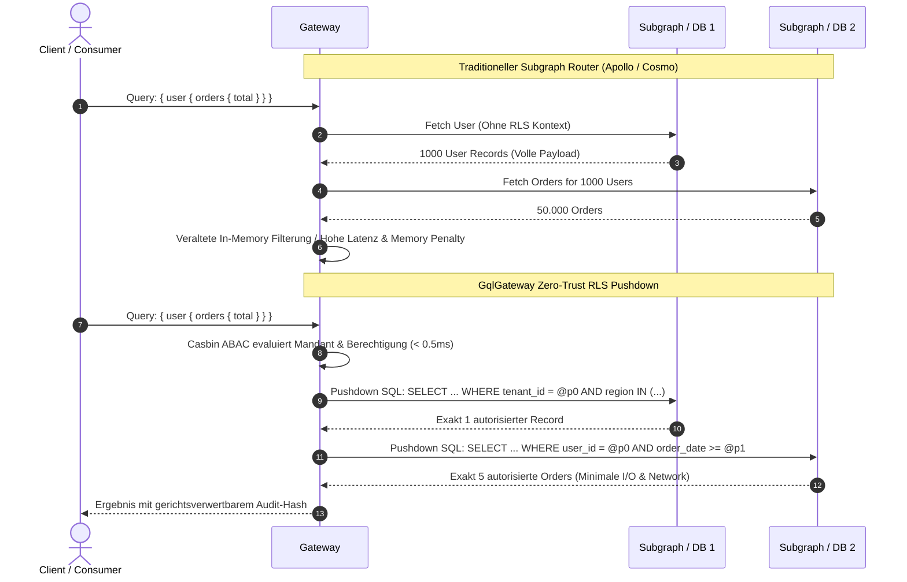
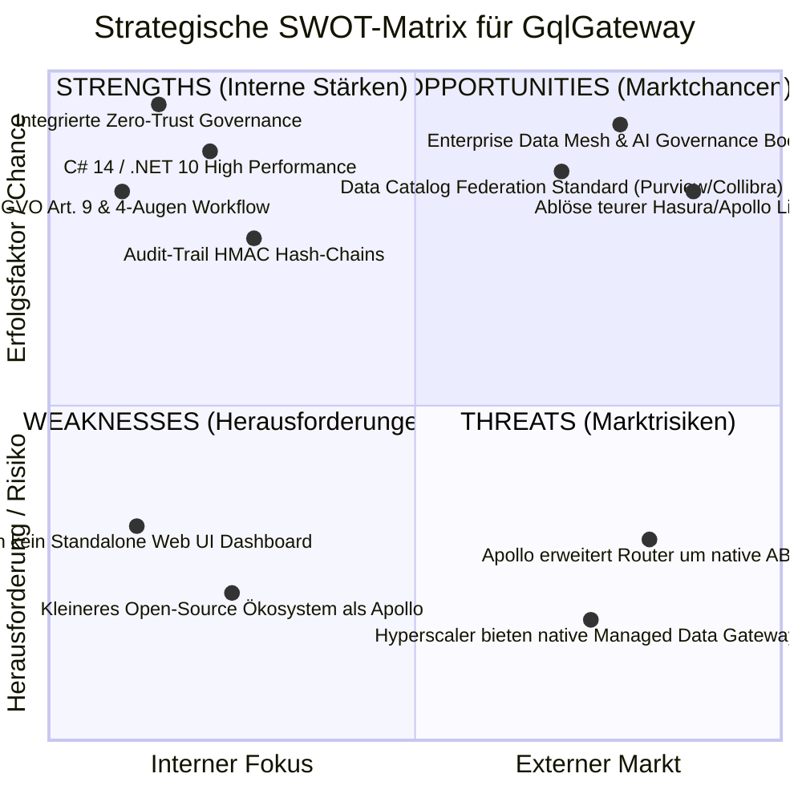

# ⚖️ Enterprise Feature-Vergleich & Wettbewerbsanalyse (Feature Comparison)

**Dokument:** GqlGateway vs. Markt-Wettbewerber (Stand: 2025 / 2026)  
**Autor:** Principal Enterprise Product Manager & Platform Strategist  
**Verglichene Lösungen:**
1. **GqlGateway** (Enterprise Zero-Trust Data-Owner Gateway)
2. **Apollo GraphQL** (Federation v2, GraphOS, Apollo Router)
3. **Hasura Enterprise** (DDN / Data Delivery Network v3)
4. **WunderGraph / Cosmo** (Open-Source Federation Router)
5. **StepZen** (IBM API Gateway / Declarative GraphQL)
6. **Data Security Suites** (Immuta, Privacera)
7. **Klassische API Gateways** (Tyk.io, Kong Enterprise, Envoy Gateway)

---

## 1. Executive Summary & Markteinordnung

Im Jahr 2025/2026 hat sich der Markt für GraphQL- und API-Gateways in drei Hauptlager aufgeteilt:
* **Frontend- & API-Föderations-Router (Apollo, Cosmo):** Exzellent im Zusammensetzen von Subgraphs, aber blind für relationale Data Governance, zeilenbasierte Autorisierung (RLS) und revisionssichere Audit-Compliance.
* **Instant-DB-APIs (Hasura DDN, StepZen):** Schneller Zugriff auf Datenbanken, jedoch stark proprietär gekoppelt, mit astronomischen Enterprise-Lizenzkosten und ohne native Integration in ITSM-Freigabeprozesse.
* **Klassische Ingress-Gateways (Kong, Tyk, Envoy):** Stark im L7-Routing, scheitern jedoch an Deep GraphQL AST-Kontexten, verursachen durch Out-of-Process-Coprozesse (gRPC) massive Latenzstrafen und kennen nur statisches Allow/Deny statt interaktiver Governance.

**GqlGateway besetzt die Leerstelle:** Ein **Zero-Trust Enterprise Data Gateway**, das Subgraph-Föderation (Hot Chocolate Fusion) mit tiefem relationalen SQL-RLS-Pushdown, nativer Apache Iceberg Lakehouse-Unterstützung, **columnar Apache Parquet Analytics-Export**, OData v4 Dual-Access, unternehmensweiter Metadaten-Synchronisation (Purview, Collibra, Alation), dbt Data-Mesh-Absicherung und nativer KI-Agenten-Governance (Model Context Protocol / MCP) verbindet.

---

## 2. Umfassende Feature-Vergleichsmatrix

| Feature-Bereich | Feature / Anforderung | GqlGateway | Apollo GraphOS / Router | Hasura DDN Enterprise | WunderGraph Cosmo | StepZen (IBM) | Immuta / Privacera | Tyk / Kong / Envoy |
| :--- | :--- | :---: | :---: | :---: | :---: | :---: | :---: | :---: |
| **Architektur & Engine** | Laufzeitumgebung / Sprache | **.NET 10 / C# 14** | Rust (Router) / Node.js | Rust / Haskell | Rust / Go | Go / Java | Java / Python Daemon | Go / C++ / Lua |
| | AST-Parsing & Zero-Allocation | **Ja** (Spans, SIMD) | Ja (Rust) | Ja | Ja | Teilweise | Nein (DB-Proxy) | Nein (JSON-Stream) |
| | Dual-Mode Extensibility | **Ja** (C# DLL & gRPC) | Nein (Rhai / Rust) | Nein (Webhooks) | Nein (Go Plugins) | Nein | Nein | Teilweise (gRPC/Lua) |
| **Access Control & RLS** | Zero-Trust Default Fail-Closed | **Ja** (Zwingend) | Nein (Opt-In) | Ja | Nein | Nein | Ja | Nein (Allow-all Default) |
| | Natives SQL RLS Pushdown | **Ja** (MSSQL, PG, SQLite, Databricks, Oracle) | ❌ Nein (Subgraph-Delegation) | **Ja** (Proprietär) | ❌ Nein | ❌ Nein | **Ja** (DB-Ebene) | ❌ Nein (Nur HTTP Path) |
| | Casbin ABAC / Dynamic Policy | **Ja** (`sub_rule`, Hot-Reload) | ❌ Nein | ❌ Nein | ❌ Nein | ❌ Nein | Ja (Proprietär) | Teilweise (OPA Sidecar) |
| | Active Directory / Kerberos SID | **Ja** (Transitiv SIDs) | ❌ Nein (Nur Claims) | ❌ Nein | ❌ Nein | ❌ Nein | Teilweise | ❌ Nein |
| **Governance & Workflows** | Data-Owner-Consent Modell | **Ja** (Mandatorisch) | ❌ Nein | ❌ Nein | ❌ Nein | ❌ Nein | Teilweise | ❌ Nein |
| | 4-Augen-Prinzip (Four-Eyes) | **Ja** (Integrierte Logik) | ❌ Nein | ❌ Nein | ❌ Nein | ❌ Nein | ❌ Nein | ❌ Nein |
| | Interaktive Challenge-Response | **Ja** (412 Precondition) | ❌ Nein (Nur 403) | ❌ Nein (Nur 403) | ❌ Nein (Nur 403) | ❌ Nein | ❌ Nein | ❌ Nein |
| | Justification-Driven Access | **Ja** (ServiceNow/Jira) | ❌ Nein | ❌ Nein | ❌ Nein | ❌ Nein | Teilweise | ❌ Nein |
| | Break-Glass Emergency SRE | **Ja** (SOC Alert + Hash) | ❌ Nein | ❌ Nein | ❌ Nein | ❌ Nein | ❌ Nein | ❌ Nein |
| | Policy Simulator Sandbox | **Ja** (What-if Analyzer) | ❌ Nein | ❌ Nein | ❌ Nein | ❌ Nein | Ja | ❌ Nein |
| **Datenschutz & Compliance** | DSGVO Art. 9 Automatisierung | **Ja** (Auto-Redaction) | ❌ Nein | ❌ Nein | ❌ Nein | ❌ Nein | Teilweise | ❌ Nein |
| | DSGVO Art. 15 Auskunft-Report | **Ja** (QuestPDF Export) | ❌ Nein | ❌ Nein | ❌ Nein | ❌ Nein | ❌ Nein | ❌ Nein |
| | Revisionssichere Hash-Chains | **Ja** (HMAC-SHA256) | ❌ Nein (Standard Logs) | ❌ Nein | ❌ Nein | ❌ Nein | Ja | ❌ Nein |
| | WORM Storage S3/Azure Export | **Ja** (Object Lock) | ❌ Nein | ❌ Nein | ❌ Nein | ❌ Nein | Teilweise | ❌ Nein |
| | Side-Channel Inference Defense | **Ja** (AST Filter Sperre) | ❌ Nein | ❌ Nein | ❌ Nein | ❌ Nein | Teilweise | ❌ Nein |
| | Table Oracle Schema Masking | **Ja** (Generic FORBIDDEN) | ❌ Nein | ❌ Nein | ❌ Nein | ❌ Nein | ❌ Nein | ❌ Nein |
| **Konnektoren & Quellen** | Relationale SQL DBs | **Ja** (Direct ADO.NET) | ❌ Nein (Subgraphs nötig) | **Ja** (Nativ) | ❌ Nein | **Ja** | **Ja** | ❌ Nein |
| | Deklaratives REST mit SSRF-Schutz | **Ja** (DNS-Pre-Resolve) | Teilweise (Connectors) | Teilweise | Teilweise | **Ja** | ❌ Nein | **Ja** |
| | Apache Iceberg Lakehouse | **Ja** (v2 Pruning + Cache) | ❌ Nein | ❌ Nein | ❌ Nein | ❌ Nein | Teilweise | ❌ Nein |
| | Subgraph Föderation | **Ja** (Fusion Router) | **Ja** (Federation v2) | Teilweise | **Ja** (Cosmo) | ❌ Nein | ❌ Nein | ❌ Nein |
| | OData v4 Dual Access | **Ja** (Power BI/SAP) | ❌ Nein | ❌ Nein | ❌ Nein | ❌ Nein | ❌ Nein | ❌ Nein |
| | Nativer Apache Parquet Export | **Ja** (Columnar Snappy mit RLS & Masking) | ❌ Nein (Nur JSON) | ❌ Nein (Nur JSON) | ❌ Nein (Nur JSON) | ❌ Nein | ❌ Nein (Nur SQL Proxy) | ❌ Nein (Nur Raw HTTP) |
| | Governed WebSQL (HTTP SQL) | **Ja** (`POST /api/v1/sql` mit AST Linter & RLS) | ❌ Nein | ❌ Nein (Nur GraphQL) | ❌ Nein | ❌ Nein | ❌ Nein (Nur DB-Proxy) | ❌ Nein |
| | Single-Query SQL Pushdown | **Ja** (`FOR JSON PATH` / `json_agg` gegen N+1) | ❌ Nein (DataLoader/Subgraphs) | **Ja** (Nativ) | ❌ Nein | ❌ Nein | ❌ Nein | ❌ Nein |
| **Echtzeit & Streaming** | GraphQL Subscriptions | **Ja** (WS / SSE) | **Ja** | **Ja** | **Ja** | Teilweise | ❌ Nein | Teilweise |
| | In-Stream Casbin RLS Filtering | **Ja** (Pro Event) | ❌ Nein | ❌ Nein | ❌ Nein | ❌ Nein | ❌ Nein | ❌ Nein |
| | Debezium / Kafka CDC Ingestion | **Ja** (Nativ) | ❌ Nein | Teilweise | ❌ Nein | ❌ Nein | ❌ Nein | ❌ Nein |
| **Data Mesh & Kataloge** | Microsoft Purview Sync | **Ja** (Mirror & Ref) | ❌ Nein | ❌ Nein | ❌ Nein | ❌ Nein | Teilweise | ❌ Nein |
| | Collibra / Alation Integration | **Ja** (REST APIs) | ❌ Nein | ❌ Nein | ❌ Nein | ❌ Nein | Teilweise | ❌ Nein |
| | dbt Contract & Health Gate | **Ja** (Circuit Breaker) | ❌ Nein | ❌ Nein | ❌ Nein | ❌ Nein | ❌ Nein | ❌ Nein |
| | OpenLineage Event Egress | **Ja** (Standard RunEvents) | ❌ Nein | ❌ Nein | ❌ Nein | ❌ Nein | ❌ Nein | ❌ Nein |
| **AI / Agentic Governance** | Model Context Protocol (MCP) | **Ja** (Stdio & SSE) | Teilweise (GraphOS Tool) | ❌ Nein | ❌ Nein | ❌ Nein | ❌ Nein | ❌ Nein |
| | Prompt Injection Guardrail | **Ja** (OWASP LLM01) | ❌ Nein | ❌ Nein | ❌ Nein | ❌ Nein | ❌ Nein | ❌ Nein |
| | Dynamic PII Scrubbing für LLMs | **Ja** (Vor dem Tokenstream)| ❌ Nein | ❌ Nein | ❌ Nein | ❌ Nein | ❌ Nein | ❌ Nein |
| **Edge & Caching** | CDN Cache-Tags (Surrogate-Keys) | **Ja** (Cloudflare/Fastly) | **Ja** | ❌ Nein | Teilweise | ❌ Nein | ❌ Nein | Teilweise |
| | Zero-Trust Cache Isolation | **Ja** (`private, no-store`) | ❌ Nein (Manuell) | ❌ Nein | ❌ Nein | ❌ Nein | ❌ Nein | ❌ Nein |
| | Distributed Token-Bucket / Fallback | **Ja** (Redis + Lock-free Mem)| Teilweise | Teilweise | Teilweise | ❌ Nein | ❌ Nein | **Ja** |
| **Lizenzmodell & TCO** | Lizenzmodell | **Open Enterprise / Autark** | Restriktiv (ELv2 / GraphOS)| Extrem teuer (DDN Core) | Open Source / Cloud | IBM Cloud Lockin | Sehr hohe Enterprise Fee | Open Source / Core |
| | Air-Gapped / On-Premise Eignung| **100% Autark (Kein Call-Home)**| Eingeschränkt (GraphOS Zwang)| Eingeschränkt | **Ja** | ❌ Cloud Only | **Ja** | **Ja** |

---

## 3. Detaillierter Wettbewerber-Vergleich

### 3.1 Apollo GraphQL (Federation v2, GraphOS, Apollo Router)

* **Marktstellung:** De-facto-Standard für GraphQL Subgraph Federation in Cloud-Native-Startups und Frontend-BFF-Teams.
* **Wo Apollo glänzt:**
  * Großes globales Entwickler-Ökosystem und umfangreiche Dokumentation.
  * Reife Implementierung von Subgraph-Stitching und Entity-Resolution via Rust-Router.
* **Kritische Lücken im Enterprise-Einsatz:**
  1. **Kein natives Data Governance & RLS:** Apollo besitzt kein Konzept für Data-Owner-Consents oder relationales Row-Level Security. Autorisierungslogik muss mühsam in jeden einzelnen Subgraph dupliziert werden.
  2. **Lizenz-Falle (ELv2):** Seit Version 1.0 steht der Apollo Router unter der Elastic License v2, was Cloud-Hosting, Managed-Service-Angebote und interne Bereitstellung in Konzernen juristisch verkompliziert.
  3. **Keine Metadaten-Katalog-Integration:** Keine Unterstützung für automatische Synchronisation mit Microsoft Purview, Collibra oder Alation.
  4. **Kein DSGVO-Compliance-Stack:** Fehlen von revisionssicheren HMAC-Audit-Trails, automatisierten DSGVO-Art.-9-Schwärzungen und Art.-15-Auskunftsberichten.
  5. **Reine JSON-Schnittstelle ohne Analytics Egress:** Apollo ist strikt auf Frontend-JSON beschränkt. Data Science Teams (DuckDB, Pandas, Polars) müssen riesige JSON-Payloads parsen, anstatt typsichere, komprimierte Apache Parquet-Streams unter Einhaltung von Governance zu beziehen.

> **GqlGateway-Vorteil:** Hot Chocolate Fusion Föderation kombiniert mit nativer Data-Owner-Governance, echtem RLS-Pushdown, nativer Apache Parquet Bereitstellung für Data Science und 100% autarker On-Premises-Betreibbarkeit ohne Lizenzgebühren.

---

### 3.2 Hasura Enterprise (DDN / Data Delivery Network v3)

* **Marktstellung:** Pionier für "Instant GraphQL" direkt auf relationalen Datenbanken.
* **Wo Hasura glänzt:**
  * Sehr schnelle Entwicklungszyklen für einfache CRUD-APIs über PostgreSQL und SQL Server.
  * Deklaratives Berechtigungssystem im Metadaten-Format.
* **Kritische Lücken im Enterprise-Einsatz:**
  1. **Massiver Vendor Lock-in:** Die gesamte Datenzugriffslogik wird in proprietäre Hasura-Metadatenmodelle gesperrt. Eine Migration weg von Hasura gleicht einem Total-Rewrite.
  2. **Astronomische Lizenzkosten:** Das Preismodell von Hasura Enterprise und Hasura DDN skaliert aggressiv nach CPU-Cores und Datenvolumen, was für Enterprise Data Meshes unbezahlbar wird.
  3. **Fehlen von Enterprise-Workflows:** Keine Unterstützung für temporäre Berechtigungsdelegationen, interaktive 4-Augen-Freigabe-Challenges oder Notfall-Break-Glass-Szenarien.
  4. **Kein dbt Contract Gate:** Hasura ignoriert Upstream-Testfehler (`run_results.json`) und liefert unbemerkt korrupte Daten an API-Consumer aus.
  5. **Kein nativer Columnar Analytics Egress:** Hasura unterstützt ausschließlich flache JSON-Streams via GraphQL/REST. Analytische Bulk-Exporte in Apache Parquet für Data Warehousing oder Feature Stores existieren nicht.

> **GqlGateway-Vorteil:** Offene, standardisierte Clean Architecture auf .NET 10 Basis, Integration in ServiceNow/Jira, dbt Health Circuit Breaker, Parquet-Analytics-Egress und drastisch niedrigere TCO ohne Core-Tax.

---

### 3.3 WunderGraph / Cosmo

* **Marktstellung:** Moderne Open-Source-Alternative zu Apollo Federation auf Rust/Go-Basis.
* **Wo Cosmo glänzt:**
  * Schneller Rust-basierter Router mit geringem Memory-Footprint.
  * Gute Open-Source-Community und Fokus auf Frontend-Entwicklerfreundlichkeit.
* **Kritische Lücken im Enterprise-Einsatz:**
  1. **Keine Enterprise-Compliance & Audit-Integrität:** Cosmo erzeugt normale Logzeilen, bietet aber keine kryptographisch verketteten SHA-256 Hash-Chains, die vor Gerichten oder Aufsichtsbehörden (BaFin, BSI) manipulationssicher sind.
  2. **Keine Legacy-Identitäts-Integration:** Keine Unterstützung für Windows Kerberos / SPNEGO Negotiate oder Active Directory SID-Hierarchien.
  3. **Reiner Subgraph-Router:** Kann nicht direkt mit Datenbanken oder Apache Iceberg Lakehouses sprechen; verlangt zwingend vorgeschaltete Microservices für jede Datenquelle.

> **GqlGateway-Vorteil:** Schlüsselfertige Hybrid-Identity (Kerberos + Entra ID), direkte Anbindung von SQL-Datenbanken und Iceberg Lakehouses sowie gerichtsverwertbare Audit-Trails.

---

### 3.4 StepZen (IBM)

* **Marktstellung:** Deklaratives GraphQL-Gateway für SaaS- und REST-APIs, 2023 von IBM übernommen.
* **Wo StepZen glänzt:**
  * Schnelle deklarative Konfiguration via benutzerdefinierte GraphQL-Direktiven (`@dbquery`, `@rest`).
* **Kritische Lücken im Enterprise-Einsatz:**
  1. **Starke IBM-Cloud-Bindung:** Zunehmende Kopplung an das IBM Hybrid-Cloud-Ökosystem und Red Hat OpenShift.
  2. **Geringe Flexibilität für benutzerdefinierte Algorithmen:** Keine Möglichkeit, tiefgreifende In-Memory-Maskierungsengines, Differential Privacy oder komplexe Casbin-ABAC-Regeln einzubinden.
  3. **Keine Lakehouse-Fähigkeiten:** Völlig ungeeignet für analytische Workloads oder Apache Iceberg Parquet-Pruning.

> **GqlGateway-Vorteil:** Unabhängigkeit von Hyperscalern, volle Erweiterbarkeit via C# In-Process Middlewares und nativer Iceberg Lakehouse Connector.

---

### 3.5 Data Security Suites (Immuta, Privacera)

* **Marktstellung:** Marktführer für Data Governance, Fine-Grained Access Control und Data Privacy direkt in Data Warehouses (Snowflake, Databricks, Redshift).
* **Wo Immuta/Privacera glänzen:**
  * Exzellente, zentrale Policy Engines für SQL-Analysten in BI- und Data-Science-Tools.
* **Kritische Lücken im Enterprise-Einsatz:**
  1. **Kein API- oder GraphQL-Gateway:** Immuta schützt die Datenbank, bietet aber keine Schnittstelle für moderne Web-, Mobile- oder Microservice-Applikationen.
  2. **Hohe Latenz & Komplexität:** Setzt tief als DB-Treiber oder Proxy an; erfordert für jeden Entwickler komplexe SQL-ODBC/JDBC-Verbindungen.
  3. **Kein HTTP-basierter Parquet-Download für Data Science:** Immuta kontrolliert SQL-Queries in Warehouses, stellt aber keinen API-Endpunkt für On-Demand-Streaming von Parquet-Dateien an moderne Data-Science-Pipelines (Polars, DuckDB) bereit.

> **GqlGateway-Vorteil:** GqlGateway fungiert als **Unified Access Layer**, der Immuta-ähnliche Richtlinien direkt an die GraphQL-, OData- und Parquet-Schnittstelle bringt und dadurch Entwicklern, BI-Tools, Data Scientists und KI-Agenten denselben Schutz bietet.

---

### 3.6 Klassische API Gateways (Tyk.io, Kong Enterprise, Envoy Gateway)

* **Marktstellung:** Etablierte Enterprise API Gateways für HTTP/REST-Traffic-Management, Ratelimiting und OAuth-Absicherung.
* **Wo klassische Gateways glänzen:**
  * Ausgereifte Entwicklerportale, globale Ingress-Verwaltung und hohe HTTP/1- und HTTP/2-Reverse-Proxy-Durchsätze.
* **Kritische Lücken im Enterprise-Einsatz:**
  1. **Der "Double-Hop-Flaschenhals" bei Coprozessen:**
     * Um Speziallogik auszuführen, schalten Tyk und Envoy externe Coprozesse via gRPC ein (`ext_proc`).
     * Jeder Request erfordert **zwei zusätzliche IPC/Netzwerk-Hops** und **vierfache Protobuf-Serialisierung**, was die P99-Latenz um 1 bis 5 ms verschlechtert und bei großen GraphQL-Payloads zu erheblichem Speicher-Overhead führt.
  2. **Kein GraphQL AST-Kontext:**
     * Klassische Gateways sehen nur flachen JSON-Text. Sie können keine RLS-Filter in den relationalen AST injizieren und müssen Egress-Maskierungen über teures Re-Parsing der fertigen JSON-Antwort durchführen.
  3. **Reines Binär-Modell (Allow/Deny):**
     * Keine Möglichkeit, interaktive Workflows (4-Augen-Freigabe, ServiceNow-Challenge, zeitbegrenzte Delegationen) abzuwickeln.

> **GqlGateway-Vorteil:** Nativer In-Process C# Hot Path mit direktem Zugriff auf Hot Chocolate AST-Knoten ohne IPC-Hops, ergänzt durch integrierte Workflow-Orchestrierung.

---

## 4. Architektur-Vergleich: Ingress/Egress-Pipeline & RLS Pushdown

### 4.1 Ingress/Egress Customizing: In-Process C# vs. Out-of-Process gRPC

```mermaid
flowchart TD
    subgraph Client ["Client HTTP / GraphQL Request"]
        C_REQ["GraphQL Query / Mutation"]
    end

    subgraph Klassisch ["Klassisches Gateway (Tyk / Envoy Modell)"]
        direction TB
        K_ING["Ingress Hook"]
        K_CORE["HTTP Proxy Core (Kein GraphQL AST)"]
        K_EGR["Egress Hook"]
        
        GRPC_ING["Externer gRPC Coprozess (Auth/Validation)"]
        GRPC_EGR["Externer gRPC Coprozess (JSON Re-Parsing Masking)"]
        
        K_ING -.->|Hop 1: IPC + Protobuf (+1-2ms)| GRPC_ING
        GRPC_ING -.->|Hop 2: Response| K_ING
        K_ING --> K_CORE --> K_EGR
        K_EGR -.->|Hop 3: IPC + Large JSON (+2-3ms)| GRPC_EGR
        GRPC_EGR -.->|Hop 4: Masked Data| K_EGR
    end

    subgraph GqlEngine ["GqlGateway (In-Process Hot Path Modell)"]
        direction TB
        G_ING["In-Process C# Middleware (Zero-Copy Span)"]
        G_AST["AST Engine: Casbin ABAC + SQL RLS Pushdown"]
        G_EGR["In-Process C# Egress (Direct Memory Masking)"]
        
        G_ING ===|0 IPC Hops (< 0.1ms)| G_AST
        G_AST ===|Zero-Allocation| G_EGR
    end

    C_REQ --> K_ING
    C_REQ --> G_ING
```

---

### 4.2 Autorisierungs-Architektur: RLS Pushdown vs. Subgraph-Kaskade



---

## 5. SWOT-Analyse: GqlGateway im Enterprise-Wettbewerb



### Stärken (Strengths)
1. **Unübertroffene Performance:** .NET 10, Zero-Allocation Spans, L1/L2 Cache-Architektur mit P99 < 15ms.
2. **Umfassender Compliance-Stack:** Manipulationssichere HMAC-SHA256 Hash-Chains, automatisierte DSGVO Art. 9 Maskierung und Art. 15 Auskunftsberichte.
3. **Enterprise Data Integration:** Schlüsselfertige Konnektoren für SQL (MSSQL, Postgres, Oracle), Apache Iceberg Lakehouses, dbt und führende Datenkataloge (Purview, Collibra).
4. **Agentic-AI Ready:** Eingebauter MCP Server mit Prompt-Injection-Guardrails und PII-Scrubbing schützt Daten vor LLM-Missbrauch.

### Schwächen (Weaknesses)
1. **Markenbekanntheit:** Geringere Bekanntheit im reinen Web-Frontend-Segment verglichen mit Apollo GraphQL.
2. **Headless:** Aktuell noch kein Standalone Web UI Management Dashboard (für P6 geplant).

### Chancen (Opportunities)
1. **Flucht vor Lizenzkosten:** Unternehmen suchen aktiv nach Alternativen zu Apollos restriktiver ELv2-Lizenz und Hasuras teurem Core-Basierten Preismodell.
2. **Strenge Regulierung in EU & USA:** DORA, NIS-2 und DSGVO zwingen Finanz-, Industrie- und Gesundheitsunternehmen zu nachweisbarer Governance und Hash-Audit-Trails.
3. **Data Mesh & dbt Boom:** Wachsender Bedarf an Gateways, die Data Engineering (dbt, Iceberg) und API-Konsumenten ohne Informationsverlust verbinden.

### Risiken (Threats)
1. **Feature-Nachzug etablierter Player:** Apollo oder Cosmo könnten versuchen, rudimentäre ABAC-Plugins nachzurüsten.
2. **Cloud-Hyperscaler:** AWS oder Microsoft könnten eigene proprietäre GraphQL-Lakehouse-Gateways auf den Markt bringen.

---

## 6. Total Cost of Ownership (TCO) & Wirtschaftlichkeitsanalyse

| Kostenfaktor | Apollo GraphOS Enterprise | Hasura Enterprise / DDN | Tyk / Kong Enterprise | GqlGateway |
| :--- | :--- | :--- | :--- | :--- |
| **Lizenzmodell** | $1.500+ / Monat Basis + Operation-Tax (Cloud) | $25.000 - $120.000+ / Jahr (Core-basiert) | $18.000 - $60.000+ / Jahr (Node-basiert) | **0 € Lizenzgebühren (Open Enterprise / Autark)** |
| **Air-Gapped On-Premises** | Sehr teuer / erfordert Sonderverträge | Extrem restriktiv lizenziert | Teure Add-ons erforderlich | **100% autark ohne Internet-Zwang / Phoning-Home** |
| **Infrastruktur-Footprint** | Mittel (Rust Router) | Sehr hoch (JVM / Haskell / Metadata DBs) | Hoch (Zusätzliche gRPC Sidecars & Proxies) | **Extrem gering (Kompakter .NET 10 Container, < 150 MB RAM)** |
| **Entwicklungs- & Integrationsaufwand** | Hoch (RLS & Governance muss in Subgraphs gebaut werden) | Mittel (Proprietäre Hasura-Metadaten) | Hoch (Eigene gRPC-Coprozesse müssen gewartet werden) | **Minimal (Schlüsselfertige Konnektoren, Purview-Sync, C# DI)** |
| **Compliance- & Audit-Risiko** | Hoch (Kein Manipulationsschutz, Gefahr von DSGVO-Strafen) | Mittel (Proprietäre Logs) | Hoch (Keine Hash-Chains) | **Minimal (Revisionssichere HMAC-Chains, DSGVO Art. 15 Generator)** |

---

## 7. Fazit & Handlungsempfehlung

Für Konzerne und regulierte Organisationen, die vor der Entscheidung zwischen Apollo, Hasura und GqlGateway stehen, ist das Ergebnis eindeutig:

* **Apollo GraphOS** eignet sich primär für reine Frontend-Entwicklerteams, die ausschließlich Microservice-APIs zusammenstecken wollen und keine relationalen Datenbanken, Lakehouses oder DSGVO-Art.-9-Vorgaben verwalten müssen.
* **Hasura Enterprise** ist attraktiv für schnelle Prototypen, bindet das Unternehmen jedoch langfristig an extrem teure, proprietäre Lizenzen und bietet keine native ServiceNow/Jira-Governance.
* **GqlGateway ist die optimale Wahl für Enterprise-Plattformen**, die höchste Performance (.NET 10), echte Zero-Trust-Datenhoheit (Data-Owner-Consent), föderierte Datenkataloge (Purview/Collibra), dbt Data-Mesh-Absicherung und zukunftssichere KI-Agenten-Unterstützung (MCP) fordern — bei vollständiger Daten- und Betriebs-Souveränität.
