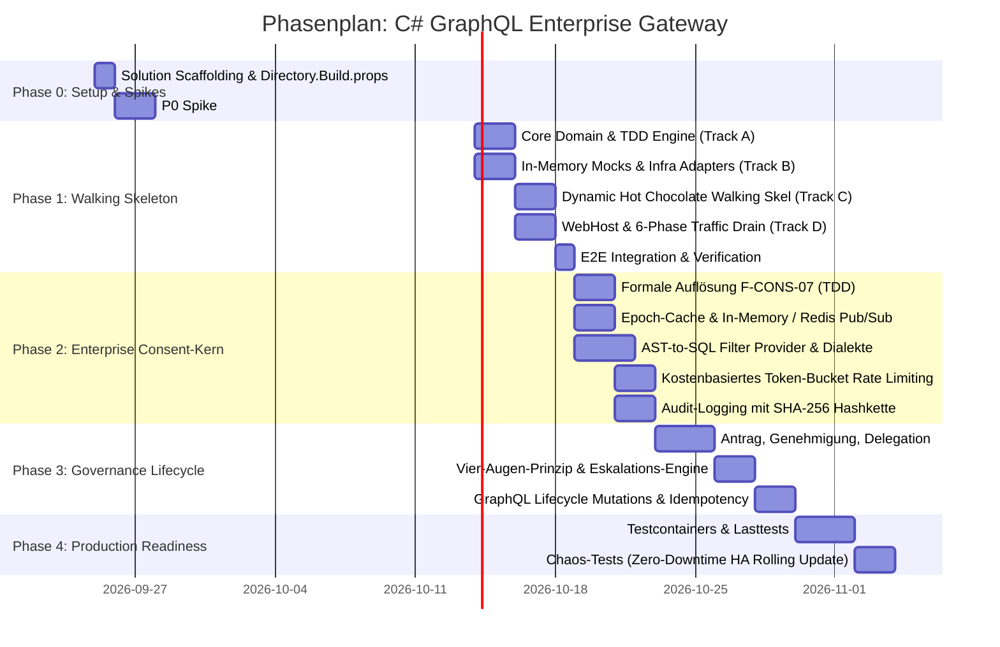
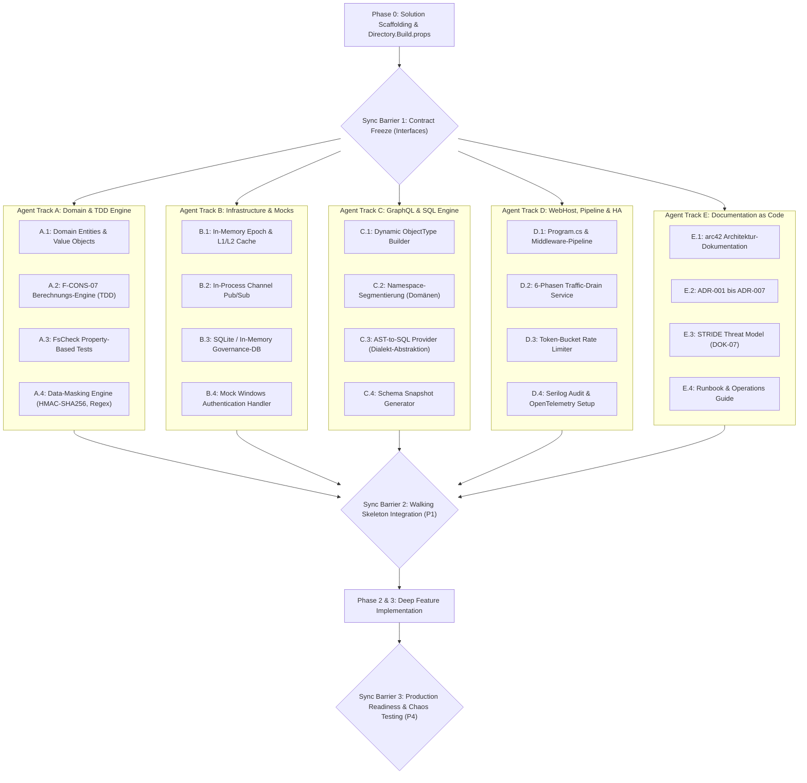

# Implementierungsplan: C# GraphQL Enterprise Gateway mit Data-Owner-Consent

**Status:** Bereit zur Ausführung (Master Execution Plan)  
**Referenz-Dokumente:** [requirements.md](file:///c:/Users/themu/Documents/github/gql/requirements.md) (v2), [gatewayconfig.md](file:///c:/Users/themu/Documents/github/gql/gatewayconfig.md)  
**Entwicklungsansatz:** Test-Driven Development (TDD), Clean Architecture, Zero-Dependency Local Setup (In-Memory Mocks)

---

## 1. Übersicht & Architektur-Fundament

Das System wird nach den Prinzipien der **Clean Architecture** aufgebaut. Sämtliche Kernlogik (insbesondere die formale Berechtigungsauflösung nach F-CONS-07) ist frei von externen Framework-Abhängigkeiten und zu 100% autark testbar.

### 1.1 Projektstruktur (`src/` & `tests/`)

```
gql/
├── Directory.Build.props                  # Zentrale Build-Regeln (Nullable, TreatWarningsAsErrors)
├── .editorconfig                          # C# Code-Style & Linter-Vorgaben
├── GqlGateway.sln                         # Solution Root
├── src/
│   ├── GqlGateway.Domain/                 # Reines Domänenmodell, Enums, Value Objects, Interfaces
│   │   ├── Model/                         # Table, Column, Consent, DataOwner, Role, PolicyEpoch
│   │   ├── Common/                        # Result<T>, Error, Sid, TableIdentifier
│   │   └── Interfaces/                    # IConsentResolutionService, IColumnMaskingProvider
│   ├── GqlGateway.Application/              # Application Use Cases, CQRS / Service Layer
│   │   ├── Services/                      # ConsentResolutionService, MaskingService
│   │   ├── Interfaces/                    # IGovernanceRepository, IConsentCacheService, IEpochService
│   │   └── Queries/ & Commands/           # Lifecycle-Operationen (Mutations)
│   ├── GqlGateway.Infrastructure/         # Externe Adapter (In-Memory Mocks, Caching, DBs)
│   │   ├── Cache/                         # MemoryCache, Redis L2, EpochValidationService
│   │   ├── Messaging/                     # In-Process Channel Pub/Sub & Redis Pub/Sub Adapter
│   │   ├── Persistence/                   # In-Memory / SQLite Governance Repo & Outbox
│   │   └── Security/                      # TestAuthHandler & Kerberos Windows Auth Adapter
│   ├── GqlGateway.GraphQL/                # Hot Chocolate Integration & Dynamic Schema
│   │   ├── DynamicTypes/                  # Dynamic ObjectTypeDescriptor & Dictionary Resolver
│   │   ├── Namespaces/                    # Domänen-Segmentierung (Root-Query Namespaces)
│   │   ├── Filtering/                     # AST-to-SQL Filter- & Sort-Provider mit Dialekt-Abstraktion
│   │   └── Interceptors/                  # Query Complexity, Depth & Cost Analyzer
│   └── GqlGateway.Api/                    # ASP.NET Core WebHost, Middlewares, HA
│       ├── Hosting/                       # 6-Phasen TrafficDrainHostedService
│       ├── Health/                        # Liveness & Readiness Probes (/health/live, /health/ready)
│       ├── Middleware/                    # Pre-Auth IP & Cluster SID Rate Limiting, Error Sanitizer
│       └── Program.cs                     # Composition Root, Options Validation
├── tests/
│   ├── GqlGateway.Tests.Unit/             # Domain & Application TDD (Shouldly, FsCheck)
│   └── GqlGateway.Tests.Integration/      # WebApplicationFactory, End-to-End, HA-Drain Tests
└── docs/                                  # Documentation as Code (arc42, ADRs, STRIDE)
```

---

## 2. Phasenplan & Meilensteine



---

## 3. Parallele Agenten-Workstreams (Multi-Agent Work Breakdown)

Die Umsetzung wird in **5 isolierte, parallelisierbare Workstreams** unterteilt. Um Merge-Konflikte und Abhängigkeitsblockaden zu verhindern, gilt das **Contract-First-Prinzip**: Die Schnittstellen (Interfaces) werden in **Sync Barrier 1** eingefroren.



---

## 4. Sync Barrier 1: Verbindliche C# Interfaces & Verträge

Bevor die parallelen Workstreams A bis D starten, werden folgende Kern-Interfaces in `GqlGateway.Domain` und `GqlGateway.Application` angelegt. Alle Agents programmieren ausschließlich gegen diese Verträge:

### 4.1 Domain Contracts (`GqlGateway.Domain`)

```csharp
namespace GqlGateway.Domain.Interfaces;

public enum ColumnAccessLevel
{
    Deny = 0,
    Mask = 1,
    Clear = 2
}

public readonly record struct Sid(string Value);
public readonly record struct TableIdentifier(string Domain, string Schema, string TableName);

public record TableAccessDecision(
    TableIdentifier Table,
    bool IsAllowed,
    IReadOnlyDictionary<string, ColumnAccessLevel> ColumnAccess,
    string? CombinedRowFilterSql,
    IReadOnlyList<string> DeniedReasons
);

public interface IConsentResolutionService
{
    /// <summary>
    /// Löst Zugriffsrechte deterministisch nach F-CONS-07 Wahrheitstabelle auf.
    /// </summary>
    TableAccessDecision ResolveAccess(
        Sid userSid,
        IReadOnlySet<Sid> subjectGroupSids,
        IReadOnlySet<string> userRoles,
        TableIdentifier table,
        IReadOnlyList<Consent> activeConsents
    );
}

public interface IColumnMaskingProvider
{
    object? MaskValue(string columnName, object? rawValue, MaskingRule rule);
}
```

### 4.2 Application & Infrastructure Contracts (`GqlGateway.Application`)

```csharp
namespace GqlGateway.Application.Interfaces;

public interface IEpochValidationService
{
    Task<bool> IsEpochValidAsync(TableIdentifier table, long cachedEpoch, CancellationToken ct = default);
    Task InvalidateEpochAsync(TableIdentifier table, CancellationToken ct = default);
}

public interface IConsentCacheService
{
    Task<TableAccessDecision?> GetCachedDecisionAsync(Sid userSid, TableIdentifier table, CancellationToken ct = default);
    Task SetCachedDecisionAsync(Sid userSid, TableIdentifier table, TableAccessDecision decision, TimeSpan ttl, CancellationToken ct = default);
    Task EvictTableDecisionsAsync(TableIdentifier table, CancellationToken ct = default);
}

public interface ISqlFilterProvider
{
    (string SqlWhereClause, IReadOnlyDictionary<string, object?> Parameters) TranslateFilterAst(
        HotChocolate.Language.FieldNode filterAst,
        TableMetadata metadata,
        DatabaseDialect dialect
    );
}

public interface IGovernanceRepository
{
    Task<TableMetadata?> GetTableMetadataAsync(TableIdentifier table, CancellationToken ct = default);
    Task<IReadOnlyList<Consent>> GetActiveConsentsForSubjectsAsync(IEnumerable<Sid> subjects, TableIdentifier table, DateTimeOffset atTime, CancellationToken ct = default);
    Task RecordAuditEventAsync(AuditLogEntry entry, CancellationToken ct = default);
}

public interface ITrafficDrainController
{
    bool IsDraining { get; }
    void InitiateGracefulShutdown();
}
```

---

## 5. Detaillierter Arbeitspaket-Katalog je Agent

### Agent Track A: Domain & TDD Engine (`GqlGateway.Domain` & `GqlGateway.Application`)
*Vollkommen entkoppelt, keine Framework-Abhängigkeiten, 100% In-Memory testbar.*

- [ ] **Task A.1 – Core Domain Model & Value Objects:**
  - `Table`, `TableColumn`, `Consent`, `ConsentColumnRule`, `ConsentRowFilter`, `DataOwner`, `Role`, `PolicyEpoch`, `AuditLogEntry`.
  - Immutable Value Objects: `Sid`, `TableIdentifier`, `ColumnAccessLevel`.
  - Strikte Validierung (z. B. `valid_from <= valid_to`, keine negativen Epochs).
- [ ] **Task A.2 – TDD: Formale Berechtigungsauflösung (F-CONS-07):**
  - Implementierung von `ConsentResolutionService : IConsentResolutionService`.
  - Vollständige Abdeckung der F-CONS-07 Wahrheitstabelle:
    1. **Hartes DENY:** Existiert in $D$ ein Tabellen-DENY $\rightarrow$ `IsAllowed = false`. Existiert Spalten-DENY in $D$ $\rightarrow$ Spalte ist `Deny`, unabhängig von $A$.
    2. **Zero Trust:** Ist $A$ leer $\rightarrow$ `IsAllowed = false`.
    3. **Spaltenstufe:** Maximum über $A$ (`Clear > Mask > Deny`). Fehlende Spaltenregel liefert `Clear`.
    4. **Zeilenfilter:** `AND` innerhalb Consent, `OR` zwischen Consents in $A$, `AND NOT (...)` für Filter aus $D$.
    5. **Nutzbarkeit:** Filter/Sort/Agg auf gesperrten (`Mask`/`Deny`) Spalten führt zu Verweigerung.
- [ ] **Task A.3 – Property-Based Testing (`FsCheck`):**
  - Generierung von 5.000+ zufälligen Consent-Kombinationen.
  - Invarianten: Niemals `Clear`, wenn ein aktives $D$ auf der Spalte existiert; Niemals Zugriff, wenn $A$ leer ist.
- [ ] **Task A.4 – Data-Masking Engine (F-CONS-08):**
  - Implementierung von `IColumnMaskingProvider`.
  - Deterministiche HMAC-SHA256 Pseudonymisierung mit geheimem Salt.
  - Format-Masking (IBAN, E-Mail, Telefonnummern) & Redaction.

---

### Agent Track B: Infrastructure & Mocks (`GqlGateway.Infrastructure`)
*Stellt alle Adapter bereit; garantiert Zero-Dependency für lokale Entwicklung und CI.*

- [ ] **Task B.1 – In-Memory Epoch Cache & Distributed Cache:**
  - Implementierung von `EpochValidationService` und `ConsentCacheService`.
  - L1: `IMemoryCache` (schnelle lokale Hits, atomare Invalidierung).
  - L2: `MemoryDistributedCache` (Simulation von Redis mit Cluster-Invalidierung).
  - Atomare Epoch-Prüfung (`MGET`-Simulation).
- [ ] **Task B.2 – In-Process Event Pub/Sub (`System.Threading.Channels`):**
  - Broadcast-Event-Bus für `consent:invalidations`.
  - Latenz < 1 ms für lokale Cache-Eviction nach Widerruf.
  - Reconnect-Simulation und Backoff.
- [ ] **Task B.3 – Governance Repository (In-Memory / SQLite):**
  - `GovernanceRepository : IGovernanceRepository`.
  - Test-Seeds: 10 Fachdomänen, 100 Tabellen, Beispieldaten für Data-Owner und Delegationen.
  - Outbox-Pattern zur transaktionalen Erhöhung der Policy-Epoch bei Consent-Änderung.
- [ ] **Task B.4 – Mock Windows Authentication Handler:**
  - `TestAuthHandler : AuthenticationHandler<AuthenticationSchemeOptions>`.
  - Injection von Benutzer- und Gruppen-SIDs via HTTP-Header (`X-Test-User-Sid`, `X-Test-Group-Sids`).
  - Garantiert lokale Ausführbarkeit aller Security-Tests ohne Active Directory.

---

### Agent Track C: GraphQL Engine & Dynamic SQL (`GqlGateway.GraphQL`)
*Baut das dynamische Hot Chocolate Schema und die AST-to-SQL Filterübersetzung.*

- [ ] **Task C.1 – Dynamic ObjectType Builder (F-DATA-08):**
  - Laufzeit-Generierung von `ObjectTypeDescriptor` anhand von `TableMetadata`.
  - Speichereffizienter Zeilen-Resolver für `IReadOnlyDictionary<string, object?>`.
  - Exakte Typkonvertierung (BigInt $\rightarrow$ String/Long-Scalar, Decimal, DateTimeOffset).
- [ ] **Task C.2 – Domänen-Segmentierung (F-DATA-07):**
  - Root-Query Namespace-Hierarchie: `query { finance { invoices { ... } } }`.
  - Namenskollisions-Prüfung bei identischen Tabellennamen in unterschiedlichen Domänen.
- [ ] **Task C.3 – AST-to-SQL Filter-Provider (F-DATA-03):**
  - Übersetzung von GraphQL-Filterbäumen (`where: { amount: { gte: 1000 } }`) in parametrisiertes SQL.
  - Dialekt-Abstraktion: PostgreSQL (`$1, $2`) vs SQL Server (`@p1, @p2`).
  - Strikte Whitelist-Validierung aller Bezeichner gegen den Metadatenkatalog (SQL-Injection-Prävention).
  - Verweigerung von Filtern/Sortierungen auf maskierten Spalten (Regel 5).
- [ ] **Task C.4 – Schema Snapshot Testing:**
  - Automatisierte Snapshot-Generierung für Test-Domänen.
  - Prüfung auf unbeabsichtigte Schema-Drifts bei Metadaten-Updates.

---

### Agent Track D: WebHost, Pipeline & HA Resilience (`GqlGateway.Api`)
*Zuständig für Hosting, Pipeline, Hochverfügbarkeit und Betriebssicherheit.*

- [ ] **Task D.1 – WebHost Setup & Options Pattern:**
  - `Program.cs` mit `WebApplication.CreateBuilder`.
  - `IOptions<T>` mit `[Required]`, `ValidateDataAnnotations()`, `ValidateOnStart()`.
  - DI Scope Validation (`ValidateScopes = true`, `ValidateOnBuild = true`).
- [ ] **Task D.2 – 6-Phasen Zero-Downtime Traffic Drain Service (NF-HA-01):**
  - `TrafficDrainHostedService : IHostedService`.
  - Phasen:
    1. SIGTERM/PreStop empfangen $\rightarrow$ Status `Draining`.
    2. `/health/ready` antwortet sofort mit HTTP 503 (Load Balancer nimmt Node aus Rotation).
    3. Asynchroner Drain-Puffer: 5 Sekunden Wartezeit für In-Flight-Requests des Load Balancers.
    4. HTTP Keep-Alive Draining (`Connection: close` / HTTP/2 `GOAWAY`).
    5. In-Flight GraphQL Execution Drain (Timeout: 15s).
    6. Geordneter Shutdown von Cache, Pub/Sub und DB-Verbindungen.
  - `/health/live` bleibt bis zur Prozessbeendigung HTTP 200.
- [ ] **Task D.3 – Rate Limiting & Query Complexity (NF-SEC-01 & NF-SEC-02):**
  - Pre-Auth IP-Rate-Limiter vor dem Windows-Negotiate-Handshake (Schutz vor Kerberos-DoS).
  - Authentifizierter Token-Bucket Rate Limiter nach Benutzer-SID.
  - Hot Chocolate Query Depth Enforcement (`MaxAllowedExecutionDepth: 10`).
  - Query Complexity Analyzer mit maximalem Kostenbudget.
- [ ] **Task D.4 – Audit-Logging & Error Sanitization:**
  - Serilog Structured JSON Logging mit SHA-256 Hashverkettung (F-AUD-02).
  - W3C Tracing (`traceparent`) Propagation in Logs und GraphQL Extensions.
  - GraphQL Error Filter: Abfangen interner Exceptions, Rückgabe standardisierter Fehlercodes (`FORBIDDEN`, `NOT_FOUND`, `RATE_LIMIT_EXCEEDED`).

---

### Agent Track E: Documentation as Code (`docs/`)
*Erstellt parallel die vollständige Architektur- und Betriebsdokumentation.*

- [ ] **Task E.1 – arc42 Architektur-Dokumentation (`docs/architecture/`):**
  - Vollständige Ausarbeitung der 12 arc42-Kapitel (Kontext, Bausteinsicht, Laufzeit, Verteilung, Qualitätsbaum).
- [ ] **Task E.2 – Architecture Decision Records (`docs/adr/`):**
  - `ADR-001-trusted-subsystem.md`: Virtualisierte Berechtigungen vs. DB-Logins.
  - `ADR-002-epoch-cache-validation.md`: Multi-Tier Caching mit Epoch-Invalidierung.
  - `ADR-003-dynamic-object-type-mapping.md`: Hot Chocolate Schema-Generierung für 50.000 Tabellen.
  - `ADR-004-ast-to-sql-provider.md`: Eigener SQL-Filter-Übersetzer statt IQueryable.
  - `ADR-005-sha256-hash-chain-audit.md`: Revisionssichere Audit-Protokollierung.
  - `ADR-006-kerberos-only-ha-cluster.md`: Stateless Windows Authentication im Cluster.
  - `ADR-007-permissive-union-semantics.md`: Auflösung widersprüchlicher Consents nach F-CONS-07.
- [ ] **Task E.3 – STRIDE Threat Model (`docs/threat-model/threat-model.md`):**
  - Bedrohungsanalyse für alle 6 STRIDE-Kategorien mit Gegenmaßnahmen.
- [ ] **Task E.4 – Operations & Developer Runbooks:**
  - `docs/operations-runbook.md`: Notfall-Widerruf, Redis-Ausfall-Verhalten, Rolling Updates.
  - `docs/developer-guide.md`: Lokales Setup ohne Docker, TDD-Workflow, Code-Styles.

---

## 6. Synchronisations-Punkte & Qualitäts-Gates

```
+-----------------------------------------------------------------------------------+
| GATE 1: Solution & Contracts Freeze                                               |
| - GqlGateway.sln kompiliert mit TreatWarningsAsErrors                             |
| - Alle Interfaces in Domain & Application sind definiert und unveränderlich       |
+-----------------------------------------------------------------------------------+
                                         |
                                         v
+-----------------------------------------------------------------------------------+
| GATE 2: Walking Skeleton Integration (Phase 1)                                   |
| - E2E-Test: GraphQL Query mit TestAuthHandler fragt Beispieltabelle ab            |
| - Consent ALLOW liefert Daten, fehlender Consent liefert FORBIDDEN                |
| - TrafficDrainHostedService liefert 503 auf /health/ready bei Shutdown            |
+-----------------------------------------------------------------------------------+
                                         |
                                         v
+-----------------------------------------------------------------------------------+
| GATE 3: TDD & Coverage Gate (Phase 2 & 3)                                         |
| - 100% der F-CONS-07 Wahrheitstabelle und Randfälle durch Unit-Tests abgedeckt    |
| - Code Coverage: >= 85% Gesamtprojekt, >= 95% Domain & Application                |
| - Stryker Mutation Testing Score >= 80%                                           |
+-----------------------------------------------------------------------------------+
                                         |
                                         v
+-----------------------------------------------------------------------------------+
| GATE 4: Production Readiness & HA Gate (Phase 4)                                  |
| - Cluster-Test: Widerruf auf Node 1 wird binnen <= 1s auf Node 2 wirksam          |
| - Rolling Update unter Last: Fehlerrate <= 0.01% (SLO Einhaltung)                 |
+-----------------------------------------------------------------------------------+
```

---

## 7. Sofortige Start-Instruktionen für die Agenten-Ausführung

Sobald die Ausführung gestartet wird, erfolgen die Schritte in dieser Reihenfolge:

1. **Initialer Setup-Task (Orchestrator):**
   - Erstellung der Solution `GqlGateway.sln` und der 7 Teilprojekte (`Domain`, `Application`, `Infrastructure`, `GraphQL`, `Api`, `Tests.Unit`, `Tests.Integration`).
   - Hinterlegen von `Directory.Build.props` und `.editorconfig`.
   - Implementierung der Kern-Interfaces aus Abschnitt 4 (**Sync Barrier 1**).
2. **Parallele Zuweisung an Subagents:**
   - **Agent Track A:** Beginnt sofort mit den TDD Unit-Tests für `ConsentResolutionService` (`tests/GqlGateway.Tests.Unit/ConsentResolutionTests.cs`).
   - **Agent Track B:** Erstellt parallel `TestAuthHandler` und den In-Memory Epoch Cache (`src/GqlGateway.Infrastructure`).
   - **Agent Track C:** Baut die dynamische Hot Chocolate Schema-Konfiguration (`src/GqlGateway.GraphQL`).
   - **Agent Track D:** Implementiert `TrafficDrainHostedService` und die Health Probes (`src/GqlGateway.Api`).
   - **Agent Track E:** Schreibt `arc42/` und die ADRs 001 bis 007 (`docs/`).
3. **Zusammenführung (Sync Barrier 2):**
   - Verdrahtung in `GqlGateway.Tests.Integration` für den Walking Skeleton Test.
