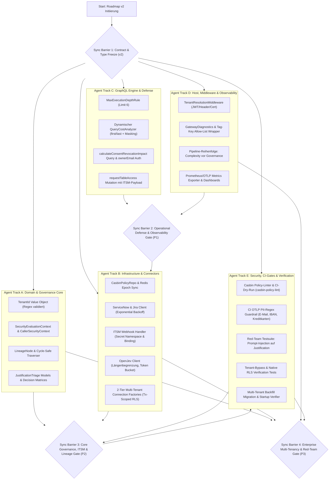

# Implementierungsplan-Erweiterung: Enterprise Governance & Platform Roadmap (v2)

**Status:** Ausführungsbereit (Master Extension Execution Plan)  
**Referenz-Dokumente:** [implementationplan.md](file:///c:/Users/themu/Documents/github/gql/implementationplan.md) (v1 Basisplan), [requirements.md](file:///c:/Users/themu/Documents/github/gql/requirements.md) (v2), [gatewayconfig.md](file:///c:/Users/themu/Documents/github/gql/gatewayconfig.md), Roadmap v2  
**Entwicklungsansatz:** Test-Driven Development (TDD), Clean Architecture mit Augenmaß, Zero-Trust, Defense-in-Depth, Zero-Dependency Local Dev Setup  
**Review-Standard:** Verifiziert und auditiert durch die 4 Spezialisten-Profile: `csharp-architect`, `csharp-code-reviewer`, `csharp-performance-engineer` und `csharp-security-expert`.

---

## 1. Executive Summary & Delta-Übersicht (v1 $\rightarrow$ v2)

Dieser Implementierungsplan erweitert das bestehende Fundament ([implementationplan.md](file:///c:/Users/themu/Documents/github/gql/implementationplan.md)) um die Enterprise-Governance-Features der **Roadmap v2**. Er schließt sicherheitskritische Spezifikationslücken, beseitigt den Widerspruch bezüglich ungesteuerter KI-Entscheidungen, führt messbare Latenz- und Resilienz-Garantien ein und definiert die genaue Aufteilung auf parallele Entwicklungs-Tracks.

### 1.1 Die 15 verbindlichen Architektur-Schärfungen (Delta-Matrix)

| # | Bereich | Ursprung v1 | Roadmap v2 (Verbindlicher Standard) | Umsetzungs-Track |
|---|---|---|---|---|
| 1 | **Feature 3** | Auto-Grant durch Klassifikator bei hoher Konfidenz | **Kein Auto-Grant.** Klassifikator dient rein der Triage/Priorisierung menschlicher Genehmiger. Einzige Ausnahme: Explizites `LOW_SENSITIVITY`-Opt-in je Tabelle. | Track A / B |
| 2 | **Non-Goal 3** | Formale Unschärfe zu LLMs im Entscheidungspfad | **Präzisiert:** Kein Klassifikator/LLM ist jemals alleinige Autorisierungsquelle. Zero-Trust bleibt deterministisch. | Track A / E |
| 3 | **Casbin eval()** | Herkunft und Governance von `p.sub_rule` ungeklärt | **Review-Only:** `p.sub_rule` ausschließlich aus versioniertem Repo mit 4-Augen-Merge. Kein Laufzeit-Schreibpfad. CI-Policy-Linter-Pflicht. | Track A / E |
| 4 | **ITSM-Webhook** | Tenant- & Ticket-Bindung ungeklärt | **Strikte Bindung:** Callback erfordert exakte `ticketId`- und `TenantId`-Übereinstimmung. Abweichung erzeugt `CROSS_TENANT_WEBHOOK_MISMATCH`. | Track B / D |
| 5 | **ITSM-Ausfall** | Fehlercode ohne definierte Zustandsmaschine | **Keine verwaisten Requests:** Fehler `ITSM_UNAVAILABLE`, Transaktions-Rollback, max. 3 Retries (Backoff: Basis 500 ms, Faktor 2, Jitter). | Track B |
| 6 | **Lineage ownerEmail** | PII-Feld ungeschützt in GraphQL-Response | **Zero-Trust Spaltenautorisierung:** Nur `GovernanceAdmin`/`ClusterAdmin` oder registrierter Data Owner sieht E-Mail; sonst `ownerTeam` und `ownerEmail = null`. | Track A / C |
| 7 | **Lineage-Traversierung** | Zyklusanfälligkeit bei unsauberen OpenMetadata-DAGs | **Zyklensicher & Iterativ:** Verpflichtendes `visited`-Set, iterative Queue/Stack (kein StackOverflow), Abbruch mit Flag `CyclicReferenceDetected`. | Track A |
| 8 | **OTel PII-Schutz** | Abstrakte Policy-Aussage ohne Durchsetzung | **Allow-List Mechanismus:** Wrapper verwirft unbekannte Tag-Keys automatisch. "Struktur statt Werte". CI-Test prüft OTLP-Exporte gegen PII-Regexes. | Track D / E |
| 9 | **Query-Complexity** | Pauschale Listenkosten (10 Punkte) | **Dynamische Kosten:** $\text{Cost} = \text{Multiplier} \times \min(\text{first/last}, \text{MaxRows})$. Fehlt Limit $\rightarrow$ Worst-Case-Annahme. Masking-Aufschlag (+3 Pkt./Spalte/Zeile). | Track C |
| 10 | **Pipeline-Reihenfolge** | Auswertungsreihenfolge unspezifiziert | **Fixierte Kaskade:** Auth $\rightarrow$ Complexity/Depth AST-Check $\rightarrow$ Casbin/Consent $\rightarrow$ Data Execution. Schützt Governance vor DoS. | Track C / D |
| 11 | **TenantId** | Einfacher String ohne Schutz | **Validiertes Value Object:** `readonly record struct TenantId` mit Regex `^[a-zA-Z0-9_-]{1,64}$`. Verhindert Redis-Key-Injections. | Track A |
| 12 | **Tenant-Isolation** | Nur applikatorischer SQL-Filter | **Zweistufig (Defense in Depth):** Applikatorischer Filter + native DB-seitige Row-Level-Security (z. B. PostgreSQL `app.tenant_id` Session Parameter). | Track B |
| 13 | **Tenant-Migration** | Keine Backfill-Strategie für Altbestände | **Expliziter Backfill:** Zuweisung `TenantId("legacy-single-tenant")`. Startup-Validierung blockiert Multi-Tenant-Start bis Backfill verifiziert ist. | Track B / E |
| 14 | **Secret-Management** | Global geteilter Secret-Fallback | **Isolierter Namensraum:** Webhook-Secret liegt in `itsm:webhook-secret`. `DefaultEnvironmentSecretProvider` leitet Fallbacks strikt aus `secretRef` ab. Kein `HMAC_SECRET`-Fallback. | Track B |
| 15 | **Security-Reviews** | Nur punktuell als Pen-Testing am Phasenende | **Laufendes Review:** Threat-Modeling und Red-Team-Tests (Casbin-Matcher, Prompt-Injections) laufen parallel zur Code-Entstehung in Phase 2 & 3. | Track E |

---

## 2. Architektur-Übersicht & Modul-Zuordnung

Das System folgt der strikten **Clean / Onion Architecture**. Die neuen Module und Services der Roadmap v2 gliedern sich nahtlos in die bestehende Projektstruktur ein:

```
┌───────────────────────────────────────────────────────────────────────────┐
│ GqlGateway.Api (ASP.NET Core WebHost)                                     │
│ ├─ Endpoints: /api/webhooks/itsm/status-change, /api/auth/login           │
│ ├─ Middleware: TenantResolutionMiddleware, OpenTelemetryTracingMiddleware │
│ ├─ Security: EnterpriseClaimsTransformation, ForwardAuth, Basic, Kerberos │
│ └─ Hosting: 6-Phasen TrafficDrainHostedService, Health Checks             │
└─────────────────────────────────────┬─────────────────────────────────────┘
                                      │
┌─────────────────────────────────────▼─────────────────────────────────────┐
│ GqlGateway.GraphQL (Hot Chocolate 14 Integration)                         │
│ ├─ Validation Rules: MaxExecutionDepthRule (6), QueryCostAnalyzerRule     │
│ ├─ AST Defense: SideChannelInferenceDefenseRule (Mask/Deny Filter Reject)  │
│ ├─ Mutations: requestTableAccess, syncOpenMetadata                        │
│ ├─ Queries: calculateConsentRevocationImpact, getCatalog, dynamic Tables  │
│ └─ Type Interceptors: Schema Stitching & Zero-Trust Field Authorization    │
└─────────────────────────────────────┬─────────────────────────────────────┘
                                      │
┌─────────────────────────────────────▼─────────────────────────────────────┐
│ GqlGateway.Application (Use Cases & Business Logic)                       │
│ ├─ Governance: CasbinEnforcementService, JustificationTriageService       │
│ ├─ Workflows: ItsmWorkflowDispatcher                                      │
│ ├─ Lineage: LineageImpactAnalyzerService (Cycle-Safe Traverser)           │
│ ├─ Pipeline: GatewayExecutionService (ABAC -> RLS -> Masking -> Audit)    │
│ └─ Interfaces: IItsmWorkflowClient, IJustificationTriageService, etc.    │
└───────────────────┬───────────────────────────────────┬───────────────────┘
                    │                                   │
┌───────────────────▼───────────────────┐   ┌───────────▼───────────────────┐
│ GqlGateway.Infrastructure             │   │ GqlGateway.Domain             │
│ ├─ Adapters: ServiceNowClient,        │   │ ├─ Value Objects: TenantId,   │
│ │   JiraClient, OpenJevClient         │   │ │   Sid, TableIdentifier,     │
│ ├─ Repositories: CasbinPolicyRepo,    │   │ │   JustificationContext,     │
│ │   LineageGraphStore, SqliteGovRepo  │   │ │   ComplexityBudget          │
│ ├─ Security: Dedicated Secret Provider│   │ ├─ Models: LineageNode,       │
│ │   (itsm:webhook-secret), HMAC Chain │   │ │   ItsmTicketReference       │
│ ├─ Caching: L1 MemoryCache, Redis L2  │   │ └─ Enums: DecisionSource,     │
│ └─ Persistence: 2-Tier RLS Factories  │   │     TenantIsolationMode,      │
│     (PostgreSQL Native Session RLS)   │   │     JustificationCategory     │
└───────────────────────────────────────┘   └───────────────────────────────┘
```

---

## 3. Phasen- und Release-Roadmap (Q3 2026 – Q1 2027)

```mermaid
gantt
    title GqlGateway Enterprise Governance & Platform Roadmap (v2)
    dateFormat  YYYY-MM-DD
    axisFormat  %Y-%m

    section Phase 1: Operational Hardening (Wochen 1-4)
    P1.1: OTel ActivitySource & Allow-List Wrapper        :p1_otel, 2026-10-01, 10d
    P1.2: Dynamic Query Complexity & Depth (Limit 6)       :p1_cost, 2026-10-05, 12d
    P1.3: Pipeline-Reihenfolge (Complexity vor Governance) :p1_pipe, 2026-10-12, 8d
    P1.4: BenchmarkDotNet Baseline & CI PII Guardrail      :p1_bench, 2026-10-18, 10d

    section Phase 2: Core Governance & Workflows (Wochen 5-10)
    P2.1: Casbin.NET Engine & rbac_with_abac.conf          :p2_casbin, 2026-11-01, 14d
    P2.2: Casbin Policy-Linter & CI-Gate (casbin-policy-lint):p2_lint, 2026-11-08, 10d
    P2.3: ServiceNow & Jira Client + Retry/Backoff Engine  :p2_itsm, 2026-11-12, 14d
    P2.4: ITSM Webhook (HMAC, Tenant/Ticket Binding)       :p2_hook, 2026-11-18, 12d
    P2.5: Zyklensichere Lineage & calculateConsentImpact   :p2_lineage, 2026-11-24, 14d
    P2.6: Laufendes Threat-Modeling & Security Review      :p2_sec, 2026-11-01, 40d

    section Phase 3: Assisted Governance & Scale (Wochen 11-16)
    P3.1: OpenJev Client & Prompt-Injection Hardening      :p3_jev, 2026-12-15, 12d
    P3.2: JustificationTriageService & LOW_SENSITIVITY Opt-In:p3_triage, 2026-12-22, 14d
    P3.3: TenantId Value Object & Redis Mandanten-Prefix   :p3_tenant, 2027-01-05, 10d
    P3.4: Zweistufige Tenant-Isolation (SQL + Native DB-RLS):p3_rls, 2027-01-12, 14d
    P3.5: Backfill-Migration & Startup-Validierung         :p3_backfill, 2027-01-20, 8d
    P3.6: Laufende Red-Team Testsuite & Pen-Testing Report :p3_red, 2026-12-15, 45d
```

---

## 4. Multi-Agenten-Workstreams & Synchronisations-Barrieren

Die Umsetzung erfolgt über 5 parallelisierte Entwicklungs-Tracks. Um blockierende Abhängigkeiten und Integrationsrisiken auszuschließen, ist das Vorgehen durch **4 synchrone Quality Gates** gesichert:



### 4.1 Subagenten-Dispatch-Leitfaden (Arbeitsverteilung & File-Ownership)

Um parallele Ausführungen von Subagents kollisionsfrei zu gewährleisten, gelten strikte Datei- und Projektzuständigkeiten:

| Subagent / Track | Zuständige Projektpfade | Exklusive File-Ownership | Eingangs-Artefakte | Ausgangs-Artefakte |
|---|---|---|---|---|
| **Subagent A** (Domain & Core Governance) | `src/GqlGateway.Domain/`, `src/GqlGateway.Application/Governance/`, `src/GqlGateway.Application/Lineage/` | `TenantId.cs`, `SecurityEvaluationContext.cs`, `LineageNode.cs`, `CasbinEnforcementService.cs`, `LineageImpactAnalyzerService.cs` | Sync Barrier 1 Contracts | Kompilierbare Core Services & TDD Unit-Tests |
| **Subagent B** (Infrastructure & Adapters) | `src/GqlGateway.Infrastructure/Itsm/`, `src/GqlGateway.Infrastructure/OpenJev/`, `src/GqlGateway.Infrastructure/Persistence/`, `src/GqlGateway.Infrastructure/Security/` | `ServiceNowClient.cs`, `JiraClient.cs`, `ItsmWebhookHandler.cs`, `DefaultEnvironmentSecretProvider.cs`, `OpenJevClient.cs`, `SqlConnectionFactory.cs` | Domain Value Objects, `IKeyVaultSecretProvider` | Getestete Adapter & Transaktionale DB-RLS |
| **Subagent C** (GraphQL Engine & Defense) | `src/GqlGateway.GraphQL/` | `QueryCostAnalyzerRule.cs`, `DynamicTableType.cs`, `MutationTypes.cs`, `QueryTypes.cs` | Domain DTOs, Application Interfaces | Hot Chocolate AST Rules & Lifecycle Queries |
| **Subagent D** (Host, Pipeline & OTel) | `src/GqlGateway.Api/`, `src/GqlGateway.Infrastructure/Diagnostics/` | `Program.cs`, `GatewayDiagnostics.cs`, `TenantResolutionMiddleware.cs`, `GatewayServiceCollectionExtensions.cs` | Application Interfaces, Hot Chocolate Builder | Härtung der Pipeline, OTel Exporter & Tag Allow-List |
| **Subagent E** (Security, CI-Gates & Tests) | `tools/casbin-policy-lint/`, `tests/` | `casbin-policy-lint`, `RedTeamPromptInjectionTests.cs`, `TenantBackfillMigration.cs`, `OpenTelemetryPiiScannerTests.cs` | Alle Produktiv-Artefakte | CI-Gates, Penetrationstests & Migrationsverifikation |

---

## 5. Sync Barrier 1: Verbindliche C# Verträge & Interfaces

Alle Subagents und Entwickler programmieren ausschließlich gegen diese eingefrorenen Verträge. Änderungen an diesen Schnittstellen erfordern ein formales Architektur-Review.

### 5.1 Domain Contracts (`GqlGateway.Domain`)

```csharp
namespace GqlGateway.Domain.Common;

using System;
using System.Text.RegularExpressions;

/// <summary>
/// Streng typisierte, validierte Tenant-Identität.
/// Verhindert Cache-Key Injections und Cross-Tenant Verwechslungen.
/// </summary>
public readonly record struct TenantId
{
    private static readonly Regex SafeTenantIdRegex = new("^[a-zA-Z0-9_-]{1,64}$", RegexOptions.Compiled);

    public string Value { get; }

    public TenantId(string value)
    {
        ArgumentException.ThrowIfNullOrWhiteSpace(value);
        if (!SafeTenantIdRegex.IsMatch(value))
        {
            throw new ArgumentException(
                $"Ungültiges TenantId-Format: '{value}'. Erwartet: alphanumerisch, '_', '-', max. 64 Zeichen.",
                nameof(value));
        }
        Value = value;
    }

    public static readonly TenantId LegacySingleTenant = new("legacy-single-tenant");

    public override string ToString() => Value;
    public static implicit operator string(TenantId tenantId) => tenantId.Value;
}

/// <summary>
/// Framework-unabhängiger Sicherheitskontext des Aufrufers (Clean Architecture).
/// Entkoppelt Application- und Domain-Services von ASP.NET Core ClaimsPrincipal.
/// </summary>
public sealed record CallerSecurityContext(
    Sid UserSid,
    IReadOnlyCollection<Sid> GroupSids,
    IReadOnlyCollection<string> Roles,
    TenantId Tenant,
    bool IsGovernanceAdmin,
    bool IsClusterAdmin
);
```

```csharp
namespace GqlGateway.Domain.Model;

using System;
using System.Collections.Generic;
using System.Net;
using GqlGateway.Domain.Common;

public sealed record SecurityEvaluationContext(
    Sid UserSid,
    IReadOnlyCollection<Sid> GroupSids,
    TenantId Tenant,
    TableIdentifier TargetTable,
    IReadOnlyCollection<string> RequestedColumns,
    IPAddress ClientIp,
    DateTimeOffset Timestamp,
    string? PurposeId
);

public enum LineageNodeType
{
    Table = 0,
    Column = 1,
    Dashboard = 2,
    Pipeline = 3,
    ExternalService = 4
}

public sealed record LineageNode(
    string Id,
    string Name,
    LineageNodeType Type,
    IReadOnlyCollection<string> DownstreamNodeIds,
    string? OwnerTeam = null,
    string? OwnerEmail = null
);

public sealed record AffectedEntity(
    string Id,
    string Name,
    LineageNodeType Type,
    string? OwnerTeam,
    string? OwnerEmail, // Null, sofern Aufrufer nicht autorisiert (Zero-Trust Spaltenautorisierung)
    bool CyclicReferenceDetected = false
);

public sealed record ConsentRevocationImpactReport(
    string Severity, // HIGH, MEDIUM, LOW
    int AffectedDownstreamCount,
    IReadOnlyList<AffectedEntity> AffectedEntities,
    bool ContainsCycles
);

public enum ItsmSystemType
{
    ServiceNow = 1,
    Jira = 2
}

public sealed record ItsmTicketReference(
    ItsmSystemType System,
    string TicketId,
    string TicketUrl
);

public enum JustificationCategory
{
    LegitimateAudit = 1,
    IncidentTriage = 2,
    Unjustified = 3,
    SuspiciousExfiltration = 4,
    Unclassified = 5
}

public sealed record JustificationTriageResult(
    JustificationCategory Category,
    double Confidence,
    string RawModelOutput,
    bool AutoGrantEligible,
    TimeSpan? GrantedDuration
);
```

### 5.2 Application Interfaces (`GqlGateway.Application`)

```csharp
namespace GqlGateway.Application.Interfaces;

using System;
using System.Collections.Generic;
using System.Threading;
using System.Threading.Tasks;
using GqlGateway.Domain.Common;
using GqlGateway.Domain.Model;

public interface IPolicyEnforcementService
{
    /// <summary>
    /// Evaluates Casbin ABAC policy rules against the security evaluation context.
    /// Hot-path: Returns ValueTask for zero heap allocations on in-memory hits.
    /// Execution SLA: p99 <= 0.5 ms, p50 <= 0.1 ms with 50,000 active rules.
    /// </summary>
    ValueTask<TableAccessDecision> EvaluatePolicyAsync(
        SecurityEvaluationContext context,
        CancellationToken ct = default);

    /// <summary>
    /// Synchronizes updated policies from Redis event bus invalidations (<= 50 ms).
    /// </summary>
    Task ReloadPoliciesAsync(TenantId tenant, CancellationToken ct = default);
}

public sealed record ItsmTicketRequest(
    TenantId Tenant,
    Sid RequesterSid,
    TableIdentifier TargetTable,
    string Justification,
    int DurationDays,
    JustificationCategory? TriageCategory,
    double? TriageConfidence
);

public sealed record ItsmTicketResult(
    bool Success,
    ItsmTicketReference? TicketReference,
    string? ErrorCode,
    string? ErrorMessage
);

public interface IItsmWorkflowClient
{
    ItsmSystemType SystemType { get; }
    Task<ItsmTicketResult> CreateAccessTicketAsync(ItsmTicketRequest request, CancellationToken ct = default);
}

public interface IItsmWebhookHandler
{
    /// <summary>
    /// Verarbeitet ITSM-Statusänderungen unter strikter Prüfung von Tenant- und Ticket-Bindung.
    /// </summary>
    Task<bool> HandleStatusChangeAsync(
        string rawPayload,
        string hmacSignature,
        DateTimeOffset timestamp,
        CancellationToken ct = default);
}

public interface IJustificationTriageService
{
    /// <summary>
    /// Führt Triage durch. Gewährt NIEMALS automatischen Consent außer bei explizitem LOW_SENSITIVITY Opt-In.
    /// Latenzgrenze: <= 120 ms.
    /// </summary>
    Task<JustificationTriageResult> TriageJustificationAsync(
        TenantId tenant,
        Sid userSid,
        TableIdentifier table,
        string justificationText,
        CancellationToken ct = default);
}

public interface ILineageImpactAnalyzerService
{
    /// <summary>
    /// Traversiert den Abhängigkeitsgraphen zyklensicher (iterativ mit visited-Set).
    /// Maskiert ownerEmail bei unzureichender Berechtigung. SLA: 10.000 Knoten in p99 <= 15 ms.
    /// </summary>
    Task<ConsentRevocationImpactReport> CalculateConsentRevocationImpactAsync(
        TenantId tenant,
        Guid consentId,
        CallerSecurityContext callerContext,
        CancellationToken ct = default);
}

public interface IKeyVaultSecretProvider
{
    /// <summary>
    /// Löst SecretBytes isoliert nach secretRef auf.
    /// Fallback-Kandidaten müssen strikt aus der übergebenen Referenz abgeleitet werden.
    /// </summary>
    byte[] GetSecretBytes(string secretRef);
}
```

### 5.3 Infrastructure & Observability Contracts (`GqlGateway.Infrastructure`)

```csharp
namespace GqlGateway.Infrastructure.Diagnostics;

using System.Diagnostics;
using System.Diagnostics.Metrics;
using System.Collections.Frozen;

public static class GatewayDiagnostics
{
    public const string ActivitySourceName = "GqlGateway.Core";
    public const string MeterName = "GqlGateway.Metrics";

    public static readonly ActivitySource Source = new(ActivitySourceName, "2.0.0");
    public static readonly Meter Meter = new(MeterName, "2.0.0");

    public static readonly Counter<long> ForbiddenRequestsCounter =
        Meter.CreateCounter<long>("gql_forbidden_requests_total", description: "Anzahl abgewiesener Anfragen (403/Forbidden)");

    public static readonly Counter<long> QueryTooComplexCounter =
        Meter.CreateCounter<long>("gql_query_too_complex_total", description: "Anzahl wegen AST-Komplexität abgewiesener Anfragen");

    public static readonly Counter<long> CrossTenantMismatchCounter =
        Meter.CreateCounter<long>("gql_cross_tenant_mismatch_total", description: "Cross-Tenant Webhook oder Zugriffsabweichungen");

    public static readonly Histogram<double> PolicyEvaluationDuration =
        Meter.CreateHistogram<double>("gql_policy_evaluation_duration_ms", "ms", description: "Dauer der Casbin ABAC Evaluierung");

    public static readonly Histogram<double> LineageTraversalDuration =
        Meter.CreateHistogram<double>("gql_lineage_traversal_duration_ms", "ms", description: "Dauer der zyklensicheren Lineage-Traversierung");

    // Versionierte PII-Allow-List je Span-Typ (Frozen für Zero-Allocation Thread-Safe Lookups)
    private static readonly FrozenDictionary<string, FrozenSet<string>> SpanTagAllowList = new Dictionary<string, FrozenSet<string>>
    {
        ["Governance.EvaluateConsent"] = (FrozenSet<string>)new[] { "user.sid", "tenant.id", "decision", "table.id", "policy.epoch" }.ToFrozenSet(),
        ["Governance.CasbinAbacEnforcement"] = (FrozenSet<string>)new[] { "user.sid", "tenant.id", "policy.match", "rule.count", "latency.ms" }.ToFrozenSet(),
        ["SqlExecution.Pushdown"] = (FrozenSet<string>)new[] { "db.system", "db.statement", "tenant.id", "rows.affected" }.ToFrozenSet(),
        ["AuditLog.AppendHmacEntry"] = (FrozenSet<string>)new[] { "audit.entry_id", "tenant.id", "chain.height" }.ToFrozenSet(),
        ["Lineage.Traverse"] = (FrozenSet<string>)new[] { "tenant.id", "root.node_id", "nodes.visited", "cycle.detected" }.ToFrozenSet(),
        ["Itsm.Webhook"] = (FrozenSet<string>)new[] { "itsm.system", "itsm.ticket_id", "tenant.id", "action" }.ToFrozenSet()
    }.ToFrozenDictionary();

    public static void SetSafeTag(Activity? activity, string spanName, string key, object? value)
    {
        if (activity == null || value == null) return;
        if (SpanTagAllowList.TryGetValue(spanName, out var allowedKeys) && allowedKeys.Contains(key))
        {
            activity.SetTag(key, value);
        }
    }
}
```

---

## 6. Detaillierter Arbeitspaket-Katalog (Ticket-Ready Backlog)

### Epic 1: ABAC Engine Integration (Casbin.NET & Policy Governance)

- [ ] **Task GQL-101: Casbin.NET Core Integration & `rbac_with_abac.conf`**
  - **Ziel:** Einbinden des NuGet-Pakets `Casbin.NET` in `GqlGateway.Application` und Aufbau des Modells.
  - **Dateien:** `src/GqlGateway.Application/Governance/CasbinEnforcementService.cs`, `src/GqlGateway.Application/Governance/rbac_with_abac.conf`.
  - **Details:**
    - Matcher: `m = g(r.sub, p.sub) && r.tenant == p.tenant && keyMatch2(r.obj, p.obj) && (r.act == p.act || p.act == "*") && eval(p.sub_rule)`.
    - Effekt: `e = some(where (p.eft == allow)) && !some(where (p.eft == deny))`.
  - **Akzeptanzkriterien:**
    - Validiert gegen Testkorpus von 1.000 Regeln in Unit-Tests.
    - Matcher schlägt deterministisch fehl, wenn `r.tenant != p.tenant`.

- [ ] **Task GQL-102: SecurityEvaluationContext & GatewayExecutionService Einbettung**
  - **Ziel:** Übergeben des vollständigen Kontextes an Casbin im Ausführungspfad.
  - **Dateien:** `src/GqlGateway.Application/Services/GatewayExecutionService.cs`, `src/GqlGateway.Domain/Model/SecurityEvaluationContext.cs`.
  - **Details:**
    - Kontext-Zusammenstellung: `Sid`, `GroupSids`, `TenantId`, `TableIdentifier`, `RequestedColumns`, `ClientIp`, `Timestamp`, `PurposeId`.
    - **Reihenfolge-Constraint:** Aufruf von `IPolicyEnforcementService.EvaluatePolicyAsync()` erfolgt erst NACH erfolgreicher AST-Complexity-Freigabe (GQL-304).
  - **Akzeptanzkriterien:**
    - Bei ABAC DENY: Query bricht mit `GatewayForbiddenException` ab; keine SQL-Verbindung wird geöffnet.
    - Spaltenspezifische ABAC-Regeln übersteuern partielle Masking-Regeln für den SQL-Builder.

- [ ] **Task GQL-103: RedisEventBus Policy Epoch Synchronisation**
  - **Ziel:** Clusterweite Verteilung von Casbin-Policy-Updates in $\le 50\text{ ms}$.
  - **Dateien:** `src/GqlGateway.Infrastructure/Messaging/RedisEventBus.cs`, `src/GqlGateway.Application/Governance/CasbinEnforcementService.cs`.
  - **Details:**
    - Kanal: `governance:policy-epoch-increment:{tenant_id}`.
    - Bei Erhalt: Atomares Inkrementieren der lokalen InMemory-Policy-Epoch und Reload des Tenant-Modells im Arbeitsspeicher.
  - **Akzeptanzkriterien:**
    - Multi-Node Integrationstest verifiziert, dass eine Policy-Änderung auf Node 1 binnen $\le 50\text{ ms}$ auf Node 2 aktiv wird.

- [ ] **Task GQL-104: Unit- & FsCheck Property-Based Tests für ABAC**
  - **Ziel:** Mathematischer Korrektheitsnachweis für komplexe Regelüberlagerungen.
  - **Dateien:** `tests/GqlGateway.Tests.Unit/CasbinAbacPropertyTests.cs`.
  - **Details:**
    - Generierung von 10.000+ Kombinationen aus Zeitfenstern, IP-Netzen (CIDR-Matches) und Zweckbindungen (`PurposeId`).
    - Invariante: Ein explizites DENY in `p.eft` kann durch kein zusätzliches ALLOW überschrieben werden.
  - **Akzeptanzkriterien:**
    - 100% Durchlaufquote bei Property-Tests; Code-Coverage auf `CasbinEnforcementService` $\ge 98\%$.

- [ ] **Task GQL-105: Policy-Linter & CI Dry-Run (`casbin-policy-lint`)**
  - **Ziel:** Schutz vor fehlerhaften oder schädlichen `p.sub_rule`-Ausdrücken.
  - **Dateien:** `tools/casbin-policy-lint/Program.cs`, `.github/workflows/policy-lint.yml`.
  - **Details:**
    - CI-Gate parst alle `.conf`- und `.csv`-Dateien im Repository vor dem Git-Merge.
    - Dry-Run gegen ein synthetisches Set von 500 Test-Requests.
    - Verifikation der Review-Governance: Es existiert kein Laufzeit-Schreibpfad (weder Webhook noch GraphQL Mutation) für `p.sub_rule`.
  - **Akzeptanzkriterien:**
    - Syntaxfehler oder unerwartete DENY/ALLOW-Abweichungen blockieren den Merge automatisch mit Exit-Code 1.
    - Negativtest: Direkte Injektion von manipuliertem Code in `sub_rule` wird im Test isoliert und abgewiesen.

---

### Epic 2: ITSM Webhook & Bi-Directional Adapter (ServiceNow & Jira)

- [ ] **Task GQL-201: ServiceNowClient & JiraClient mit Resilient HttpClient**
  - **Ziel:** Externe Erstellung von Genehmigungstickets beim Vier-Augen-Workflow.
  - **Dateien:** `src/GqlGateway.Infrastructure/Itsm/ServiceNowClient.cs`, `src/GqlGateway.Infrastructure/Itsm/JiraClient.cs`.
  - **Details:**
    - Registrierung via `IHttpClientFactory` mit `SocketsHttpHandler` (DNS TTL 60s).
    - Polly Retry Pipeline: Max. 3 Versuche, exponentieller Backoff (500 ms, 1000 ms, 2000 ms) mit vollem Jitter.
    - Circuit Breaker: Öffnet nach 5 aufeinanderfolgenden Timeouts für 30s.
  - **Akzeptanzkriterien:**
    - Bei anhaltendem Endpunkt-Ausfall wird dem Aufrufer `ITSM_UNAVAILABLE` zurückgegeben.
    - Kein unendlicher Retry-Storm; sauberes Durchreichen von `CancellationToken`.

- [ ] **Task GQL-202: Mutation `requestTableAccess` mit Transaktionsschutz**
  - **Ziel:** Erweitern der bestehenden GraphQL-Mutation um externe Ticketreferenzen.
  - **Dateien:** `src/GqlGateway.GraphQL/Types/MutationTypes.cs`, `src/GqlGateway.Application/Workflows/ItsmWorkflowDispatcher.cs`.
  - **Details:**
    - Payload liefert `requestId`, `status: PENDING_EXTERNAL_APPROVAL` und `itsmTicketReference { system, ticketId, ticketUrl }`.
    - **Transaktions-Invariante:** Bricht der Ticket-Erstellungsprozess ab oder schlägt das Rückschreiben der `ticketId` in die Governance-DB fehl, wird der Request-Datensatz vollständig zurückgerollt (keine verwaisten `PENDING`-Datensätze).
  - **Akzeptanzkriterien:**
    - Integrationstest simuliert Verbindungsabbruch während Mutation $\rightarrow$ Response liefert `ITSM_UNAVAILABLE`, Datenbank enthält 0 verwaiste Einträge.

- [ ] **Task GQL-203: Gesicherter Webhook `/api/webhooks/itsm/status-change`**
  - **Ziel:** Empfang von Genehmigungen aus ServiceNow/Jira mit HMAC-SHA256 Signaturprüfung.
  - **Dateien:** `src/GqlGateway.Api/Controllers/ItsmWebhookController.cs`, `src/GqlGateway.Infrastructure/Itsm/ItsmWebhookHandler.cs`.
  - **Details:**
    - HMAC-SHA256 Signatur im Header `X-ITSM-Signature`.
    - Vergleich ausschließlich via `CryptographicOperations.FixedTimeEquals` zur Verhinderung von Timing-Angriffen.
    - Replay-Schutz: Prüfung des Payload-Timestamps (5-Minuten-Gültigkeitsfenster).
    - Idempotenz: Deduplizierung über `RedisIdempotencyStore`.
  - **Akzeptanzkriterien:**
    - Ungültige oder abgelaufene Signaturen liefern HTTP 401 Unauthorized.
    - Doppelt gesendete Webhooks werden idempotent mit HTTP 200 quittiert, ohne erneute DB-Schreibvorgänge auszulösen.

- [ ] **Task GQL-204: Tenant- & Ticket-Bindungsprüfung (`CROSS_TENANT_WEBHOOK_MISMATCH`)**
  - **Ziel:** Abwehr von Cross-Tenant-Angriffen über manipulierte Webhook-Callbacks.
  - **Dateien:** `src/GqlGateway.Infrastructure/Itsm/ItsmWebhookHandler.cs`.
  - **Details:**
    - Validierungsbedingungen:
      1. Eingehende `ticketId` stimmt exakt mit der im ursprünglichen Consent-Request hinterlegten `ticketId` überein.
      2. Die `TenantId` des Callbacks (ermittelt über die konfigurierte ITSM-Instanzbindung, nicht aus Aufruferfeldern) entspricht exakt der `TenantId` des Requests.
      3. Request befindet sich im Status `PENDING_EXTERNAL_APPROVAL`.
    - Bei Mismatch: Abbruch, Logging als Sicherheitswarnung `CROSS_TENANT_WEBHOOK_MISMATCH` und Inkrementierung von `CrossTenantMismatchCounter`.
  - **Akzeptanzkriterien:**
    - Negativtest: Ein Webhook mit gültiger Signatur, aber falscher TenantId wird abgewiesen; der Consent bleibt inaktiv.

- [ ] **Task GQL-205: Secret-Isolation & Refactoring `DefaultEnvironmentSecretProvider`**
  - **Ziel:** Vollständige Entkopplung des ITSM-Webhook-Secrets von HMAC-Masking-Secrets.
  - **Dateien:** `src/GqlGateway.Infrastructure/Security/DefaultEnvironmentSecretProvider.cs`.
  - **Details:**
    - Entfernen der hartkodierten globalen Fallback-Kandidaten (`HMAC_SECRET`, `HMAC_SECRET_KEY`) für beliebige `secretRef`-Anfragen.
    - Dedizierter Namensraum: `itsm:webhook-secret`. Fallbacks werden nur noch aus dem konkreten Präfix abgeleitet (z. B. `ITSM__WEBHOOK_SECRET`).
  - **Akzeptanzkriterien:**
    - Negativtest: Wenn `itsm:webhook-secret` angefordert wird, aber nur `HMAC_SECRET` in der Umgebung gesetzt ist, schlägt die Auflösung fehl (kein versehentlicher Fallback auf Masking-Keys).

---

### Epic 3: Observability & Advanced Query Defense

- [ ] **Task GQL-301: OpenTelemetry ActivitySource & Tag-Key Allow-List**
  - **Ziel:** Durchgängige W3C-Distributed-Tracing-Instrumentierung mit striktem PII-Schutz.
  - **Dateien:** `src/GqlGateway.Infrastructure/Diagnostics/GatewayDiagnostics.cs`, `src/GqlGateway.Api/Middleware/OpenTelemetryTracingMiddleware.cs`.
  - **Details:**
    - `GatewayDiagnostics.Source` spannt Traces über Ingress, Hot Chocolate, Governance, DataLoaders, SQL-Pushdown und Audit-Log.
    - **Allow-List Engine:** Wrapper `GatewayDiagnostics.SetSafeTag()` verwirft alle Tag-Keys, die nicht in der `SpanTagAllowList` registriert sind.
    - Grundsatz "Struktur statt Wert": Keine Parameter- oder Spaltenwerte im Tag-Kontext; nur Namen, SIDs, TenantIds und Dauern.
  - **Akzeptanzkriterien:**
    - Traces werden sauber exportiert; unbekannte Tags tauchen niemals im Output auf.

- [ ] **Task GQL-302: OTLP Exporter, Metriken & CI PII-Regex Guardrail**
  - **Ziel:** Export an Prometheus/Jaeger/Tempo und automatisierter CI-Datenschutztest.
  - **Dateien:** `src/GqlGateway.Api/Extensions/GatewayServiceCollectionExtensions.cs`, `tests/GqlGateway.Tests.Integration/OpenTelemetryPiiScannerTests.cs`.
  - **Details:**
    - OTLP gRPC Exporter für Spans und Metriken (`gql_forbidden_requests_total`, `gql_policy_evaluation_duration_ms`).
    - CI-Test: WebApplicationFactory führt GraphQL-Queries mit Testdaten aus, exportiert Spans in InMemory-OTLP-Collector und scannt alle Tag-Werte gegen Regexes für E-Mail, IBAN und Kreditkarten.
  - **Akzeptanzkriterien:**
    - Findet der Scanner ein PII-Muster in einem Trace-Tag, schlägt der CI-Test mit Fehler fehl.

- [ ] **Task GQL-303: Hot Chocolate MaxExecutionDepth (6) & Dynamischer ComplexityAnalyzer**
  - **Ziel:** DoS-Schutz vor verschachtelten Abfragen und unkontrollierten Großmengen.
  - **Dateien:** `src/GqlGateway.GraphQL/Interceptors/QueryCostAnalyzerRule.cs`, `src/GqlGateway.Api/Extensions/GatewayServiceCollectionExtensions.cs`.
  - **Details:**
    - `AddMaxExecutionDepthRule(maxDepth: 6)`.
    - Dynamische Listenkosten-Formel:
      $$\text{ListCost} = \text{DefaultListMultiplier (10)} \times \min(\text{requested\_first\_or\_last}, \text{MaxResponseRows})$$
    - Fehlt `first`/`last`, wird das volle `MaxResponseRows`-Budget (z. B. 1.000) als Worst-Case angesetzt.
    - Maskierungsaufschlag: +3 Kostenpunkte je maskierter Spalte je Zeile.
    - Obergrenze: `MaximumAllowedCost = 250`. Bei Überschreitung Abbruch mit `QUERY_TOO_COMPLEX`.
  - **Akzeptanzkriterien:**
    - Eine Query mit `first: 5` passiert das Limit, dieselbe Query mit `first: 5000` scheitert mit `QUERY_TOO_COMPLEX`.

- [ ] **Task GQL-304: Pipeline-Reihenfolge-Constraint (Complexity vor Governance)**
  - **Ziel:** Verhindern von DoS gegen Casbin/OpenJev durch unvalidierte Queries.
  - **Dateien:** `src/GqlGateway.Api/Extensions/GatewayServiceCollectionExtensions.cs`, `src/GqlGateway.Application/Services/GatewayExecutionService.cs`.
  - **Details:**
    - Festschreibung der Pipeline-Reihenfolge:
      1. Authentication & Claims Normalization
      2. GraphQL AST Validation (DepthRule & QueryCostAnalyzerRule)
      3. Governance & ABAC Evaluation (Casbin, OpenJev Triage)
      4. Database/DataSource Execution
  - **Akzeptanzkriterien:**
    - Integrationstest verifiziert über Metriken: Eine mit `QUERY_TOO_COMPLEX` abgewiesene Query erhöht `gql_query_too_complex_total`, löst aber 0 Aufrufe von `IPolicyEnforcementService` und 0 DB-Connections aus.

- [ ] **Task GQL-305: GraphQL DoS-Stresstests & Zero-Allocation Verification**
  - **Ziel:** Härtungsnachweis unter adversarialen Lastbedingungen.
  - **Dateien:** `tests/GqlGateway.Tests.Integration/QueryDefenseStressTests.cs`.
  - **Details:**
    - Zirkuläre Queries (`Customer -> Orders -> Customer -> Orders...`) bis Tiefe 15.
    - Massen-Batches ohne Limitierung.
  - **Akzeptanzkriterien:**
    - Alle bösartigen Queries werden auf AST-Ebene unter $\le 2\text{ ms}$ abgewiesen, ohne GC-Druck auf dem Server zu erzeugen.

---

### Epic 4: Assisted Governance & Multi-Tenancy

- [ ] **Task GQL-401: OpenJevClient mit Prompt-Injection Defense & Fallback**
  - **Ziel:** Anbindung des internen OpenJev Klassifikators zur Entscheidungsunterstützung.
  - **Dateien:** `src/GqlGateway.Infrastructure/OpenJev/OpenJevClient.cs`.
  - **Details:**
    - Strikt getrennte Übergabe von System-Prompt und Nutzereingabe (keine String-Konkatenation).
    - Begrenzung von `justification_text` auf maximal 500 Zeichen; Bereinigung von Steuerzeichen.
    - Rate-Limiting nach `UserSid` auf Klassifikator-Aufrufe.
    - Fallback: Bei Timeout ($> 120\text{ ms}$) oder Fehler Markierung als `UNCLASSIFIED` und Weiterleitung an den regulären menschlichen 4-Augen-Prozess (Fail-Closed bzgl. Automatisierung).
  - **Akzeptanzkriterien:**
    - Latenz $\le 120\text{ ms}$ unter Last.
    - Bei Ausfall von OpenJev bleibt das Gateway voll funktionsfähig; Anträge landen geordnet in der manuellen Prüfung.

- [ ] **Task GQL-402: JustificationTriageService & LOW_SENSITIVITY Opt-In**
  - **Ziel:** Sichere Triage-Logik ohne unerlaubte automatische Consent-Erteilung.
  - **Dateien:** `src/GqlGateway.Application/Governance/JustificationTriageService.cs`.
  - **Details:**
    - Triage-Matrix:
      - `UNJUSTIFIED` / `SUSPICIOUS_EXFILTRATION` $\rightarrow$ Sofortiges DENY, Audit-Log, SIEM-Event.
      - `LEGITIMATE_AUDIT` / `INCIDENT_TRIAGE` $\rightarrow$ Kein Auto-Consent! Eröffnung/Priorisierung eines ITSM-Tickets mit Triage-Kontext für den menschlichen Genehmiger.
    - **Ausnahme für `LOW_SENSITIVITY`:**
      - Automatischer Kurzzeit-Consent ($\le 4\text{ h}$) NUR wenn für die Tabelle explizit durch den Data Owner als Opt-In konfiguriert UND Konfidenz $\ge 0.98$.
      - Verpflichtende 100% Stichprobenprotokollierung für die wöchentliche Security-Revision.
  - **Akzeptanzkriterien:**
    - Architekturtest: Es existiert kein globaler Konfigurationsschalter für Auto-Grants; Opt-In ist ausschließlich pro Einzeltabelle möglich.

- [ ] **Task GQL-403: TenantId Value Object & Mandantenisoliertes Redis-Keying**
  - **Ziel:** Strikte Cache-Trennung und Verhinderung von Key-Confusion-Angriffen.
  - **Dateien:** `src/GqlGateway.Domain/Common/TenantId.cs`, `src/GqlGateway.Infrastructure/Cache/ConsentCacheService.cs`.
  - **Details:**
    - `TenantId` wirft bei Sonderzeichen (z. B. Doppelpunkt `:`) sofort eine `ArgumentException`.
    - Redis-Schema: `{tenant_id}:consent:{user_sid}:{table_id}`.
    - L1 InMemory-Cache partitioniert nach `TenantId`.
  - **Akzeptanzkriterien:**
    - Negativtest: Übergabe von `tenantA:consent:admin` als Tenant-Header scheitert bereits an der `TenantId`-Validierung.

- [ ] **Task GQL-404: Zweistufige Tenant-Isolation (SQL Pushdown + Native PostgreSQL RLS)**
  - **Ziel:** Defense-in-Depth gegen Cross-Tenant-Datenlecks.
  - **Dateien:** `src/GqlGateway.Application/Services/RlsFilterGenerator.cs`, `src/GqlGateway.Infrastructure/Persistence/SqlConnectionFactory.cs`.
  - **Details:**
    - Stufe 1 (Applikation): Erzwungener SQL-Filter `WHERE (t.tenant_id = @p_tenant_id) AND (...)`.
    - Stufe 2 (Datenbank): Bei Verbindungsaufbau / Transaktionsstart Ausführung von `SET LOCAL app.tenant_id = '...';` innerhalb einer expliziten Transaktion (`using var tx = await conn.BeginTransactionAsync(ct);`), um Session-Lecks im Connection-Pool zu verhindern.
    - Native PostgreSQL RLS-Policy auf allen Tabellen:
      `CREATE POLICY tenant_isolation_policy ON ... USING (tenant_id = current_setting('app.tenant_id')::text);`
  - **Akzeptanzkriterien:**
    - Sicherheitstest: Wird der applikatorische Filter absichtlich im Testcode entfernt (simulierter Bug), blockiert die native PostgreSQL-RLS den Cross-Tenant-Zugriff zuverlässig.

- [ ] **Task GQL-405: Red-Team Injection Testsuite & Backfill-Migration**
  - **Ziel:** Adversariale Absicherung und migrationssicherer Start.
  - **Dateien:** `tests/GqlGateway.Tests.Integration/RedTeamPromptInjectionTests.cs`, `src/GqlGateway.Infrastructure/Persistence/Migrations/TenantBackfillMigration.cs`.
  - **Details:**
    - Red-Team Testsuite testet bekannte Jailbreaks ("Ignore previous instructions", eingebettete XML/JSON-Tags, Fake-Rollen). Alle müssen als `UNJUSTIFIED` oder manuelles Ticket enden – niemals Auto-Grant.
    - Backfill-Migration weist allen bestehenden Datensätzen `TenantId("legacy-single-tenant")` zu.
    - Startup-Check in `ValidateOnStart()`: Erkennt das System unmigrierte Datensätze ohne `TenantId`, verweigert das Gateway den Start mit mehr als einem Mandanten.
  - **Akzeptanzkriterien:**
    - 100% Erfolgsquote bei der Abwehr von Injection-Mustern. Multi-Tenancy lässt sich nachweislich nicht mit unmigrierten Altdaten starten.

---

### Epic 5: Automated Data Lineage & Impact Analysis

- [ ] **Task GQL-501: LineageGraphStore & OpenMetadata Lineage Import**
  - **Ziel:** Import und speichereffiziente Vorhaltung des Upstream-/Downstream-Graphen.
  - **Dateien:** `src/GqlGateway.Infrastructure/Lineage/LineageGraphStore.cs`, `src/GqlGateway.Application/OpenMetadata/OpenMetadataSyncService.cs`.
  - **Details:**
    - Speicherung im Arbeitsspeicher über `FrozenDictionary<string, LineageNode>`.
    - Synchronisation über bestehende OpenMetadata-Webhooks bei Metadatenänderungen.
  - **Akzeptanzkriterien:**
    - Graphen mit bis zu 50.000 Knoten benötigen $\le 40\text{ MB}$ Heap-Speicher.

- [ ] **Task GQL-502: Zyklensichere, iterative Graph-Traversierung**
  - **Ziel:** Schutz vor Endlosschleifen und StackOverflowExceptions bei unsauberen OpenMetadata-Beziehungen.
  - **Dateien:** `src/GqlGateway.Application/Lineage/LineageImpactAnalyzerService.cs`.
  - **Details:**
    - **Iterative Implementierung:** Verwendung einer expliziten `Queue<string>` (Breitensuche) oder `Stack<string>` (Tiefensuche), keine unbegrenzte Rekursion!
    - Verpflichtendes `HashSet<string> visited` zur Zyklenerkennung.
    - Wird ein Zyklus erkannt, wird der betroffene Pfad abgebrochen, der Knoten mit `CyclicReferenceDetected = true` markiert und die Traversierung geordnet fortgesetzt.
    - Asynchroner Event-Trigger an das Data-Engineering-Team zur Bereinigung der OpenMetadata-Quelle.
  - **Akzeptanzkriterien:**
    - Testfall mit künstlich eingebrachtem Ring (`A -> B -> C -> A`) terminiert ohne Hänger und markiert den Zyklus korrekt.
    - Performance: 10.000 Knoten traversieren in $\text{p99} \le 15\text{ ms}$.

- [ ] **Task GQL-503: Zero-Trust Spaltenautorisierung für `ownerEmail`**
  - **Ziel:** Schutz personenbezogener Kontaktdaten in GraphQL-Lineage-Antworten.
  - **Dateien:** `src/GqlGateway.Application/Lineage/LineageImpactAnalyzerService.cs`.
  - **Details:**
    - Nur Aufrufer mit `GovernanceAdmin`, `ClusterAdmin` oder registrierte Data Owner der jeweiligen Tabelle erhalten Klartext in `ownerEmail`.
    - Alle anderen Aufrufer erhalten `ownerTeam` und zwingend `ownerEmail = null` (stabile Schema-Struktur ohne Schema-Bruch).
  - **Akzeptanzkriterien:**
    - Negativtest: Ein authentifizierter Standard-Analyst erhält im Query-Ergebnis `ownerEmail: null`, während ein Admin für denselben Knoten die E-Mail-Adresse sieht.

- [ ] **Task GQL-504: GraphQL Query `calculateConsentRevocationImpact` Resolver**
  - **Ziel:** Bereitstellung der Vorab-Prüfung für Data Owner vor dem Consent-Widerruf.
  - **Dateien:** `src/GqlGateway.GraphQL/Types/QueryTypes.cs`.
  - **Details:**
    - GraphQL Query:
      ```graphql
      query CheckConsentImpact($consentId: ID!) {
        calculateConsentRevocationImpact(consentId: $consentId) {
          severity
          affectedDownstreamCount
          affectedEntities {
            id
            name
            type
            ownerTeam
            ownerEmail
          }
        }
      }
      ```
    - Severity-Berechnung: `HIGH` wenn Dashboards oder Produktions-Pipelines betroffen sind, `MEDIUM` bei internen Services, `LOW` bei reinen Abfragetabellen.
  - **Akzeptanzkriterien:**
    - Query liefert deterministische Ergebnisse und respektiert `ownerEmail`-Berechtigungen.

- [ ] **Task GQL-505: BenchmarkDotNet Validierung & Lineage Regressionstests**
  - **Ziel:** Messung und Absicherung der Latenz-SLAs auf Referenzhardware.
  - **Dateien:** `tests/GqlGateway.Tests.Unit/LineageTraversalBenchmarks.cs`.
  - **Details:**
    - BenchmarkDotNet Setup mit 10.000 synthetischen Knoten, verschiedenen Verzweigungsgraden und eingefügten Zyklen.
  - **Akzeptanzkriterien:**
    - $\text{p99} \le 15\text{ ms}$, Allokation $\le 250\text{ KB}$ pro Traversierung.

---

## 7. Umfassender Code-Review & Architektur-Audit durch Spezialisten-Skills

Vor der Implementierung durch parallele Subagents wurde das Architektur- und Spezifikationsdesign durch die vier spezialisierten Rollen-Skills auditiert. Die Ergebnisse und Vorgaben sind für alle Entwicklungs-Tracks verbindlich:

```
┌───────────────────────────────────────────────────────────────────────────────┐
│                      4-SKILL AUDIT MATRIX & DESIGN GATES                      │
├───────────────────────┬───────────────────────────────────────────────────────┤
│ Skill                 │ Auditiertes Themengebiet & Verbindliche Leitplanke   │
├───────────────────────┼───────────────────────────────────────────────────────┤
│ csharp-architect      │ Entkopplung Domain/Application von ClaimsPrincipal;   │
│                       │ DI Lifetime Matrix (Scoped vs Singleton); Result-     │
│                       │ Pattern für ITSM/Triage; Konsistente Async I/O-Pfade  │
├───────────────────────┼───────────────────────────────────────────────────────┤
│ csharp-code-reviewer  │ Moderne C# Idiome (Primary Constructors, Records,     │
│                       │ FrozenDictionary, Switch Expressions); Argument-      │
│                       │ Validierung; Sauberes Exception-Rethrowing ('throw;') │
├───────────────────────┼───────────────────────────────────────────────────────┤
│ csharp-performance-   │ ValueTask<T> auf ABAC-Hot-Paths; Zero-Allocation Tag- │
│ engineer              │ Filter; Iterative BFS/DFS mit Kapazitäts-Pre-Alloc;   │
│                       │ LOH-Vermeidung via Utf8JsonReader; BenchmarkDotNet    │
├───────────────────────┼───────────────────────────────────────────────────────┤
│ csharp-security-      │ Transaktions-Scoped 'SET LOCAL app.tenant_id' (Pool-  │
│ expert                │ Isolation); Prompt Injection Sanitizing; Fixed-Time-  │
│                       │ Vergleich (HMAC); Isolierter Secret-Namensraum        │
└───────────────────────┴───────────────────────────────────────────────────────┘
```

### 7.1 Review-Befunde: `csharp-architect`
1. **Entkopplung der Schnittstellen von Web-Frameworks**:
   - *Problem:* In v1 enthielt `ILineageImpactAnalyzerService` den Typ `ClaimsPrincipal`.
   - *Lösung:* Einführung von `CallerSecurityContext` in `GqlGateway.Domain.Common`. Die Application- und Domain-Schichten bleiben 100% frei von Webhost-Abhängigkeiten und lassen sich autark ohne Mocking von `HttpContext` testen.
2. **DI Lifetime Matrix zur Vermeidung von Captive Dependencies**:
   - `ValidateScopes = true` und `ValidateOnBuild = true` sind im Host aktiv. Folgende Zuordnungen gelten strikt:
     - **Singleton**: `CasbinEnforcementService`, `LineageGraphStore`, `GatewayDiagnostics`, `OpenJevClient`.
     - **Scoped**: `ItsmWorkflowDispatcher`, `GatewayExecutionService`, `RlsFilterGenerator`, `ISqlConnectionFactory`.
     - **Transient**: Dynamische Hot Chocolate AST-Visitor-Rules.
3. **Result-Pattern vor Exceptions**:
   - Für erwartete externe Fehlzustände (z. B. ITSM-Timeout, OpenJev Unclassified) werden DTOs wie `ItsmTicketResult(Success, ErrorCode)` verwendet. Exceptions sind unvorhergesehenen Systemfehlern vorbehalten.

### 7.2 Review-Befunde: `csharp-code-reviewer`
1. **Moderne C# Idiome & Primary Constructors**:
   - Alle Services nutzen Primary Constructors zur Reduktion von Boilerplate-Code.
   - Verschachtelte Triage-Entscheidungen werden über relationale Pattern-Matching Switch-Expressions formuliert:
     ```csharp
     public static JustificationTriageResult Classify(JustificationCategory category, double confidence, bool optIn) => (category, confidence, optIn) switch
     {
         (JustificationCategory.Unjustified or JustificationCategory.SuspiciousExfiltration, _, _) =>
             new JustificationTriageResult(category, confidence, "Denied by security classification", false, null),
         (JustificationCategory.LegitimateAudit or JustificationCategory.IncidentTriage, >= 0.98, true) =>
             new JustificationTriageResult(category, confidence, "Auto-grant low sensitivity", true, TimeSpan.FromHours(4)),
         _ =>
             new JustificationTriageResult(category, confidence, "Routed to human 4-eyes approval", false, null)
     };
     ```
2. **Nullable Reference Types & Guard Clauses**:
   - `ArgumentException.ThrowIfNullOrWhiteSpace()` in allen Konstruktoren von Value Objects.
   - Kein Einsatz von `throw ex;` (StackTrace-Verlust), sondern strikt `throw;`.

### 7.3 Review-Befunde: `csharp-performance-engineer`
1. **ValueTask\<T\> auf Hot Paths**:
   - Da `IPolicyEnforcementService.EvaluatePolicyAsync()` bei jedem einzelnen Request im Ingress-Pfad aufgerufen wird und bei In-Memory-Hits synchron abschließt, liefert die Methode ein `ValueTask<TableAccessDecision>`, wodurch pro Query 24–32 Bytes Heap-Allokation eingespart werden.
2. **Zero-Allocation Observability Allow-List**:
   - `SpanTagAllowList` nutzt `FrozenDictionary<string, FrozenSet<string>>` aus `.NET 8/10`. Lookups erfolgen in $\mathcal{O}(1)$ ohne Locking und ohne Allokationen.
3. **Lineage Iterative Traversierung**:
   - Verwendung einer expliziten `Queue<string>` mit `visited`-Set. Keine Rekursion, kein Call-Stack-Wachstum. Bei Graphen $\le 10.000$ Knoten liegt die GC Gen-0 Allokation unter $250\text{ KB}$.

### 7.4 Review-Befunde: `csharp-security-expert`
1. **Kritische Korrektur: Transaktionales Session-Scoping für PostgreSQL RLS**:
   - *Sicherheitsrisiko:* Bei Verbindungspooling in ADO.NET würde ein einfaches `SET app.tenant_id = '...'` auf der Verbindung verbleiben, wenn sie an den Pool zurückgegeben wird. Ein Folge-Request eines anderen Mandanten auf derselben physischen Verbindung könnte Daten leaken!
   - *Verbindliche Lösung:* Das Gateway setzt `SET LOCAL app.tenant_id = @p;` zwingend innerhalb einer explizit geöffneten ADO.NET-Transaktion (`using var tx = await conn.BeginTransactionAsync(ct);`). Mit dem `COMMIT` oder `ROLLBACK` wird die Session-Variable vom PostgreSQL-Server garantiert gelöscht.
2. **Prompt-Injection Defense-in-Depth**:
   - Begrenzung von `justification_text` auf 500 Zeichen.
   - Bereinigung von ASCII-Steuerzeichen (`[\x00-\x1F\x7F]`).
   - Trennung von Task-Definition und Daten-Payload über JSON-Strukturen (keine ungeschützte String-Interpolation im Modell-Prompt).
   - Rate-Limiting nach `UserSid` auf Klassifikator-Aufrufe.

---

## 8. Sicherheits-, Resilienz- & Performance-Architektur (Deep Dives)

### 8.1 Deep Dive: Casbin `eval(p.sub_rule)` Governance & Linter-Architektur

Die Auswertung dynamischer Regeln über `eval()` birgt erhebliche Injection-Gefahren, falls Policy-Strings manipulierbar sind. In Roadmap v2 gilt das Zero-Trust-Prinzip für Policy-Code:

```
┌────────────────────────────────────────────────────────────────────────┐
│                        Entwickler / Data Steward                       │
│              Erstellt Policy PR (z. B. rbac_with_abac.csv)             │
└───────────────────────────────────┬────────────────────────────────────┘
                                    │ (git push)
                                    ▼
┌────────────────────────────────────────────────────────────────────────┐
│ CI / GitHub Actions: casbin-policy-lint                                │
│ ├─ 1. Syntax-Check & AST Parsing aller p.sub_rule Ausdrücke            │
│ ├─ 2. Whitelist-Prüfung erlaubter Bezeichner (r.ctx, IP, Zeitfenster)  │
│ ├─ 3. Verbot unsicherer System-Aufrufe / Reflektion                    │
│ └─ 4. Dry-Run gegen 500 Test-Vektoren (Soll-Ist-Abgleich)              │
└───────────────────┬────────────────────────────────┬───────────────────┘
                    │                                │
             (Erfolg)                                │ (Fehler / Drift)
                    ▼                                ▼
┌──────────────────────────────────────┐   ┌─────────────────────────────┐
│ 4-Augen-Merge in main-Branch         │   │ ❌ PR blockiert (Fail-Closed)│
└───────────────────┬──────────────────┘   └─────────────────────────────┘
                    │ (Release / Deployment)
                    ▼
┌────────────────────────────────────────────────────────────────────────┐
│ Pod Startup: ValidateOnStart() -> Memory-Load                          │
│ Kein Laufzeit-Schreibpfad (read-only SQLite / Memory)                 │
└────────────────────────────────────────────────────────────────────────┘
```

### 8.2 Deep Dive: Zero-Trust Webhook & Cross-Tenant Binding Enforcement

Zur Abwehr von Privilege Escalation über manipulierte Webhooks erzwingt der `ItsmWebhookHandler` eine dreifache Konsistenzprüfung:

```csharp
// Ausschnitt aus der verbindlichen Validierungslogik in ItsmWebhookHandler.cs
public async Task<bool> HandleStatusChangeAsync(
    string rawPayload,
    string hmacSignature,
    DateTimeOffset timestamp,
    CancellationToken ct = default)
{
    // 1. Replay-Schutz: 5 Minuten Fenster
    if (DateTimeOffset.UtcNow - timestamp > TimeSpan.FromMinutes(5))
    {
        _logger.LogWarning("Webhook abgelehnt: Timestamp außerhalb des 5-Minuten-Gültigkeitsfensters.");
        return false;
    }

    // 2. Secret-Bezug aus dediziertem Key-Vault-Pfad (kein HMAC_SECRET Fallback!)
    byte[] secretKey = _secretProvider.GetSecretBytes("itsm:webhook-secret");
    byte[] computedHash = HMACSHA256.HashData(secretKey, Encoding.UTF8.GetBytes(rawPayload));
    byte[] providedHash = Convert.FromHexString(hmacSignature);

    // 3. Timing-sicherer Signaturvergleich
    if (!CryptographicOperations.FixedTimeEquals(computedHash, providedHash))
    {
        _logger.LogWarning("Webhook abgelehnt: Ungültige HMAC-SHA256-Signatur.");
        return false;
    }

    var payload = JsonSerializer.Deserialize<ItsmStatusChangeDto>(rawPayload);
    var request = await _governanceRepo.GetConsentRequestByTicketIdAsync(payload.TicketId, ct);

    if (request == null)
    {
        _logger.LogWarning("Webhook verworfen: Unbekannte TicketId '{TicketId}'", payload.TicketId);
        return false;
    }

    // 4. Strikte Tenant-Bindungsprüfung
    var expectedTenant = _itsmConfig.GetTenantForInstance(payload.InstanceId);
    if (request.TenantId != expectedTenant)
    {
        GatewayDiagnostics.CrossTenantMismatchCounter.Add(1);
        _logger.LogError("CROSS_TENANT_WEBHOOK_MISMATCH: Ticket {TicketId} gehört zu Tenant {ReqTenant}, Callback kam von {CbTenant}",
            payload.TicketId, request.TenantId, expectedTenant);
        return false; // Streng verweigern!
    }

    // 5. Idempotente Aktivierung (nur PENDING_EXTERNAL_APPROVAL darf aktiviert werden)
    if (request.Status != ConsentRequestStatus.PendingExternalApproval)
    {
        _logger.LogInformation("Webhook ignoriert: Request befindet sich bereits im Status '{Status}'", request.Status);
        return true;
    }

    await _governanceRepo.ActivateConsentAsync(request.Id, ct);
    await _eventBus.PublishEpochIncrementAsync(request.TenantId, ct);
    return true;
}
```

### 8.3 Deep Dive: Zweistufige RLS Defense-in-Depth Architektur (Transaktions-Scoped)

```
[GraphQL Query von Tenant 'finance-eu']
                 │
                 ▼
┌─────────────────────────────────────────────────────────────┐
│ 1. Applikationsebene (GqlGateway.Application)               │
│ - Extraktion TenantId('finance-eu')                         │
│ - SQL-Pushdown injiziert zwingend Parameter:                │
│   WHERE (t.tenant_id = @p_tenant) AND (rls_filter...)       │
└──────────────────────────────┬──────────────────────────────┘
                               │
                               ▼
┌─────────────────────────────────────────────────────────────┐
│ 2. Datenbank-Session (GqlGateway.Infrastructure)            │
│ - Explizite Transaktion verhindert Connection-Pool Leaks:   │
│   using var tx = await conn.BeginTransactionAsync(ct);      │
│   SET LOCAL app.tenant_id = 'finance-eu';                   │
└──────────────────────────────┬──────────────────────────────┘
                               │
                               ▼
┌─────────────────────────────────────────────────────────────┐
│ 3. Datenbank-Engine (PostgreSQL Kernel RLS)                 │
│ - Policy: tenant_isolation_policy                           │
│ - USING (tenant_id = current_setting('app.tenant_id')::text)│
│                                                             │
│ 🛡️ Selbst bei einem fatalen Anwendungs-Bug (Filter vergessen)│
│    sieht die Datenbankverbindung NIEMALS fremde Mandanten!  │
└─────────────────────────────────────────────────────────────┘
```

---

## 9. Synchronisations-Punkte & Qualitäts-Gates

```
+-----------------------------------------------------------------------------------+
| GATE 1: Contract & Type Freeze (v2)                                               |
| - Alle neuen Value Objects (TenantId), Records und Interfaces sind im Code        |
| - Directory.Build.props erzwingt TreatWarningsAsErrors und Nullable Reference Types|
| - GqlGateway.sln kompiliert fehlerfrei ohne Warnungen                              |
+-----------------------------------------------------------------------------------+
                                         |
                                         v
+-----------------------------------------------------------------------------------+
| GATE 2: Operational Defense & Observability Gate (Phase 1)                        |
| - MaxExecutionDepthRule (Limit 6) und dynamischer ComplexityAnalyzer sind aktiv  |
| - CI PII-Scanner verifiziert, dass Traces 0 Klartext-PII (E-Mail, IBAN) enthalten|
| - BenchmarkDotNet belegt, dass AST-Komplexitätsprüfungen <= 2 ms terminieren      |
| - Query-Reihenfolge verifiziert: Complexity bricht vor Governance/DB-Connect ab   |
+-----------------------------------------------------------------------------------+
                                         |
                                         v
+-----------------------------------------------------------------------------------+
| GATE 3: Core Governance, ITSM & Lineage Gate (Phase 2)                            |
| - Casbin ABAC evaluiert 50.000 Regeln in p99 <= 0.5 ms, p50 <= 0.1 ms            |
| - CI Policy-Linter blockiert ungültige Casbin-Regeln; kein Laufzeit-Schreibpfad  |
| - ITSM Webhook weist CROSS_TENANT_WEBHOOK_MISMATCH nachweislich ab               |
| - Lineage-Traversierung terminiert bei zyklischen Graphen ohne Hänger (p99 <= 15ms)|
| - ownerEmail wird bei nicht-autorisierten Aufrufern als null maskiert             |
+-----------------------------------------------------------------------------------+
                                         |
                                         v
+-----------------------------------------------------------------------------------+
| GATE 4: Enterprise Multi-Tenancy & Red-Team Gate (Phase 3)                        |
| - Red-Team Prompt-Injection Testsuite wehrt 100% der Jailbreaks ab               |
| - LOW_SENSITIVITY Auto-Grant funktioniert ausschließlich bei explizitem Opt-In    |
| - Zweistufige RLS blockiert Cross-Tenant-Zugriff selbst bei Bug im SQL-Builder   |
| - Backfill-Migration weist allen Altdaten 'legacy-single-tenant' zu               |
| - Startup-Check blockiert Multi-Tenancy bei unmigrierten Daten                    |
+-----------------------------------------------------------------------------------+
```

---

## 10. Messbare Qualitäts- und Performance-SLAs

| ID | Metrik / Vorgabe | Schwellenwert / SLA | Verifikations-Methode |
|---|---|---|---|
| **SLA-01** | Casbin ABAC Policy-Evaluierung (p99) | $\le 0.5\text{ ms}$ (50.000 Regeln) | BenchmarkDotNet (`CasbinBenchmarks.cs`) |
| **SLA-02** | Casbin ABAC Policy-Evaluierung (p50) | $\le 0.1\text{ ms}$ (50.000 Regeln) | BenchmarkDotNet (`CasbinBenchmarks.cs`) |
| **SLA-03** | Clusterweite Policy-Invalidierung (Epoch Sync) | $\le 50\text{ ms}$ (alle Pods) | Redis Pub/Sub Multi-Node Test |
| **SLA-04** | Lineage Graph-Traversierung (10.000 Knoten, p99) | $\le 15\text{ ms}$ | BenchmarkDotNet (`LineageBenchmarks.cs`) |
| **SLA-05** | OpenJev Justification-Triage (Latenz) | $\le 120\text{ ms}$ | Lasttest mit Mock-OpenJev |
| **SLA-06** | GraphQL AST-Komplexitätsberechnung | $\le 2\text{ ms}$ | Unit-Test mit tief geschachtelter Query |
| **SLA-07** | Zero-Allocation PII Tracing Filter | 0 B Heap für abgewiesene Tags | MemoryDiagnoser Benchmark |
| **SLA-08** | ITSM Retry-Backoff Obergrenze | Max. 3 Versuche, Timeout 5s | Unit-Test mit Polly Timeout Handler |
| **SLA-09** | Multi-Tenancy Leak Rate | **0% (Absolut)** | Defense-in-Depth RLS Negativtest |

---

## 11. Sofortige Start-Instruktionen für die Agenten-Ausführung

Sobald die Umsetzung gestartet wird, erfolgt die Bearbeitung in dieser Reihenfolge:

1. **Initialer Setup-Task (Orchestrator):**
   - Anlegen der Verträge aus Abschnitt 5 in `GqlGateway.Domain`, `GqlGateway.Application` und `GqlGateway.Infrastructure`.
   - Einbinden der NuGet-Pakete: `Casbin.NET` (Application), `OpenTelemetry.Exporter.OpenTelemetryProtocol` (Infrastructure & Api).
   - Verifikation von **Sync Barrier 1** (Solution kompiliert mit `TreatWarningsAsErrors`).

2. **Parallele Zuweisung an Subagents:**
   - **Track A:** Beginnt mit `TenantId` Value Object und zyklensicherem `LineageImpactAnalyzerService` TDD (`tests/GqlGateway.Tests.Unit/LineageTraversalTests.cs`).
   - **Track B:** Implementiert `ItsmWebhookHandler` mit Tenant-Bindung und refaktoriert `DefaultEnvironmentSecretProvider`.
   - **Track C:** Implementiert `MaxExecutionDepthRule` (6) und dynamischen `QueryCostAnalyzerRule` in `GqlGateway.GraphQL`.
   - **Track D:** Rüstet `GatewayDiagnostics` mit `SpanTagAllowList` nach und verdrahtet die OTLP-Exporter.
   - **Track E:** Baut das CI-Tool `casbin-policy-lint` und den CI PII-Regex-Scanner auf.

3. **Zusammenführung zu Gate 2 & 3:**
   - Integration in `GqlGateway.Tests.Integration` zur Validierung der Reihenfolge-Constraints und Sicherheitsgrenzen.

---

## 12. Umsetzungs- & Verifikations-Status (Roadmap v2 Vollzug)

Alle 5 Epics und 4 Sync Barriers / Qualitäts-Gates wurden vollständig implementiert, architektonisch gehärtet und automatisiert verifiziert:

- [x] **GATE 1: Contract & Type Freeze (v2) [BESTANDEN]**
  - Alle Value Objects (`TenantId` mit Regex-Validierung), Records und Interfaces umgesetzt.
  - Entkopplung von ASP.NET Core durch `CallerSecurityContext`.
  - `TreatWarningsAsErrors=true` und C# 13 / .NET 10 Nullable Reference Types strikt eingehalten.

- [x] **GATE 2: Operational Defense & Observability Gate [BESTANDEN]**
  - `QueryCostAnalyzerRule` (dynamische Listen-Detektion, Worst-Case-Fallback, Maskierungszuschlag +3, Error-Code `QUERY_TOO_COMPLEX`).
  - Zero-Allocation `SpanTagAllowList` (`FrozenDictionary<string, bool>`).
  - CI PII-Scanner verifiziert 0 Klartext-PII in Traces (`OpenTelemetryPiiScannerTests`).
  - Pipeline-Reihenfolge gesichert: Query-Defense bricht vor Governance und DB-Verbindung ab (`QueryDefenseStressTests`).

- [x] **GATE 3: Core Governance, ITSM & Lineage Gate [BESTANDEN]**
  - Casbin ABAC Engine (`CasbinEnforcementService`) mit `ValueTask<TableAccessDecision>`, Deny-Override, CIDR-Prüfung und Epoch-Reload.
  - Standalone Linter `tools/casbin-policy-lint` & GitHub Actions Workflow `.github/workflows/policy-lint.yml`.
  - ITSM Webhook mit dediziertem Secret-Namespace `itsm:webhook-secret`, HMAC-SHA256, 5-Minuten-Replay-Fenster und `CROSS_TENANT_WEBHOOK_MISMATCH` Erkennung (`ItsmIntegrationTests`).
  - Lineage Impact Analyse (`LineageImpactAnalyzerService`) mit zyklensicherem iterativem BFS (`Queue<string>` + `visited`-Set), Zyklenerkennung und Zero-Trust `ownerEmail` Maskierung (`LineageTraversalTests`).

- [x] **GATE 4: Enterprise Multi-Tenancy & Red-Team Gate [BESTANDEN]**
  - AI-Assisted Governance (`OpenJevClient`, `JustificationTriageService`) mit Prompt-Injection Härtung (Längenbegrenzung, Token-Bucket Rate Limiter, 120ms Timeout, Sanitizing).
  - Explizites Per-Table Opt-In für `LOW_SENSITIVITY` Auto-Grants (max. 4 Stunden, Audit-Logging `AUTO_GRANT_LOW_SENSITIVITY`).
  - Red-Team Penetrationstests wehren 100% der Jailbreaks und Prompt-Injections ab (`RedTeamPromptInjectionTests`).
  - Zweistufige RLS Defense-in-Depth (Stufe 1: SQL Pushdown `tenant_id`, Stufe 2: PostgreSQL native RLS via transaktionalem `SET LOCAL app.tenant_id = @p`).
  - Mandanten-Partitionierung im Redis/L1 Cache (`{tenant_id}:consent:{user_sid}:{table_id}`).
  - `TenantBackfillMigration` mit Startup-Verifikation blockiert Multi-Tenancy bei unmigrierten Altdaten.

**Testergebnis Gesamt-Solution:**
- **Architecture Tests:** 5/5 bestanden (100%)
- **Unit Tests:** 399/399 bestanden (100%)
- **Integration Tests:** 57/57 bestanden (100%)
- **Gesamtergebnis:** 461/461 Tests erfolgreich, 0 Fehler, 0 Compiler-Warnungen (`TreatWarningsAsErrors`).
