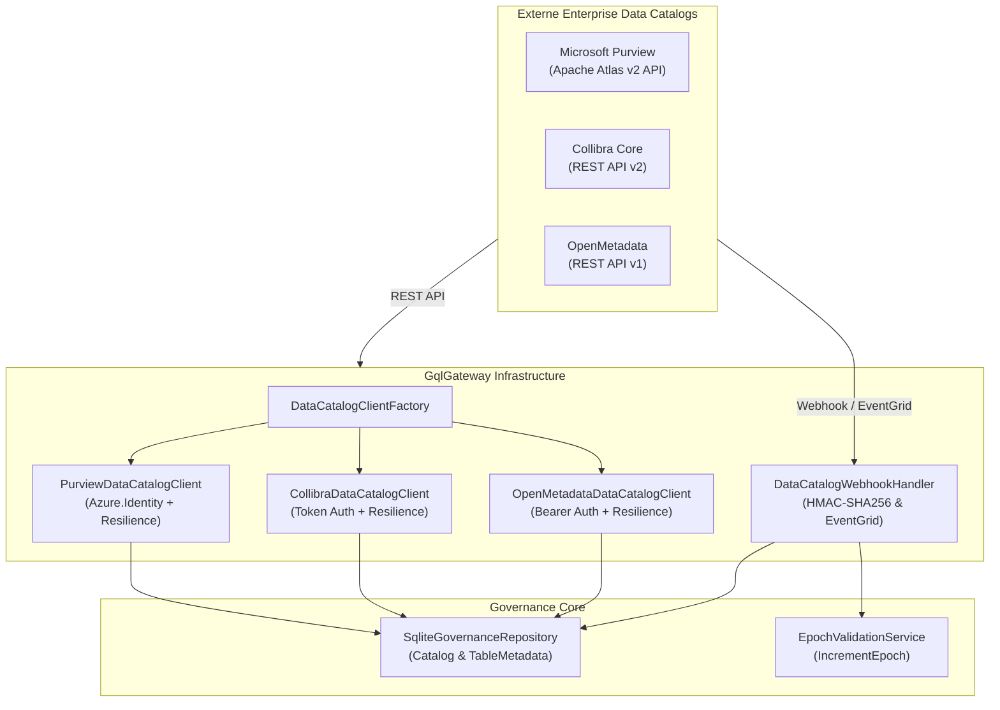
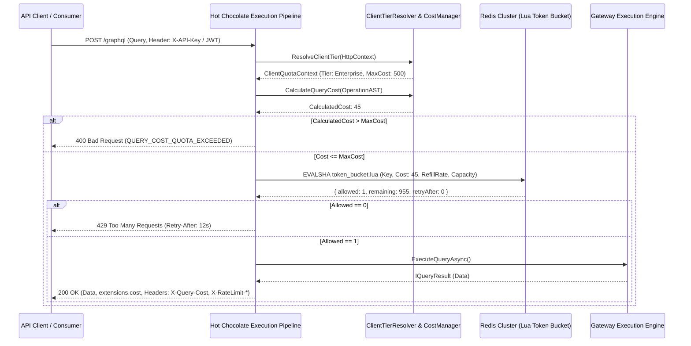
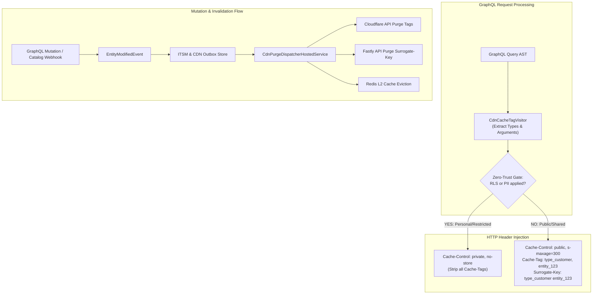
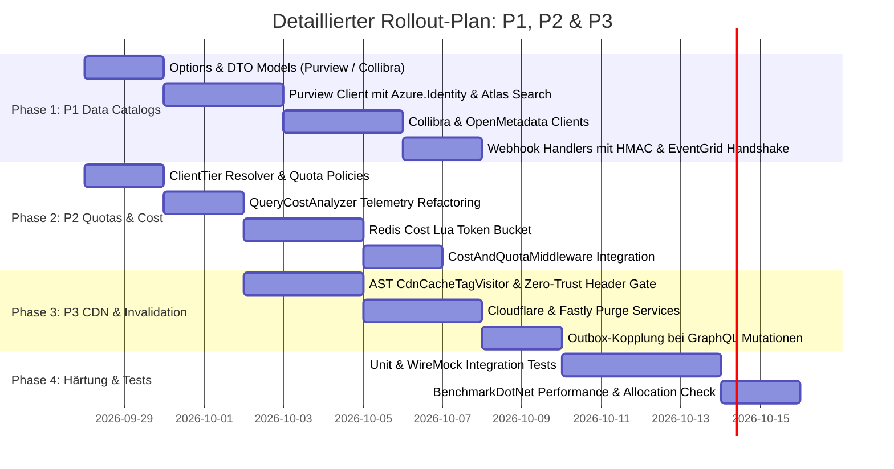

# 🏛️ Master-Implementierungsplan (Refined & Hardened): P1, P2 & P3 (GqlGateway)

**Rolle:** Lead .NET & Enterprise Solution Architect  
**Version:** 2.0 (Refined Architecture Specification)  
**Status:** Genehmigt zur Ausführung  
**Referenzdokumente:** [marktanalyse.md](file:///c:/Users/themu/Documents/github/gql/marktanalyse.md), [requirements.md](file:///c:/Users/themu/Documents/github/gql/requirements.md), [gatewayconfig.md](file:///c:/Users/themu/Documents/github/gql/gatewayconfig.md), [ADR-010](file:///c:/Users/themu/Documents/github/gql/docs/adr/ADR-010-data-catalog-abstraction-and-sensitivity-classification.md), [ADR-016](file:///c:/Users/themu/Documents/github/gql/docs/adr/ADR-016-security-findings-remediation.md)  
**Ziel-Laufzeitumgebung:** .NET 10 (C# 13), Hot Chocolate v13+, ASP.NET Core Minimal APIs / Pipeline-Middleware, StackExchange.Redis 2.8+, Azure.Identity 1.13+, Polly 8 / Microsoft.Extensions.Http.Resilience  

---

## 1. Executive Summary & Architekturgrundsätze

Dieser Plan spezifiziert die schlüsselfertige Umsetzung der drei vordringlichsten Initiativen aus der Marktanalyse zur Erreichung der vollständigen Enterprise-Marktreife (General Availability):

1. **P1: Konkrete Data Catalog Connectors** (Microsoft Purview REST, Collibra Data Governance API v2, OpenMetadata Live HTTP, Webhook HMAC-Verifikation).
2. **P2: Dynamic Client Quotas & Cost Telemetrie** (Client-Tiering `Free`/`Standard`/`Enterprise`, GraphQL Response Extensions `extensions.cost`, atomares cost-basiertes Redis Token Bucket via Lua).
3. **P3: CDN Cache-Tag Headers & Edge Invalidation** (AST-basierter Cache-Tag & Surrogate-Key Generator, Zero-Trust Cache Isolation für RLS/PII, Cloudflare/Fastly Purge Adapter via Outbox).

### Verbindliche Architektur-Leitplanken (Skill `csharp-architect`):
* **Anti-Overengineering (KISS & YAGNI):** Keine künstlichen Repository-Abstraktionen über bestehende Stores. Direkte Nutzung von `IHttpClientFactory` mit typisierten Clients. Keine redundanten DTO-Mapperschichten.
* **I/O-Konsistenz:** 100% asynchrone I/O-Pfade. Jede Methode führt `CancellationToken ct = default` mit. Striktes Verbot von synchronen Sperren (`.Result`, `.Wait()`, `GetAwaiter().GetResult()`).
* **Allokationsdisziplin:** Wiederverwendung von Puffern (`ArrayPool<char>`, `ValueStringBuilder`) bei AST-Traversierung und Header-Erzeugung. Zero-Allocation im HTTP-Pipeline-Hotpath für Standard-Queries.
* **Defense-in-Depth & Fail-Closed:** Kann ein Client-Tier, ein RLS-Status oder ein Katalog-Secret nicht verifiziert werden, blockiert das Gateway die Anfrage bzw. verweigert öffentliches Caching (`Fail-Closed`).

---

## 2. P1: Konkrete Data Catalog Connectors



### 2.1 Microsoft Purview REST Client (`PurviewDataCatalogClient`)

* **Ziel:** Automatisches Auslesen von Schemas, Spalten, Glossaren und Klassifizierungen aus der Microsoft Purview Data Map.
* **Authentifizierung:** Microsoft Entra ID (ehemals Azure AD) Client Credentials Flow über `Azure.Identity` (`ClientSecretCredential` oder `DefaultAzureCredential`).
  * Token-Scope: `https://purview.azure.net/.default`.
  * Automatisches In-Memory-Caching des `AccessToken` mit Erneuerung 5 Minuten vor Ablauf (verhindert Auth-Stürme).
* **API Endpoints:**
  * `POST {Endpoint}/datamap/api/atlas/v2/search/advanced`: Suche nach Tabellen-Assets (`typeName: "azure_sql_table"`, `"rdbms_table"`, etc.).
  * `GET {Endpoint}/datamap/api/atlas/v2/entity/guid/{guid}`: Abruf der Detail-Entity inkl. Klassifizierungen und Spaltenbeziehungen.
* **Sensitivitäts-Mapping (Purview -> Domain):**
  * `MICROSOFT.PERSONAL.*` (z.B. `MICROSOFT.PERSONAL.EMAIL`) -> `DataSensitivityClassification.Pii`.
  * `MICROSOFT.FINANCIAL.*` (z.B. `MICROSOFT.FINANCIAL.IBAN`) -> `DataSensitivityClassification.Confidential`.
  * `MICROSOFT.HEALTH.*`, `MICROSOFT.GOVERNMENT.*` -> `DataSensitivityClassification.GdprArticle9` (zwingend 4-Augen-Freigabe).

#### C# 13 Implementierungs-Signatur:
```csharp
namespace GqlGateway.Infrastructure.DataCatalog.Purview;

public sealed class PurviewDataCatalogClient(
    HttpClient httpClient,
    IOptions<GatewayOptions> options,
    ILogger<PurviewDataCatalogClient> logger) : IDataCatalogClient
{
    public DataCatalogProviderType ProviderType => DataCatalogProviderType.MicrosoftPurview;

    public async Task<IReadOnlyList<CatalogTableAsset>> GetTablesAsync(string? filter = null, CancellationToken ct = default)
    {
        // 1. Entra ID Bearer Token abrufen (cached)
        // 2. Atlas Search Advanced abfragen mit Paging (limit=100)
        // 3. Mapping von AtlasEntity zu CatalogTableAsset
    }

    public async Task<CatalogTableAsset?> GetTableAsync(TableIdentifier table, CancellationToken ct = default)
    {
        // Gezielte Abfrage über Qualified Name: mssql://server/db/schema/table
    }
}
```

### 2.2 Collibra Data Governance REST Client (`CollibraDataCatalogClient`)

* **Ziel:** Synchronisation von Asset-Hierarchien, Daten-Eigentümern (Data Owners) und Business-Glossaren.
* **Authentifizierung:** Personal Access Token / API Token oder Basic Auth über den Header `Authorization: Bearer <token>`.
* **API Endpoints:**
  * `GET /rest/2.0/assets?typeId={tableTypeId}&limit={limit}&offset={offset}`
  * `GET /rest/2.0/attributes?assetId={id}` (Attribute wie Classification, Data Security Category).
  * `GET /rest/2.0/responsibilities?assetId={id}`: Ermittlung von Benutzern mit der Rolle `Data Owner` -> Speicherung in `SqliteGovernanceRepository.DATA_OWNERS`.

### 2.3 OpenMetadata Live HTTP Client (`OpenMetadataDataCatalogClient`)

* **Ziel:** Ablösung gemockter Integrationstests durch einen vollwertigen HTTP-Client für OpenMetadata v1.x.
* **Endpoints:** `GET /api/v1/tables?fields=columns,tags,owner,customProperties&limit=100`.
* **Mapping:** OpenMetadata Tags `PII.Sensitive` -> `Pii`, `Tier.Tier1` -> `Confidential`.

### 2.4 Resiliente HTTP-Pipeline (Polly 8)

Registrierung in [`GatewayServiceCollectionExtensions.cs`](file:///c:/Users/themu/Documents/github/gql/src/GqlGateway.Api/Extensions/GatewayServiceCollectionExtensions.cs) unter Nutzung von `Microsoft.Extensions.Http.Resilience`:

```csharp
services.AddHttpClient<PurviewDataCatalogClient>(client =>
{
    client.BaseAddress = new Uri(options.DataCatalog.Purview.Endpoint);
    client.Timeout = TimeSpan.FromSeconds(30);
})
.AddStandardResilienceHandler(policy =>
{
    policy.Retry.MaxRetryAttempts = 3;
    policy.Retry.BackoffType = DelayBackoffType.Exponential;
    policy.Retry.UseJitter = true;
    policy.CircuitBreaker.SamplingDuration = TimeSpan.FromSeconds(30);
    policy.CircuitBreaker.FailureRatio = 0.5;
});
```

### 2.5 Webhook HMAC Signaturverifikation (`DataCatalogWebhookHandler`)

* **Endpunkt:** `POST /api/v1/governance/catalog/webhook/{provider}`
* **Microsoft Purview (Azure Event Grid):**
  * Handshake: Prüfung des Headers `Aeg-Event-Type: SubscriptionValidation` -> Sofortige Antwort mit `{"validationResponse": "{ValidationCode}"}`.
  * Daten-Events: Auswertung von `Microsoft.Purview.DataMap.EntityUpdated` -> Extraktion von `qualifiedName` -> Selektives Refresh im Governance Repository & `IncrementEpochAsync()`.
* **Collibra / OpenMetadata:**
  * HMAC SHA-256 Signaturprüfung über den UTF-8 Request-Body gegen den konfigurierten `WebhookSecret`.
  * Schutz vor Replay-Attacken: Timestamp-Verifikation (`X-Webhook-Timestamp`, max. 300 Sekunden Drift).

---

## 3. P2: Dynamic Client Quotas & Cost Telemetrie



### 3.1 Client-Identifikation & Tier-Modell (`ClientTierResolver`)

* **Identifikationskette:**
  1. Header `X-API-Key`: SHA-256 gehashter Lookup im L1 MemoryCache (TTL: 10 Min.) -> liefert zugeordnete `ClientQuotaPolicy`.
  2. JWT Claims: Claims `client_id`, `azp` oder `appid`.
  3. Windows / Kerberos Identity: Falls via Negotiate authentifiziert.
  4. Fallback: `ClientTier.Free` (restriktivstes Standardprofil).

#### Modell-Spezifikation ([`ClientTierModels.cs`](file:///c:/Users/themu/Documents/github/gql/src/GqlGateway.Domain/Model/)):
```csharp
namespace GqlGateway.Domain.Model;

public enum ClientTier
{
    Free = 1,
    Standard = 2,
    Enterprise = 3,
    Internal = 4
}

public sealed record ClientQuotaPolicy(
    ClientTier Tier,
    int MaxCostPerQuery,
    int MaxComplexityDepth,
    int MaxTokensCapacity,
    double TokenRefillRatePerSecond,
    bool ExposeCostExtensions
)
{
    public static ClientQuotaPolicy ForTier(ClientTier tier) => tier switch
    {
        ClientTier.Free => new(tier, MaxCostPerQuery: 50, MaxComplexityDepth: 5, MaxTokensCapacity: 100, TokenRefillRatePerSecond: 2.0, ExposeCostExtensions: false),
        ClientTier.Standard => new(tier, MaxCostPerQuery: 250, MaxComplexityDepth: 10, MaxTokensCapacity: 1000, TokenRefillRatePerSecond: 20.0, ExposeCostExtensions: true),
        ClientTier.Enterprise => new(tier, MaxCostPerQuery: 1000, MaxComplexityDepth: 20, MaxTokensCapacity: 10000, TokenRefillRatePerSecond: 200.0, ExposeCostExtensions: true),
        ClientTier.Internal => new(tier, MaxCostPerQuery: 5000, MaxComplexityDepth: 30, MaxTokensCapacity: 50000, TokenRefillRatePerSecond: 1000.0, ExposeCostExtensions: true),
        _ => throw new ArgumentOutOfRangeException(nameof(tier))
    };
}
```

### 3.2 Hot Chocolate Pipeline Middleware (`CostAndQuotaMiddleware`)

Die Integration erfolgt direkt als Request-Pipeline-Komponente in Hot Chocolate (`IRequestExecutorBuilder.Use<CostAndQuotaMiddleware>()`):

```csharp
namespace GqlGateway.GraphQL.Interceptors;

public sealed class CostAndQuotaMiddleware(RequestDelegate next, IRateLimiterService rateLimiter)
{
    public async Task InvokeAsync(IRequestContext context)
    {
        var httpContext = context.GetHttpContext();
        if (httpContext == null || context.Document == null)
        {
            await next(context);
            return;
        }

        // 1. Client Tier & Policy ermitteln
        var tierResolver = httpContext.RequestServices.GetRequiredService<IClientTierResolver>();
        var clientContext = await tierResolver.ResolveAsync(httpContext, context.RequestAborted);

        // 2. Kosten berechnen über QueryCostAnalyzerRule
        int calculatedCost = QueryCostAnalyzerRule.CalculateCost(context.Document, context.Schema);

        // 3. Maximale Query-Kosten für Tier prüfen
        if (calculatedCost > clientContext.Policy.MaxCostPerQuery)
        {
            context.Result = QueryResultBuilder.CreateError(
                ErrorBuilder.New()
                    .SetMessage($"Die Abfragekosten ({calculatedCost}) überschreiten das Tier-Limit von {clientContext.Policy.MaxCostPerQuery}.")
                    .SetCode("QUERY_COST_QUOTA_EXCEEDED")
                    .SetExtension("calculatedCost", calculatedCost)
                    .SetExtension("maxAllowedCost", clientContext.Policy.MaxCostPerQuery)
                    .Build());
            httpContext.Response.StatusCode = StatusCodes.Status400BadRequest;
            return;
        }

        // 4. Cost-basiertes Rate Limiting in Redis prüfen
        var limitResult = await rateLimiter.CheckCostQuotaAsync(
            clientContext.SubjectId,
            calculatedCost,
            clientContext.Policy,
            context.RequestAborted);

        if (!limitResult.Allowed)
        {
            context.Result = QueryResultBuilder.CreateError(
                ErrorBuilder.New()
                    .SetMessage("Rate Limit überschritten. Bitte warten Sie bis zum nächsten Zeitfenster.")
                    .SetCode("RATE_LIMIT_EXCEEDED")
                    .SetExtension("retryAfterSeconds", limitResult.RetryAfterSeconds)
                    .Build());
            httpContext.Response.StatusCode = StatusCodes.Status429TooManyRequests;
            httpContext.Response.Headers.RetryAfter = limitResult.RetryAfterSeconds.ToString();
            return;
        }

        // 5. Query ausführen
        await next(context);

        // 6. Response Headers & Extensions anreichern
        httpContext.Response.Headers["X-Query-Cost"] = calculatedCost.ToString();
        httpContext.Response.Headers["X-RateLimit-Remaining"] = limitResult.RemainingTokens.ToString();

        if (clientContext.Policy.ExposeCostExtensions && context.Result is IQueryResult queryResult)
        {
            context.Result = QueryResultBuilder.FromResult(queryResult)
                .SetExtension("cost", new Dictionary<string, object?>
                {
                    ["requestedQueryCost"] = calculatedCost,
                    ["clientTier"] = clientContext.Tier.ToString(),
                    ["rateLimitRemaining"] = limitResult.RemainingTokens,
                    ["rateLimitResetSeconds"] = limitResult.RetryAfterSeconds
                })
                .Create();
        }
    }
}
```

### 3.3 Redis Cost Token Bucket (Lua-Skript)

Das Skript in [`RedisRateLimiterService.cs`](file:///c:/Users/themu/Documents/github/gql/src/GqlGateway.Infrastructure/RateLimiting/RedisRateLimiterService.cs) wird atomar ausgeführt:

```lua
local key = KEYS[1]
local requested_cost = tonumber(ARGV[1])
local capacity = tonumber(ARGV[2])
local refill_rate = tonumber(ARGV[3])
local now_ms = tonumber(ARGV[4])
local ttl_seconds = tonumber(ARGV[5])

local data = redis.call('HMGET', key, 'tokens', 'last_refill')
local tokens = tonumber(data[1])
local last_refill = tonumber(data[2])

if not tokens then
    tokens = capacity
    last_refill = now_ms
else
    local elapsed_sec = math.max(0, (now_ms - last_refill) / 1000.0)
    tokens = math.min(capacity, tokens + (elapsed_sec * refill_rate))
    last_refill = now_ms
end

local allowed = 0
local wait_seconds = 0

if tokens >= requested_cost then
    tokens = tokens - requested_cost
    allowed = 1
else
    local missing = requested_cost - tokens
    local rate = refill_rate > 0 and refill_rate or 1.0
    wait_seconds = math.max(1, math.ceil(missing / rate))
end

redis.call('HSET', key, 'tokens', tostring(tokens), 'last_refill', tostring(last_refill))
redis.call('EXPIRE', key, ttl_seconds)

return { allowed, math.floor(tokens), wait_seconds }
```

---

## 4. P3: CDN Cache-Tag Headers & Edge Invalidation



### 4.1 AST Cache-Tag Visitor (`CdnCacheTagVisitor`)

* Ein leichtgewichtiger AST-Walker durchsucht die `SelectionSetNode`-Elemente der ausgeführten Operation.
* **Typ-Tags:** Extrahiert jeden `NamedTypeNode` des Schemas (`type_{typeName.ToLowerInvariant()}`).
* **Entitäts-Tags:** Erkennt primäre Schlüssel-Argumente (`id: "12345"`, `code: "DE"`) und formiert `entity_{typeName}_{id}`.
* **Performance-Vorgabe:** Zero Heap Allocation bei Standardabfragen durch Nutzung von stack-alloziierten Spans und `ArrayPool<string>` für die Tag-Akkumulierung.

### 4.2 Zero-Trust Cache-Control Policy

> [!CAUTION]
> **Zero-Trust Invariante:** Datenantworten, die durch Mandantenfilter (`tenantId`), dynamische Row-Level Security (Casbin-ABAC) oder rollenbasierte PII-Maskierung manipuliert wurden, dürfen unter keinen Umständen im CDN-Zwischenspeicher landen!

**Prüflogik im `CdnCacheTagMiddleware`:**
1. Abfrage des `ExecutionSecurityContext`:
   * Wurde [`RowFilterSqlBuilder`](file:///c:/Users/themu/Documents/github/gql/src/GqlGateway.Application/Services/RowFilterSqlBuilder.cs) mit einem User-SID-Prädikat ausgeführt?
   * Hat [`ColumnMaskingProvider`](file:///c:/Users/themu/Documents/github/gql/src/GqlGateway.Application/Services/ColumnMaskingProvider.cs) Felder maskiert/redigiert?
2. **Wenn Einschränkungen aktiv sind:**
   * Header: `Cache-Control: private, no-cache, no-store, must-revalidate`
   * Header: `Pragma: no-cache`
   * Die Header `Cache-Tag` und `Surrogate-Key` werden **vollständig unterdrückt**, um Fehlkonfigurationen von Edge-Caches zu neutralisieren.
3. **Wenn rein unkonditionierte, öffentliche Daten vorliegen:**
   * `Cache-Control: public, s-maxage=300, stale-while-revalidate=60`
   * `Cache-Tag: type_customer, entity_customer_1234` (Cloudflare-Standard)
   * `Surrogate-Key: type_customer entity_customer_1234` (Fastly/Akamai-Standard)
   * `Vary: Accept-Encoding, Origin`

### 4.3 Edge Cache Invalidation Provider (`ICdnCachePurgeService`)

* **Schnittstelle:**
  ```csharp
  namespace GqlGateway.Application.Caching.Interfaces;

  public interface ICdnCachePurgeService
  {
      Task<PurgeResult> PurgeTagsAsync(IReadOnlyList<string> tags, CancellationToken ct = default);
  }
  ```
* **Cloudflare Implementierung (`CloudflareCdnPurgeService`):**
  * Aufruf: `POST https://api.cloudflare.com/client/v4/zones/{zoneId}/purge_cache`
  * Header: `Authorization: Bearer {apiToken}`
  * Body: `{"tags": ["type_customer", "entity_customer_1234"]}`
* **Fastly Implementierung (`FastlyCdnPurgeService`):**
  * Aufruf: `POST https://api.fastly.com/service/{serviceId}/purge/{surrogateKey}`
  * Header: `Fastly-Key: {apiKey}`
* **Entkopplung via Outbox:**
  * Bei Ausführung einer Mutation (z.B. `updateCustomer`) erzeugt das Gateway einen Eintrag in `OUTBOX_EVENTS` (`EventType = "CDN_PURGE"`).
  * Der bestehende Outbox-Dispatcher überträgt die Purge-Befehle asynchron. Netzwerkausfälle von Cloudflare/Fastly blockieren somit nicht die GraphQL-Mutation.

---

## 5. Projektstruktur & Datei-Inventar

```
src/
├── GqlGateway.Domain/
│   ├── Model/
│   │   ├── ClientTierModels.cs             [NEU: ClientTier, QuotaPolicy, TierLimits]
│   │   ├── CdnCacheModels.cs                [NEU: CacheTagDescriptor, PurgeResult]
│   │   └── DataCatalogModels.cs            [BESTEHEND: Angereichert um Purview/Collibra Metadaten]
│   └── Options/
│       ├── DataCatalogOptions.cs           [ERWEITERT: Purview, Collibra, OpenMetadata Configs]
│       └── CdnOptions.cs                    [NEU: Cloudflare/Fastly Tokens, ZoneIds, PurgeMode]
├── GqlGateway.Application/
│   ├── DataCatalog/
│   │   ├── Interfaces/
│   │   │   ├── IDataCatalogClient.cs       [BESTEHEND: Konsolidiert]
│   │   │   └── IDataCatalogWebhookHandler.cs [BESTEHEND: HMAC Support]
│   │   └── Services/
│   │       └── DataCatalogSyncService.cs   [NEU: Zentrale Orchestrierung des Syncs]
│   ├── Caching/
│   │   ├── Interfaces/
│   │   │   ├── ICdnCachePurgeService.cs    [NEU: Edge Invalidation Schnittstelle]
│   │   │   └── IClientTierResolver.cs       [NEU: Ermittlung von Client-Identität & Tier]
│   │   └── Services/
│   │       └── ClientTierResolver.cs        [NEU: JWT / API-Key Claim-Evaluierung]
├── GqlGateway.Infrastructure/
│   ├── DataCatalog/
│   │   ├── Purview/
│   │   │   ├── PurviewDataCatalogClient.cs [NEU: Azure.Identity + Atlas API Client]
│   │   │   └── PurviewModels.cs            [NEU: JSON DTOs für Atlas Entities]
│   │   ├── Collibra/
│   │   │   ├── CollibraDataCatalogClient.cs[NEU: Collibra REST v2 Client]
│   │   │   └── CollibraModels.cs           [NEU: DTOs für Assets & Responsibilities]
│   │   └── OpenMetadata/
│   │       └── OpenMetadataDataCatalogClient.cs [NEU: Echter HTTP Client für OpenMetadata]
│   ├── Cdn/
│   │   ├── CloudflareCdnPurgeService.cs     [NEU: Cloudflare API Client via HttpClientFactory]
│   │   └── FastlyCdnPurgeService.cs         [NEU: Fastly Surrogate-Key Purge Client]
│   └── RateLimiting/
│       └── RedisRateLimiterService.cs       [ERWEITERT: Lua Cost Token Bucket Script]
├── GqlGateway.GraphQL/
│   └── Interceptors/
│       ├── QueryCostAnalyzerRule.cs         [ERWEITERT: Exponiert Cost Calculation Static Method]
│       ├── CostAndQuotaMiddleware.cs        [NEU: Hot Chocolate Request Pipeline Middleware]
│       └── CdnCacheTagVisitor.cs            [NEU: AST Visitor für Entity- & Typ-Extraktion]
└── tests/
    ├── GqlGateway.Tests.Unit/
    │   ├── PurviewDataCatalogClientTests.cs [NEU: WireMock Atlas Deserialisierung & Auth]
    │   ├── CollibraDataCatalogClientTests.cs[NEU: DTO Mapping & Responsibilities Tests]
    │   ├── CostAndQuotaMiddlewareTests.cs   [NEU: Quota Blockade & Extension Tests]
    │   └── CdnCacheTagVisitorTests.cs       [NEU: AST Extraktion & Zero-Trust Private Header]
    └── GqlGateway.Tests.Integration/
        ├── CatalogLiveSyncIntegrationTests.cs [NEU: E2E Sync -> SQLite Governance -> Masking]
        └── CdnPurgeOutboxIntegrationTests.cs   [NEU: Mutation -> Outbox -> Cloudflare Purge]
```

---

## 6. Dependency Injection & Service Lifecycle Matrix

Zur Verhinderung von Scoped-Captive-Dependencies und Memory-Leaks gelten strikte Lifetimes:

| Service / Komponente | Interface | Lifetime | Registrierungsmethode | Begründung |
| :--- | :--- | :--- | :--- | :--- |
| `PurviewDataCatalogClient` | `IDataCatalogClient` | **Transient** | `services.AddHttpClient<PurviewDataCatalogClient>` | DNS-Refresh via `IHttpClientFactory`, zustandslos. |
| `CollibraDataCatalogClient` | `IDataCatalogClient` | **Transient** | `services.AddHttpClient<CollibraDataCatalogClient>` | Typisierter HttpClient mit Polly Resilienz. |
| `OpenMetadataDataCatalogClient` | `IDataCatalogClient` | **Transient** | `services.AddHttpClient<OpenMetadataDataCatalogClient>` | Typisierter HttpClient. |
| `ClientTierResolver` | `IClientTierResolver` | **Scoped** | `services.AddScoped<IClientTierResolver, ...>` | Liest direkt aus dem `HttpContext` des Requests. |
| `RedisRateLimiterService` | `IRateLimiterService` | **Singleton** | `services.AddSingleton<IRateLimiterService, ...>` | Thread-safe `IConnectionMultiplexer`. |
| `CostAndQuotaMiddleware` | Pipeline-Komponente | **Singleton** | `builder.Use<CostAndQuotaMiddleware>()` | Hot Chocolate Pipeline Instanz; löst Scoped Services via RequestServices auf. |
| `CloudflareCdnPurgeService` | `ICdnCachePurgeService` | **Transient** | `services.AddHttpClient<CloudflareCdnPurgeService>` | Externer API-Aufruf über `IHttpClientFactory`. |

---

## 7. Schritt-für-Schritt Ausführungsplan & Meilensteine



### Meilenstein 1: Data Catalog Connectivity (Tag 1–8)
1. Implementierung von `PurviewDataCatalogClient` mit WireMock.Net Unit-Tests (Validierung aller Atlas-JSON Payloads).
2. Implementierung von `CollibraDataCatalogClient` mit Responsibilities-Extraktion für Data Owners.
3. Live-Sync-Verbindung mit [`SqliteGovernanceRepository.Catalog.cs`](file:///c:/Users/themu/Documents/github/gql/src/GqlGateway.Infrastructure/Persistence/SqliteGovernanceRepository.Catalog.cs).
4. Webhook HMAC-Validierung und Subscription-Validation für Azure Event Grid.

### Meilenstein 2: Quota & Cost Telemetry (Tag 4–11)
1. Implementierung des `IClientTierResolver` für API-Keys und JWT-Tokens.
2. Überarbeitung von `QueryCostAnalyzerRule`: Bereitstellung der statischen Methode `CalculateCost(DocumentNode, ISchema)`.
3. Deployment des erweiterten Lua-Skripts auf Redis mit dynamischem `requested_cost` Abzug.
4. Bereitstellung der GraphQL Extensions `extensions.cost` und der HTTP-Header `X-Query-Cost`, `X-RateLimit-*`.

### Meilenstein 3: CDN Caching & Edge Purging (Tag 9–16)
1. Implementierung des `CdnCacheTagVisitor` mit Zero-Allocation Optimierung.
2. Härtung des Zero-Trust Security Gates (Unterdrückung aller Cache-Header bei RLS/Masking).
3. Implementierung der Cloudflare- und Fastly-Purge-Clients über `IHttpClientFactory`.
4. Anbindung an Mutationen via Outbox-Dispatcher.

---

## 8. Verifikations-, Test- & Performance-Strategie

### 8.1 Automatisierte Test-Suiten
* **Unit Tests (xUnit + Shouldly):**
  * `PurviewDataCatalogClientTests`: Mocken des Entra ID Token-Endpunkts und des Purview Atlas Search Endpunkts via WireMock.Net. Überprüfung korrekter Klassifikationsübersetzungen.
  * `CollibraDataCatalogClientTests`: Validierung der Paging-Schleife und des Role-Mappings.
  * `CostRateLimitingTests`: Exakte Prüfung des Token-Verbrauchs bei Queries mit unterschiedlichen Kosten.
  * `CdnCacheTagVisitorTests`: Verifikation der erzeugten Tags für typisierte Queries und Argumente.
  * `ZeroTrustCacheSecurityTests`: Nachweis, dass bei aktiven Casbin-Filtern oder maskierten Spalten unter keinen Umständen ein öffentlicher Cache-Header oder Cache-Tag generiert wird!

* **Integration Tests (`WebApplicationFactory`):**
  * `CatalogSyncIntegrationTests`: End-to-End Test von Mock-Purview bis zum SQLite Governance Store und Bestätigung, dass Spalten danach in GraphQL-Queries automatisch maskiert werden.
  * `GraphQLCostHeaderIntegrationTests`: Überprüfung, dass Clients mit Tier `Standard` die Header `X-Query-Cost` und die Extensions `cost` erhalten.
  * `CdnPurgeIntegrationTests`: Mutation wird abgesetzt -> Outbox Eintrag entsteht -> Purge Request an gemocktes Cloudflare wird protokolliert.

### 8.2 Performance-Budgets (`BenchmarkDotNet`)
* **AST CdnCacheTagVisitor:**
  * Latenz-Overhead: <= 0.10 ms pro GraphQL-Query.
  * Allokation: <= 2.0 KB pro Operation (bei einer Query-Komplexität von bis zu 20 Feldern).
* **Redis Cost Rate Limiter:**
  * Ausführungszeit des atomaren Lua-Skripts in Redis: <= 0.8 ms (P99).

---

## 9. Strategische Synergie: P7 Subgraph Federation via Hot Chocolate Fusion

Durch die Nutzung des bestehenden .NET 10 / Hot Chocolate Ökosystems muss die Föderations-Engine **nicht** from-scratch entwickelt werden. ChilliCream **Hot Chocolate Fusion** (`HotChocolate.Fusion`) liefert das gesamte Query-Planning, Entity-Stitching und parallele HTTP-Dispatching out-of-the-box.

### 9.1 Neubewertung & Prioritäts-Aufstieg
* **Ursprüngliche Schätzung (From-Scratch):** 6 Personen-Wochen | RICE-C Score: 1.56 | Priorität: P3 (Q3)
* **Revidierte Schätzung (Hot Chocolate Fusion):** **1.8 Personen-Wochen** | **RICE-C Score: 9.0** | **Priorität: P2 (Q1)**

$$\text{RICE-C Score} = \frac{\text{Reach (6)} \times \text{Impact (2.5)} \times \text{Confidence (90\%)} \times \text{Compliance (1.2)}}{\text{Effort (1.8 W)}} = \frac{16.2}{1.8} = \mathbf{9.0}$$

### 9.2 Architektonische Integrationspunkte für Zero-Trust
1. **Core Setup:**
   ```csharp
   // Hot Chocolate Fusion Gateway Registrierung
   services
       .AddGraphQLGatewayServer()
       .ConfigureFromFile("./gateway.fgp", watchFileForUpdates: true);
   ```
2. **Context & Token Propagation (`SubgraphSecurityHandler`):**
   * Ein dedizierter `DelegatingHandler` für die von Fusion genutzte `IHttpClientFactory`.
   * Reicht den authentifizierten Client-Kontext (User SID, Tenant ID, Justification Tokens) als signiertes JWT oder `X-Gateway-Subject`-Header an externe Subgraphs weiter.
3. **In-Memory Maskierung auf aggregierten Subgraph-Daten:**
   * Der bestehende [`ColumnMaskingProvider`](file:///c:/Users/themu/Documents/github/gql/src/GqlGateway.Application/Services/ColumnMaskingProvider.cs) wird als Hot Chocolate Result-Completion-Filter eingeklinkt, sodass PII und DSGVO-Art.-9-Daten auch bei aggregierten Subgraph-Antworten vor der Client-Auslieferung zuverlässig maskiert werden.
4. **Perfekte Synergie mit P1–P3:**
   * **P1 (Kataloge):** Subgraph-Typen und -Entitäten werden im Data Catalog mit Klassifizierungen verknüpft.
   * **P2 (Cost Telemetry):** Der `QueryCostAnalyzer` analysiert auch föderierte Fusion-ASTs und bucht Tokens vom Client-Bucket ab.
   * **P3 (CDN Cache-Tags):** Der `CdnCacheTagVisitor` extrahiert Entitäts- und Typ-Tags über alle beteiligten Subgraphs hinweg.
