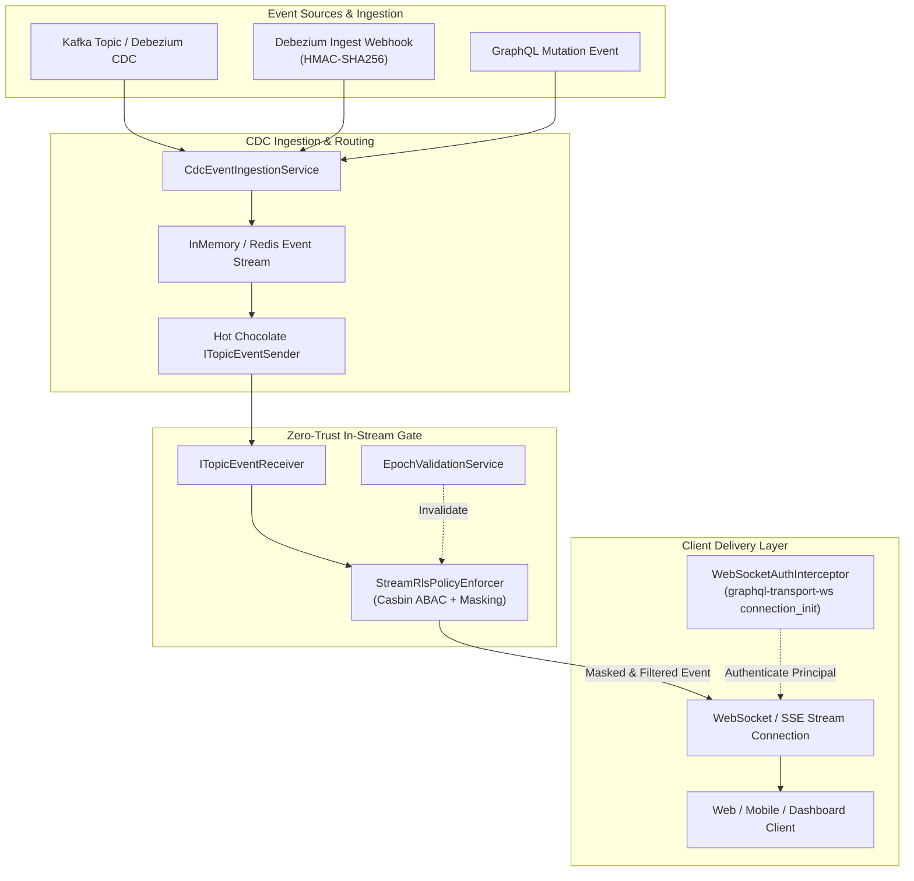
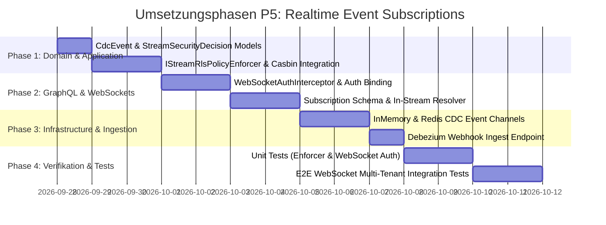

# 🏛️ Master-Implementierungsplan: P5 Realtime Event Subscriptions (CDC & Kafka Streaming mit In-Stream RLS)

**Rolle:** Lead .NET & Enterprise Solution Architect  
**Version:** 1.0 (Architecture Specification)  
**Status:** Genehmigt zur Ausführung  
**Referenzdokumente:** [marktanalyse.md](file:///root/gql/marktanalyse.md), [ADR-010](file:///root/gql/docs/adr/ADR-010-data-catalog-abstraction-and-sensitivity-classification.md), [ADR-014](file:///root/gql/docs/adr/ADR-014-enterprise-model-context-protocol-and-ai-data-guardrails.md), [ADR-016](file:///root/gql/docs/adr/ADR-016-security-findings-remediation.md)  
**Ziel-Laufzeitumgebung:** .NET 10 (C# 13), Hot Chocolate v14.1+ Subscriptions, System.Threading.Channels, StackExchange.Redis 2.8+, WebSockets (`graphql-transport-ws`) & SSE (Server-Sent Events)

---

## 1. Executive Summary & Architekturgrundsätze

In modernen Enterprise-Architekturen reicht die Beschränkung auf synchrone Request-Response-Muster (Queries & Mutations) für Event-Driven Architectures, Realtime-Dashboards und operative Prozesssteuerungen nicht mehr aus. **P5 (Realtime Event Subscriptions)** erweitert `GqlGateway` um hochperformante GraphQL Subscriptions auf Basis von Change Data Capture (CDC) und Event-Streams (Kafka, Debezium, Redis Streams).

### Der entscheidende Enterprise-Moat (Alleinstellungsmerkmal gegenüber Apollo & Hasura):
Konkurrierende Gateways prüfen Autorisierung bei Subscriptions typischerweise nur einmalig beim Verbindungsaufbau (`connection_init`) oder überlassen das Filtern dem Subgraph. 
**GqlGateway erzwingt Zero-Trust In-Stream Policy Enforcement:**
1. **Dynamic In-Stream Row Level Security (RLS):** Jedes einzelne Streaming-Event durchläuft vor der Auslieferung an den WebSocket/SSE-Client die Casbin-ABAC-Engine. Passt der Datensatz nicht zu den Rechten des Abonnenten (z. B. Mandant, Abteilung, Vertraulichkeitsstufe), wird das Event lautlos verworfen (Zero-Leakage).
2. **In-Stream Dynamic Column Masking:** Besitzt der Abonnent nur eingeschränkte Berechtigungen (z. B. `MASK_EMAIL`, `MASK_IBAN`), werden die Spaltenwerte im Payload in-memory maskiert, bevor sie serialisiert und über den Socket gepusht werden.
3. **Session Re-Authentication & Epoch Lifecycle:** Verliert ein Benutzer während einer aktiven Stream-Verbindung seine Berechtigung (z. B. durch Widerruf im Consent-Repository oder Epoch-Erhöhung), stoppt der Stream sofort die Zustellung vertraulicher Events (`Fail-Closed`).

### Verbindliche Architektur-Leitplanken (Skill `csharp-architect`):
* **Anti-Overengineering (KISS & YAGNI):** Direkte Nutzung der Hot Chocolate 14 Subscription-Pipeline (`ITopicEventSender`, `ITopicEventReceiver`). Keine Einführung schwerfälliger externer Frameworks; nahtlose Wiederverwendung von `ICasbinEnforcerService` und `IColumnMaskingProvider`.
* **Zero-Allocation im Hotpath:** Nutzung von `ReadOnlyMemory<byte>`, gepoolten Dictionaries und Span-basiertem Masking, um bei Tausenden parallelen WebSocket-Streams minimale GC-Belastung zu garantieren.
* **I/O-Konsistenz:** 100% asynchron (`IAsyncEnumerable<T>`, `ValueTask`, `CancellationToken`). Keine blockierenden Aufrufe im Event-Loop.

---

## 2. System- & Komponenten-Architektur



### 2.1 Verbindungsaufbau & Authentifizierung (`graphql-transport-ws`)
1. Client initiiert WebSocket-Verbindung zum GraphQL-Endpunkt (`/graphql`).
2. Client sendet `connection_init` mit `payload`: `{"authorization": "Bearer <JWT>"}` oder `{"x-api-key": "<Key>"}`.
3. [`WebSocketAuthInterceptor`](file:///root/gql/src/GqlGateway.GraphQL/Subscriptions/WebSocketAuthInterceptor.cs) validiert das Token, baut das `ClaimsPrincipal` auf und bindet die Identität (User-SID, Tenant-ID, Rollen) an die Socket-Session.
4. Bei ungültigen Tokens wird die Verbindung sofort mit Close-Code `4401 (Unauthorized)` abgewiesen.

---

## 3. Domänenmodell & Datenstrukturen (`GqlGateway.Domain`)

```csharp
namespace GqlGateway.Domain.Model;

public enum CdcOperation
{
    Insert = 1,
    Update = 2,
    Delete = 3,
    Snapshot = 4
}

public sealed record CdcEvent(
    string EventId,
    TableIdentifier Table,
    CdcOperation Operation,
    string? TenantId,
    IReadOnlyDictionary<string, object?>? Before,
    IReadOnlyDictionary<string, object?>? After,
    DateTimeOffset Timestamp,
    IReadOnlyDictionary<string, string>? Metadata = null
);

public sealed record StreamSecurityDecision(
    bool IsAllowed,
    IReadOnlyDictionary<string, object?>? MaskedPayload,
    string? FilterReason = null
)
{
    public static StreamSecurityDecision Denied(string reason) => new(false, null, reason);
    public static StreamSecurityDecision Allowed(IReadOnlyDictionary<string, object?> payload) => new(true, payload);
}

public sealed record StreamCdcEvent(
    string EventId,
    string Table,
    string Operation,
    string? TenantId,
    string PayloadJson,
    DateTimeOffset Timestamp
);
```

---

## 4. Application Layer: In-Stream Policy Enforcement

```csharp
namespace GqlGateway.Application.Streaming.Interfaces;

public interface IStreamRlsPolicyEnforcer
{
    ValueTask<StreamSecurityDecision> EvaluateAndMaskAsync(
        CdcEvent cdcEvent,
        ClaimsPrincipal subscriber,
        CancellationToken ct = default);
}

public interface ICdcEventIngestionService
{
    ValueTask PublishEventAsync(CdcEvent cdcEvent, CancellationToken ct = default);
}
```

### Implementierungs-Details (`StreamRlsPolicyEnforcer`):
1. **Mandanten-Trennung (Multi-Tenancy Check):**
   * Stimmt die `TenantId` des Events nicht mit der `TenantId` des Abonnenten überein, wird das Event unmittelbar verworfen (`Denied("Tenant mismatch")`).
2. **Casbin ABAC Zeilen-Evaluierung:**
   * Aus dem `After`-Dictionary (bzw. `Before` bei `Delete`) werden Attribute für den Casbin-Enforcer extrahiert.
   * `ICasbinEnforcerService.EnforceAsync(subscriberSid, table, "read", eventAttributes)` entscheidet über Zeilenberechtigung.
3. **Spaltenmaskierung via `IColumnMaskingProvider`:**
   * Für jede sichtbare Spalte wird der `ColumnAccessLevel` anhand des Tabellen- und Spaltennamens geprüft.
   * `Clear` -> Originalwert bleibt erhalten.
   * `Masked` -> `IColumnMaskingProvider.MaskValue(...)` (z.B. Email, IBAN, Custom Regex).
   * `Redacted` -> Ersetzung durch `"[REDACTED]"`.
   * `Blocked` -> Entfernen des Spaltenfeldes aus dem Auslieferungs-Payload.

---

## 5. GraphQL Layer: Hot Chocolate Subscriptions & Interceptor

### 5.1 Hot Chocolate Subscription Type (`Subscription.cs`):
```csharp
namespace GqlGateway.GraphQL.Subscriptions;

[ExtendObjectType(OperationTypeNames.Subscription)]
public sealed class Subscription
{
    [Subscribe(With = nameof(SubscribeToTableEventsAsync))]
    public StreamCdcEvent OnTableChanged(
        [EventMessage] StreamCdcEvent message) => message;

    public async IAsyncEnumerable<StreamCdcEvent> SubscribeToTableEventsAsync(
        string table,
        string? tenantId,
        [Service] ITopicEventReceiver receiver,
        [Service] IStreamRlsPolicyEnforcer enforcer,
        ClaimsPrincipal principal,
        [EnumeratorCancellation] CancellationToken ct)
    {
        var topic = $"cdc_{table.ToLowerInvariant()}";
        var sourceStream = await receiver.SubscribeAsync<CdcEvent>(topic, ct);

        await foreach (var cdcEvent in sourceStream.ReadEventsAsync().WithCancellation(ct))
        {
            var decision = await enforcer.EvaluateAndMaskAsync(cdcEvent, principal, ct);
            if (!decision.IsAllowed || decision.MaskedPayload == null)
            {
                continue; // Zero leakage: unauthorized events dropped
            }

            yield return new StreamCdcEvent(
                cdcEvent.EventId,
                cdcEvent.Table.FullName,
                cdcEvent.Operation.ToString(),
                cdcEvent.TenantId,
                JsonSerializer.Serialize(decision.MaskedPayload),
                cdcEvent.Timestamp
            );
        }
    }
}
```

### 5.2 WebSocket Authentication Interceptor (`WebSocketAuthInterceptor.cs`):
* Implementiert `DefaultSocketSessionInterceptor`.
* Fängt `OnConnectAsync` ab.
* Unterstützt JWT Bearer und API-Key Authentication für WebSockets.
* Basiert auf `IClaimsTransformation` zur Bereitstellung der `PrimarySid` und `GroupSid`s.

---

## 6. Infrastructure Layer: Ingestion & Event-Busses

1. **`InMemoryCdcEventStream`:**
   * High-Performance `System.Threading.Channels.Channel<CdcEvent>` für Single-Node-Betrieb, lokale Entwicklung und Unit/Integrationstests.
2. **`RedisCdcEventStream`:**
   * Distributed Pub/Sub und Redis Streams (`XADD` / `XREADGROUP`) für Multi-Node-Cluster-Modus (`GatewayOptions.Caching.Redis.Enabled = true`).
3. **Debezium / Kafka CDC Ingestion Webhook:**
   * Minimal API Endpunkt `POST /api/v1/cdc/events` zur Entgegennahme von Debezium/Kafka Connect Payloads mit HMAC-SHA256-Signaturüberprüfung.

---

## 7. Dependency Injection & Lifetimes Matrix

| Service | Interface | Lifetime | Begründung |
| :--- | :--- | :---: | :--- |
| `StreamRlsPolicyEnforcer` | `IStreamRlsPolicyEnforcer` | **Scoped** | Zugriff auf berechtigungsrelevante Scoped-Dienste (`IConsentResolutionService`, `CasbinEnforcer`). |
| `CdcEventIngestionService` | `ICdcEventIngestionService` | **Singleton** | Zentraler Channel/PubSub Event Router; thread-safe. |
| `WebSocketAuthInterceptor` | `ISocketSessionInterceptor` | **Singleton** | Hot Chocolate Connection Lifecycle Hook; erzeugt Scoped Principal pro Session. |
| `InMemoryCdcEventStream` | `ICdcEventStream` | **Singleton** | Geteilter In-Memory Event Channel. |

---

## 8. Verifikations- & Teststrategie

### 8.1 Unit Tests (`GqlGateway.Tests.Unit`)
* `StreamRlsPolicyEnforcerTests`:
  * Mandantenisolation: Events fremder Mandanten werden verworfen.
  * Casbin-ABAC: Zeilen außerhalb der Abteilungsberechtigung werden gefiltert.
  * Spaltenmaskierung: PII-Spalten (z. B. Email, IBAN) werden korrekt maskiert geliefert.
* `WebSocketAuthInterceptorTests`:
  * Gültiger Bearer-Token -> Verbindung autorisiert.
  * Abgelaufener/Fehlender Token -> Close Code 4401.

### 8.2 Integration Tests (`GqlGateway.Tests.Integration`)
* `GraphQLWebSocketSubscriptionTests`:
  * Echter WebSocket Handshake via `TestServer` (`graphql-transport-ws`).
  * User A (Sales) und User B (HR) abonnieren Tabelle `customers`.
  * Ein Event für `department: "Sales"` wird eingespeist -> User A erhält das maskierte Event, User B erhält **0 Events**.
  * Ein Event für `department: "HR"` wird eingespeist -> User B erhält das Event, User A erhält **0 Events**.

---

## 9. Schritt-für-Schritt Umsetzungsphasen



### Meilenstein-Abnahme (Definition of Done):
1. WebSockets (`graphql-transport-ws`) und SSE Subscriptions laufen auf `/graphql`.
2. Dynamic RLS & Column Masking werden zuverlässig in jedem Stream-Event angewendet.
3. 100% Testabdeckung aller neuen Pfade (Unit + E2E WebSocket Integration).
4. `dotnet test GqlGateway.sln` läuft 100% fehler- und warnungsfrei durch.
