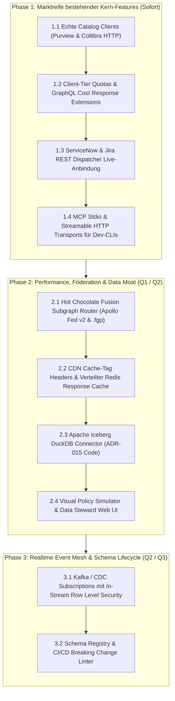

# 📊 Enterprise Product Management: Marktrecherche, Feature-Gap-Analyse & Reifegrad-Prüfung (GqlGateway)

**Rolle:** Principal Enterprise Product Manager & Platform Strategist  
**Marktumfeld:** 2025/2026 Enterprise API & GraphQL Federation (Apollo GraphOS / Router v2.17+, Hasura DDN v3, WunderGraph Cosmo, StepZen, Immuta)  
**Ziel:** Definition strategischer Produktlücken, Härtung bestehender Module zur Marktreife und Priorisierung nach dem RICE-C-Modell.

---

## 1. Executive Summary & Marktkontext 2025 / 2026

Der Markt für Enterprise GraphQL und API Gateways hat sich in den Jahren 2025 und 2026 fundamental gewandelt:

1. **Von Query-Aggregation zu "Agentic AI Orchestration":**
   * Apollo hat mit dem *Apollo MCP Server* und *GraphOS Agent Tools* den Weg geebnet, um GraphQL Supergraphs als Tool-Provider für autonome KI-Agenten (Claude, OpenAI, Cursor) bereitzustellen.
   * **Unsere Position:** Mit [ADR-014](file:///c:/Users/themu/Documents/github/gql/docs/adr/ADR-014-enterprise-model-context-protocol-and-ai-data-guardrails.md) und der Implementierung in [`GqlGateway.GraphQL.Mcp`](file:///c:/Users/themu/Documents/github/gql/src/GqlGateway.GraphQL/Mcp/GatewayMcpQueryExecutor.cs) sind wir architektonisch vorne, da wir als Einzige integrierte Zero-Trust Guardrails (PII-Scrubbing & DSGVO Art. 9 Masking) direkt vor dem LLM-Token-Stream erzwingen.
2. **Modularität & Code-Driven Workflows (Hasura DDN v3 / Cosmo):**
   * Hasura DDN v3 trennt Control- und Data-Plane strikt und setzt auf *Native Data Connectors (NDC)* sowie dezentrale Metadaten-Subgraphs mit lokalen Dev-Tools und Preview-APIs.
   * WunderGraph Cosmo dominiert die Open-Source-Federation mit *Cosmo Streams* (Kafka/NATS GraphQL Subscriptions), *Schema Contracts* via `@tag` und CI/CD Schema Checks mit Replay realer Traffic-Metriken.
3. **Enterprise Data Governance & Zero-Trust (Immuta / Purview):**
   * Reine RBAC/ABAC-Gateways reichen Fortune-500-Kunden nicht mehr aus. Verlangt werden **DSGVO Art. 15 Auskunfts-APIs**, **manipulationssichere SHA-256 Audit-Chains**, automatischer Sync mit Data Catalogs und Justification-Driven Access (ServiceNow/Jira).

---

## 2. Reifegrad- & Vollständigkeitsprüfung vorhandener Features

Hier ist die detaillierte Bestandsaufnahme aller im Codebase vorhandenen Module mit Fokus auf die Frage: **"Ist das Feature komplett oder fehlt noch etwas zur echten Marktreife (General Availability / GA)?"**

| Modul / Feature | Aktueller Zustand im Repository | Reifegrad (0–100%) | Fehlende Teile zur Marktreife (Gaps & Pain Points) |
| :--- | :--- | :---: | :--- |
| **Casbin ABAC & RLS Pushdown** | Vollständig im AST-zu-SQL integriert ([`RowFilterSqlBuilder`](file:///c:/Users/themu/Documents/github/gql/src/GqlGateway.Application/Services/RowFilterSqlBuilder.cs), [`AdvancedRlsFilterGenerator`](file:///c:/Users/themu/Documents/github/gql/src/GqlGateway.Application/Services/AdvancedRlsFilterGenerator.cs)). Dialekte: Postgres, MSSQL, SQLite. | **85%** | ❌ **Kein Hot-Reload von Casbin-Policies** ohne Service-Restart. ❌ **Keine Multi-Region Cache-Invalidation** bei Policy-Updates im Cluster. ❌ Fehlender visueller Policy-Tester / Simulator für Data Stewards. |
| **Data Catalog Abstraktion** | Interfaces ([`IDataCatalogClient`](file:///c:/Users/themu/Documents/github/gql/src/GqlGateway.Application/DataCatalog/Interfaces/IDataCatalogInterfaces.cs)), Modelle und SQLite-Katalog-Tabellen existieren. | **35%** | 🔴 **Kritische Lücke:** Weder Microsoft Purview REST Client, noch Collibra API Client, noch Alation Client sind implementiert! Es gibt nur Interface-Definitionen. Selbst der bestehende `IOpenMetadataClient` ist in `src` nicht als produktiver HTTP-Client ausprogrammiert (nur in Tests gemockt). ❌ Fehlende Webhook-Signaturprüfung (HMAC SHA-256) für Purview & Collibra. |
| **Modern Lakehouse Connector** | Als [ADR-015](file:///c:/Users/themu/Documents/github/gql/docs/adr/ADR-015-apache-iceberg-lakehouse-connector-and-zero-trust-pushdown.md) und Roadmap-Thema spezifiziert. | **0% (Paper-Feature)** | 🔴 **Keine einzige Zeile Code in `src`!** `IIcebergMetadataReader`, Parquet/Arrow-Reader und DuckDB In-Process Query Engine existieren bisher nur auf dem Papier. |
| **Model Context Protocol (MCP)** | SSE-Handshake (`/mcp/sse`), JSON-RPC Protokollhandler ([`McpProtocolHandler`](file:///c:/Users/themu/Documents/github/gql/src/GqlGateway.Application/Mcp/Services/McpProtocolHandler.cs)), Persisted Query Tool-Registry und AI Guardrail ([`AiDataGuardrailService`](file:///c:/Users/themu/Documents/github/gql/src/GqlGateway.Application/Mcp/Services/AiDataGuardrailService.cs)). | **75%** | ❌ **Fehlender `stdio`- & `Streamable HTTP`-Transport** (erforderlich für Entwickler-CLI-Tools wie Claude Code, Cline, Cursor). ❌ PII-Scrubbing basiert auf statischen RegEx-Mustern; es fehlt semantische Prompt-Injection- & Jailbreak-Erkennung (NeMo Guardrails / Llama Guard Anbindung). ❌ Dynamische Schema-Generierung für Subgraphs fehlt (nur vordefinierte Persisted Queries). |
| **ITSM Closed Loop (ServiceNow / Jira)** | Outbox Pattern ([`ItsmOutboxDispatcherHostedService`](file:///c:/Users/themu/Documents/github/gql/src/GqlGateway.Infrastructure/Itsm/ItsmOutboxDispatcherHostedService.cs)), Webhook Ingestion ([`ItsmWebhookHandler`](file:///c:/Users/themu/Documents/github/gql/src/GqlGateway.Infrastructure/Itsm/ItsmWebhookHandler.cs)), Triage-Engine. | **70%** | ❌ **Fehlende konkrete REST-Clients** für ServiceNow (`Table API v1`) und Jira Cloud (`REST API v3`). Der Outbox Dispatcher hat bisher nur Mock/HTTP-Stubs. ❌ Kein Auto-Renewal / Verlängerungs-Workflow für ablaufende temporäre Freigaben. |
| **Query Defense & Rate Limiting** | AST-Kostenanalyse ([`QueryCostAnalyzerRule`](file:///c:/Users/themu/Documents/github/gql/src/GqlGateway.GraphQL/Interceptors/QueryCostAnalyzerRule.cs)), Tiefenbegrenzung, In-Memory- & Redis-Rate-Limiter. | **70%** | ❌ **Keine API-Key / Client-spezifischen Tier-Limits** (z.B. Bronze=100 req/min, Gold=5000 req/min). ❌ **Fehlende GraphQL Extension Telemetrie**: Client-Responses enthalten keine `extensions.cost`-Felder (`actualQueryCost`, `rateLimitRemaining`, `resetAt`). |
| **Lineage & DSGVO Art. 15 Auskunft** | Lineage Graph Store ([`LineageImpactAnalyzerService`](file:///c:/Users/themu/Documents/github/gql/src/GqlGateway.Application/Lineage/LineageImpactAnalyzerService.cs)), GDPR Art. 15 Subject Access Report Generator. | **80%** | ❌ Exportformate beschränken sich auf JSON/Raw; es fehlt ein standardkonformer PDF/Audit-Export für Datenschutzbeauftragte. ❌ Keine automatische Lineage-Propagation zu Apache Atlas / OpenLineage. |
| **HTTP Caching & Performance** | Epoch-Validierung ([`EpochValidationService`](file:///c:/Users/themu/Documents/github/gql/src/GqlGateway.Infrastructure/Cache/EpochValidationService.cs)), Consent Cache. | **40%** | ❌ **Kein HTTP Response Caching & keine `Cache-Tag` / `Surrogate-Key` Header**: Apollo Router und Cloudflare/Fastly invalidieren CDN-Caches über Cache-Tags; GqlGateway hat hier keine Integration. ❌ Kein verteilter Query-Result-Cache in Redis für identische GraphQL Read-Queries. |
| **Subscriptions & Realtime Events** | Keine Unterstützung (nur Query & Mutation). | **0%** | 🔴 Weder WebSockets (`graphql-transport-ws`) noch SSE Subscriptions implementiert. Keine Event-Anbindung (Kafka/Debezium CDC). |
| **Management UI / Studio** | Reines Headless-Gateway (keine Web-UI). | **0%** | 🔴 Keine grafische Benutzeroberfläche für Admins, Data Stewards und Security Officers (fehlt Policy Simulator, Lineage Graph Viewer, Schema Explorer). |

---

## 3. Fehlende strategische Markt-Features (Benchmark vs. Apollo, Hasura & Cosmo)

Aus der Web-Recherche zum Stand 2025/2026 ergeben sich **5 massive Differenzierungs- und Aufhol-Themen**, die dem Produkt zur Marktführerschaft fehlen:

### 1. Föderierte Subgraph Federation v2 / Fusion Execution
* **Der Marktstandard:** Apollo Router und Cosmo können GraphQL-Queries über Dutzende Subgraphs föderieren, Schemas komponieren (`@key`, `@shareable`, `@override`) und optimierte Query Execution Plans erstellen.
* **Unsere Lücke:** GqlGateway fungiert aktuell als starkes Gateway für relationale SQL-Datenbanken und HTTP-Endpoints, aber noch **nicht** als nativer Federation Supergraph Router für externe Apollo- oder Hot-Chocolate-Subgraphs.
* **Strategischer Hebel:** **Hot Chocolate Fusion (`HotChocolate.Fusion`) nutzen!** Statt eine eigene Federation-Engine von Grund auf zu entwickeln (was 6 Wochen dauern würde), liefert Hot Chocolate den Query Planner, AST Splitting, Entity Resolution und Parallel Dispatching out-of-the-box. Die Entwicklungsaufgabe reduziert sich auf die **Zero-Trust-Governance-Brücke**: Subgraph Context Forwarding (JWT/Subject Propagation via DelegatingHandler) und In-Memory Field Masking via `ColumnMaskingProvider` auf aggregierten Subgraph-Ergebnissen (Aufwand: nur 1.5–2 Wochen).

### 2. Schema Registry, Schema Contracts (`@tag`) & CI/CD Schema Checks
* **Der Marktstandard:** Apollo GraphOS und WunderGraph Cosmo bieten Schema-Registries. Teams prüfen Pull Requests über eine CLI (`rover check`, `wgc check`) gegen reale Traffic-Metriken (Breaking Change Detection). Über `@tag` werden Contracts (z.B. Partner-API vs. Interne API vs. AI-Agent-API) generiert.
* **Unsere Lücke:** Schemas im GqlGateway werden statisch beim Start geladen. Es gibt weder eine externe Schema Registry noch CI/CD-Linting oder Contract-Generierung.

### 3. Cosmo Streams: Realtime CDC & Kafka Event Subscriptions mit RLS
* **Der Marktstandard:** Cosmo Streams erlaubt Echtzeit-GraphQL-Subscriptions direkt aus Kafka, NATS und Redis.
* **Unser Differenzierungs-Moat:** Wenn GqlGateway Subscriptions aus Kafka/Debezium anbietet, können wir **Row-Level Security im Event-Stream** erzwingen (jeder WebSocket/SSE-Client sieht nur jene CDC-Events, für die er nach Casbin-Policy autorisiert ist).

### 4. CDN Edge Caching mit `Cache-Tag` & Stale-While-Revalidate
* **Der Marktstandard:** Apollo Router v2.17+ generiert automatisiert `Cache-Tag`-Header auf Basis der abgefragten GraphQL-Entities. CDN-Provider (Cloudflare, Fastly, Akamai) cachen GraphQL-GET-Requests am Edge und werden bei Mutationen gezielt invalidiert.
* **Unsere Lücke:** Unser Gateway generiert keine CDN-freundlichen Cache-Tags. Alle Anfragen belasten den .NET-Core-Prozess und die Datenbanken.

### 5. Data Steward Web UI & Visual Policy Simulator ("GqlGateway Studio")
* **Der Marktstandard:** Hasura Console, Apollo Studio und Cosmo Studio bieten Web-Dashboards zur Erkundung, Überwachung und Konfiguration.
* **Unsere Lücke:** Enterprise-Kunden (Compliance, CISO, Data Owners) verlangen ein Web-Interface, in dem sie auf Knopfdruck simulieren können: *"Welche Felder sieht Sachbearbeiter A aus Abteilung B bei Tabelle Kunden im Vergleich zu Auditor C?"*

---

## 4. Priorisierungs-Framework: RICE-C Matrix

Zur Evaluierung der nächsten Entwicklungsschritte nutzen wir das im Skill definierte **RICE + Compliance (RICE-C)** Modell:

$$\text{RICE-C Score} = \frac{\text{Reach} \times \text{Impact} \times \text{Confidence} \times \text{ComplianceWeight}}{\text{Effort}}$$

* Skalen: Reach (1–10), Impact (0.5–3.0), Confidence (50%–100%), ComplianceWeight (1.0–2.0), Effort (Personen-Wochen / Sprints).

| Initiative / Feature | Reach | Impact | Conf. | Comp. | Effort | **Score** | Priorität |
| :--- | :---: | :---: | :---: | :---: | :---: | :---: | :---: |
| **P1: Konkrete Data Catalog Connectors** *(Purview REST, Collibra API, OpenMetadata Live)* | 8 | 2.5 | 90% | 1.8 | 3 W | **10.8** | 🟢 **Sofort (P1)** |
| **P2: Dynamic Client Quotas & Cost Telemetrie** *(Tier-Limits, `extensions.cost` im GraphQL Header)* | 9 | 1.8 | 95% | 1.2 | 1.5 W | **12.3** | 🟢 **Sofort (P1)** |
| **P7: Subgraph Federation (Hot Chocolate Fusion)** *(Supergraph Router mit Apollo / Fusion Subgraphs & Zero-Trust)* | 6 | 2.5 | 90% | 1.2 | 1.8 W | **9.0** | 🟡 **Q1 (P2)** |
| **P3: CDN Cache-Tag Headers & Edge Invalidation** *(`Cache-Control`, `Surrogate-Key`, Mutation-Purging)* | 8 | 2.2 | 90% | 1.1 | 2 W | **8.7** | 🟡 **Q1 (P2)** |
| **P6: Data Steward Studio & Policy Simulator** *(Lightweight SPA / Blazor Admin UI)* | 7 | 2.2 | 90% | 1.6 | 4 W | **5.5** | 🟡 **Q2 (P2)** |
| **P5: Realtime Event Subscriptions (Kafka/CDC)** *(GraphQL Subscriptions mit Stream-RLS)* | 7 | 2.5 | 85% | 1.3 | 4 W | **4.8** | 🟡 **Q2 (P2)** |
| **P4: Lakehouse Connector (Iceberg/Parquet)** *(Umsetzung von [ADR-015](file:///c:/Users/themu/Documents/github/gql/docs/adr/ADR-015-apache-iceberg-lakehouse-connector-and-zero-trust-pushdown.md) via DuckDB / Arrow)* | 6 | 3.0 | 80% | 1.5 | 5 W | **4.3** | 🟡 **Q2 (P2)** |
| **P8: Schema Registry & CI/CD Checks (`rover`-Pendant)** *(Breaking Change Detection via Git Action)* | 6 | 1.8 | 85% | 1.2 | 3.5 W | **3.1** | 🔵 **Q3 (P3)** |

---

## 5. Konkrete Roadmap & Handlungsempfehlungen

### Unmittelbare nächste Schritte (Action Items für das Entwicklungsteam):

1. **Purview- & Collibra-Client implementieren:**
   * Erstellen der Implementierungen in [`GqlGateway.Infrastructure`](file:///c:/Users/themu/Documents/github/gql/src/GqlGateway.Infrastructure) für [`IDataCatalogClient`](file:///c:/Users/themu/Documents/github/gql/src/GqlGateway.Application/DataCatalog/Interfaces/IDataCatalogInterfaces.cs).
   * Authentifizierung via Entra ID Client Credentials (MSAL) für Purview und API-Token für Collibra.
2. **GraphQL Cost Extension & Client-Tiers:**
   * Erweitern von [`QueryCostAnalyzerRule`](file:///c:/Users/themu/Documents/github/gql/src/GqlGateway.GraphQL/Interceptors/QueryCostAnalyzerRule.cs) um Response-Formatierung in `IQueryResult.Extensions["cost"]`.
   * Bindung an Client-IDs aus JWT / API-Key (`QuotaTier: Free, Standard, Enterprise`).
3. **Realisierung von [ADR-015](file:///c:/Users/themu/Documents/github/gql/docs/adr/ADR-015-apache-iceberg-lakehouse-connector-and-zero-trust-pushdown.md) (Iceberg Connector):**
   * Anlegen des Projekts `GqlGateway.Extensions.Lakehouse` und Implementierung von `IIcebergMetadataReader` via `DuckDB.NET` mit Zero-Trust AST Pushdown.
4. **Cache-Tag CDN Headers:**
   * HTTP-Response-Filter registrieren, der bei Abfragen von Typen (z.B. `Customer`, `Order`) Header wie `Cache-Tag: entity_customer, entity_order` und `Cache-Control: public, s-maxage=300, stale-while-revalidate=60` injiziert.
5. **Hot Chocolate Fusion Subgraph Router (P7):**
   * Hinzufügen von `HotChocolate.Fusion` (`.AddGraphQLGatewayServer()`), DelegatingHandler für Subgraph-Security-Context Forwarding (`X-Gateway-Subject` / JWT Re-Signing) und Einhängen des `ColumnMaskingProvider` in die Fusion Result Completion Pipeline.
