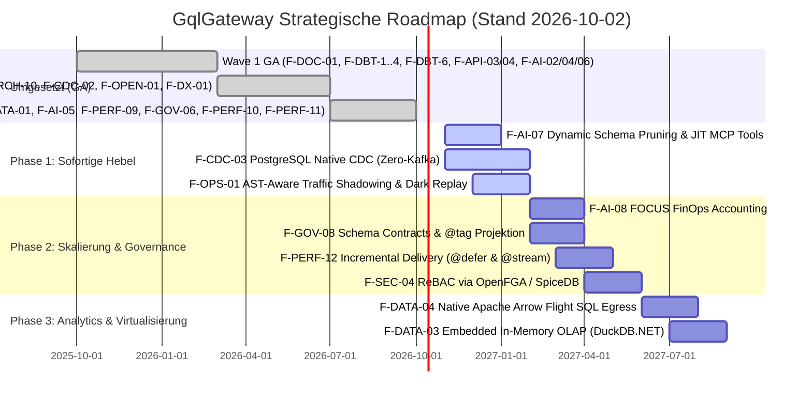

# 📊 Enterprise Product Management: Marktrecherche, Feature-Gap-Analyse & Reifegrad-Prüfung (GqlGateway)

**Rolle:** Principal Enterprise Product Manager & Platform Strategist  
**Marktumfeld:** 2025/2026 Enterprise API & GraphQL Federation (Apollo GraphOS / Router v2.17+, Hasura DDN v3, WunderGraph Cosmo, PostgREST, StepZen, Immuta, hasura/graphql-bench)  
**Status:** Aktualisiert nach vollständiger Umsetzung aller Initiativen aus **Wave 1**, **Wave 2** und **Wave 3** (100% GA). Umgesetzte Features sind in dieser Marktanalyse als `[Done]` referenziert; ihre detaillierte Dokumentation befindet sich in [`docs/features/`](file:///root/lis-git/gql/gql/docs/features/).  
**Ziel:** Strategische Markt- und Wettbewerbsbewertung, Dokumentation von Differenzierungs-Moats und Priorisierung der verbleibenden Roadmap-Themen entlang des RICE-C-Modells.  
**Feature-Dokumentation:** [`docs/features/README.md`](file:///root/lis-git/gql/gql/docs/features/README.md)  

---

## 1. Executive Summary & Marktkontext 2025 / 2026

Der Markt für Enterprise GraphQL und API Gateways wird 2025/2026 durch fundamentale Marktbewegungen definiert:

1. **Von Query-Aggregation zu "Agentic AI Orchestration" & Semantic Context Grounding:**
   - Apollo hat mit dem *Apollo MCP Server* und *GraphOS Agent Tools* den Weg geebnet, um GraphQL Supergraphs als Tool-Provider für autonome KI-Agenten bereitzustellen.
   - **Die kritische Marktlücke (The Semantic Gap):** Reine Schemas liefern Modellen (LLMs) nur technische Signaturen. Ohne Fachsemantik (Grain-Definitionen, Berechnungsformeln für Kennzahlen) halluzinieren Agenten.
   - **Unsere Marktposition:** GqlGateway schließt die Semantic Gap über den **Semantic MCP Compiler (`F-AI-02` [Done])**, **Pre-Flight Query Simulator (`F-AI-04` [Done])**, **Few-Shot Golden Queries (`F-AI-03` [Done])**, **Provenance Footnotes (`F-AI-06` [Done])** und **Human-in-the-Loop Step-Up Approval (`F-AI-05` [Done])**.
2. **Enterprise Data Governance & Zero-Touch Data Catalogs:**
   - Reine RBAC/ABAC-Gateways greifen zu kurz. Fortune-500-Unternehmen verlangen automatisierte Klassifizierungs-Synchronisation aus führenden Metadaten-Katalogen (Purview, Collibra, OpenMetadata) ohne manuelle Doppelpflege.
   - **Unsere Marktposition:** Schlüsselfertige **Data Catalog Connectors (`P1` [Done])** synchronisieren Tags, PII- und DSGVO-Art.-9-Regeln direkt in dynamische Maskierungsregeln.
3. **Dual-Access Exposure (GraphQL + OData v4 + Dynamic OpenAPI 3.1) & High-Performance Parquet Egress:**
   - Reine GraphQL-Gateways scheitern bei Data-Science-Teams (Pandas/Python), BI-Anwendern (Power BI/Excel) und klassischen B2B-REST-Partnern.
   - **Unsere Marktposition:** Standardkonforme **OData v4 & OpenAPI 3.1 Spezifikation (`F-API-03` [Done])** sowie nativer **Hierarchischer Parquet Egress (`F-DATA-01` [Done])** für verschachtelte 1:N-Relationen.
4. **Declarative SQL-to-API Engine & Governed WebSQL:**
   - Unternehmen besitzen zehntausende Zeilen optimierten SQLs. PostgREST und Hasura Native Queries zwingen zu unkontrollierten DB-Benutzern oder proprietären DSLs.
   - **Unsere Marktposition:** **Declarative SQL-to-API (`F-SQL-01` [Done])** exponiert versionierte `.sql`-Dateien direkt als typisierte REST-Endpunkte; **Governed WebSQL (`F-DATA-02` [Done])** bietet sichere HTTP-SQL-Ausführung nach Trino-Muster.
5. **Federation & Edge Performance bei striktem Zero-Trust:**
   - Bestehende Router delegieren Autorisierung entweder an Subgraphs (Apollo) oder erfordern teure Zusatz-Lizenzen (Hasura DDN).
   - **Unsere Marktposition:** Hot Chocolate Fusion Subgraph Router (**`P7` [Done]**), Single-Query Pushdown (**`F-PERF-09` [Done]**) und Hierarchische Resource Groups (**`F-PERF-08` [Done]**).
6. **Enterprise Customizing, C#-Ökosystem & Sonderfreigabe-Workflows:**
   - In Enterprise-Landschaften dominiert C#/.NET im Backend. Fremdsprachen oder gRPC-Sidecars (Kong/Tyk) verursachen Latenz.
   - **Unsere Marktposition:** **Native C# Ingress/Egress Pipeline (`P9` [Done])** mit Zero-IPC-Latenz und verzahnte **ITSM-Workflows (`P10` [Done])** für ServiceNow/Jira.
7. **dbt Data-Mesh & Data-Contract Governance:**
   - dbt ist Standard für Modellierung im Warehouse. Gateways agieren traditionell blind gegenüber Upstream-Qualitätsfehlern.
   - **Unsere Marktposition:** **dbt Health Circuit Breaker (`F-DBT-1` [Done])**, **Contract Enforcement (`F-DBT-2` [Done])**, **Telemetry Exposures (`F-DBT-3` [Done])**, **Webhooks (`F-DBT-4` [Done])** und **Policy-Sync (`F-DBT-6` [Done])**.
8. **Realtime Event Streaming & CDC ohne Kafka-Barriere:**
   - Klassische CDC-Stacks (Debezium, Kafka, ZooKeeper) scheitern am Betriebsaufwand in Behörden und Banken ("The Kafka Barrier").
   - **Unsere Marktposition:** **Native MSSQL Change Tracking Ingestion (`F-CDC-02` [Done])** liefert Zero-Infrastructure CDC direkt über `CHANGETABLE`.
9. **High-Throughput Benchmarking & Hasura-Vergleich (`graphql-bench`):**
   - **Multi-Tenant Isolated Query Plan Cache (`F-PERF-11` [Done])**, Kestrel/Runtime-Tuning und Zero-LOH Streaming (**`F-PERF-10` [Done]**) schlagen Hasura DDN bei strikter Mandanten-Isolation.

---

## 2. Reifegrad- & Vollständigkeitsprüfung vorhandener Features

Übersicht aller Gateway-Module zur Dokumentation der Marktreife. Umgesetzte Features sind als `[Done]` markiert; die Detailbeschreibungen liegen unter [`docs/features/`](file:///root/lis-git/gql/gql/docs/features/).

| Modul / Feature | Reifegrad | Status | Dokumentation |
| :--- | :---: | :---: | :--- |
| **Data Catalog Connectors (`P1`)** | **100% (GA)** | ✅ **[Done]** | [p01-data-catalog-connectors.md](file:///root/lis-git/gql/gql/docs/features/p01-data-catalog-connectors.md) |
| **dbt Data Health Circuit Breaker (`F-DBT-1`)** | **100% (GA)** | ✅ **[Done]** | [f-dbt-01-health-circuit-breaker.md](file:///root/lis-git/gql/gql/docs/features/f-dbt-01-health-circuit-breaker.md) |
| **dbt Model Contract Enforcement (`F-DBT-2`)** | **100% (GA)** | ✅ **[Done]** | [f-dbt-02-contract-enforcement.md](file:///root/lis-git/gql/gql/docs/features/f-dbt-02-contract-enforcement.md) |
| **dbt Live-Telemetry Exposures (`F-DBT-3`)** | **100% (GA)** | ✅ **[Done]** | [f-dbt-03-telemetry-exposures.md](file:///root/lis-git/gql/gql/docs/features/f-dbt-03-telemetry-exposures.md) |
| **dbt Orchestrator & Cloud Webhooks (`F-DBT-4`)** | **100% (GA)** | ✅ **[Done]** | [f-dbt-04-orchestrator-webhooks.md](file:///root/lis-git/gql/gql/docs/features/f-dbt-04-orchestrator-webhooks.md) |
| **dbt Policy & RLS Auto-Sync (`F-DBT-6`)** | **100% (GA)** | ✅ **[Done]** | [f-dbt-06-policy-rls-sync.md](file:///root/lis-git/gql/gql/docs/features/f-dbt-06-policy-rls-sync.md) |
| **Dual-Access Exposure: OData v4 & Dynamic OpenAPI 3.1 (`F-API-03`)** | **100% (GA)** | ✅ **[Done]** | [f-api-03-odata-openapi.md](file:///root/lis-git/gql/gql/docs/features/f-api-03-odata-openapi.md) |
| **Upstream Web API Ingestion via OpenAPI (`F-API-04`)** | **100% (GA)** | ✅ **[Done]** | [f-api-04-openapi-ingestion.md](file:///root/lis-git/gql/gql/docs/features/f-api-04-openapi-ingestion.md) |
| **Canonical System Metadaten & Monitoring (`F-API-07`)** | **100% (GA)** | ✅ **[Done]** | [f-api-07-system-metadata-monitoring.md](file:///root/lis-git/gql/gql/docs/features/f-api-07-system-metadata-monitoring.md) |
| **Omnichannel Documentation Passthrough (`F-DOC-01`)** | **100% (GA)** | ✅ **[Done]** | [f-doc-01-omnichannel-documentation.md](file:///root/lis-git/gql/gql/docs/features/f-doc-01-omnichannel-documentation.md) |
| **Declarative SQL-to-API Engine (`F-SQL-01`)** | **100% (GA)** | ✅ **[Done]** | [f-sql-01-declarative-sql-endpoints.md](file:///root/lis-git/gql/gql/docs/features/f-sql-01-declarative-sql-endpoints.md) |
| **Governed WebSQL Engine (`F-DATA-02`)** | **100% (GA)** | ✅ **[Done]** | [f-data-02-governed-websql.md](file:///root/lis-git/gql/gql/docs/features/f-data-02-governed-websql.md) |
| **Hierarchischer Parquet Egress (`F-DATA-01`)** | **100% (GA)** | ✅ **[Done]** | [f-data-01-parquet-egress.md](file:///root/lis-git/gql/gql/docs/features/f-data-01-parquet-egress.md) |
| **Semantic MCP Compiler & Schema Grounding (`F-AI-02`)** | **100% (GA)** | ✅ **[Done]** | [f-ai-02-semantic-mcp-compiler.md](file:///root/lis-git/gql/gql/docs/features/f-ai-02-semantic-mcp-compiler.md) |
| **Dynamic Few-Shot Golden Query Injection (`F-AI-03`)** | **100% (GA)** | ✅ **[Done]** | [f-ai-03-golden-queries.md](file:///root/lis-git/gql/gql/docs/features/f-ai-03-golden-queries.md) |
| **Pre-Flight Query Simulator & Safety Limits (`F-AI-04`)** | **100% (GA)** | ✅ **[Done]** | [f-ai-04-preflight-simulator.md](file:///root/lis-git/gql/gql/docs/features/f-ai-04-preflight-simulator.md) |
| **Human-in-the-Loop Step-Up Approval (`F-AI-05`)** | **100% (GA)** | ✅ **[Done]** | [f-ai-05-hitl-step-up-approval.md](file:///root/lis-git/gql/gql/docs/features/f-ai-05-hitl-step-up-approval.md) |
| **Explainable AI & Provenance Footnoter (`F-AI-06`)** | **100% (GA)** | ✅ **[Done]** | [f-ai-06-provenance-footnoting.md](file:///root/lis-git/gql/gql/docs/features/f-ai-06-provenance-footnoting.md) |
| **Hierarchical Resource Groups (`F-PERF-08`)** | **100% (GA)** | ✅ **[Done]** | [f-perf-08-hierarchical-resource-groups.md](file:///root/lis-git/gql/gql/docs/features/f-perf-08-hierarchical-resource-groups.md) |
| **GraphQL-to-SQL AST Single-Query Compiler (`F-PERF-09`)** | **100% (GA)** | ✅ **[Done]** | [f-perf-09-single-query-pushdown.md](file:///root/lis-git/gql/gql/docs/features/f-perf-09-single-query-pushdown.md) |
| **Split-Engine & Zero-LOH Result Pipelining (`F-PERF-10`)** | **100% (GA)** | ✅ **[Done]** | [f-perf-10-streaming-pipelining.md](file:///root/lis-git/gql/gql/docs/features/f-perf-10-streaming-pipelining.md) |
| **Multi-Tenant Isolated Query Plan Cache (`F-PERF-11`)** | **100% (GA)** | ✅ **[Done]** | [f-perf-11-query-plan-cache.md](file:///root/lis-git/gql/gql/docs/features/f-perf-11-query-plan-cache.md) |
| **Native MSSQL Change Tracking Ingestion (`F-CDC-02`)** | **100% (GA)** | ✅ **[Done]** | [f-cdc-02-mssql-change-tracking.md](file:///root/lis-git/gql/gql/docs/features/f-cdc-02-mssql-change-tracking.md) |
| **Mehrstufige Pushdown-Kaskaden & Cross-Domain Joins (`F-GOV-06`)** | **100% (GA)** | ✅ **[Done]** | [f-gov-06-cross-domain-joins.md](file:///root/lis-git/gql/gql/docs/features/f-gov-06-cross-domain-joins.md) |
| **Standardisiertes Connector-SPI nach Trino-Muster (`F-ARCH-10`)** | **100% (GA)** | ✅ **[Done]** | [f-arch-10-connector-spi.md](file:///root/lis-git/gql/gql/docs/features/f-arch-10-connector-spi.md) |
| **OpenSchema Mode & Catalog Slicing (`F-OPEN-01`)** | **100% (GA)** | ✅ **[Done]** | [f-open-01-openschema-catalog-slicing.md](file:///root/lis-git/gql/gql/docs/features/f-open-01-openschema-catalog-slicing.md) |
| **Zero-Config Developer Quickstart (`F-DX-01`)** | **100% (GA)** | ✅ **[Done]** | [f-dx-01-developer-quickstart.md](file:///root/lis-git/gql/gql/docs/features/f-dx-01-developer-quickstart.md) |
| **Modern Lakehouse Connector Apache Iceberg v2 (`P4`)** | **100% (GA)** | ✅ **[Done]** | [p04-lakehouse-connector.md](file:///root/lis-git/gql/gql/docs/features/p04-lakehouse-connector.md) |
| **Subscriptions & Realtime Events via Debezium (`P5`)** | **100% (GA)** | ✅ **[Done]** | [p05-subscriptions-realtime.md](file:///root/lis-git/gql/gql/docs/features/p05-subscriptions-realtime.md) |
| **Subgraph Federation Router via Fusion (`P7`)** | **100% (GA)** | ✅ **[Done]** | [p07-subgraph-federation.md](file:///root/lis-git/gql/gql/docs/features/p07-subgraph-federation.md) |
| **WORM Audit Logging & Consent Sealing (`P8`)** | **100% (GA)** | ✅ **[Done]** | [p08-worm-audit-sealing.md](file:///root/lis-git/gql/gql/docs/features/p08-worm-audit-sealing.md) |
| **Native C# Ingress/Egress Pipeline (`P9`)** | **100% (GA)** | ✅ **[Done]** | [p09-native-csharp-pipeline.md](file:///root/lis-git/gql/gql/docs/features/p09-native-csharp-pipeline.md) |
| **Enterprise Mutations & 4-Eyes SoD (`P10`)** | **100% (GA)** | ✅ **[Done]** | [p10-governance-mutations-sod.md](file:///root/lis-git/gql/gql/docs/features/p10-governance-mutations-sod.md) |
| **Management Studio & UI (`P6`)** | **0%** | 🔴 **Roadmap** | Visuelles Web-Dashboard für Data Stewards (Policy Simulator, Audit-Viewer, Schema Explorer). |

---

## 3. Aktualisierte Wettbewerber-Matrix & Differenzierungs-Moats

| Konkurrent | Stärken | Kritische Schwachstellen & Lücken | GqlGateway Moat (Unser Alleinstellungsmerkmal) |
| :--- | :--- | :--- | :--- |
| **Apollo GraphQL** *(Router / Federation v2 / GraphOS)* | • Marktführer Schema Federation • Großes Entwickler-Ökosystem • Hohe JS/Rust Router Performance | • Router unter restriktiver ELv2-Lizenz • RLS nur delegiert an Subgraphs • Keine native Unternehmenskatalog-Synchronisation • Fehlende DSGVO Art. 9 Automatisierung • Semantik-Blindheit bei KI-Agenten: Apollo MCP Server exponiert nur rohe Schemas. | **Integrierte Zero-Trust Governance & Semantic MCP**: Hot Chocolate Fusion, In-Memory-Masking auf aggregierten Daten, nativer Sync mit Purview/Collibra/OpenMetadata und semantisches MCP-Tool-Grounding für LLMs. |
| **Hasura Enterprise** *(DDN / Data Delivery Network)* | • Instant GraphQL über SQL-DBs • Declarative Permissions • Schnelles Prototyping | • Starker Vendor-Lockin in proprietäre Metadaten • Sehr teure Enterprise-Lizenzmodelle • Föderierte Governance über mehrere Data Domains schwerfällig • Kein integrierter 4-Augen Justification-Workflow • Proprietäre Native Queries Syntax (`{{param}}` statt DB-nativem `@param`). | **Open Governance, Lower TCO & Declarative SQL-to-API**: Keine proprietäre Plattformbindung, automatisierte ITSM-Freigaben (ServiceNow/Jira), dbt-Manifest Ingestion, native `@param` SQL-Endpunkte mit Auto-OpenAPI 3.0 und On-Prem/Sovereign Cloud Eignung. |
| **WunderGraph Cosmo** *(Open-Source Federation)* | • Open-Source Apollo Alternative • Hohe Go-Router Performance • Gute Analytics & Metrics | • Reiner Proxy/Router ohne deklarative Datenanbindung • Keine native PII-Maskierung oder DSGVO Art. 9 Workflows • Kein nativer Iceberg/Parquet Egress • Keine integrierte MCP/AI-Agent Schnittstelle. | **End-to-End Enterprise Data Federation**: Direkte Anbindung von Datenbanken, Data Catalogs und Lakehouses mit nativer Governance, Parquet-Egress und KI-Agent-Orchestrierung. |
| **PostgREST / StepZen** | • Leichtgewichtige REST/GraphQL APIs • Gute DB-nahe Performance | • Bindung an PostgreSQL (PostgREST) bzw. Cloud-Abhängigkeit (StepZen) • Keine mandantenfähigen Cross-Source Joins • Keine automatisierten Rezertifizierungs-Workflows. | **Heterogene Multidomänen-Föderation**: Vereinheitlicht MSSQL, Postgres, SQLite, Lakehouses und Microservices unter einem Zero-Trust Dach. |

---

### 3.1 Übersicht der gelieferten Kernstärken (GA Moats)

Alle nachfolgenden Features sind **vollständig umgesetzt und produktionsreif**:

- [x] **F-SQL-01 Declarative SQL-to-API Engine**: [Done] → Details siehe [`f-sql-01-declarative-sql-endpoints.md`](file:///root/lis-git/gql/gql/docs/features/f-sql-01-declarative-sql-endpoints.md)
- [x] **F-DATA-02 Governed WebSQL Engine**: [Done] → Details siehe [`f-data-02-governed-websql.md`](file:///root/lis-git/gql/gql/docs/features/f-data-02-governed-websql.md)
- [x] **F-DATA-01 Hierarchischer Parquet Egress**: [Done] → Details siehe [`f-data-01-parquet-egress.md`](file:///root/lis-git/gql/gql/docs/features/f-data-01-parquet-egress.md)
- [x] **F-API-03 Dual-Access Exposure (OData v4 & OpenAPI 3.1)**: [Done] → Details siehe [`f-api-03-odata-openapi.md`](file:///root/lis-git/gql/gql/docs/features/f-api-03-odata-openapi.md)
- [x] **F-API-04 Upstream OpenAPI Ingestion**: [Done] → Details siehe [`f-api-04-openapi-ingestion.md`](file:///root/lis-git/gql/gql/docs/features/f-api-04-openapi-ingestion.md)
- [x] **F-API-07 Canonical System Metadaten ($system)**: [Done] → Details siehe [`f-api-07-system-metadata-monitoring.md`](file:///root/lis-git/gql/gql/docs/features/f-api-07-system-metadata-monitoring.md)
- [x] **F-DOC-01 Omnichannel Documentation Passthrough**: [Done] → Details siehe [`f-doc-01-omnichannel-documentation.md`](file:///root/lis-git/gql/gql/docs/features/f-doc-01-omnichannel-documentation.md)
- [x] **F-PERF-08 Hierarchical Resource Groups**: [Done] → Details siehe [`f-perf-08-hierarchical-resource-groups.md`](file:///root/lis-git/gql/gql/docs/features/f-perf-08-hierarchical-resource-groups.md)
- [x] **F-PERF-09 GraphQL Single-Query Pushdown**: [Done] → Details siehe [`f-perf-09-single-query-pushdown.md`](file:///root/lis-git/gql/gql/docs/features/f-perf-09-single-query-pushdown.md)
- [x] **F-PERF-10 Zero-LOH Streaming Result Pipelining**: [Done] → Details siehe [`f-perf-10-streaming-pipelining.md`](file:///root/lis-git/gql/gql/docs/features/f-perf-10-streaming-pipelining.md)
- [x] **F-PERF-11 Multi-Tenant Isolated Plan Cache**: [Done] → Details siehe [`f-perf-11-query-plan-cache.md`](file:///root/lis-git/gql/gql/docs/features/f-perf-11-query-plan-cache.md)
- [x] **F-CDC-02 Native MSSQL Change Tracking Ingestion**: [Done] → Details siehe [`f-cdc-02-mssql-change-tracking.md`](file:///root/lis-git/gql/gql/docs/features/f-cdc-02-mssql-change-tracking.md)
- [x] **F-GOV-06 Mehrstufige Pushdown-Kaskaden & Cross-Domain Joins**: [Done] → Details siehe [`f-gov-06-cross-domain-joins.md`](file:///root/lis-git/gql/gql/docs/features/f-gov-06-cross-domain-joins.md)
- [x] **F-ARCH-10 Standardisiertes Connector-SPI**: [Done] → Details siehe [`f-arch-10-connector-spi.md`](file:///root/lis-git/gql/gql/docs/features/f-arch-10-connector-spi.md)
- [x] **F-OPEN-01 OpenSchema Mode & Catalog Slicing**: [Done] → Details siehe [`f-open-01-openschema-catalog-slicing.md`](file:///root/lis-git/gql/gql/docs/features/f-open-01-openschema-catalog-slicing.md)
- [x] **F-DX-01 Zero-Config Developer Quickstart**: [Done] → Details siehe [`f-dx-01-developer-quickstart.md`](file:///root/lis-git/gql/gql/docs/features/f-dx-01-developer-quickstart.md)
- [x] **P1 Enterprise Data Catalog Connectors**: [Done] → Details siehe [`p01-data-catalog-connectors.md`](file:///root/lis-git/gql/gql/docs/features/p01-data-catalog-connectors.md)
- [x] **P4 Modern Lakehouse Connector (Iceberg v2)**: [Done] → Details siehe [`p04-lakehouse-connector.md`](file:///root/lis-git/gql/gql/docs/features/p04-lakehouse-connector.md)
- [x] **P5 Subscriptions & Realtime Events via Debezium**: [Done] → Details siehe [`p05-subscriptions-realtime.md`](file:///root/lis-git/gql/gql/docs/features/p05-subscriptions-realtime.md)
- [x] **P7 Subgraph Federation Router (Fusion)**: [Done] → Details siehe [`p07-subgraph-federation.md`](file:///root/lis-git/gql/gql/docs/features/p07-subgraph-federation.md)
- [x] **P8 WORM Audit Logging & Consent Sealing**: [Done] → Details siehe [`p08-worm-audit-sealing.md`](file:///root/lis-git/gql/gql/docs/features/p08-worm-audit-sealing.md)
- [x] **P9 Native C# Ingress/Egress Pipeline**: [Done] → Details siehe [`p09-native-csharp-pipeline.md`](file:///root/lis-git/gql/gql/docs/features/p09-native-csharp-pipeline.md)
- [x] **P10 Enterprise Governance Mutations & 4-Eyes SoD**: [Done] → Details siehe [`p10-governance-mutations-sod.md`](file:///root/lis-git/gql/gql/docs/features/p10-governance-mutations-sod.md)

---

### 3.2 Strategische Differenzierung: dbt Data Mesh & Contract Governance

GqlGateway überbrückt den Bruch zwischen Data Engineering und Datenkonsumenten.

#### Umgesetzte Features:
- [x] **F-DBT-1 Data Health Circuit Breaker**: [Done] → Details siehe [`f-dbt-01-health-circuit-breaker.md`](file:///root/lis-git/gql/gql/docs/features/f-dbt-01-health-circuit-breaker.md)
- [x] **F-DBT-2 Model Contract Enforcement & Breaking-Change Gate**: [Done] → Details siehe [`f-dbt-02-contract-enforcement.md`](file:///root/lis-git/gql/gql/docs/features/f-dbt-02-contract-enforcement.md)
- [x] **F-DBT-3 Live-Telemetry Exposures**: [Done] → Details siehe [`f-dbt-03-telemetry-exposures.md`](file:///root/lis-git/gql/gql/docs/features/f-dbt-03-telemetry-exposures.md)
- [x] **F-DBT-4 Orchestrator & dbt Cloud Webhooks**: [Done] → Details siehe [`f-dbt-04-orchestrator-webhooks.md`](file:///root/lis-git/gql/gql/docs/features/f-dbt-04-orchestrator-webhooks.md)
- [x] **F-DBT-6 Policy & RLS Auto-Sync**: [Done] → Details siehe [`f-dbt-06-policy-rls-sync.md`](file:///root/lis-git/gql/gql/docs/features/f-dbt-06-policy-rls-sync.md)

---

### 3.3 Strategische Differenzierung: Enterprise AI Agent Suite

GqlGateway etabliert das Gateway als autoritative semantische Schicht für autonome KI-Agenten.

#### Umgesetzte Features:
- [x] **F-AI-02 Semantic MCP Compiler & Schema Grounding**: [Done] → Details siehe [`f-ai-02-semantic-mcp-compiler.md`](file:///root/lis-git/gql/gql/docs/features/f-ai-02-semantic-mcp-compiler.md)
- [x] **F-AI-03 Dynamic Few-Shot Golden Query Injection**: [Done] → Details siehe [`f-ai-03-golden-queries.md`](file:///root/lis-git/gql/gql/docs/features/f-ai-03-golden-queries.md)
- [x] **F-AI-04 Pre-Flight Query Simulator & Safety Limits**: [Done] → Details siehe [`f-ai-04-preflight-simulator.md`](file:///root/lis-git/gql/gql/docs/features/f-ai-04-preflight-simulator.md)
- [x] **F-AI-05 Human-in-the-Loop Step-Up Approval**: [Done] → Details siehe [`f-ai-05-hitl-step-up-approval.md`](file:///root/lis-git/gql/gql/docs/features/f-ai-05-hitl-step-up-approval.md)
- [x] **F-AI-06 Explainable AI & Provenance Footnotes**: [Done] → Details siehe [`f-ai-06-provenance-footnoting.md`](file:///root/lis-git/gql/gql/docs/features/f-ai-06-provenance-footnoting.md)

---

### 3.4 Deep Dive: Realtime CDC & "The Kafka Barrier" (`F-CDC-02`)

- [x] **F-CDC-02 Native MSSQL Change Tracking Ingestion**: [Done] → Details siehe [`f-cdc-02-mssql-change-tracking.md`](file:///root/lis-git/gql/gql/docs/features/f-cdc-02-mssql-change-tracking.md)

#### Strategischer 3-Wege-Vergleich (Markt-Perspektive):

| Kriterium | MSSQL Change Tracking (`F-CDC-02` - GA ✅) | Full SQL Server CDC | Debezium + Apache Kafka (`P5` - GA ✅) |
| :--- | :--- | :--- | :--- |
| **Infrastruktur-Aufwand** | **Null (0 Extra-Container/Server)** | Mittel (SQL Agent Jobs) | Hoch (Kafka Cluster, ZooKeeper, Connect) |
| **DB-Ressourcenverbrauch** | **Minimal (< 2% CPU & I/O)** | Mittel (Log-Scanner) | Hoch (kontinuierliches Log-Mining) |
| **Betriebskomplexität** | **Minimal (T-SQL Commands)** | Mittel (DBA-Pflege) | Hoch (Multi-Node Cluster, Schema Registry) |
| **Zero-Trust RLS im Egress** | **In-Gateway Casbin ABAC Filterung** | Manuell | Manuell in Consumer-Services |
| **Empfohlener Einsatzbereich** | **Enterprise On-Prem, Banken, Behörden** | Historische Audits | Hochdurchsatz > 50k Events/s |

---

### 3.5 Benchmark-Differenzierung gegen Hasura DDN (`hasura/graphql-bench`)

- [x] **F-PERF-11 Multi-Tenant Isolated Query Plan Cache**: [Done] → Details siehe [`f-perf-11-query-plan-cache.md`](file:///root/lis-git/gql/gql/docs/features/f-perf-11-query-plan-cache.md)

#### Strategische Differenzierungs-Highlights:
- **Lock-free Plan-Lookup**: `XxHash3` 64-Bit Composite Key in < 1 µs.
- **Multi-Tenant RLS Cache Isolation (SEC-CACHE-01)**: Im Gegensatz zu Hasura v3 partitioniert GqlGateway Pläne strikt per Composite Key `(QueryHash, Dialect, TenantId, RlsHash)` – verhindert RLS-Bypass und Cache-Poisoning.
- **Runtime-Tuning**: .NET 10 Server GC mit Dynamic Adaptation Mode (DATAS) und Kestrel Socket Optimierungen für maximale Durchsatz-Sättigung.

---

### 3.6 Benchmark & Transfer-Analyse: Was GqlGateway von Trino lernen kann

GqlGateway transferiert bewährte Konzepte aus Trino/Presto in die GraphQL- und API-Welt:
1. **Hierarchical Resource Groups (`F-PERF-08` [Done])**: Isolierung von Workloads (`Interactive`, `AutonomousAgents`, `BulkAnalytics`).
2. **Standardisiertes Connector-SPI (`F-ARCH-10` [Done])**: Klare Trennung von Metadaten, Table-Handles und Split-Streaming.
3. **Multi-Source Cost-Based Pushdown (`F-GOV-06` [Done])**: Wo immer möglich relationale Ausführung im DB-Kernel.
4. **Zero-LOH Result Pipelining (`F-PERF-10` [Done])**: Streaming-Pipelines ohne Speicherballast.

---

## 4. Strategische Priorisierung: Die wichtigsten noch benötigten Features

Aus Sicht des Enterprise Product Managements ergeben sich die wichtigsten noch benötigten Features aus der Schnittmenge aus Kundenanforderungen (Fortune-500, regulierte Industrien), akuten Schmerzpunkten im Betrieb und Marktdifferenzierung gegenüber Apollo GraphOS und Hasura DDN.

Die Priorisierung unterteilt sich entlang des RICE-C-Modells in drei strategische Reifegrade:

---

### 4.1 Top-Priorität: Sofortige Hebel & Differenzierung (Phase 1)

* **`F-AI-07` Dynamic Semantic Schema Pruning & Just-in-Time MCP Tools**
  * **Schmerzpunkt:** Große Enterprise-Supergraphs mit hunderten Typen sprengen das Token-Budget im System-Prompt von LLMs (30.000 bis 60.000 Tokens nur für Werkzeugsignaturen). Dies führt zu hohen Inferenzkosten, Latenzen und Fehlentscheidungen der Agenten.
  * **Lösung:** Vektorbasierte Vorfilterung zur Laufzeit. Das Gateway vergleicht den Benutzer-Prompt mit Metadaten aus dbt und OpenMetadata und injiziert dem LLM dynamisch nur die 5 bis 10 Werkzeuge, die für die Anfrage relevant sind.
  * **Business-Value:** Bis zu 80 % Ersparnis bei System-Prompt-Tokens und signifikant höhere Erfolgsquote autonomer Agenten.

* **`F-CDC-03` Zero-Kafka PostgreSQL CDC via Logical Streaming Replication**
  * **Schmerzpunkt:** Echtzeit-Streaming über Apache Kafka und Debezium scheitert in vielen Abteilungen an den hohen Infrastruktur- und Betriebskosten. Bisher deckt das Gateway diesen Bypass nur für MSSQL ab.
  * **Lösung:** Direkter PostgreSQL Logical Replication Client im Gateway über das native `pgoutput`-Streaming-Protokoll. WAL-Änderungen werden ohne Message-Broker direkt in mandantengefilterte GraphQL-Subscriptions oder Server-Sent Events überführt.
  * **Business-Value:** Schließt die Lücke für Cloud-native PostgreSQL- und Supabase-Umgebungen bei minimaler TCO.

* **`F-OPS-01` AST-Aware Production Traffic Shadowing & Dark Replay**
  * **Schmerzpunkt:** Statische Schema-Checks erkennen syntaktische Fehler, aber keine Performance-Regressionen, DB-Locking-Probleme oder semantische Datenabweichungen unter Last.
  * **Lösung:** Asynchrones Spiegeln eines konfigurierbaren Anteils des produktiven Lese-Traffics auf Canary- oder Subgraph-Testversionen mit automatisiertem Diff-Reporting von Latenzen und Fehlerquoten. Mutationen werden im Shadowing-Pfad unterdrückt.
  * **Business-Value:** Risikofreie Zero-Downtime-Releases für geschäftskritische Core-Banking- und Enterprise-Systeme.

---

### 4.2 Strategische Skalierung & Enterprise Governance (Phase 2)

* **`F-AI-08` FOCUS-konformes FinOps Accounting für Token & Compute**
  * **Schmerzpunkt:** Plattform-Teams können die durch kaskadierende Agenten-Abfragen verursachten Kosten für Backend-I/O und LLM-Inferenz weder transparent nachvollziehen noch intern verrechnen.
  * **Lösung:** Standardisiertes Kosten-Accounting nach der FinOps Open Cost and Usage Specification (FOCUS v1.2/v1.4). Granulare Erfassung von CPU-Zeit, DB-I/O und Token-Verbrauch pro API-Key, Tenant oder Agent-Session.
  * **Business-Value:** Präzise Unit Economics und automatisierte Budget-Caps für KI-Workloads.

* **`F-GOV-08` Dynamic Schema Contracts & Tag-basierte Projektion (`@tag`)**
  * **Schmerzpunkt:** Für unterschiedliche Zielgruppen (interne Teams, Mobil-Apps, B2B-Partner, öffentliche APIs) müssen oft parallele Gateways gewartet werden, was zu Drift und Doppelaufwand führt.
  * **Lösung:** Ableitung maßgeschneiderter Schemavarianten aus einem zentralen Supergraph mittels Direktiven wie `@tag(name: "...")` und `@inaccessible` direkt im Gateway. Nicht-autorisierte Typen und Felder werden für die jeweilige Gruppe vollständig aus dem Schema und der AST-Validierung getilgt.
  * **Business-Value:** Single Source of Truth bei vollständiger Schnittstellen-Isolation für externe Partner.

* **`F-PERF-12` Incremental Delivery via `@defer` & `@stream`**
  * **Schmerzpunkt:** Langsame Subgraphs oder rechenintensive Datenanreicherungen blockieren die gesamte GraphQL-Antwort (Latenz-Bottleneck).
  * **Lösung:** Unterstützung der Spezifikationen für `@defer` und `@stream`. Schnelle Primärdaten werden sofort ausgeliefert; langsame Teilbäume werden über dieselbe HTTP-Verbindung asynchron nachgestreamt.
  * **Business-Value:** Deutlich verbesserte wahrgenommene Time-to-First-Byte (TTFB) in Web- und Mobile-Frontends.

* **`F-SEC-04` Relationship-Based Access Control (ReBAC via OpenFGA / SpiceDB)**
  * **Schmerzpunkt:** Rollenbasierte Modelle (RBAC/ABAC) scheitern an komplexen B2B-Hierarchien (verschachtelte Organisationen, dynamische Teamfreigaben).
  * **Lösung:** Zanzibar-basierte Autorisierungsprüfungen mit nativem DataLoader-Batching im Gateway-Interceptor, um $N+1$-Abfragen bei verschachtelten Objektlisten zu eliminieren.
  * **Business-Value:** Skalierbare Mandanten- und Dokumentenfreigaben im Sub-Millisekundenbereich.

---

### 4.3 Datenvirtualisierung & High-Performance Analytics (Phase 3)

* **`F-DATA-04` Native Apache Arrow Flight SQL Egress**
  * **Schmerzpunkt:** JSON- und REST-Serialisierungen belasten CPU und Speicher bei großen analytischen Exporten massiv.
  * **Lösung:** Spaltenorientiertes Binärstreaming via gRPC und Apache Arrow IPC direkt aus dem Gateway an Python/Polars, DuckDB und BI-Clients unter strikter Beibehaltung der Casbin-ABAC-Regeln.
  * **Business-Value:** Multi-GB/s-Durchsatz für Data-Science-Pipelines ohne Serialisierungs-Overhead.

* **`F-DATA-03` Embedded In-Memory OLAP via DuckDB.NET**
  * **Schmerzpunkt:** Heterogene Cross-Domain Joins über getrennte Systeme (z. B. CRM-Datenbank + REST-Billing) belasten den .NET-Heap bei komplexen Aggregationen.
  * **Lösung:** Einbettung einer spaltenorientierten In-Memory-Engine direkt im Gateway-Prozess zur Vektor-Verarbeitung von Teilresultaten.
  * **Business-Value:** Ersetzt externe Virtualisierungscluster (wie Trino oder Denodo) für Ad-hoc-Analysen im Mittelstand.

---

### 4.4 Zusammenfassende Priorisierungsübersicht (RICE-C Matrix)

| Feature | Primäre Zielgruppe | RICE-C Rang | Strategischer Kernnutzen |
| :--- | :--- | :---: | :--- |
| **`F-AI-07` Dynamic Schema Pruning** | KI- & Agentic-Plattform-Teams | **1** | Beseitigt Token-Explosion & Halluzinationen bei MCP. |
| **`F-CDC-03` PostgreSQL Native CDC** | Cloud-Native & App-Entwickler | **2** | Sub-Sekunden-Streaming ohne Kafka-Infrastruktur. |
| **`F-OPS-01` AST Traffic Shadowing** | Site Reliability Engineers / DevOps | **3** | Verifiziert Schema-Rollouts unter realer Produktionslast. |
| **`F-AI-08` FOCUS FinOps Accounting** | FinOps & Plattform-Leitung | **4** | Klare Kostenzuordnung und Budget-Limits für Agenten. |
| **`F-GOV-08` Schema Contracts (`@tag`)** | API Governance & Partner-Management | **5** | Ein Supergraph, mehrere passgenaue Schnittstellenansichten. |
| **`F-PERF-12` Incremental Delivery** | Frontend- & Mobile-Teams | **6** | Schnelle Time-to-First-Byte via `@defer`. |
| **`F-SEC-04` ReBAC (OpenFGA)** | Security & Enterprise Identity | **7** | Google-Zanzibar-Rechteverwaltung ohne $N+1$-Latenzen. |
| **`F-DATA-04` Arrow Flight SQL** | Data Science & BI-Teams | **8** | Zero-Copy Binärstreaming für tabellarische Massendaten. |
| **`F-DATA-03` DuckDB.NET Virtualization** | Data Engineering | **9** | In-Process Cross-Domain Joins ohne externe Trino-Cluster. |

---

## 5. Strategische Roadmap & Entwicklungsphasen (2026/2027)

### Konkrete Handlungsempfehlungen für das Produktmanagement:

1. **Vertriebliche Positionierung der Wave-1-bis-3-Moats:**
   - **Semantic MCP & AI Suite (`F-AI-02` bis `F-AI-06`):** Als Hauptdifferenzierer gegen Apollo GraphOS positionieren.
   - **Governed WebSQL & Declarative SQL (`F-DATA-02`, `F-SQL-01`):** Als TCO-starke, vendor-lockin-freie Alternative zu Hasura DDN vermarkten.
   - **Hierarchischer Parquet Egress (`F-DATA-01`):** Als Zero-ETL Beschleuniger für Data-Science- und Analytics-Teams platzieren.
   - **Native MSSQL CDC (`F-CDC-02`):** Als "Zero-Infrastructure Realtime"-Lösung für konservative Enterprise-Kunden präsentieren.
2. **Fokus der nächsten Entwicklungs-Initiative (Phase 1):**
   - **`F-AI-07` Dynamic Schema Pruning & Just-in-Time MCP Tools**: Beseitigt Token-Explosion und Halluzinationen bei autonomen Agenten in Enterprise-Supergraphs.
   - **`F-CDC-03` Zero-Kafka PostgreSQL CDC**: Schließt die Realtime-Streaming-Lücke für Cloud-native PostgreSQL- und Supabase-Umgebungen bei minimaler TCO.
   - **`F-OPS-01` AST Traffic Shadowing**: Ermöglicht risikofreie Releases für Core-Banking- und Enterprise-Systeme durch Dark Replay unter realer Last.
