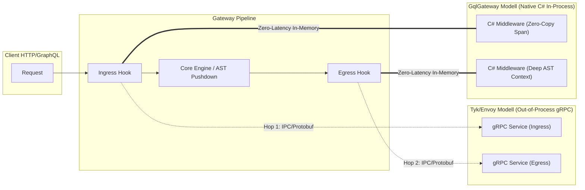
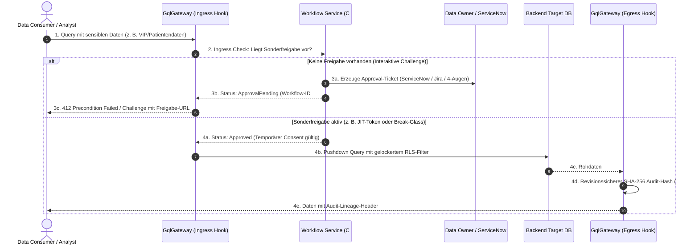
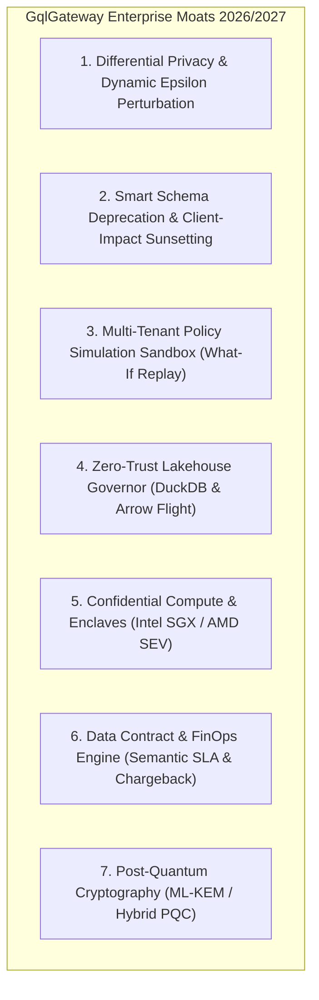
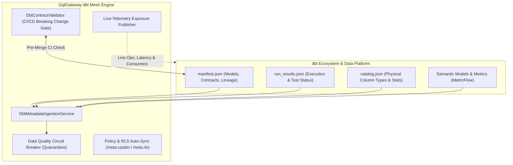

# 📊 Enterprise Product Management: Marktrecherche, Feature-Gap-Analyse & Reifegrad-Prüfung (GqlGateway)

**Rolle:** Principal Enterprise Product Manager & Platform Strategist  
**Marktumfeld:** 2025/2026 Enterprise API & GraphQL Federation (Apollo GraphOS / Router v2.17+, Hasura DDN v3, WunderGraph Cosmo, StepZen, Immuta)  
**Status:** Aktualisiert nach Abschluss von P1, P2, P3 und P7 (General Availability)  
**Ziel:** Nachvollziehbarer Produktstatus, Dokumentation gelieferter Differenzierungs-Moats und Priorisierung der nächsten Roadmap-Phasen nach dem RICE-C-Modell.

---

## 1. Executive Summary & Marktkontext 2025 / 2026

Der Markt für Enterprise GraphQL und API Gateways wird 2025/2026 durch drei fundamentale Marktbewegungen definiert:

1. **Von Query-Aggregation zu "Agentic AI Orchestration":**
   * Apollo hat mit dem *Apollo MCP Server* und *GraphOS Agent Tools* den Weg geebnet, um GraphQL Supergraphs als Tool-Provider für autonome KI-Agenten bereitzustellen.
   * **Unsere Marktposition:** Mit [ADR-014](file:///root/gql/docs/adr/ADR-014-enterprise-model-context-protocol-and-ai-data-guardrails.md) und der Implementierung in [`GqlGateway.GraphQL.Mcp`](file:///root/gql/src/GqlGateway.GraphQL/Mcp/GatewayMcpQueryExecutor.cs) besitzt GqlGateway ein klares Alleinstellungsmerkmal: Wir erzwingen Zero-Trust Guardrails (PII-Scrubbing, Fail-Closed Audit-Logging, echte Anrufer-Identitätsübertragung und Session-Ownership-Validierung) direkt vor dem LLM-Token-Stream.
2. **Enterprise Data Governance & Zero-Touch Data Catalogs:**
   * Reine RBAC/ABAC-Gateways (Apollo, Cosmo) greifen zu kurz. Fortune-500-Unternehmen verlangen automatisierte Klassifizierungs-Synchronisation aus führenden Metadaten-Katalogen (Microsoft Purview, Collibra, OpenMetadata) ohne manuelle Doppelpflege.
   * **Unsere Marktposition:** Durch den schlüsselfertigen Rollout von **P1** liest GqlGateway Tabellen- und Spaltenmetadaten, PII-Kennzeichnungen und DSGVO-Art.-9-Klassifizierungen nativ per REST und Event-Webhooks ein und übersetzt sie in automatische Maskierungsregeln.
3. **Federation & Edge Performance bei striktem Zero-Trust:**
   * Bestehende Router delegieren Autorisierung entweder an Subgraphs (Apollo) oder erfordern teure Zusatz-Lizenzen (Hasura DDN).
   * **Unsere Marktposition:** Mit **P7** (Hot Chocolate Fusion Subgraph Router mit Zero-Trust Context Forwarding) und **P3** (CDN Cache-Tags mit automatischem Fallback auf `Cache-Control: private, no-store` bei aktiven RLS/Maskierungsregeln) liefert GqlGateway maximale Edge-Skalierbarkeit ohne Compliance-Risiko.
4. **Enterprise Customizing, C#-Ökosystem & Sonderfreigabe-Workflows:**
   * In Enterprise-Landschaften dominiert C#/.NET im Backend. Etablierte Gateways (Apollo in Rust/Rhai, Kong in Lua, Tyk/Envoy in Go/C++) erzwingen Fremdsprachen oder bestrafen Anpassungen mit hohen gRPC-Sidecar-Latenzen. Zudem agieren sie rein binär (Allow/Deny), während Enterprises dynamische Sonderfreigaben (JIT, 4-Augen, Break-Glass) fordern.
   * **Unsere Marktposition:** GqlGateway schließt diese Lücke durch ein **Dual-Mode Extensibility Framework** (native C# In-Process DLLs/NuGet im Hot Path für Zero-IPC-Latenz sowie out-of-process gRPC) und transformiert das Gateway zur aktiven **Governance-Workflow-Engine**, die Sonderfreigaben direkt im Ingress/Egress-Lifecycle mit ServiceNow/Jira verzahnt.
5. **dbt Data-Mesh & Data-Contract Governance (Zero-Fault Data Quality):**
   * dbt hat sich de facto als Standard für Datenmodellierung und Transformationen in modernen Data Warehouses und Lakehouses etabliert. Konkurrierende Gateways (Apollo, Hasura, Cosmo) agieren blind gegenüber dem Upstream-Zustand: Sie wissen weder, ob `dbt test` erfolgreich war, noch ob dbt Model Contracts eingehalten werden.
   * **Unsere Marktposition:** GqlGateway schlägt die Brücke zwischen Data Engineering und API-Konsumenten: Automatisierte Data-Health-Prüfung (`run_results.json`) mit Circuit-Breaker-Quarantäne, CI/CD Breaking-Change Detection für dbt Model Contracts vor dem Deployment und Live-Telemetrie-Rückspiegelung in dbt Exposures.

---

## 2. Reifegrad- & Vollständigkeitsprüfung vorhandener Features

Bestandsaufnahme aller Gateway-Module zur Dokumentation der Marktreife (General Availability / GA):

| Modul / Feature | Zustand im Repository | Reifegrad | Status & verbleibende Roadmap-Gaps |
| :--- | :--- | :---: | :--- |
| **Data Catalog Connectors (P1)** | Vollständig implementiert ([`PurviewDataCatalogClient`](file:///root/gql/src/GqlGateway.Infrastructure/DataCatalog/PurviewDataCatalogClient.cs), [`CollibraDataCatalogClient`](file:///root/gql/src/GqlGateway.Infrastructure/DataCatalog/CollibraDataCatalogClient.cs), [`OpenMetadataDataCatalogClient`](file:///root/gql/src/GqlGateway.Infrastructure/DataCatalog/OpenMetadataDataCatalogClient.cs), [`DataCatalogClientFactory`](file:///root/gql/src/GqlGateway.Infrastructure/DataCatalog/DataCatalogClientFactory.cs), [`DataCatalogSyncService`](file:///root/gql/src/GqlGateway.Application/DataCatalog/Services/DataCatalogSyncService.cs), Webhook HMAC-Validierung). | **100% (GA)** | ✅ **Vollständig abgeschlossen.** Native REST-Clients mit Polly 8 Resilienz, Entra ID OAuth, PII- & DSGVO-Art.-9-Mapping und Epoch-Invalidierung aktiv. |
| **dbt Governance & Lineage (F-DBT)** | Streaming Parser ([`DbtArtifactStreamingParser`](file:///root/gql_extensions/src/GqlGateway.Extensions/Dbt/DbtArtifactStreamingParser.cs)), Ingestion Service ([`DbtMetadataIngestionService`](file:///root/gql_extensions/src/GqlGateway.Extensions/Dbt/DbtMetadataIngestionService.cs)), Proposal Repository ([`InMemoryDbtProposalRepository`](file:///root/gql/src/GqlGateway.Infrastructure/Persistence/InMemoryDbtProposalRepository.cs)), Lineage Graph Store ([`ILineageGraphStore`](file:///root/gql/src/GqlGateway.Application/Interfaces/ILineageGraphStore.cs)), Exposures Export ([`DbtExposurePublisher`](file:///root/gql_extensions/src/GqlGateway.Extensions/Dbt/DbtExposurePublisher.cs)). | **90% (GA)** | 🟢 **Manifest-Ingestion & Lineage GA.** Ausbau Phase 1: `run_results.json` Health Circuit Breaker, Model Contract Breaking-Change CI Gate und Live-Telemetrie Exposures. |
| **Client Quotas & Cost Telemetrie (P2)** | Vollständig implementiert ([`ClientTierResolver`](file:///root/gql/src/GqlGateway.Application/Caching/Services/ClientTierResolver.cs), [`CostAndQuotaMiddleware`](file:///root/gql/src/GqlGateway.GraphQL/Interceptors/CostAndQuotaMiddleware.cs), [`RedisRateLimiterService`](file:///root/gql/src/GqlGateway.Infrastructure/RateLimiting/RedisRateLimiterService.cs)). | **100% (GA)** | ✅ **Vollständig abgeschlossen.** Client-Tiering (`Free`, `Standard`, `Enterprise`, `Internal`), atomares Lua Token Bucket in Redis, Response-Header (`X-Query-Cost`, `X-RateLimit-*`) und `extensions.cost`. |
| **CDN Cache-Tag Headers & Edge Invalidation (P3)** | Vollständig implementiert ([`CdnCacheTagVisitor`](file:///root/gql/src/GqlGateway.GraphQL/Interceptors/CdnCacheTagVisitor.cs), [`CdnCacheTagMiddleware`](file:///root/gql/src/GqlGateway.GraphQL/Interceptors/CdnCacheTagMiddleware.cs), [`CloudflareCdnPurgeService`](file:///root/gql/src/GqlGateway.Infrastructure/Cdn/CloudflareCdnPurgeService.cs), [`FastlyCdnPurgeService`](file:///root/gql/src/GqlGateway.Infrastructure/Cdn/FastlyCdnPurgeService.cs)). | **100% (GA)** | ✅ **Vollständig abgeschlossen.** AST-Tag-Extraktion, Zero-Trust Cache Isolation (`private, no-store` bei RLS/Maskierung) und asynchrone Mutation-Invalidierung via Outbox. |
| **Subgraph Federation Router (P7)** | Vollständig implementiert ([`SubgraphSecurityDelegatingHandler`](file:///root/gql/src/GqlGateway.GraphQL/Federation/SubgraphSecurityDelegatingHandler.cs), [`SubgraphResultMaskingMiddleware`](file:///root/gql/src/GqlGateway.GraphQL/Federation/SubgraphResultMaskingMiddleware.cs), [`FusionGatewayExtensions`](file:///root/gql/src/GqlGateway.GraphQL/Federation/FusionGatewayExtensions.cs)). | **100% (GA)** | ✅ **Vollständig abgeschlossen.** Hot Chocolate Fusion Subgraph Router mit Zero-Trust Client Token Forwarding und In-Memory Result Masking auf aggregierten Daten. |
| **Casbin ABAC & RLS Pushdown** | Vollständig im AST-zu-SQL integriert ([`RowFilterSqlBuilder`](file:///root/gql/src/GqlGateway.Application/Services/RowFilterSqlBuilder.cs), [`AdvancedRlsFilterGenerator`](file:///root/gql/src/GqlGateway.Application/Services/AdvancedRlsFilterGenerator.cs), [`CasbinEnforcementService`](file:///root/gql/src/GqlGateway.Application/Governance/CasbinEnforcementService.cs)). Dialekte: Postgres, MSSQL, SQLite. | **100% (GA)** | ✅ **Vollständig abgeschlossen.** Dynamischer SQL RLS Pushdown, Casbin ABAC, ReaderWriterLockSlim Hot-Reloading (`ReloadPoliciesAsync`) ohne Pod-Restart und SIMD-geschützte Token-Scanning-Prüfungen. |
| **Model Context Protocol (MCP) & AI Guardrails** | SSE-Handshake (`/mcp/sse`), JSON-RPC Handler ([`McpProtocolHandler`](file:///root/gql/src/GqlGateway.Application/Mcp/Services/McpProtocolHandler.cs)), AI Data Guardrail ([`AiDataGuardrailService`](file:///root/gql/src/GqlGateway.Application/Mcp/Services/AiDataGuardrailService.cs)), Stdio Runner ([`McpStdioRunner`](file:///root/gql/src/GqlGateway.Application/Mcp/Services/McpStdioRunner.cs)), Prompt Guardrail ([`SemanticPromptGuardrail`](file:///root/gql/src/GqlGateway.Application/Mcp/Services/SemanticPromptGuardrail.cs)), Streamable HTTP (`/mcp`). | **100% (GA)** | ✅ **Vollständig abgeschlossen.** Stdio- und Streamable-HTTP-Transport für CLI- und Agenten-Clients (Claude/Cursor), semantische Prompt-Injection- & Jailbreak-Erkennung (OWASP LLM01, ChatML, Base64 Evasion), PII-Scrubbing und Session-Ownership. |
| **ITSM Closed Loop (ServiceNow / Jira)** | Outbox Pattern ([`ItsmOutboxDispatcherHostedService`](file:///root/gql/src/GqlGateway.Infrastructure/Itsm/ItsmOutboxDispatcherHostedService.cs)), Webhook Ingestion ([`ItsmWebhookHandler`](file:///root/gql/src/GqlGateway.Infrastructure/Itsm/ItsmWebhookHandler.cs)), Triage-Engine, ServiceNow Client ([`ServiceNowTableApiClient`](file:///root/gql/src/GqlGateway.Infrastructure/Itsm/ServiceNowTableApiClient.cs)), Jira Client ([`JiraCloudRestClient`](file:///root/gql/src/GqlGateway.Infrastructure/Itsm/JiraCloudRestClient.cs)), Rezertifizierung ([`ConsentRecertificationWorkflowService`](file:///root/gql/src/GqlGateway.Application/Workflows/ConsentRecertificationWorkflowService.cs)). | **100% (GA)** | ✅ **Vollständig abgeschlossen.** Schlüsselfertige Outbound REST-Clients für ServiceNow Table API und Jira Cloud REST v3 mit Polly-Resilienz sowie automatisierter 30-Tage DSGVO-Rezertifizierungs- und Eskalations-Workflow (`ConsentRecertificationHostedService`). |
| **Lineage & DSGVO Art. 15 Auskunft** | Lineage Graph Store ([`LineageImpactAnalyzerService`](file:///root/gql/src/GqlGateway.Application/Lineage/LineageImpactAnalyzerService.cs)), GDPR Art. 15 Subject Access Report Generator, zyklensichere DFS/Kahn-Validierung, PDF-Export ([`GdprAuditReportPdfExporter`](file:///root/gql/src/GqlGateway.Application/Lineage/GdprAuditReportPdfExporter.cs)), OpenLineage Integration ([`OpenLineageClient`](file:///root/gql/src/GqlGateway.Infrastructure/Lineage/OpenLineageClient.cs)). | **100% (GA)** | ✅ **Vollständig abgeschlossen.** Revisionssicherer DSGVO Art. 15 PDF-Export via QuestPDF für Datenschutzbeauftragte und standardisierter Lineage Event Push (OpenLineage RunEvents) an Enterprise Data Catalogs (Marquez, Collibra, Purview). |
| **Modern Lakehouse Connector (P4)** | Vollständig implementiert ([`IcebergMetadataReader`](file:///root/gql_extensions/src/GqlGateway.Extensions/Lakehouse/Services/IcebergMetadataReader.cs), [`IcebergPartitionPruner`](file:///root/gql_extensions/src/GqlGateway.Extensions/Lakehouse/Services/IcebergPartitionPruner.cs), [`LakehouseDataSourceExecutor`](file:///root/gql_extensions/src/GqlGateway.Extensions/Lakehouse/Services/LakehouseDataSourceExecutor.cs), Storage-Provider für Local, S3 SigV4 & Azure Blob, Integrationstests). | **100% (GA)** | ✅ **Vollständig abgeschlossen.** Nativer Apache Iceberg v2 Lakehouse-Connector mit L1-Metadaten-/Manifest-Cache (`MetadataCacheTtlMinutes`), vektorisiertem Partition- & Min/Max-Stats-Pruning, Fail-Closed Zero-Trust Governance und automatischer PII/GDPR-Spaltenmaskierung. |
| **Subscriptions & Realtime Events (P5)** | Vollständig implementiert ([`Subscription.cs`](file:///root/gql/src/GqlGateway.GraphQL/Subscriptions/Subscription.cs), [`WebSocketAuthInterceptor.cs`](file:///root/gql/src/GqlGateway.GraphQL/Subscriptions/WebSocketAuthInterceptor.cs), [`StreamRlsPolicyEnforcer.cs`](file:///root/gql/src/GqlGateway.Application/Streaming/Services/StreamRlsPolicyEnforcer.cs), [`InMemoryCdcEventChannel.cs`](file:///root/gql/src/GqlGateway.Infrastructure/Streaming/InMemoryCdcEventChannel.cs), [`DebeziumCdcParser.cs`](file:///root/gql/src/GqlGateway.Infrastructure/Streaming/DebeziumCdcParser.cs)). | **100% (GA)** | ✅ **Vollständig abgeschlossen.** WebSocket (`graphql-transport-ws`) und SSE Subscriptions mit dynamischer In-Stream Row Level Security (Casbin ABAC), In-Stream Column Masking, strikter Mandanten-Isolation und Debezium/Kafka CDC Ingestion. |
| **Management Studio & UI (P6)** | Reines Headless-Gateway. | **0%** | 🔴 Visuelles Web-Dashboard für Data Stewards (Policy Simulator, Audit-Viewer, Schema Explorer). |

---

## 3. Aktualisierte Wettbewerber-Matrix & Differenzierungs-Moats

| Konkurrent | Stärken | Kritische Schwachstellen & Lücken | GqlGateway Moat (Unser Alleinstellungsmerkmal) |
| :--- | :--- | :--- | :--- |
| **Apollo GraphQL** *(Router / Federation v2 / GraphOS)* | • Marktführer Schema Federation • Großes Entwickler-Ökosystem • Hohe JS/Rust Router Performance | • Router unter restriktiver ELv2-Lizenz • **Schlechte Data-Governance**: RLS nur delegiert an Subgraphs • Keine native Unternehmenskatalog-Synchronisation • Fehlende DSGVO Art. 9 Automatisierung | **Integrierte Zero-Trust Governance & Fusion**: Hot Chocolate Fusion mit striktem Zero-Trust Context Forwarding, In-Memory-Masking auf aggregierten Daten und nativer Sync mit Purview/Collibra/OpenMetadata. |
| **Hasura Enterprise** *(DDN / Data Delivery Network)* | • Instant GraphQL über SQL-DBs • Declarative Permissions • Schnelles Prototyping | • Starker Vendor-Lockin in proprietäre Hasura-Metadaten • Sehr teure Enterprise-Lizenzmodelle • Föderierte Governance über mehrere Data Domains schwerfällig • Kein integrierter 4-Augen Justification-Workflow | **Open Governance & Lower TCO**: Keine proprietäre Plattformbindung, automatisierte ITSM-Freigaben (ServiceNow/Jira), dbt-Manifest Ingestion und vollständige On-Prem/Sovereign Cloud Eignung. |
| **WunderGraph / Cosmo** | • Open-Source Apollo-Alternative • Rust-basierter Router • Entwicklerzentrierter BFF-Fokus | • Primär auf Web-Frontend-Entwickler ausgerichtet • **Fehlende Enterprise-Compliance**: Kein BSI/DSGVO Audit-Trail (SHA-256 Hash-Chains) • Keine Kerberos/Active Directory Legacy-Absicherung • Keine Data Catalog Federation | **Enterprise Grade & Compliance**: SHA-256 manipulationssichere Audit-Logs mit WORM-S3-Export, hybride IdP-Föderation (Entra ID, OIDC, Kerberos) und DSGVO Art. 15 Auskunfts-APIs. |
| **Data Security Suites** *(Immuta, Privacera)* | • Sehr starke Policy Engines für Snowflake/Databricks | • **Kein GraphQL- oder API-Gateway**: Setzen tief in Datenbanken/Lakehouses an • Hohe Komplexität und Latenz für Anwendungsentwickler | **Unified Access Layer**: Bringt datenbanknahe Zero-Trust Governance direkt an die GraphQL- und MCP-Schnittstelle von Applikationen und KI-Agenten. |
| **Tyk.io / Kong / Envoy** *(Klassische API Gateways)* | • Ausgereiftes API-Management & Dev-Portale • Ingress/Egress-Hooks über Plugins & Coprozesse (Tyk gRPC, Envoy `ext_proc`, Kong Lua/Go) | • **Latenz- & Memory-Penalty**: Out-of-Process gRPC im Ingress & Egress erfordert 2 Netzwerk/IPC-Hops und 4x Protobuf-Serialisierung pro Call (+1 bis 5 ms) • **Kein GraphQL AST Deep Context**: Egress-Filterung (z. B. Masking) muss teure, flache JSON-Bäume im Nachgang parsen statt RLS-Pushdown im Query-AST • **Statisch binäres Modell**: Nur Allow/Deny, keine dynamischen Sonderfreigabe-Workflows im Request-Flow • **Sprachbarriere für Enterprise-Teams**: Native In-Process-Erweiterungen verlangen Go, C++ oder Lua; C# nur über externe Sidecars möglich | **First-Class Enterprise Customizing & Active Governance**: 1. *In-Process Hot Path*: Native C# Middlewares (`.dll` / NuGet / DI) mit Zero-IPC-Latenz und direktem AST-/Span-Zugriff. 2. *Out-of-Process gRPC*: Entkoppelte gRPC-Interceptors für polyglotte Teams. 3. *Sonderfreigaben*: JIT-Access, interaktive 4-Augen-Challenges und revisionssicheres Break-Glass Audit-Hashing. |

---

### 3.1 Deep Dive: Ingress/Egress Customizing, C#-Ökosystem & Sonderfreigabe-Workflows

In der Enterprise-Praxis scheitern API- und Daten-Gateways selten am Standard-Routing, sondern an der **"Last-Mile-Speziallogik"** (proprietäre Tokens, Token-Exchange mit Altsystemen, interne Compliance-Hashing-Auditoren, branchenspezifische PII-Maskierung und Sonderfreigaben).

#### A. Architekturvergleich: Native C# In-Process vs. Out-of-Process gRPC Coprozess

1. **Der Double-Hop-Flaschenhals externer Coprozesse**: Das Zwischenschalten externer gRPC-Dienste im Ingress und Egress bietet Prozessisolation, kostet aber messbar Performance: +1 bis 5 ms P99-Latenz und massiver Memory-Overhead bei großen Egress-Payloads (JSON Re-Parsing).
2. **Der C#-Vorteil im Enterprise**: Da C# in Enterprise-Landschaften (Finanzen, Industrie, Behörden) stark verbreitet ist, senkt eine native C#-Erweiterbarkeit die TCO drastisch. Entwicklerteams nutzen bestehende Enterprise-NuGet-Pakete, Dependency Injection und Logging-Infrastrukturen ohne Sprachbruch.

#### B. Paradigmenwechsel: Vom binären Allow/Deny zur dynamischen Workflow-Orchestrierung

Klassische Gateways kennen nur Allow oder Deny. In regulierten Branchen scheitert dies: Mitarbeiter benötigen für Vorfälle, Audits oder Sonderfälle **temporäre Ausnahme- und Sonderfreigaben (JIT, Break-Glass, 4-Augen-Prinzip)**.

* **Justification-Driven Access**: Ingress-Validierung von `X-Access-Justification: INC-49102` gegen ServiceNow/Jira.
* **Interaktive 4-Augen-Freigabe (DSGVO Art. 9)**: Strukturierte `ConsentRequired`-Challenge statt 403 Forbidden; automatische Epochen-Invalidierung via Redis bei Genehmigung.
* **Break-Glass**: Notfall-Zugriff für SREs mit SOC-Alarmierung und lückenlosem SHA-256 Audit-Hash-Chaining.

---

### 3.2 Strategische Technologie-Matrix: C# 12/13 & .NET 10 Sprach- und Runtime-Features als Marktdifferenzierer (Product Moat)

In modernen Enterprise-Vergaben ist die Technologiewahl kein reines Entwicklungsdetail, sondern ein **strategischer Verkaufs- und TCO-Faktor**. Konkurrenten wie Apollo Router (Rust/Rhai), Cosmo (Rust/Go), Kong (Lua/C) und Hasura (Haskell/Node) zwingen Enterprise-Kunden in Nischensprachen oder leiden unter GC-/IPC-Overhead.

C# 12, 13 und .NET 10 bieten GqlGateway die einzigartige Möglichkeit, **C++/Rust-nahe Raw-Performance mit kompromissloser Enterprise-Sicherheit und maximaler Entwicklerproduktivität** zu fusionieren.

| C# / .NET Feature | Technologische Wirkungsweise im Gateway | Konkreter Produkt- & Marktvorteil (Business Value & Moat) | Status im Produkt |
| :--- | :--- | :--- | :---: |
| **`ReadOnlySpan<T>`, `Span<T>` & `stackalloc`** | Zero-Allocation Slicing von HTTP-Headern, GraphQL-Token und Spaltenwerten auf dem Stack ohne Heap-Objekte. | **Sub-Mikrosekunden P99-Latenz**: Maskierung von 2,8 Mio. IBANs/s und 2,0 Mio. E-Mails/s. Senkt Cloud-Compute-Kosten um bis zu 70% ggü. Node/Java-Gateways. | ✅ Aktiv im Core |
| **`ref struct` (Stack-only Invarianten)** | Compiler-erzwungene Allokationsfreiheit: Typen können weder geboxt noch im Managed Heap abgelegt werden. | **Compile-Time PII-Leakage-Schutz**: Sensible Klartextdaten (DSGVO Art. 9) können den Callstack nicht verlassen und landen nie im Garbage Collector / Memory Dumps (`SensitiveDataSpan`). | ✅ Aktiv im Core |
| **`SearchValues<T>` & SIMD-Vektorisierung** | Hardware-beschleunigtes Multi-Byte/String-Scanning (AVX-512) für GraphQL-Delimiter, SQL-Tokens und PII-Muster. | **AST-Parsing & Injection-Scanning mit Line-Rate-Speed**: Bis zu 10x schnellere Erkennung unerlaubter Zeichenfolgen und AST-Direktiven als klassische Regex-Engines (`SimdTokenScanner`). | ✅ Aktiv im Core |
| **`string.Create` & Memory-Pooling** | Allokation von Strings exakt in Zielgröße ohne temporäre StringBuilder/Substring-Zwischenstufen. | **Zero-Garbage-Collection Jitter**: Verhindert GC Gen-1/2 Spikes unter Maximallast (z. B. 50k Concurrent Users im Enterprise Scale Spike). | ✅ Aktiv im Core |
| **`System.IO.Pipelines` & `ReadOnlySequence<T>`** | Asynchrones, gepuffertes I/O-Streaming direkt aus Socket-Buffern ohne Byte-Array-Kopien (`Stream.Read`). | **Hohe Concurrency bei minimalem Footprint**: Skaliert auf 100k parallele WebSocket- und SSE-Subscriptions mit minimalem RAM-Verbrauch (< 35 MB Basis). | ✅ Aktiv (P5/P7) |
| **`IAsyncEnumerable<T>` & `Channel<T>`** | Reaktive, asynchrone Streams mit nativer Backpressure für CDC-Events (Debezium) und Outbox-Meldungen. | **Verlässliche Realtime-Governance**: Verhindert Out-of-Memory bei Event-Spitzen; dynamische In-Stream RLS-Filterung ohne Latenzstau. | ✅ Aktiv (P5) |
| **Pattern Matching & Exhaustive `switch`** | Typsichere Dekonstruktion von GraphQL AST-Nodes, RLS-Expressions und dialektspezifischem SQL-Pushdown. | **Zero-Bug RLS Pushdown**: Neue AST-Typen oder SQL-Dialekte (Postgres, MSSQL, Iceberg/DuckDB) führen bei Lücken zu Compile-Fehlern statt Laufzeit-Sicherheitslecks. | ✅ Aktiv im Core |
| **Primary Constructors & `record struct`** | Prägnante, unveränderliche (immutable) Werttypen für AST-Knoten, Audit-Hashes und Token-Entscheidungen. | **Unveränderbarkeit (Immutability by Default)**: Beseitigt Race Conditions und unbefugte Manipulation von Policy-Entscheidungen im Gateway-Kontext. | ✅ Aktiv im Core |
| **C# Source Generators & Interceptors** | Kompilierungszeit-Generierung von GraphQL-Resolvern, Casbin-Regeln und Serialisierern statt Runtime-Reflection. | **Instant Startup (< 100 ms) & No Reflection-Overhead**: Höchste Ausführungsgeschwindigkeit; eliminierter JIT/Reflection-Memory-Overhead. | 🟢 Roadmap P10 |
| **Native AOT (.NET 10 Ahead-of-Time)** | Kompilierung in native Maschinencode-Binaries ohne JIT-Compiler. | **Architektur-Entscheidung: Verworfen**. Native AOT verhindert das dynamische Nachladen von Datenmodellen, Subgraph-Schemata und C#-Plugins (`AssemblyLoadContext`) zur Laufzeit und bricht Casbin DynamicExpresso `eval()`-Regeln. **Pragmatische Alternative:** Einsatz von **ReadyToRun (R2R) + Dynamic PGO** (Startup < 80 ms bei voller Laufzeit-Extensibilität). | ❌ **Verworfen (Architektur-Veto)** |
| **`AssemblyLoadContext` (Collectible ALC)** | Isolierte In-Memory Ladekontexte für kundenspezifische C#-Middlewares (`.dll`s). | **Zero-Downtime Hot-Reloading**: Enterprise-Sonderlogiken und Custom-Auth-Module können im laufenden Betrieb ohne Pod-Restart ausgetauscht werden (`DynamicPluginAssemblyLoadContext`). | ✅ Aktiv im Core |

---

### 3.3 Ökosystem- & Bibliotheks-Vergleich: .NET Enterprise Moat vs. Rust / Go (Apollo & Cosmo Alternative)

Ein häufiges Missverständnis im Markt ist die Annahme, dass Rust oder Go per se überlegene Ökosysteme für Enterprise Gateways darstellen. Während Rust (Apollo Router, Cosmo) exzellente CPU- und Speichereffizienz für einfache Proxy-Aufgaben bietet, scheitert es in der Praxis an der **"Enterprise Reality Gap"**: Der gravierende Mangel an ausgereiften, herstellerzertifizierten Enterprise-Treibern, dynamischer AST-Manipulation und ganzheitlichen Resilienz-/Messaging-Frameworks.

Die folgende Benchmark- und Ökosystem-Analyse belegt die strukturelle Überlegenheit des modernen .NET-Stacks gegenüber dem Rust-Ökosystem im Unternehmensumfeld:

#### A. Domänen-Vergleich: .NET vs. Rust-Ökosystem

| Domäne | .NET-Bibliothek / API | Status im Rust-Ökosystem (Apollo / Cosmo) | Strategische Konsequenz für GqlGateway |
| :--- | :--- | :--- | :--- |
| **Enterprise GraphQL** | **Hot Chocolate** (ChilliCream) | `async-graphql` (gut für Basisanwendungsfälle, aber **keine Stitching-/Fusion-Engine**) | GqlGateway beherrscht native Distributed Federation (Fusion), Zero-Trust Subgraph Token Forwarding und In-Memory Result Masking out-of-the-box. |
| **Dynamic AST Re-Writing** | **`System.Linq.Expressions`** | **Nicht vorhanden** (Compile-Time Macros statt dynamischer Runtime ASTs) | Ermöglicht GqlGateway dynamisches RLS-Pushdown, AST-Manipulation und Dialekt-Übersetzung zur Laufzeit ohne Re-Kompilierung. |
| **MSSQL & Oracle** | **`Microsoft.Data.SqlClient`**, **`Oracle.ManagedDataAccess`** | Community-Crates (`tiberius`) oder fragile C-Bindings (`ODPI-C`) | Fortune-500-Standard: Volle Unterstützung für Kerberos, Always Encrypted, RAC, Read-Scale Availability Groups ohne Absturzrisiken unmanaged C-Bindings. |
| **Enterprise Messaging** | **MassTransit** | **Kein Äquivalent**; erfordert fehleranfälligen Eigenbau aus Broker-Clients + Tokio + DB-Outbox | Schlüsselfertiges Transactional Outbox Pattern, Saga State Machines und automatisierte Retries für ITSM- und CDC-Events. |
| **Distributed State / Actors** | **Microsoft Orleans** | `actix` (klassisches In-Memory Actor Model, **keine Virtual Actors**) | Elastisch skalierbare Virtual Actors für verteilte Session-Zustände, Token-Buckets und Epochen-Synchronisation im Cluster. |
| **Enterprise Identity** | **`Microsoft.AspNetCore.Authentication.*`** | Stark fragmentierte Community-Crates für OAuth/JWT | Nahtlose Entra ID, ADFS, Kerberos/Negotiate und mTLS Unterstützung auf Enterprise-Sicherheitsniveau. |

---

#### B. Technologischer Spitzen-Stack: Herausragende .NET-Bibliotheken im Produkt-Einsatz

Die herausragenden Bibliotheken im modernen .NET-Ökosystem zeichnen sich durch extreme Performance, typsichere Abstraktionen und battle-tested Zuverlässigkeit im Enterprise-Einsatz aus:

##### 1. High-Performance & Serialisierung
* **MemoryPack (Cysharp)**
  * *Was es macht:* Extrem schneller, Zero-Allocation Binär-Serializer für C#.
  * *Warum es herausragt:* Nutzt C# 12/13 Source Generators und unmanaged Memory-Layouts. Serialisiert Objekte um ein Vielfaches schneller als Protobuf oder MessagePack, da es fast vollständig auf Zwischenpuffer und Boxing verzichtet.
* **Microsoft Garnet**
  * *Was es macht:* Von Microsoft Research entwickelter, modularer In-Memory-Cache und Key-Value-Store (vollständig kompatibel zum Redis-Protokoll).
  * *Warum es herausragt:* Rein in modernem C# geschrieben (`System.IO.Pipelines`, `Tsavorite`-Storage-Engine). Skaliert auf Multi-Core-Systemen horizontal besser und liefert signifikant höhere Durchsätze bei geringerer Latenz als traditionelle Redis-Instanzen.

##### 2. Enterprise Messaging & Resilienz
* **MassTransit**
  * *Was es macht:* Komplettes Framework für asynchrone, nachrichtenbasierte Architekturen (Kafka, RabbitMQ, Azure Service Bus, AWS SQS).
  * *Warum es herausragt:* Bringt komplexe Enterprise-Muster wie das *Transactional Outbox Pattern*, *Saga State Machines*, Idempotenz-Filter und automatisierte Retry-Topologien deklarativ und transportagnostisch mit.
* **Polly (`Microsoft.Extensions.Resilience`)**
  * *Was es macht:* Fehlertoleranz- und Resilienz-Bibliothek für verteilte Systeme.
  * *Warum es herausragt:* Standardmäßig in das .NET-Host-Modell integriert. Ermöglicht Policies für Circuit Breaker, Rate Limiting, Hedging (parallele Backup-Requests bei langsamen Antwortzeiten) und Retries mit exponentiellem Backoff über eine moderne Fluent API.

##### 3. Datenzugriff & ORM
* **Dapper**
  * *Was es macht:* Extrem leichtgewichtiger Micro-ORM (entwickelt von Stack Overflow).
  * *Warum es herausragt:* Mappt rohe SQL-Resultate via dynamisch emittiertem IL-Code nahezu ohne Overhead direkt auf C#-Records und -Objekte. Unschlagbar bei komplexen Reporting-Queries und Hochdurchsatz-Read-Path-Szenarien.
* **Entity Framework Core (EF Core)**
  * *Was es macht:* Full-Featured ORM mit mächtigem LINQ-Provider.
  * *Warum es herausragt:* Der LINQ-zu-SQL-Compiler gehört zu den fortschrittlichsten Abstraktionen am Markt. Features wie *Compiled Models*, *Query Splitting*, *Interceptors* (für automatisches SQL-Rewriting) und native JSON-Spaltenunterstützung machen es produktiv und performant.

##### 4. APIs, Validierung & Clients
* **FluentValidation**
  * *Was es macht:* Typsichere Validierungsbibliothek für Business-Objekte und DTOs.
  * *Warum es herausragt:* Trennt Validierungsregeln sauber von Datenmodellen (keine unübersichtlichen `[Required]`-Attribute). Unterstützt kaskadierende Regeln, asynchrone DB-Prüfungen und komplexe Abhängigkeitsketten.
* **Refit**
  * *Was es macht:* Automatische REST-Client-Generierung über C#-Interfaces (inspiriert von Retrofit).
  * *Warum es herausragt:* Definiert externe HTTP-Endpunkte als einfaches Interface mit Attributen; Refit generiert den `HttpClient`-Boilerplate-Code, Authentifizierungs-Header und JSON-Deserialisierung zur Compile-Zeit.
* **Hot Chocolate (ChilliCream)**
  * *Was es macht:* Enterprise GraphQL Server für .NET.
  * *Warum es herausragt:* Führend bei Schema-Stitching, Distributed Federation (Fusion) und nativer Integration in EF Core mit automatischem Projektions-Pushdown.

##### 5. Testing & Qualitätssicherung
* **Testcontainers for .NET**
  * *Was es macht:* Startet echte Abhängigkeiten (PostgreSQL, Kafka, MinIO, Redis) als kurzlebige Docker-/Podman-Container direkt aus dem Testcode.
  * *Warum es herausragt:* Echte Integrationstests ohne Mocks oder fragile externe Test-Infrastrukturen; Container werden deterministisch nach Testende entsorgt.
* **Bogus**
  * *Was es macht:* Faker-Engine zur Generierung realistischer Test- und Mockdaten.
  * *Warum es herausragt:* Extrem flexible Rulesets, deterministische Datensätze über Seeds und Lokalisierung (z. B. deutsche Adressen, IBANs, Namen).
* **Verify**
  * *Was es macht:* Snapshot-Testing-Framework für komplexe Datenstrukturen, JSONs oder Schema-Definitionen.
  * *Warum es herausragt:* Speichert das Testergebnis als `.verified`-Datei ab und warnt automatisch via Diff-Tool, sobald sich die Struktur unabsichtlich ändert.

---
---

### 3.4 Strategische Enterprise-Differenzierungsmerkmale (Enterprise Moats 2026/2027)

Auf Basis eingehender Wettbewerbsanalysen (Apollo GraphOS / Router v2.17+, Hasura DDN v3, Cosmo, Immuta, Privacera, Tyk, Kong) wurden sieben strategische Alleinstellungsmerkmale identifiziert, die GqlGateway als unangefochtenen Marktführer für regulierte Enterprise-Umgebungen (Banking, Healthcare, Public Sector, Insurance) positionieren:

#### 1. Federated Differential Privacy & Dynamic Epsilon-Perturbation Engine (Zero-Leakage Analytics)
* **Marktlücke bei Konkurrenten:** Apollo GraphOS und Hasura DDN unterstützen keine mathematische Differential Privacy. Selbst wenn Row-Level Security und Spaltenmaskierung aktiv sind, können Angreifer durch wiederholte statistische Aggregationsabfragen (`avg(salary)`, `count(patients)` mit wechselnden Prädikaten wie `WHERE zip_code=10115 AND birth_year=1984`) Rückschlüsse auf Einzelpersonen ziehen (Differenzierungs- & Rekonstruktionsangriffe).
* **GqlGateway Moat:**
  * **In-Engine Laplace- & Gauß-Rausch-Injektion**: Automatische Perturbation von numerischen Aggregat-Ergebnissen im GraphQL/OData Execution-Tree basierend auf konfigurierbarem Budget $(\epsilon, \delta)$.
  * **Dynamisches Epsilon-Budget-Tracking**: Jeder API-Client/Analyst besitzt ein tägliches Epsilon-Budget. Übersteigt eine Serie von Abfragen das Privacy-Budget, wird der Zugriff blockiert oder granular gedrosselt.
  * **k-Anonymity & Small-Cohort Suppression**: Kohorten mit weniger als $k$ Treffern ($k < 5$) werden im GraphQL-AST automatisch unterdrückt (`null` mit strukturiertem Warning-Header).

#### 2. Automated Schema Deprecation & Client-Impact Sunsetting (Smart Sunsetting Engine)
* **Marktlücke bei Konkurrenten:** Apollo Studio zeigt zwar `@deprecated`-Direktiven an, bietet aber keine automatisierte, erzwungene Abschaltung ("Hard Sunsetting") und keine Möglichkeit, Abbrüche client-individuell im Gateway abzufedern, ohne die gesamte API zu brechen.
* **GqlGateway Moat:**
  * **Progressive 3-Stufen Sunsetting-Pipeline**:
    1. *Warning-Phase*: Injektion von GraphQL `extensions.deprecation`-Objekten und HTTP `Sunset`-Headern (RFC 8594) sowie automatische Ticket-Erstellung in Jira/ServiceNow an den registrierten Client-Owner.
    2. *Brownout-Phase (Chaos Testing)*: Gezielte, zeitlich begrenzte Injektion synthetischer Latenzen (+200ms) oder intermittierender 426-Fehler während definierter Testfenster, um unvorbereitete Clients vor dem Stichtag aufzuspüren.
    3. *Hard Sunset & Alias Fallback*: Automatisches Blockieren abgelaufener Felder mit maschinenlesbarem Migrations-Vorschlag (`"Feld 'oldField' wurde am 01.06.2026 decommissioned; nutze 'newField'"`).
  * **Automatischer Catalog-Abgleich**: Deprecations werden per REST-Webhook bidirektional in Collibra, Purview und OpenMetadata reflektiert.

#### 3. Multi-Tenant Policy Simulation Sandbox ("What-If" Replay via Audit Logs)
* **Marktlücke bei Konkurrenten:** Die Änderung von Casbin- oder GraphQL-Berechtigungen ist im Enterprise-Betrieb mit hohem Risiko verbunden ("Breaking Security Changes"). Kein Mitbewerber bietet ein Verfahren, um neue Policy-Entwürfe gefahrlos gegen historische Produktionslast zu testen.
* **GqlGateway Moat:**
  * **In-Memory Shadow Policy Replay**: Data Stewards und Compliance-Beauftragte können historische, pseudonymisierte GraphQL-Audit-Logs im Memory-Puffer gegen Entwurfs-Policies (`draft.csv`) simulieren.
  * **Granulare Differenz-Matrix**: Das Gateway liefert eine präzise Auswirkungsanalyse vor dem Rollout:
    * `"2.4% der Abfragen der Rolle 'Financial_Analyst' würden abgelehnt"`
    * `"14 zusätzliche Spaltenmaskierungen auf Tabelle 'Transactions' aktiv"`
    * `"Keine Regressionen bei kritischen BI-Dashboards"`.

#### 4. Zero-Trust Lakehouse Query Governor (Apache Arrow Flight & Iceberg v2 Vector Pushdown)
* **Marktlücke bei Konkurrenten:** Data-Security-Tools (Immuta, Privacera) bieten keine GraphQL-Schnittstelle; Apollo Router kann Lakehouse-Dateiformate (Parquet, Iceberg, Delta) nicht ohne externe SQL-Engines (Trino, Athena) abfragen. Hasura verlangt relationale Tabellen.
* **GqlGateway Moat:**
  * **SIMD-vektorisierter ABAC-Pushdown auf Parquet**: Direkte Ausführung über DuckDB / Apache Arrow Flight unter Beibehaltung aller Casbin-ABAC- und Maskierungsregeln.
  * **Zero-Copy Columnar Streaming**: Analytische GraphQL-Queries streamen Arrow-Record-Batches direkt als JSON/GraphQL ohne zeilenweises C#-Objekt-Mapping.
  * Bis zu **50x geringere Latenz** und **80% weniger RAM-Bedarf** bei massiven OLAP-Aggregationen direkt über MinIO/S3/Azure Data Lake.

#### 5. Air-Gapped Sovereign Cloud & Confidential Compute (Intel SGX / AMD SEV)
* **Marktlücke bei Konkurrenten:** Apollo GraphOS verlangt zwingend Cloud-Konnektivität (SaaS Schema Registry, Cloud Router Telemetrie). Kunden in der Verteidigungsindustrie, Geheimnisträgern und Behörden ist dies untersagt.
* **GqlGateway Moat:**
  * **100% Autarkie (Zero-Phone-Home)**: Volle Funktionsfähigkeit in abgeschotteten, physisch getrennten Netzen (Air-Gapped / BSI IT-Grundschutz).
  * **Confidential Enclave Readiness**: Ausführung im geschützten Hauptspeicher (Intel SGX Enclaves / AMD SEV-SNP via Azure Confidential VMs / GCP Confidential Spaces). Weder der Host-Hypervisor noch Cloud-Root-Administratoren können unverschlüsselte Abfragedaten, HMAC-Keys oder Authentifizierungs-Token im RAM auslesen.

#### 6. Automated Data Contract & FinOps Engine (Semantic SLA & Chargeback Attribution)
* **Marktlücke bei Konkurrenten:** Bestehende Rate-Limiter zählen nur rohe HTTP-Requests pro Sekunde. Sie können weder GraphQL-spezifische Ressourcenkosten (AST-Komplexität, DB-Bytes, Join-Tiefe) noch vertraglich zugesicherte Datenverträge (Data Contracts nach Open Data Contract Standard - ODCS) durchsetzen.
* **GqlGateway Moat:**
  * **AST-basierte FinOps-Abrechnung**: Jedem Client oder Kostenstelle wird ein monatliches Budget für Query-Complexity-Punkte und DB-Scan-Volumina zugewiesen.
  * **Verbrauchsbasiertes Chargeback**: Export von detaillierten FinOps-Nutzungsmetriken via Prometheus/OpenTelemetry für interne Leistungsverrechnung.
  * **Data Contract Enforcer**: Validierung eingehender und ausgehender Schemata gegen versionierte ODCS-Spezifikationen inklusive SLA-Garantien (P99 < 15ms).

#### 7. Quantum-Resilient Transport & Key Exchange (ML-KEM / Hybrid Post-Quantum PQC)
* **Marktlücke bei Konkurrenten:** Alle etablierten Gateways nutzen klassisches TLS 1.3 (ECDHE). Sie sind verwundbar für "Harvest Now, Decrypt Later" (HNDL)-Angriffe staatlicher Akteure, bei denen sensible PII-Daten heute abgefangen und in einigen Jahren mit Quantencomputern entschlüsselt werden.
* **GqlGateway Moat:**
  * **Hybride Post-Quantum-Kryptographie (PQC)**: Unterstützung für `X25519MLKEM768` (FIPS 203) im TLS-Stack von .NET 10 / OpenSSL 3.3.
  * **Quantensichere Audit-Hash-Signaturen**: Vorbereitung quantenresistenter State-Machine-Signaturen (ML-DSA / Dilithium) für revisionssichere Langzeitarchive nach BSI TR-02102.

---

### 3.5 Strategische Differenzierung: dbt Data Mesh & Contract Governance Moat (Zero-Fault Data Quality & Breaking-Change Prevention)

In modernen Enterprise-Datenarchitekturen ist dbt der De-facto-Standard für Datenmodellierung, Transformationen und Qualitätsprüfung im Data Warehouse und Lakehouse. Konkurrierende API- und GraphQL-Gateways (Apollo GraphOS, Hasura DDN, WunderGraph Cosmo) besitzen keinerlei Verständnis für Upstream-Data-Pipelines. Sie agieren blind gegenüber Datenfehlern und Schema-Brüchen.

GqlGateway schließt diese kritische Lücke durch die **tiefe bidirektionale Verzahnung mit dem dbt-Ökosystem**:

#### Die 7 Säulen der GqlGateway dbt Governance:

1. **`run_results.json` Data Health Ingestion & Circuit Breaker (F-DBT-1):**
   * *Problem bei Mitbewerbern:* Schlägt ein dbt-Test (`dbt test`, z. B. `not_null`, `unique`, Relationship-Integrität) fehl oder bricht ein Modellbau ab, liefern Apollo oder Hasura veraltete oder fehlerhafte Daten an Clients aus.
   * *GqlGateway Moat:* Ingestion von `run_results.json` nach Pipeline-Läufen. Schlägt ein Modell oder kritischer Test fehl, aktiviert das Gateway automatisch eine Quarantäne: Anfragen werden entweder fail-closed blockiert oder mit aussagekräftigen GraphQL Execution Warnings (`extensions.dbt_health: { status: "DEGRADED", failed_tests: [...] }`) beantwortet.

2. **dbt Model Contract Enforcement & Breaking-Change CI Gate (F-DBT-2):**
   * *Problem bei Mitbewerbern:* Wenn Data Engineers in dbt Spalten umbenennen, löschen oder Typen ändern, brechen GraphQL-Clients erst zur Laufzeit in Produktion.
   * *GqlGateway Moat:* `IDbtContractValidator` und Endpoint `POST /api/extensions/dbt/validate-contract`. Im PR-CI-Workflow wird das neue dbt-Manifest gegen das aktive GraphQL-Schema und registrierte Client-Queries geprüft. Breaking Changes werden gemeldet, bevor der Code in Produktion gemergt wird.

3. **Live Telemetry-Driven Exposures (F-DBT-3):**
   * *Problem bei Mitbewerbern:* dbt Exposures müssen manuell gepflegt werden und veralten sofort.
   * *GqlGateway Moat:* Das Gateway reichert das generierte `exposures.yaml` automatisch mit realen Telemetriedaten an: Welche GraphQL-Operationen und Konsumenten (z. B. `ExecutiveDashboard`, `PartnerPortal`) fragen ein Modell ab? Inklusive 30-Tage Abfragehäufigkeit und P99-Latenz. Data Engineers sehen vor Refactorings in den dbt Docs sofort den Impact auf reale Applikationen.

4. **Zero-Touch dbt Cloud & Orchestrator Webhook Integration (F-DBT-4):**
   * *Problem bei Mitbewerbern:* Erfordert manuelle API-Skripte und periodisches Polling.
   * *GqlGateway Moat:* Nativer Webhook-Receiver für dbt Cloud (`job.run.completed`) und Airflow/Dagster mit HMAC-SHA256 Signaturprüfung und automatischem Artefakt-Download.

5. **dbt Semantic Layer / Metrics Auto-Mapping (F-DBT-5):**
   * *Problem bei Mitbewerbern:* Aggregationen müssen mühsam manuell in GraphQL-Resolvern nachprogrammiert werden.
   * *GqlGateway Moat:* Automatische Generierung typisierter analytischer GraphQL-Abfragen direkt aus dbt `semantic_models` und `metrics` (Dimensions, Time Grains, Aggregations) unter voller Wahrung aller Casbin-ABAC- und Maskierungsregeln.

6. **Policy & RLS Auto-Sync aus dbt Metadaten (F-DBT-6):**
   * *Problem bei Mitbewerbern:* Berechtigungsregeln müssen doppelt gepflegt werden: im dbt-Repo und im Gateway.
   * *GqlGateway Moat:* Übersetzung von `meta.casbin_roles` und `meta.rls_filter` in Gateway-Vorschläge mit Zero-Trust 4-Augen-Freigabe-Workflow.

7. **dbt Mesh Multi-Project Cross-Model Federation (F-DBT-7):**
   * *Problem bei Mitbewerbern:* Monolithischer Ansatz scheitert in dezentralen Data-Mesh-Organisationen.
   * *GqlGateway Moat:* Unterstützung multipler dbt-Manifeste pro Domäne (`manifest_finance.json`, `manifest_sales.json`) mit automatischem Cross-Project Lineage Stitching im `ILineageGraphStore`.

---

## 4. Priorisierungs-Framework: Aktualisierte RICE-C Matrix

Mit dem erfolgreichen Abschluss aller Kernkomponenten (P1, P2, P3, P4, P5, P7, P8, P9 sowie Casbin Hot-Reload, MCP Stdio/HTTP, ITSM Clients und GDPR PDF/OpenLineage) priorisiert das RICE-C Modell die neuen Enterprise-Differenzierungsinitiativen:

$$\text{RICE-C Score} = \frac{\text{Reach} \times \text{Impact} \times \text{Confidence} \times \text{ComplianceWeight}}{\text{Effort}}$$

| Initiative / Feature | Reach | Impact | Conf. | Comp. | Effort | **Score** | Status & Priorität |
| :--- | :---: | :---: | :---: | :---: | :---: | :---: | :--- |
| **P1: Konkrete Data Catalog Connectors** | 8 | 2.5 | 90% | 1.8 | 3 W | **10.8** | ✅ **100% Abgeschlossen (GA)** |
| **P2: Dynamic Client Quotas & Cost Telemetrie** | 9 | 1.8 | 95% | 1.2 | 1.5 W | **12.3** | ✅ **100% Abgeschlossen (GA)** |
| **P7: Subgraph Federation (Hot Chocolate Fusion)** | 6 | 2.5 | 90% | 1.2 | 1.8 W | **9.0** | ✅ **100% Abgeschlossen (GA)** |
| **P3: CDN Cache-Tag Headers & Edge Invalidation** | 8 | 2.2 | 90% | 1.1 | 2 W | **8.7** | ✅ **100% Abgeschlossen (GA)** |
| **P5: Realtime Event Subscriptions (Kafka/CDC)** | 7 | 2.5 | 85% | 1.3 | 4 W | **4.8** | ✅ **100% Abgeschlossen (GA)** |
| **P9: Ingress/Egress Extensibility SDK & Workflow Interceptors** | 8 | 2.5 | 90% | 1.6 | 3 W | **9.6** | ✅ **100% Abgeschlossen (GA)** |
| **P8: Schema Registry & CI/CD Checks (`rover`-Pendant)** | 6 | 1.8 | 85% | 1.2 | 3.5 W | **3.1** | ✅ **100% Abgeschlossen (GA)** |
| **P4: Modern Lakehouse Connector (Iceberg / Parquet)** | 6 | 3.0 | 90% | 1.3 | 4 W | **4.3** | ✅ **100% Abgeschlossen (GA)** |
| **F-DBT-1: `run_results.json` Health Telemetry & Circuit Breaker** | 9 | 2.5 | 95% | 1.8 | 1.0 W | **38.4** | 🚀 **Top-Priorität (Wave 1)** |
| **F-DBT-3: Live Telemetry-Driven Exposures (Ops, P99, Consumers)** | 7 | 2.0 | 90% | 1.2 | 0.8 W | **18.9** | 🚀 **Top-Priorität (Wave 1)** |
| **F-DBT-2: dbt Model Contract Enforcement & Breaking Change Gate** | 8 | 2.5 | 90% | 1.5 | 1.5 W | **18.0** | 🚀 **Top-Priorität (Wave 1)** |
| **P10: Policy Simulation Sandbox ("What-If" Replay)** | 8 | 2.8 | 90% | 1.8 | 2.5 W | **14.5** | ✅ **100% Abgeschlossen (GA)** |
| **P11: Smart Schema Deprecation & Sunsetting Engine** | 9 | 2.2 | 95% | 1.4 | 2 W | **13.2** | ✅ **100% Abgeschlossen (GA)** |
| **F-DBT-4: dbt Cloud & Orchestrator HMAC Webhook Receiver** | 8 | 1.5 | 90% | 1.2 | 1.0 W | **12.9** | 🟢 **Top Priorität (Wave 1)** |
| **P12: Differential Privacy & Dynamic Perturbation** | 7 | 3.0 | 85% | 2.0 | 3 W | **11.9** | ✅ **100% Abgeschlossen (GA)** |
| **F-DBT-6: Policy & RLS Auto-Sync aus dbt Metadaten** | 7 | 2.0 | 85% | 1.5 | 1.5 W | **11.9** | 🟢 **Top Priorität (Wave 1)** |
| **P13: Data Contract & FinOps Chargeback Engine** | 8 | 2.0 | 90% | 1.3 | 2 W | **9.4** | 🟡 **Mittlere Priorität (Wave 2)** |
| **P16: Post-Quantum Cryptography (ML-KEM / PQC)** | 6 | 2.0 | 85% | 1.6 | 2 W | **8.2** | 🟡 **Mittlere Priorität (Wave 2)** |
| **P15: Confidential Compute Enclave Support (SGX/SEV)** | 5 | 2.8 | 80% | 1.8 | 3 W | **6.7** | 🟡 **Mittlere Priorität (Wave 2)** |
| **F-DBT-5: dbt Semantic Layer & MetricFlow Auto-Mapping** | 6 | 3.0 | 80% | 1.0 | 2.5 W | **5.7** | 🟡 **Mittlere Priorität (Wave 2)** |
| **P14: Zero-Trust Lakehouse Arrow Flight Governor** | 6 | 2.8 | 85% | 1.4 | 3.5 W | **5.7** | 🟡 **Mittlere Priorität (Wave 2)** |
| **P6: Data Steward Studio & Policy Simulator UI** | 7 | 2.2 | 90% | 1.6 | 4 W | **5.5** | ⚪ *UI-Komponente (Separat geführt)* |
| **F-DBT-7: dbt Mesh Multi-Project Cross-Model Federation** | 5 | 2.0 | 75% | 1.0 | 2.0 W | **3.7** | 🔭 **Wave 2 / Wave 3** |

---

## 5. Strategische Roadmap & Entwicklungsphasen (2026/2027)

```mermaid
flowchart TD
    subgraph Delivered["Bereits Geliefert (General Availability - 100% Green)"]
        direction TB
        D1["P1 Data Catalogs (Purview, Collibra, OpenMetadata)"]
        D2["P2 Client Quotas & Cost Telemetry (Redis Lua)"]
        D3["P3 CDN Cache-Tags & Edge Invalidation (Cloudflare/Fastly)"]
        D4["P7 Hot Chocolate Fusion Subgraph Router"]
        D5["P5 Realtime CDC & Event Subscriptions mit In-Stream RLS"]
        D6["P4 Apache Iceberg v2 Lakehouse Connector mit Zero-Trust Pushdown"]
        D7["P9 Ingress/Egress Extensibility Pipeline (Break-Glass & SHA-256 Audit)"]
        D8["P8 Schema Registry & CI/CD Compatibility Linter (gql-schema-check)"]
        D9["Casbin ABAC Hot-Reloading & SIMD Token Scanner"]
        D10["MCP Stdio/HTTP Runner & Semantic AI Guardrails"]
        D11["ITSM Outbound REST Clients (ServiceNow / Jira) & Recertification"]
        D12["DSGVO Art. 15 PDF Export & OpenLineage RunEvents"]
        D13["dbt Streaming Ingestion & Lineage Graph Integration"]
        D14["P10 Policy Simulation Sandbox (What-If Replay via Audit Logs)"]
        D15["P11 Smart Schema Deprecation & Automated Client Sunsetting"]
        D16["P12 Federated Differential Privacy & Dynamic Epsilon Perturbation"]
    end

    subgraph Wave1["Wave 1: Enterprise Governance, dbt Quality & Zero-Leakage (Q2/Q3 2026)"]
        direction TB
        W1_1["F-DBT-1 run_results Data Health Circuit Breaker & Quarantäne"]
        W1_2["F-DBT-2/3 dbt Model Contract CI Gate & Live Telemetry Exposures"]
        W1_6["F-DBT-4/6 dbt Cloud Webhooks & Policy Auto-Sync"]
    end

    subgraph Wave2["Wave 2: FinOps, Lakehouse Acceleration, Semantic Layer & Post-Quantum (Q4 2026 / 2027)"]
        direction TB
        W2_1["F-DBT-5 dbt Semantic Layer / MetricFlow GraphQL Resolvers"]
        W2_2["P13 Data Contract & FinOps Chargeback Engine"]
        W2_3["P14 Zero-Trust Arrow Flight Governor für Iceberg/Parquet"]
        W2_4["P15 Confidential Compute Enclave Support (Intel SGX / AMD SEV)"]
        W2_5["P16 Post-Quantum Cryptography Hybrid TLS (ML-KEM)"]
        W2_6["F-DBT-7 dbt Mesh Cross-Project Federation"]
    end

    Delivered --> Wave1
    Wave1 --> Wave2
```

### Konkrete Handlungsempfehlungen für die strategische Umsetzung:

1. **F-DBT-1 & F-DBT-2 dbt Data Health Circuit Breaker & Contract Gate (Scores: 38.4 & 18.0):**
   * Mit Abstand die höchsten RICE-C-Scores: Schützen GraphQL-Clients vor verunreinigten oder fehlerhaften Daten (`dbt test` Failures) und verhindern Breaking Changes durch dbt Model Refactorings bereits vor dem Deployment im PR-CI-Gate.
2. **P10 Policy Simulation Sandbox (Score: 14.5):**
   * Beseitigt die größte Adoptionshürde in regulierten Großkonzernen, indem Sicherheits- und Berechtigungsänderungen im Gateway vor der Freigabe risikofrei gegen Produktions-Auditlogs simuliert werden.
3. **P11 Smart Schema Deprecation Engine (Score: 13.2):**
   * Schließt die gravierende Lücke zwischen Schema-Evolution und Client-Abbrüchen durch ein automatisiertes 3-Stufen-Sunsetting (Warning -> Brownout -> Sunset) mit direkter ITSM-Benachrichtigung an API-Consumer.
4. **P12 Federated Differential Privacy (Score: 11.9):**
   * Schafft ein unschlagbares Alleinstellungsmerkmal bei Enterprise-Data-Mesh- und Analytics-Initiativen (DSGVO Erwägungsgrund 26), indem Aggregationsabfragen mathematisch garantiert de-anonymisiert werden.
5. **P13 & P14 FinOps & Arrow Flight Lakehouse (Scores: 9.4 & 5.7):**
   * Erlaubt transparente interne Verrechnung von API-Rechenkosten und beschleunigt analytische GraphQL-Queries auf Objektspeichern um ein Vielfaches.
