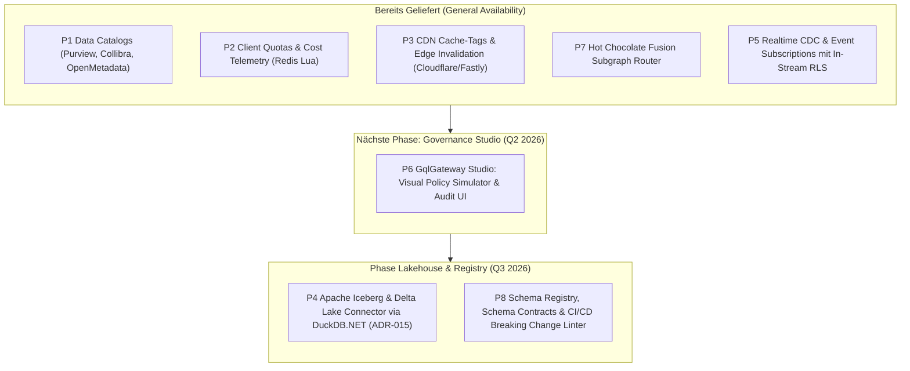

# 📊 Enterprise Product Management: Marktrecherche, Feature-Gap-Analyse & Reifegrad-Prüfung (GqlGateway)

**Rolle:** Principal Enterprise Product Manager & Platform Strategist  
**Marktumfeld:** 2025/2026 Enterprise API & GraphQL Federation (Apollo GraphOS / Router v2.17+, Hasura DDN v3, WunderGraph Cosmo, StepZen, Immuta)  
**Status:** Aktualisiert nach Abschluss von P1, P2, P3 und P7 (General Availability)  
**Ziel:** Nachvollziehbarer Produktstatus, Dokumentation gelieferter Differenzierungs-Moats und Priorisierung der nächsten Roadmap-Phasen nach dem RICE-C-Modell.

---

## 1. Executive Summary & Marktkontext 2025 / 2026

Der Markt für Enterprise GraphQL und API Gateways wird 2025/2026 durch drei fundamentale Marktbewegungen definiert:

1. **Von Query-Aggregation zu "Agentic AI Orchestration":**
   * Apollo hat mit dem *Apollo MCP Server* und *GraphOS Agent Tools* den Weg geebnet, um GraphQL Supergraphs als Tool-Provider für autonome KI-Agenten bereitzustellen.
   * **Unsere Marktposition:** Mit [ADR-014](file:///root/gql/docs/adr/ADR-014-enterprise-model-context-protocol-and-ai-data-guardrails.md) und der Implementierung in [`GqlGateway.GraphQL.Mcp`](file:///root/gql/src/GqlGateway.GraphQL/Mcp/GatewayMcpQueryExecutor.cs) besitzt GqlGateway ein klares Alleinstellungsmerkmal: Wir erzwingen Zero-Trust Guardrails (PII-Scrubbing, Fail-Closed Audit-Logging, echte Anrufer-Identitätsübertragung und Session-Ownership-Validierung) direkt vor dem LLM-Token-Stream.
2. **Enterprise Data Governance & Zero-Touch Data Catalogs:**
   * Reine RBAC/ABAC-Gateways (Apollo, Cosmo) greifen zu kurz. Fortune-500-Unternehmen verlangen automatisierte Klassifizierungs-Synchronisation aus führenden Metadaten-Katalogen (Microsoft Purview, Collibra, OpenMetadata) ohne manuelle Doppelpflege.
   * **Unsere Marktposition:** Durch den schlüsselfertigen Rollout von **P1** liest GqlGateway Tabellen- und Spaltenmetadaten, PII-Kennzeichnungen und DSGVO-Art.-9-Klassifizierungen nativ per REST und Event-Webhooks ein und übersetzt sie in automatische Maskierungsregeln.
3. **Federation & Edge Performance bei striktem Zero-Trust:**
   * Bestehende Router delegieren Autorisierung entweder an Subgraphs (Apollo) oder erfordern teure Zusatz-Lizenzen (Hasura DDN).
   * **Unsere Marktposition:** Mit **P7** (Hot Chocolate Fusion Subgraph Router mit Zero-Trust Context Forwarding) und **P3** (CDN Cache-Tags mit automatischem Fallback auf `Cache-Control: private, no-store` bei aktiven RLS/Maskierungsregeln) liefert GqlGateway maximale Edge-Skalierbarkeit ohne Compliance-Risiko.

---

## 2. Reifegrad- & Vollständigkeitsprüfung vorhandener Features

Bestandsaufnahme aller Gateway-Module zur Dokumentation der Marktreife (General Availability / GA):

| Modul / Feature | Zustand im Repository | Reifegrad | Status & verbleibende Roadmap-Gaps |
| :--- | :--- | :---: | :--- |
| **Data Catalog Connectors (P1)** | Vollständig implementiert ([`PurviewDataCatalogClient`](file:///root/gql/src/GqlGateway.Infrastructure/DataCatalog/PurviewDataCatalogClient.cs), [`CollibraDataCatalogClient`](file:///root/gql/src/GqlGateway.Infrastructure/DataCatalog/CollibraDataCatalogClient.cs), [`OpenMetadataDataCatalogClient`](file:///root/gql/src/GqlGateway.Infrastructure/DataCatalog/OpenMetadataDataCatalogClient.cs), [`DataCatalogClientFactory`](file:///root/gql/src/GqlGateway.Infrastructure/DataCatalog/DataCatalogClientFactory.cs), [`DataCatalogSyncService`](file:///root/gql/src/GqlGateway.Application/DataCatalog/Services/DataCatalogSyncService.cs), Webhook HMAC-Validierung). | **100% (GA)** | ✅ **Vollständig abgeschlossen.** Native REST-Clients mit Polly 8 Resilienz, Entra ID OAuth, PII- & DSGVO-Art.-9-Mapping und Epoch-Invalidierung aktiv. |
| **Client Quotas & Cost Telemetrie (P2)** | Vollständig implementiert ([`ClientTierResolver`](file:///root/gql/src/GqlGateway.Application/Caching/Services/ClientTierResolver.cs), [`CostAndQuotaMiddleware`](file:///root/gql/src/GqlGateway.GraphQL/Interceptors/CostAndQuotaMiddleware.cs), [`RedisRateLimiterService`](file:///root/gql/src/GqlGateway.Infrastructure/RateLimiting/RedisRateLimiterService.cs)). | **100% (GA)** | ✅ **Vollständig abgeschlossen.** Client-Tiering (`Free`, `Standard`, `Enterprise`, `Internal`), atomares Lua Token Bucket in Redis, Response-Header (`X-Query-Cost`, `X-RateLimit-*`) und `extensions.cost`. |
| **CDN Cache-Tag Headers & Edge Invalidation (P3)** | Vollständig implementiert ([`CdnCacheTagVisitor`](file:///root/gql/src/GqlGateway.GraphQL/Interceptors/CdnCacheTagVisitor.cs), [`CdnCacheTagMiddleware`](file:///root/gql/src/GqlGateway.GraphQL/Interceptors/CdnCacheTagMiddleware.cs), [`CloudflareCdnPurgeService`](file:///root/gql/src/GqlGateway.Infrastructure/Cdn/CloudflareCdnPurgeService.cs), [`FastlyCdnPurgeService`](file:///root/gql/src/GqlGateway.Infrastructure/Cdn/FastlyCdnPurgeService.cs)). | **100% (GA)** | ✅ **Vollständig abgeschlossen.** AST-Tag-Extraktion, Zero-Trust Cache Isolation (`private, no-store` bei RLS/Maskierung) und asynchrone Mutation-Invalidierung via Outbox. |
| **Subgraph Federation Router (P7)** | Vollständig implementiert ([`SubgraphSecurityDelegatingHandler`](file:///root/gql/src/GqlGateway.GraphQL/Federation/SubgraphSecurityDelegatingHandler.cs), [`SubgraphResultMaskingMiddleware`](file:///root/gql/src/GqlGateway.GraphQL/Federation/SubgraphResultMaskingMiddleware.cs), [`FusionGatewayExtensions`](file:///root/gql/src/GqlGateway.GraphQL/Federation/FusionGatewayExtensions.cs)). | **100% (GA)** | ✅ **Vollständig abgeschlossen.** Hot Chocolate Fusion Subgraph Router mit Zero-Trust Client Token Forwarding und In-Memory Result Masking auf aggregierten Daten. |
| **Casbin ABAC & RLS Pushdown** | Vollständig im AST-zu-SQL integriert ([`RowFilterSqlBuilder`](file:///root/gql/src/GqlGateway.Application/Services/RowFilterSqlBuilder.cs), [`AdvancedRlsFilterGenerator`](file:///root/gql/src/GqlGateway.Application/Services/AdvancedRlsFilterGenerator.cs)). Dialekte: Postgres, MSSQL, SQLite. | **90%** | ❌ Hot-Reload von Casbin-Policies ohne Pod-Restart. ❌ Visueller Policy-Tester / Simulator für Data Stewards (siehe P6). |
| **Model Context Protocol (MCP) & AI Guardrails** | SSE-Handshake (`/mcp/sse`), JSON-RPC Handler ([`McpProtocolHandler`](file:///root/gql/src/GqlGateway.Application/Mcp/Services/McpProtocolHandler.cs)), AI Data Guardrail ([`AiDataGuardrailService`](file:///root/gql/src/GqlGateway.Application/Mcp/Services/AiDataGuardrailService.cs)), Session-Ownership Schutz, SigV4 Audit-Export. | **85%** | ❌ Stdio- und Streamable HTTP-Transport für Entwickler-CLIs (Claude Code / Cursor). ❌ Semantische Prompt-Injection- & Jailbreak-Erkennung (NeMo Guardrails / Llama Guard). |
| **ITSM Closed Loop (ServiceNow / Jira)** | Outbox Pattern ([`ItsmOutboxDispatcherHostedService`](file:///root/gql/src/GqlGateway.Infrastructure/Itsm/ItsmOutboxDispatcherHostedService.cs)), Webhook Ingestion ([`ItsmWebhookHandler`](file:///root/gql/src/GqlGateway.Infrastructure/Itsm/ItsmWebhookHandler.cs)), Triage-Engine. | **80%** | ❌ Direkte Outbound-REST-Clients für ServiceNow Table API & Jira Cloud REST v3. ❌ Automatischer Rezertifizierungs- & Verlängerungs-Workflow für ablaufende temporäre Consents. |
| **Lineage & DSGVO Art. 15 Auskunft** | Lineage Graph Store ([`LineageImpactAnalyzerService`](file:///root/gql/src/GqlGateway.Application/Lineage/LineageImpactAnalyzerService.cs)), GDPR Art. 15 Subject Access Report Generator, zyklensichere DFS/Kahn-Validierung. | **85%** | ❌ Standardisierter PDF/Audit-Export für externe Datenschutzbeauftragte. ❌ Lineage-Push zu OpenLineage / Apache Atlas. |
| **Modern Lakehouse Connector (P4)** | Spezifiziert in [ADR-015](file:///root/gql/docs/adr/ADR-015-apache-iceberg-lakehouse-connector-and-zero-trust-pushdown.md). | **0% (Next Up)** | 🔴 **Nächster großer Meilenstein:** Direkte Iceberg/Parquet-Abfrage über DuckDB.NET / Apache Arrow Flight unter Beibehaltung der Casbin-ABAC. |
| **Subscriptions & Realtime Events (P5)** | Vollständig implementiert ([`Subscription.cs`](file:///root/gql/src/GqlGateway.GraphQL/Subscriptions/Subscription.cs), [`WebSocketAuthInterceptor.cs`](file:///root/gql/src/GqlGateway.GraphQL/Subscriptions/WebSocketAuthInterceptor.cs), [`StreamRlsPolicyEnforcer.cs`](file:///root/gql/src/GqlGateway.Application/Streaming/Services/StreamRlsPolicyEnforcer.cs), [`InMemoryCdcEventChannel.cs`](file:///root/gql/src/GqlGateway.Infrastructure/Streaming/InMemoryCdcEventChannel.cs), [`DebeziumCdcParser.cs`](file:///root/gql/src/GqlGateway.Infrastructure/Streaming/DebeziumCdcParser.cs)). | **100% (GA)** | ✅ **Vollständig abgeschlossen.** WebSocket (`graphql-transport-ws`) und SSE Subscriptions mit dynamischer In-Stream Row Level Security (Casbin ABAC), In-Stream Column Masking, strikter Mandanten-Isolation und Debezium/Kafka CDC Ingestion. |
| **Management Studio & UI (P6)** | Reines Headless-Gateway. | **0%** | 🔴 Visuelles Web-Dashboard für Data Stewards (Policy Simulator, Audit-Viewer, Schema Explorer). |

---

## 3. Aktualisierte Wettbewerber-Matrix & Differenzierungs-Moats

| Konkurrent | Stärken | Kritische Schwachstellen & Lücken | GqlGateway Moat (Unser Alleinstellungsmerkmal) |
| :--- | :--- | :--- | :--- |
| **Apollo GraphQL** *(Router / Federation v2 / GraphOS)* | • Marktführer Schema Federation • Großes Entwickler-Ökosystem • Hohe JS/Rust Router Performance | • Router unter restriktiver ELv2-Lizenz • **Schlechte Data-Governance**: RLS nur delegiert an Subgraphs • Keine native Unternehmenskatalog-Synchronisation • Fehlende DSGVO Art. 9 Automatisierung | **Integrierte Zero-Trust Governance & Fusion**: Hot Chocolate Fusion mit striktem Zero-Trust Context Forwarding, In-Memory-Masking auf aggregierten Daten und nativer Sync mit Purview/Collibra/OpenMetadata. |
| **Hasura Enterprise** *(DDN / Data Delivery Network)* | • Instant GraphQL über SQL-DBs • Declarative Permissions • Schnelles Prototyping | • Starker Vendor-Lockin in proprietäre Hasura-Metadaten • Sehr teure Enterprise-Lizenzmodelle • Föderierte Governance über mehrere Data Domains schwerfällig • Kein integrierter 4-Augen Justification-Workflow | **Open Governance & Lower TCO**: Keine proprietäre Plattformbindung, automatisierte ITSM-Freigaben (ServiceNow/Jira), dbt-Manifest Ingestion und vollständige On-Prem/Sovereign Cloud Eignung. |
| **WunderGraph / Cosmo** | • Open-Source Apollo-Alternative • Rust-basierter Router • Entwicklerzentrierter BFF-Fokus | • Primär auf Web-Frontend-Entwickler ausgerichtet • **Fehlende Enterprise-Compliance**: Kein BSI/DSGVO Audit-Trail (SHA-256 Hash-Chains) • Keine Kerberos/Active Directory Legacy-Absicherung • Keine Data Catalog Federation | **Enterprise Grade & Compliance**: SHA-256 manipulationssichere Audit-Logs mit WORM-S3-Export, hybride IdP-Föderation (Entra ID, OIDC, Kerberos) und DSGVO Art. 15 Auskunfts-APIs. |
| **Data Security Suites** *(Immuta, Privacera)* | • Sehr starke Policy Engines für Snowflake/Databricks | • **Kein GraphQL- oder API-Gateway**: Setzen tief in Datenbanken/Lakehouses an • Hohe Komplexität und Latenz für Anwendungsentwickler | **Unified Access Layer**: Bringt datenbanknahe Zero-Trust Governance direkt an die GraphQL- und MCP-Schnittstelle von Applikationen und KI-Agenten. |

---

## 4. Priorisierungs-Framework: Aktualisierte RICE-C Matrix

Mit dem erfolgreichen Abschluss von **P1, P2, P3 und P7** aktualisiert sich das Priorisierungs-Ranking wie folgt:

$$\text{RICE-C Score} = \frac{\text{Reach} \times \text{Impact} \times \text{Confidence} \times \text{ComplianceWeight}}{\text{Effort}}$$

| Initiative / Feature | Reach | Impact | Conf. | Comp. | Effort | **Score** | Status & Priorität |
| :--- | :---: | :---: | :---: | :---: | :---: | :---: | :--- |
| **P1: Konkrete Data Catalog Connectors** | 8 | 2.5 | 90% | 1.8 | 3 W | **10.8** | ✅ **100% Abgeschlossen (GA)** |
| **P2: Dynamic Client Quotas & Cost Telemetrie** | 9 | 1.8 | 95% | 1.2 | 1.5 W | **12.3** | ✅ **100% Abgeschlossen (GA)** |
| **P7: Subgraph Federation (Hot Chocolate Fusion)** | 6 | 2.5 | 90% | 1.2 | 1.8 W | **9.0** | ✅ **100% Abgeschlossen (GA)** |
| **P3: CDN Cache-Tag Headers & Edge Invalidation** | 8 | 2.2 | 90% | 1.1 | 2 W | **8.7** | ✅ **100% Abgeschlossen (GA)** |
| **P5: Realtime Event Subscriptions (Kafka/CDC)** | 7 | 2.5 | 85% | 1.3 | 4 W | **4.8** | ✅ **100% Abgeschlossen (GA)** |
| **P6: Data Steward Studio & Policy Simulator** *(Lightweight Blazor / SPA Admin Dashboard)* | 7 | 2.2 | 90% | 1.6 | 4 W | **5.5** | 🟢 **Nächste Priorität (Q2 - P1)** |
| **P4: Modern Lakehouse Connector (Iceberg/Arrow)** *(Umsetzung von [ADR-015](file:///root/gql/docs/adr/ADR-015-apache-iceberg-lakehouse-connector-and-zero-trust-pushdown.md) via DuckDB.NET)* | 6 | 3.0 | 80% | 1.5 | 5 W | **4.3** | 🟡 **Q2/Q3 (P2)** |
| **P8: Schema Registry & CI/CD Checks (`rover`-Pendant)** *(Breaking Change Detection via CLI & GitHub Action)* | 6 | 1.8 | 85% | 1.2 | 3.5 W | **3.1** | 🔵 **Q3 (P3)** |

---

## 5. Strategische Roadmap & Nächste Entwicklungsphasen

### Konkrete Handlungsempfehlungen für die nächsten Sprints:

1. **P6 Data Steward Studio & Policy Simulator (Höchste verbleibende Priorität, Score: 5.5):**
   * Bereitstellung eines intuitiven Management-Frontends (z.B. Blazor WebAssembly oder React SPA embedded).
   * **Core Feature:** Ein "What-If" Policy Simulator, mit dem Sicherheitsbeauftragte und Data Stewards interaktiv prüfen können, wie Rollen, Abteilungen und Justifications auf konkrete Tabellen und Spaltenmaskierungen wirken.
2. **P4 Modern Lakehouse Connector (Iceberg/Parquet via DuckDB):**
   * Realisierung von [ADR-015](file:///root/gql/docs/adr/ADR-015-apache-iceberg-lakehouse-connector-and-zero-trust-pushdown.md) als separates Extension-Projekt `GqlGateway.Extensions.Lakehouse`.
   * Parquet- und Metadata-Parsing über DuckDB.NET und Zero-Allocation Streaming über Apache Arrow.
3. **P8 Schema Registry, Contracts & CI/CD Checks (`rover`-Pendant):**
   * CLI-Tool zur Validierung von Schemata gegen aktive Clients und Breaking Change Detection.
