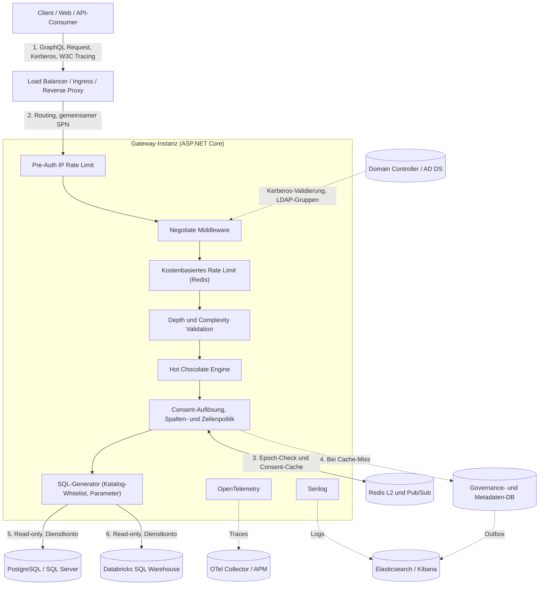
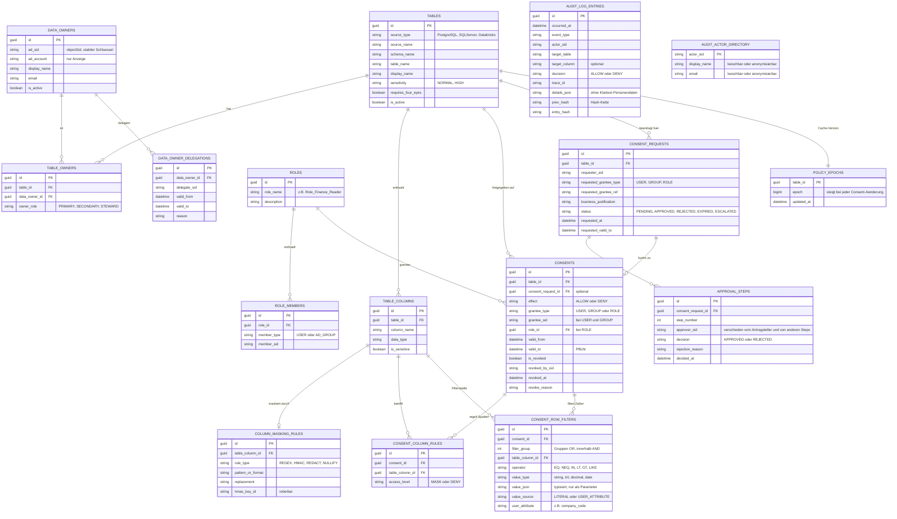

# Anforderungsspezifikation v2: C# GraphQL Enterprise Gateway mit Data-Owner-Consent

**Status:** Überarbeiteter Entwurf (Review-Stand)  
**Kennzeichnung:** `[NEU]` neue Anforderung, `[GEÄNDERT]` inhaltlich überarbeitet, `[ENTSCHEIDUNG]` offener Punkt, der vor Umsetzung geklärt werden muss. Nicht markierte Abschnitte entsprechen dem Original.

---

## 1. Projektziel & Vision

Entwicklung eines hochperformanten, hochverfügbaren (HA) und zustandslosen (stateless) **GraphQL Gateways** auf Basis von **C# / ASP.NET Core** und **Hot Chocolate**.

Das Gateway dient als zentrale, einheitliche Schnittstelle (Unified API) zu relationalen Unternehmensdatenbanken (PostgreSQL, SQL Server) und Big-Data-Quellen (Databricks SQL Warehouse). Der Zugriff auf Daten (Enterprise-Maßstab: bis zu 50.000 Tabellen) unterliegt einer strikten **Data-Owner-Zustimmung (Consent Management)** auf Basis der Benutzeridentität aus dem **lokalen Active Directory (On-Premises AD DS)**.

### 1.1 Clients & Nutzungsszenarien
- **Primäre Konsumenten:** Interne Web-Frontends und Intranet-Anwendungen (Browser mit Single-Sign-On via Windows Auth / Kerberos). Reine BI-Tools (mit ODBC/OData-Bedarf) sind für Phase 1 Out-of-Scope. `[ENTSCHIEDEN D4]`
- Für die Frontends ist die Reauthentifizierung bei Verbindungsabbrüchen oder nach `GOAWAY` transparent gewährleistet.

### 1.2 Messbare Qualitätsziele `[NEU]`
Alle Werte sind Startwerte und im Rahmen des PoC zu validieren.

| ID | Ziel | Zielwert |
|:--|:--|:--|
| Q-01 | Consent-Auflösung, L1-Treffer | < 1 ms |
| Q-02 | Consent-Auflösung inkl. Epoch-Check und L2 (p95) | < 10 ms |
| Q-03 | Consent-Auflösung bei vollständigem Cache-Miss (p95) | < 50 ms |
| Q-04 | Gateway-Overhead pro Request ohne Datenquellenzeit (p95) | < 30 ms |
| Q-05 | Schema-Build-Zeit für Referenzkatalog (50.000 Tabellen) | im PoC zu messen, Budget festlegen |
| Q-06 | Speicherbedarf pro Instanz mit vollständigem Schema | im PoC zu messen, Budget festlegen |
| Q-07 | Widerruf → erster verweigerter Request auf jedem Knoten (p99) | ≤ 1 s |
| Q-08 | Fehlerrate während Rolling Update unter Referenzlast | ≤ 0,01 % |
| Q-09 | Referenzlast | z. B. 200 req/s, festzulegen |

---

## 2. Priorisierung & Phasenplan `[NEU]`

Um das Risiko zu senken, wird in Phasen geliefert. Ein „Walking Skeleton" kommt vor den aufwendigen Funktionen.

| Phase | Inhalt | MoSCoW |
|:--|:--|:--|
| **P0 – Spike** | Benchmark dynamisches Schema mit synthetischem 50k-Katalog; Entscheidung zur Schema-Strategie (F-DATA-01); Prototyp Negotiate hinter Proxy | Must |
| **P1 – Walking Skeleton** | 1 Datenquelle (SQL Server oder PostgreSQL), Negotiate-Auth, Tabellen-Consent (ALLOW/DENY), erzwungenes Paging, Audit von Denies, Health/Readiness | Must |
| **P2 – Consent-Kern** | Spalten-DENY/MASK, Zeilenfilter, Konfliktauflösung, Epoch-Cache und Invalidierung, Audit-Trail, Rate-Limiting | Must |
| **P3 – Lifecycle** | Antrag/Genehmigung, Befristung, Delegation, Vier-Augen, Eskalation, Rezertifizierung, Benachrichtigungen | Should |
| **P4 – Erweiterung** | Databricks, Persisted Queries erzwungen, Hintergrund-Crawler, Aggregationen, zeilenweise Maskierung | Should/Could |

---

## 3. Funktionale Anforderungen

### 3.1 Authentifizierung & Identität

- **F-AUTH-01: Lokales Active Directory (On-Premises AD DS) Integration** `[GEÄNDERT]`
  - **Primär: Windows-Authentifizierung / SSO** über `Microsoft.AspNetCore.Authentication.Negotiate` (Kerberos, NTLM nur als dokumentierter Fallback).
  - **Alternativ / Hybrid:** Bearer-Tokens über ADFS oder LDAP-Abfragen.
  - **Identitätsextraktion:** `objectSid` (**primärer, stabiler Schlüssel**), `sAMAccountName`, `DOMÄNE\username`, `UPN` und AD-Gruppen (SIDs) in das `ClaimsPrincipal`. Anzeigenamen dienen nur der Darstellung; alle Berechtigungen und Audit-Einträge referenzieren die **SID**.
  - Gruppenauflösung berücksichtigt **verschachtelte Gruppen** (z. B. `LDAP_MATCHING_RULE_IN_CHAIN` oder Token-Groups) und **deaktivierte/gesperrte Konten** (`userAccountControl`). Das Verhalten bei sehr vielen Gruppen (Kerberos-PAC-Größenlimit) ist zu testen und zu dokumentieren.
- **F-AUTH-02: Domain-Controller-Entlastung & Stateless Execution**
  - Keine serverseitigen Sessions; Authentifizierung pro Verbindung über Kerberos-Ticket.
  - Aufgelöste Gruppenmitgliedschaften werden in Redis gecacht (`GroupCacheTtl`, Standard 5 min).
- **F-AUTH-03: Virtualisiertes RBAC & Trusted Subsystem** `[GEÄNDERT]`
  - Keine serverweiten SQL-Logins oder DB-Benutzer für Endbenutzer oder AD-Gruppen.
  - Ein dediziertes technisches Dienstkonto pro Datenquelle, **ausschließlich lesend und nach Least Privilege** (nur die im Katalog geführten Schemas/Tabellen). Connection Pooling bleibt erhalten.
  - **Attribution:** Der Nutzerkontext wird pro Abfrage an die Quelle weitergereicht, soweit technisch möglich (SQL Server `SESSION_CONTEXT`, PostgreSQL `set_config`, Databricks Query-Tags/Kommentar), damit Quellsystem-Logs dem Endnutzer zuordenbar sind.
  - Autorisierung liegt vollständig in Governance-DB und Gateway. Das erhöhte Risiko (großer Blast Radius bei Kompromittierung des Dienstkontos) ist im Threat Model (DOK-07) zu behandeln.
- **F-AUTH-04: Cluster-Betrieb der Windows-Authentifizierung** `[NEU]`
  - Negotiate authentifiziert **pro TCP-Verbindung**. Deshalb: ein gemeinsamer SPN auf dem Load-Balancer-Alias, identischer Dienstaccount bzw. Keytab auf allen Knoten, Cluster läuft **Kerberos-only** (NTLM ist verbindungsgebunden und benötigt Affinität).
  - Linux-Container: Keytab bzw. Service-Principal (gMSA-Unterstützung für Container gilt für Windows-Container).
  - Phase-3-Proxy-Modus (`X-Remote-User`): Header-Spoofing ist zu verhindern durch mTLS zwischen Proxy und Gateway, IP-Allowlist des Proxys und zwingendes Verwerfen eingehender Identitäts-Header.
- **F-AUTH-05: Autorisierung der Verwaltungsfunktionen** `[NEU]`
  - Für `approveConsentRequest`, `rejectConsentRequest`, `revokeConsent`, `delegateDataOwnership` und `reloadSchema` sind eigene Berechtigungen definiert (Data Owner der Tabelle bzw. Delegierter; Governance-Admin für `reloadSchema`).
  - `reloadSchema` und andere Admin-Operationen werden auf einem **separaten Admin-Endpunkt** (eigene Route/Port, Netzwerkeinschränkung) bereitgestellt, nicht im öffentlichen Schema.

### 3.2 Data-Owner Consent Management & RBAC

- **F-CONS-01: Dreistufige Consent-Granularität (Tabelle, Spalte, Zeile)**
  - Tabellen-Ebene: Freigabe gilt standardmäßig für die gesamte Tabelle/View.
  - Spalten-Ebene: `DENY` oder `MASK` für sensible Felder.
  - Zeilen-Ebene: Typisierte, parametrisierte Prädikate (siehe Datenmodell `CONSENT_ROW_FILTERS`), inkl. Verknüpfung mit Nutzerattributen (z. B. `CompanyCode = user.company_code`) und Gruppen (OR) / Bedingungen (AND). `[GEÄNDERT]`
  - Zero Trust: Ohne explizite Freigabe kein Lesezugriff.
- **F-CONS-02: Hybrides Rollen- & Subjekt-Modell**
  - Freigaben an einzelne AD-Benutzer, AD-Gruppen (jeweils per SID) oder fachliche Rollen. Vererbung über alle (verschachtelten) Gruppenmitgliedschaften.
- **F-CONS-03: Pre-Execution Validation**
  - Prüfung aller Ebenen **bevor** SQL/Spark-Statements abgesetzt werden.
- **F-CONS-04: Abfragefilterung & Fehlerbehandlung** `[GEÄNDERT]`
  - Unberechtigte Tabellenabfragen: `FORBIDDEN`/`UNAUTHORIZED`.
  - **Nicht berechtigte Tabellen und Spalten werden aus dem für den Nutzer sichtbaren Schema entfernt** (bzw. sind für ihn nicht abfragbar), damit ihre Existenz nicht offengelegt wird. Maskierte Spalten bleiben sichtbar und liefern maskierte Werte.
  - **Introspection** ist in Produktion deaktiviert oder pro Nutzer auf berechtigte Elemente gefiltert.
  - **Fehlerbehandlung `[ENTSCHIEDEN D5]`:** Getrennte Fehlercodes (`FORBIDDEN` bei fehlender Data-Owner-Freigabe vs. `NOT_FOUND` bei nicht existierender Tabelle), um dem Benutzer im Frontend gezielt das Beantragen von Rechten zu ermöglichen.
- **F-CONS-05: Sofortiger Widerruf (Event-getrieben, ≤ 1 s)** `[GEÄNDERT]`
  - Details und Mechanik siehe **NF-PERF-04** (Epoch-Validierung, Pub/Sub als Beschleuniger).
  - Widerruf ist ab dem nächsten Request nach DB-Commit auf jedem Knoten wirksam.
- **F-CONS-06: Vollständiger Consent-Lifecycle**
  - Antrag mit Begründung und gewünschter Laufzeit; Genehmigung/Ablehnung (Ablehnungsgrund Pflicht); Delegation; Pflicht-Ablaufdatum `valid_to`; Rezertifizierung (z. B. 14 Tage vorher); Vier-Augen-Prinzip für hochsensible Tabellen; Eskalation nach SLA (z. B. 5 Werktage).
  - **Ergänzungen** `[NEU]`:
    - **Funktionstrennung:** Antragsteller ≠ Genehmiger; beide Vier-Augen-Freigeber sind verschiedene Personen; Delegationsketten sind zyklenfrei und auf eine maximale Tiefe begrenzt.
    - **Benachrichtigungen:** Kanäle (E-Mail, ggf. Teams) für Antrag, Entscheidung, Eskalation, Rezertifizierung und bevorstehenden Ablauf.
    - **Verwaiste Tabellen:** Ist ein Data Owner ausgeschieden bzw. sein AD-Konto deaktiviert, geht die Zuständigkeit an den Stellvertreter oder das Data-Governance-Gremium.
    - **Leaver-Prozess:** Consents für deaktivierte oder gelöschte AD-Konten werden automatisch beendet bzw. wirkungslos (siehe F-AUTH-01).
    - **Ablauf:** Der Ablauf wirkt zeitgenau, unabhängig vom Job (Prüfung von `valid_to` bei jeder Auflösung, siehe NF-PERF-04).
- **F-CONS-07: Deterministische Berechtigungsauflösung** `[GEÄNDERT]`

  *Begriffe*
  - **Subjekt-Menge S:** SID des Benutzers, SIDs aller (transitiven) AD-Gruppen, alle Rollen, in denen er direkt oder über eine Gruppe Mitglied ist.
  - **Aktiver Consent:** `is_revoked = false`, `valid_from ≤ jetzt < valid_to`, Workflow abgeschlossen (inkl. Vier-Augen, falls gefordert).
  - **A:** aktive Consents mit `effect = ALLOW` für ein Subjekt aus S. **D:** aktive Consents mit `effect = DENY` für ein Subjekt aus S.
  - Spaltenstufen: `CLEAR (2) > MASK (1) > DENY (0)`.

  *Regeln (in dieser Reihenfolge)*
  1. **Hartes DENY:** Ein Tabellen-DENY in D verweigert den Zugriff, ein Spalten-DENY in D sperrt die Spalte, unabhängig von Grantee-Typ und jedem ALLOW.
  2. **Zero Trust:** Ist A leer, ist der Zugriff verweigert.
  3. **Spaltenstufe** (ohne hartes DENY): **Maximum** über alle Consents in A. Ein Consent ohne Spaltenregel liefert für die Spalte `CLEAR`. `MASK`/`DENY` innerhalb eines ALLOW-Consents begrenzt nur diesen Consent.
  4. **Zeilenprädikat:** Innerhalb eines Consents `AND` (Filtergruppen untereinander `OR`); zwischen Consents in A `OR` (Consent ohne Filter = `TRUE`); Zeilenfilter aus D wirken als `AND NOT (...)`.
  5. **Nutzbarkeit:** Filter, Sortierung, Gruppierung, Aggregation und `totalCount` dürfen nur Spalten mit effektiver Stufe `CLEAR` verwenden. Gleiches gilt für Spalten, die in einem wirksamen Zeilenfilter stehen und für den Nutzer nicht lesbar sind.

  *Wahrheitstabelle (pro Spalte)*

  | Hartes DENY | Bester Wert aus A | Effektive Stufe |
  |:--|:--|:--|
  | ja | beliebig | **DENY** |
  | nein | kein Consent in A | **DENY** (Zero Trust) |
  | nein | mind. ein Consent mit `CLEAR` | **CLEAR** |
  | nein | bester Wert `MASK` | **MASK** |
  | nein | nur `DENY`-Einträge innerhalb von ALLOW-Consents | **DENY** |

  *Pflicht-Testfälle*
  - Gruppe hat ALLOW mit `salary = MASK`, Nutzer hat direktes ALLOW ohne Spaltenregel → `salary` ist `CLEAR`.
  - Wie oben, zusätzlich Rollen-DENY auf `salary` → `DENY`.
  - Zwei ALLOW-Consents mit `Company = DE01` bzw. `Company = AT01` → Vereinigung der Zeilen.

  *Offene Entscheidungen* `[ENTSCHEIDUNG]`
  - **D1: Vereinigungssemantik vs. Spezifitätsvorrang.** Gewählt ist die Vereinigung (permissivstes Ergebnis). Alternative: Vorrang User > Gruppe > Rolle (schwerer erklärbar).
  - **D2: Zeilen und Spalten gemeinsam.** Ein Consent gibt Zeilen `DE01` im Klartext, ein zweiter alle Zeilen maskiert. Zeilen-OR plus Spalten-Maximum würde Klartext für alle Zeilen ausliefern (Leck). Korrekt ist die zeilenweise Auswertung (`CASE WHEN <Prädikat> THEN spalte ELSE mask(spalte) END`). **Phase 1/2:** Consents mit gleichzeitig abweichenden Zeilen- und Spaltenregeln auf derselben Tabelle werden beim Grant abgelehnt oder als Warnung markiert; zeilenweise Auswertung in P4.
- **F-CONS-08: Konfigurierbares Data-Masking (Status MASK)** `[GEÄNDERT]`
  - Strategien: Regex/Format-Masking (E-Mail, IBAN, Telefon), Pauschalierung/Nulling, **deterministische Pseudonymisierung per HMAC-SHA256** mit geheimem, pro Spalte rotierbarem Schlüssel (`hmac_key_id`, Schlüssel im Secret Store).
  - Reines SHA256 ohne Schlüssel ist bei niedriger Entropie (IDs, Telefonnummern) per Brute Force umkehrbar und daher nicht zulässig.
  - Maskierung findet **so früh wie möglich** statt: bevorzugt im SQL der Quelle, andernfalls im Gateway, bevor Werte in Cache, Log oder Response gelangen.
- **F-CONS-09: GraphQL Lifecycle Mutations**
  - `requestTableAccess`, `approveConsentRequest`, `rejectConsentRequest`, `revokeConsent`, `delegateDataOwnership`.
  - **Schreibzugriff ausschließlich auf die Governance-DB**; die Quelldatenbanken bleiben strikt read-only. `[GEÄNDERT]`
  - Alle Mutationen sind autorisiert (F-AUTH-05), auditiert und **idempotent über `Idempotency-Key`** (serverseitige Deduplizierung). `[NEU]`
- **F-CONS-10: Wirksamkeit bei Änderungen von Rollen und Gruppen** `[NEU]`
  - Änderungen an `ROLE_MEMBERS` erhöhen die Policy-Epoch aller Tabellen mit Consents dieser Rolle.
  - Änderungen an AD-Gruppenmitgliedschaften sind nicht event-getrieben. Maximale Verzögerung = `GroupCacheTtl` bzw. Ticket-Laufzeit; das ist als **bewusstes Restrisiko** im Risikoregister (Abschnitt 11) dokumentiert.

### 3.3 Datenquellen, Schema-Generierung & Query Execution

- **F-DATA-01: Dynamische Schema-Generierung (bis 50.000 Tabellen)** `[GEÄNDERT]`
  - Das Schema wird zur Laufzeit aus dem Metadaten-Repository aufgebaut.
  - **Schema-Strategie ist Ergebnis des Spikes P0** `[ENTSCHEIDUNG]`. Kandidaten: (a) ein Schema nur mit Tabellen, für die mindestens ein aktiver Consent existiert; (b) getrennte Schemas pro Fachdomäne (Federation/Stitching); (c) generischer Zugriff `table(name:, columns:)` mit Katalog-Validierung. Bei 50.000 Typen samt Filter-, Sort- und Connection-Typen entstehen Millionen Schema-Elemente (Build-Zeit, RAM, Introspection, Validierung).
  - **Startverhalten:** Startup-Probe, Schema-Aufbau und Warm-up vor Readiness. Ist die Governance-DB beim Start nicht erreichbar, startet der Pod mit einem **Last-known-good-Katalogsnapshot** (persistiert, versioniert), meldet dies aber im Health-Status (Degraded).
- **F-DATA-02: Dedizierte Governance- und Metadaten-Datenbank**
  - Speichert Tabellen-/Spalten-Metadaten, Data-Owner-Zuordnungen, Consents, Workflow-Daten, Audit-Log (siehe Abschnitt 6).
  - Betriebsanforderungen `[NEU]`: Backup, definierte RTO/RPO (festzulegen), Restore-Test, Hochverfügbarkeit.
- **F-DATA-03: Filtering, Sorting, Paging auf dynamischen Typen** `[GEÄNDERT]`
  - Hot Chocolates `UseFiltering`/`UseSorting` setzen auf `IQueryable`/Expression Trees auf und lassen sich auf `Dictionary`/`DbDataReader`-Zeilen (F-DATA-08) nicht direkt nach SQL übersetzen.
  - Gefordert ist daher ein **eigener Filter-/Sort-Provider**, der den Filter-AST in **parametrisiertes SQL** übersetzt, mit **Dialekt-Abstraktion** (PostgreSQL, SQL Server, Databricks SQL).
  - **SQL-Injection-Regel:** Tabellen- und Spaltennamen stammen **ausschließlich aus dem Katalog** (Whitelist, korrektes dialektspezifisches Quoting), niemals aus Client-Input. Werte werden ausschließlich als Parameter übergeben.
  - Paging: siehe NF-SEC-02 (Keyset/Cursor).
- **F-DATA-04: Multi-Source Anbindung**
  - PostgreSQL, SQL Server via ADO.NET/Dapper (kein EF Core im Datenpfad, da Modelle dynamisch sind). Databricks über SQL Statement Execution API / ODBC.
  - **Beziehungen über Datenquellen hinweg** (z. B. Postgres ↔ Databricks) sind in Phase 1 **nicht unterstützt** (Out of Scope); Relationen gelten innerhalb einer Quelle. `[NEU]`
- **F-DATA-05: Persisted Queries (Trusted Documents)**
  - Unterstützt. Für Produktions-Clients ist ein Modus „nur persistierte Queries" konfigurierbar (siehe NF-SEC-02).
- **F-DATA-06: Event- & API-getriebener Schema-Refresh (Zero-Downtime)**
  - Admin-Mutation `reloadSchema()` (separater Admin-Endpunkt, F-AUTH-05) mit Broadcast über Redis Pub/Sub; Hintergrund-Crawler synchronisiert Information Schema und Katalog.
  - **Hintergrund-Jobs bei N Instanzen** `[NEU]`: Crawler, Ablaufprüfung, Eskalation und Rezertifizierung laufen genau einmal pro Zeitpunkt (Leader Election oder verteilter Lock, z. B. Quartz/Hangfire im Cluster-Modus) und sind idempotent.
  - **Schema-Drift** `[NEU]`: Gelöschte oder umbenannte Spalten/Tabellen führen zu Deprecation (`@deprecated`) vor Entfernung; definierte Deprecation-Frist; Consents auf entfernte Objekte werden markiert, nicht gelöscht.
- **F-DATA-07: Domänen-Segmentierung & Namespace-Objekte**
  - Hierarchische Gliederung nach Fachdomäne/DB-Schema, z. B. `query { finance { invoices(first: 50) { nodes { id amount } } } }`.
- **F-DATA-08: Speichereffizientes Dynamic ObjectType Mapping**
  - Zur Laufzeit erzeugte `ObjectType`-Deskriptoren; Resolver mappen Zeilen aus `IReadOnlyDictionary<string, object?>` bzw. `DbDataReader`, ohne IL-Kompilierung.
- **F-DATA-09: Typ-Mapping und Namensregeln** `[NEU]`
  - Verbindliche Abbildung der Quelltypen auf GraphQL-Typen: `decimal` (Präzision, als String oder eigener Scalar), `bigint` (> 53 Bit als String/`Long`-Scalar), Datum/Zeit (ISO-8601, UTC-Regel), `binary`, `json`, Geo-Typen (nicht unterstützt oder Scalar).
  - Namensregeln: Umgang mit ungültigen, doppelten oder reservierten GraphQL-Namen (Normalisierung, Alias aus `display_name`, Kollisionserkennung mit Fehler im Katalog-Import).
- **F-DATA-10: Aggregationen** `[NEU, P4]`
  - Falls für Analyse-Szenarien erforderlich: eigene, kontrollierte Aggregationsfelder (`count`, `sum`, `avg`, `groupBy`) nur auf `CLEAR`-Spalten (F-CONS-07 Regel 5) und mit eigener Kostenanalyse.

---

## 4. Nicht-funktionale Anforderungen

### 4.1 Sicherheit & Schutz vor Missbrauch

- **NF-SEC-01: Verteiltes, kostenbasiertes Rate Limiting** `[GEÄNDERT]`
  1. **Pre-Auth-Limit:** Zusätzliches IP-basiertes Limit vor der Authentifizierung (Schutz vor Negotiate-Handshake-Flooding, das vor der Identitätsermittlung stattfindet).
  2. **Per-User-Limit:** Partitioniert nach **SID**. Das Limit gilt **clusterweit** (Zähler in Redis, z. B. Token Bucket per Lua-Skript), nicht pro Instanz. Ein pro-Instanz-Limit wäre effektiv N × Limit und ist nur als bewusst akzeptierte Degradation bei Redis-Ausfall zulässig.
  3. **Kostenbudget statt reiner Request-Zähler:** Jede Query verbraucht Budget in Höhe ihres berechneten Kosten-Scores (siehe NF-SEC-02). Bucket-Größe und Auffüllrate sind pro Nutzergruppe konfigurierbar (`RateLimitOptions`).
  4. Überschreitung: `HTTP 429` mit `Retry-After` und GraphQL-Fehlercode `RATE_LIMIT_EXCEEDED`.
  5. **Fail-Verhalten bei Redis-Ausfall:** konfigurierbar (Standard: lokales Fallback-Limit pro Instanz mit konservativem Wert), nie „unbegrenzt".
- **NF-SEC-02: Query-Kosten, Paging und Ressourcenschutz** `[GEÄNDERT]`
  - **Erzwungenes Paging:** Jede Tabellen-Query erzwingt Paging (Standard `first: 50`, Maximum `250`, konfigurierbar).
  - **Keyset-/Cursor-Paging** ist Standard. Offset-Paging ist nur mit begrenztem Offset zulässig. Ein Cursor ist an Sortierung, Filter und Consent-Epoch gebunden und kryptografisch signiert (manipulationssicher).
  - **`totalCount` nur auf ausdrückliche Anforderung** (Opt-in-Feld), da bei großen Tabellen teuer; unterliegt der Kostenanalyse und F-CONS-07 Regel 5.
  - **Tiefe:** Die Tiefe wird **fachlich** gemessen (Domäne/Namespace-Ebene und Connection-Wrapper `nodes`/`edges` zählen nicht mit). Fachlich sind höchstens **3 Relationsebenen** ab Tabellen-Einstieg zulässig. Technisch ist `MaxAllowedExecutionDepth` entsprechend höher zu setzen (Startwert 10; im PoC zu kalibrieren), da bereits `domäne → tabelle → nodes → feld` vier Ebenen verbraucht und ein starres Limit von 5 zu knapp ist.
  - **Kosten-Analyzer (statisch, vor Ausführung):** Score aus Feldanzahl, Relationen (Multiplikator = `first` je Ebene), Domänenübergreifenden Zugriffen, Filter-/Sort-Komplexität und ggf. `totalCount`. Überschreitung: `HTTP 400` mit Code `QUERY_TOO_COMPLEX`.
  - **Weitere Limits (konfigurierbar, Startwerte):** max. Aliase pro Request 15 (Alias-Flooding), max. Felder 200, max. Request-Größe 100 KB, max. Variablengröße, max. Batch-Größe bei Batching (Standard: Batching aus).
  - **Timeouts & Cancellation:** `QueryTimeout` (Startwert 30 s) und `CancellationToken`-Weitergabe bis zur Datenquelle; bricht der Client ab, wird die laufende Quell-Query abgebrochen.
  - **Resilienz pro Datenquelle:** Bulkhead (max. parallele Queries je Quelle und je Nutzer), Circuit Breaker, Retry nur für idempotente Lesezugriffe.
  - **Antwortgröße:** max. Zeilen und max. Bytes pro Response.
  - **Databricks:** Kostenbudget je Nutzer/Gruppe und Warehouse (Queries pro Zeitfenster, max. Laufzeit, Auto-Cancel).
  - **Persisted Queries:** Für Produktions-Clients konfigurierbarer Modus „nur Trusted Documents"; freie Queries nur für definierte Entwickler-/Non-Prod-Umgebungen.
- **NF-SEC-03: Secrets, Transport und Web-Sicherheit** `[NEU]`
  - Secrets (Dienstkonto-Zugangsdaten, HMAC-Schlüssel, Redis-Passwort) in Vault/Key Vault, nicht in `appsettings`; Rotation dokumentiert.
  - TLS für alle Verbindungen (Client → LB, LB → Gateway, Gateway → Redis/DBs), Redis mit Authentifizierung und TLS.
  - CORS mit Credentials ausschließlich für freigegebene Origins; CSRF-Schutz für GraphQL-Endpunkte (Content-Type-Prüfung, keine GET-Mutationen).
  - Security-Header und Deaktivierung von Banana Cake Pop in Produktion.
- **NF-SEC-04: Fehlerbehandlung & Information-Leaking-Prevention**
  - Error-Sanitizing-Filter; deterministische Codes (`UNAUTHORIZED`, `FORBIDDEN`, `RATE_LIMIT_EXCEEDED`, `TABLE_NOT_FOUND`, `QUERY_TOO_COMPLEX`); Diagnosedaten und Trace-IDs nur im geschützten Log. (Vormals 8.6.)

### 4.2 Caching-Architektur & Performance

- **NF-PERF-01: Request-Scoped Caching (DataLoader)** – Batching und Caching identischer Entitäten innerhalb einer Abfrage.
- **NF-PERF-02: Session- & Berechtigungs-Cache (Redis)** – `IDistributedCache` für Consent-Listen und aufgelöste Gruppen-SIDs, konfigurierbare TTL (Standard 5–15 min, Obergrenze siehe NF-PERF-04).
- **NF-PERF-03: Sicheres HTTP Cache-Control** – `@cacheControl` mit `scope: PRIVATE`, `Vary: Authorization`; kein Shared-Caching benutzerbezogener Daten.
- **NF-PERF-04: Epoch-basierte Cache-Validierung mit Pub/Sub als Beschleuniger** `[GEÄNDERT]`
  1. **Schreibpfad:** Jede Änderung, jeder Widerruf oder Ablauf eines Consents erhöht **in derselben Transaktion** `POLICY_EPOCHS.epoch` der betroffenen Tabelle. Nach dem Commit wird der Wert per **Outbox-Pattern** nach Redis (`epoch:table:{id}`) gespiegelt. Rollenänderungen erhöhen die Epoch aller Tabellen mit Consents dieser Rolle.
  2. **Lesepfad:** L1-/L2-Einträge speichern die Epoch, mit der sie berechnet wurden. Pro Request werden die Epochs der angefragten Tabellen per **einem pipelined `MGET`** gelesen; bei Abweichung wird der Eintrag verworfen und neu berechnet.
  3. **Pub/Sub** (`consent:invalidations`) bleibt als Optimierung erhalten (frühes Entfernen aus L1); die **Korrektheit hängt nicht davon ab**, da Pub/Sub „fire and forget" ist.
  4. **Reconnect:** Bei Abbruch und Wiederaufbau der Pub/Sub-Verbindung wird der gesamte L1-Cache verworfen.
  5. **TTL:** `TTL = min(konfigurierte TTL, valid_to − jetzt)`; für Tabellen mit `requires_four_eyes` oder hoher Sensitivität kürzere TTL (Standard 60 s). Die Fallback-TTL von 10 Minuten gilt nur als Netz für nicht sensible Tabellen.
  6. **Fail-Closed:** Ist Redis (Epoch-Prüfung) nicht erreichbar, werden Zugriffe auf hochsensible Tabellen verweigert; für alle anderen optionaler Degraded-Modus mit L1-Weiternutzung bis `DegradedMaxStalenessSeconds` (Standard 30 s). Ist bei Cache-Miss die Governance-DB nicht erreichbar: verweigern.
  7. **Abnahme:** Widerruf → erster verweigerter Request auf jedem Knoten p99 ≤ 1 s; Test mit mehreren Instanzen, simuliertem Redis-Ausfall und Pub/Sub-Trennung.
  8. **Restrisiko:** AD-Gruppenänderungen (F-CONS-10).

### 4.3 Observability, Audit & Compliance

- **NF-OBS-01: Strukturiertes Logging** `[GEÄNDERT]`
  - Serilog mit JSON-Output. Audit-relevante Felder: `ActorSid`, Gruppen (SIDs), Ressource, Data Owner, Entscheidung, Zeitstempel, `TraceId`.
  - **Keine personenbezogenen Nutzdaten in Logs:** GraphQL-Variablen, Filterwerte und Zeilendaten werden nicht geloggt (Allowlist statt Blocklist); Query-Text nur als Hash bzw. Operationsname.
  - Elasticsearch-Anbindung: den aktuellen, unterstützten Sink bzw. OTel-Export prüfen (`Serilog.Sinks.Elasticsearch` gilt als abgelöst).
- **NF-OBS-02: W3C Distributed Tracing (OpenTelemetry)** – `traceparent`/`tracestate`, End-to-End vom HTTP-Request bis zur Quell-Query; Korrelation über `TraceId`.
- **NF-OBS-03: Revisionssicheres Audit (Dual Storage)** `[GEÄNDERT]`
  1. **Ebene 1 – Governance-DB:** Append-only Tabelle `AUDIT_LOG_ENTRIES`. Die Unveränderlichkeit ist **technisch** durchzusetzen durch mindestens zwei Maßnahmen: (a) entzogene `UPDATE`/`DELETE`-Rechte für alle Anwendungs- und Admin-Konten, (b) **Hash-Kette** (`prev_hash`, `entry_hash`) mit periodischer Verifikation, ggf. ergänzt durch SQL-Server-Ledger-Tabellen oder täglichen WORM-Export mit signiertem Kettenanker.
  2. **Ebene 2 – Elasticsearch/Kibana:** Streaming der Events für Dashboards, Anomalieerkennung, Alarme, Volltextsuche.
  3. **Konsistenz:** Audit-Events werden per **Outbox-Pattern** transaktional erzeugt und asynchron nach Elasticsearch ausgeliefert (at-least-once, deduplizierbar über Event-ID).
  4. **Audit-Umfang (abgestuft)** `[ENTSCHEIDUNG D3, mit Datenschutzbeauftragtem abzustimmen]`:
     - **Stufe A (vollständig, transaktional in Ebene 1):** alle Änderungen am Consent-Lifecycle, alle Rechte- und Rollenänderungen, alle Admin-Aktionen (`reloadSchema`, Delegationen), alle `ACCESS_DENIED`, alle Zugriffe auf als hochsensibel markierte Tabellen.
     - **Stufe B (aggregiert):** `ACCESS_GRANTED` auf normale Tabellen werden pro Nutzer/Tabelle/Zeitfenster (z. B. 1 min) mit Anzahl, Spaltenset-Hash und Consent-Referenz verdichtet; vollständige Einzelereignisse gehen nur nach Elasticsearch.
  5. **Integritätsprüfung:** Geplanter Job verifiziert die Hash-Kette und alarmiert bei Bruch.
- **NF-OBS-04: Metriken & Alarme** `[NEU]` – Mindestmetriken: Consent-Cache-Trefferquote L1/L2, Epoch-Mismatches, Pub/Sub-Reconnects, Rate-Limit-Treffer, Query-Kosten-Verteilung, Quell-DB-Latenz je Quelle, Circuit-Breaker-Zustände, Audit-Outbox-Rückstand.

### 4.4 DSGVO, Aufbewahrung & Löschkonzept `[NEU]`

- **NF-DSGVO-01: Rechtsgrundlage und Aufbewahrung**
  - Aufbewahrungsfristen je Ereignistyp werden mit Compliance/Datenschutz festgelegt (Startwerte, rechtlich zu prüfen; z. B. Consent-/Rechteänderungen entsprechend der Nachweisfristen aus GoBD/SOX, Zugriffsprotokolle kürzer). Die Fristen sind in `AuditRetentionOptions` konfigurierbar.
- **NF-DSGVO-02: Pseudonymisierung statt Klartext-Personenbezug**
  - Audit-Einträge enthalten `actor_sid`, nicht Namen. Die Zuordnung SID → Person (Name, E-Mail) liegt in einem getrennten Verzeichnis (`AUDIT_ACTOR_DIRECTORY`), das bei berechtigten Löschverlangen bzw. nach Ablauf der Zweckbindung entfernt oder anonymisiert werden kann, ohne die Hash-Kette zu brechen.
- **NF-DSGVO-03: Löschung ohne Manipulation der Kette**
  - Audit-Tabelle ist nach Monaten partitioniert. Nach Ablauf der Frist werden **ganze Partitionen** archiviert bzw. gelöscht. Vor dem Löschen wird ein **signierter Kettenanker** (Hash des letzten Eintrags) in den Folgeeintrag übernommen, sodass die Integrität der verbleibenden Kette nachweisbar bleibt.
- **NF-DSGVO-04: Betroffenenrechte** – Auskunft (welche Zugriffe/Consents betreffen mich) über kontrollierte Abfrage auf Ebene 1; Prozess und Verantwortlichkeiten in DOK-06.
- **NF-DSGVO-05: Datenminimierung im Betrieb** – Caches (L1/L2) enthalten nur Berechtigungsentscheidungen, keine Nutzdaten; Response-Caching auf Nutzdaten ist untersagt.

### 4.5 Hosting-Strategie & Hochverfügbarkeit

- **NF-HOST-01: Phasenmodell**
  - Phase 1 (PoC): Windows-Hosting (Kestrel/IIS) mit Negotiate.
  - Phase 2 (Produktion): Linux-Container (Docker/Kubernetes) mit Kerberos-Keytab bzw. Service-Principal (F-AUTH-04).
  - Phase 3 (optional): Reverse-Proxy mit Edge-Authentifizierung und gesicherter Header-Weiterleitung (F-AUTH-04, Spoofing-Schutz).
- **NF-HA-01: Zero-Downtime bei Rolling Update und Knotenausfall** `[GEÄNDERT]`
  - **SLO:** Bei Rolling Update oder geplantem Reboot unter Referenzlast beträgt die Fehlerrate (5xx, Connection Reset, Timeout) im gesamten Update-Fenster **≤ 0,01 %**. Bereits akzeptierte Requests werden innerhalb `QueryTimeout` nicht abgebrochen.

  | Phase | Verhalten | Konfiguration |
  |:--|:--|:--|
  | 1. `preStop` | Wartezeit, damit Endpoint-Entfernung und SIGTERM nicht konkurrieren | `preStop: sleep 5` |
  | 2. Readiness | `/health/ready` sofort 503 | `periodSeconds` 2, `failureThreshold` 1 |
  | 3. Drain-Puffer | Kestrel nimmt Restanfragen an | `DrainDelaySeconds` ≥ Probe-Intervall × Schwelle + Propagation (Standard 5 s) |
  | 4. Connection-Draining | `Connection: close` bzw. HTTP/2 `GOAWAY` | Kestrel Graceful Shutdown |
  | 5. In-Flight | Laufende Queries fertigstellen | `HostOptions.ShutdownTimeout` ≥ `QueryTimeout` + 10 s |
  | 6. Kill | Erst danach SIGKILL | `terminationGracePeriodSeconds` ≥ preStop + Drain + ShutdownTimeout + 10 s |

  - `PodDisruptionBudget` (`maxUnavailable: 1`), Verteilung über Zonen/Knoten (Anti-Affinity), Startup-Probe; Pod wird erst `Ready`, wenn Schema und L1-Warm-up abgeschlossen sind.
  - **Proxy-Retry-Policy:** nur bei Verbindungsfehlern vor dem Senden des Requests und bei Readiness-503. GraphQL-**Mutationen** werden nicht automatisch wiederholt, außer mit serverseitig deduplizierendem `Idempotency-Key`. GraphQL-Queries per POST sind formal nicht idempotent, gelten aber als lesend und dürfen einmal wiederholt werden.
  - **Abnahme:** Automatisierter Chaos-Test (Rolling Update und Pod-Kill unter Last) in der Staging-Pipeline, der das SLO misst.
  - Kerberos-Aspekte im Cluster: siehe F-AUTH-04.

---

## 5. System- und Komponentenarchitektur `[GEÄNDERT]`



---

## 6. Datenmodell für Governance- & Consent-Store `[GEÄNDERT]`

Änderungen: SID als Identitätsschlüssel; `effect` an Consents; `TABLE_OWNERS` für Vier-Augen; typisierte Zeilenfilter; Epoch-Tabelle; Hash-Kette im Audit; getrenntes Personenverzeichnis.



**Constraints (verbindlich):**
- `CONSENTS`: `grantee_type = 'ROLE'` genau dann, wenn `role_id IS NOT NULL`; `grantee_sid` nur bei `USER`/`GROUP`; `valid_to` ist `NOT NULL` und größer als `valid_from`.
- Vier-Augen: zwei `APPROVAL_STEPS` mit **verschiedenen** `approver_sid`, keiner gleich `requester_sid`.
- `DATA_OWNER_DELEGATIONS`: Zyklenprüfung und maximale Ketten-Tiefe.
- `AUDIT_LOG_ENTRIES`: keine `UPDATE`/`DELETE`-Rechte, Partitionierung nach Monat, `entry_hash = H(prev_hash || Nutzdaten)`.
- `POLICY_EPOCHS`: Erhöhung nur in derselben Transaktion wie die Consent-Änderung.

---

## 7. Abgrenzung & Nicht-Ziele (Out of Scope für Phase 1) `[GEÄNDERT]`
- Eigene Admin-Weboberfläche für Data Owner (separates Backoffice/Directus/DB-Skripte); die Lifecycle-Mutationen dienen als Backend-API.
- **Schreibzugriff auf Quelldatenbanken und Databricks.** Schreibzugriff erfolgt ausschließlich auf die Governance-DB.
- Manuelle SQL-Server-Logins pro Fachanwender (ersetzt durch virtualisiertes RBAC).
- Relationen über Datenquellen hinweg, zeilenweise Maskierung bei kombinierten Zeilen-/Spaltenregeln, Aggregationen (P4).

---

## 8. Lokale Entwicklungs- & Test-Strategie

- **Zero-Dependency Local Setup:** Lokale Entwicklung und Unit-/Integrationstests benötigen weder Docker noch laufende MSSQL-/PostgreSQL-/Redis-Dienste.
  - Verteilter Cache & Events: `MemoryDistributedCache` und `System.Threading.Channels`, hinter denselben Interfaces (inkl. Epoch-Semantik).
  - Governance-DB & Katalog: In-Memory/SQLite mit Testdaten.
  - Windows-Auth: Test-Auth-Handler mit konfigurierbaren SIDs/Gruppen.
  - Datenquellen: Mock-SQL-Engine mit Dictionary-Datensätzen.
- **Ergänzend `[NEU]`:** Nightly-Integrationstests mit **Testcontainers** (echte PostgreSQL, SQL Server, Redis), da Mocks reale Eigenschaften (Pub/Sub-Verhalten, SQL-Dialekte, Kerberos) nicht abbilden. Ein Kerberos-Test in einer AD-Testumgebung ist Teil der Abnahme vor Produktion.

---

## 9. Software-Qualität, Tests & Clean Architecture

### 9.1 Solution- und Verzeichnisstruktur
```text
/
├── .editorconfig
├── Directory.Build.props
├── docs/
│   ├── adr/
│   ├── architecture/                 # arc42
│   ├── threat-model/                 # STRIDE (neu)
│   └── schema/                       # Schema-Export pro Domäne (neu)
├── src/
│   ├── GqlGateway.Domain/
│   ├── GqlGateway.Application/
│   ├── GqlGateway.Infrastructure/
│   ├── GqlGateway.GraphQL/
│   └── GqlGateway.Api/
└── tests/
    ├── GqlGateway.Tests.Unit/
    ├── GqlGateway.Tests.Integration/
    ├── GqlGateway.Tests.Architecture/   # NetArchTest (neu)
    └── GqlGateway.Tests.Load/           # Last-/Chaos-Tests (neu)
```

### 9.2 Technologie-Stack `[GEÄNDERT]`
| Bereich | Technologie | Anmerkung |
|:--|:--|:--|
| Runtime | **.NET 10 (LTS)**, C# 14 | .NET 9 ist STS; .NET 8 und 9 erreichen nach aktuellem Stand im November 2026 das Support-Ende. Bitte gegen die offizielle Support-Policy prüfen. |
| GraphQL | `HotChocolate.AspNetCore`, `HotChocolate.Data` (Paging/Typen), eigener SQL-Filter-Provider | siehe F-DATA-03 |
| Auth | `Microsoft.AspNetCore.Authentication.Negotiate` | |
| Caching/Events | `Microsoft.Extensions.Caching.StackExchangeRedis`, `Microsoft.Extensions.Caching.Memory`, `StackExchange.Redis` | Epoch + Pub/Sub |
| Jobs | Quartz.NET oder Hangfire (Cluster-Modus) | Leader Election |
| Logging | `Serilog.AspNetCore`, aktueller Elasticsearch-Sink bzw. OTel-Export | Sink-Wahl prüfen |
| Tracing | `OpenTelemetry.Extensions.Hosting`, `OpenTelemetry.Instrumentation.AspNetCore` | |
| Tests | `xunit`, `NSubstitute`, `Microsoft.AspNetCore.Mvc.Testing`, `Testcontainers`, `NetArchTest.Rules`, `FsCheck`, Stryker.NET | |
| Assertions | **Shouldly** oder **AwesomeAssertions** | `FluentAssertions` ist ab Version 8 kostenpflichtig lizenziert; Lizenz prüfen |
| Coverage | `coverlet.collector`, `ReportGenerator` | |

### 9.3 TDD & Test-Pyramide `[GEÄNDERT]`
- TDD (Red-Green-Refactor) zwingend für: Berechtigungsauflösung (F-CONS-07 inkl. Wahrheitstabelle), Masking, Zeilenfilter → parametrisiertes SQL, Consent-Lifecycle (Vier-Augen, Delegation, Eskalation), Epoch-Validierung.
- **Property-Based-Tests (FsCheck)** und **Mutation-Testing (Stryker.NET)** für die Berechtigungsauflösung.
- **Sicherheitstests:** SQL-Injection-Tests auf dem Filter-Provider, Inferenz-Tests (Filter/Sort/`totalCount` auf DENY/MASK-Spalten), Introspection-Tests.
- **Architektur-Tests (NetArchTest):** Abhängigkeitsrichtung der Clean Architecture.
- **Integrationstests:** Volle GraphQL-Abfragen über `WebApplicationFactory<Program>`; **Schema-Snapshots pro Domäne** anhand einer festen Fixture-Katalogdefinition.
- **Last-/Chaos-Tests:** synthetischer 50k-Katalog; Rolling-Update-/Pod-Kill-Test unter Last (NF-HA-01); Mehrinstanz-Widerrufstest (NF-PERF-04).
- **Coverage-Gate:** ≥ 85 % gesamt, ≥ 95 % in Domain und Application.

### 9.4 Compiler-Striktheit
- `Nullable` aktiviert; `TreatWarningsAsErrors` für Release; globale `.editorconfig` und Roslyn-Analyzer.

### 9.5 Strongly-Typed Configuration & Fail-Fast
- Keine ungetypten `IConfiguration`-Schlüssel; `IOptions<T>` mit `ValidateDataAnnotations()` und `ValidateOnStart()`. Konfigurationsklassen u. a.: `ConsentOptions`, `RateLimitOptions`, `QueryLimitOptions`, `CacheOptions`, `AuditRetentionOptions`, `ShutdownOptions`.

### 9.6 Dependency-Injection-Sicherheit
- `ValidateScopes = true` und `ValidateOnBuild = true` (Captive Dependencies).

### 9.7 CI/CD Quality-Gate `[GEÄNDERT]`
1. Lint/Style (`.editorconfig`).
2. Build mit `TreatWarningsAsErrors`.
3. Unit-, Architektur- und Integrationstests.
4. Schema-Snapshot-Verifikation (pro Domäne).
5. Coverage-Gate (85 %).
6. **Sicherheitsprüfungen:** NuGet-Vulnerability-Audit, Container-Image-Scan, Secret-Scan.
7. Nightly: Testcontainers-Suite und Lasttest-Smoke.

---

## 10. Dokumentationsanforderungen (Documentation as Code)

- **DOK-01:** arc42 unter `/docs/architecture/` (Kontext, Bausteine, Laufzeitsichten für HA-Shutdown, Consent-Lifecycle, Epoch-Invalidierung, Verteilung, Risiken).
- **DOK-02:** ADRs unter `/docs/adr/` (u. a. Trusted Subsystem, Epoch statt reinem Pub/Sub, Schema-Strategie, Konfliktauflösung D1/D2, Audit-Umfang D3).
- **DOK-03:** Vollständige Beschreibung jedes GraphQL-Typs/-Felds; Banana Cake Pop nur Non-Prod; Schema-Export pro Domäne nach `docs/schema/`.
- **DOK-04:** Runbook: Deployment (Windows-Service, Kubernetes), SPN-/Keytab-Betrieb, Monitoring (Metriken aus NF-OBS-04, Kibana-Dashboards, Alarmschwellen), Notfallpläne (Redis-Ausfall, manueller Sofort-Widerruf, Wiederherstellung der Governance-DB, Bruch der Audit-Hash-Kette).
- **DOK-05:** Developer Setup (`dotnet run` im Zero-Dependency-Modus), TDD-Leitfaden für neue Datenquellen, Masking-Regeln, Mutation-Handler.
- **DOK-06:** Compliance-/DSGVO-Dokumentation: Audit-Trail, Unveränderlichkeit, Aufbewahrungs- und Löschkonzept (NF-DSGVO), Betroffenenrechte, Nachweisführung.
- **DOK-07 `[NEU]`:** **STRIDE-Threat-Model** (Identitätsspoofing über Proxy-Header, Kompromittierung des Dienstkontos, Inferenz-Angriffe, Cache-Poisoning, Denial of Service, Manipulation des Audit-Logs).

---

## 11. Risikoregister & offene Entscheidungen `[NEU]`

| ID | Thema | Risiko / Frage | Maßnahme / Entscheidung bis |
|:--|:--|:--|:--|
| R-01 | 50k-Schema | Build-Zeit, RAM, Introspection | Spike P0, Schema-Strategie festlegen |
| R-02 | Filter/Sort | Kein `IQueryable` bei Dictionary-Zeilen | Eigener SQL-Provider, Prototyp in P1 |
| R-03 | Negotiate hinter LB | Verbindungsbezogene Auth vs. Draining/Retry | Kerberos-only, Client-Kompatibilitätstest in P0 |
| R-04 | Gruppenänderungen | Nicht event-getrieben, Verzögerung bis `GroupCacheTtl` | Bewusstes Restrisiko, Freigabe durch Security |
| R-05 | Trusted Subsystem | Großer Blast Radius | Least Privilege, Read-only, Attribution, Threat Model |
| R-06 | Inferenz | Leaks über Filter/Sort/Count auf gesperrten Spalten | Regel 5 in F-CONS-07, Tests |
| R-07 | Audit-Last | Vollprotokollierung jedes Zugriffs | Entscheidung D3 mit Datenschutz |
| R-08 | Recht | Aufbewahrungsfristen und Löschpflichten | Rechtliche Prüfung, Fristen konfigurierbar |
| **D1** | **Semantik** | **Vereinigung vs. Spezifitätsvorrang** | **Entschieden:** Vereinigungssemantik (permissivstes Ergebnis) verbindlich festgelegt. |
| **D2** | **Zeile × Spalte** | **Phaseneinteilung Masking** | **Entschieden:** P1/P2 Grant-Zeit-Validierung (Verbot gleichzeitiger abweichender Regeln); P4 zeilenweises `CASE WHEN`. |
| **D3** | **Audit-Umfang** | **DB-Last vs. Vollständigkeit** | **Entschieden:** Stufe A (vollständig transaktional in DB) + Stufe B (Lesezugriffe verdichtet in DB, 100% Streaming nach ES). |
| **D4** | **Clients** | **Konsumenten-Fokus** | **Entschieden:** Interne Web-Frontends/Intranet via Kerberos SSO. Externe BI-Tools vorerst Out-of-Scope. |
| **D5** | **Fehlermeldungen** | **Information Disclosure vs. UX** | **Entschieden:** Getrennte Fehlercodes (`FORBIDDEN` vs. `NOT_FOUND`), um im Frontend Self-Service-Anträge zu triggern. |
