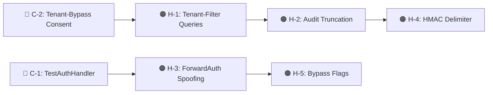

# 🔒 GqlGateway – Security Review

> **Datum:** 2026-09-27  
> **Scope:** Vollständiges Projekt (`/root/gql`) – API, Authentication, SQL/Data Access, Infrastructure, Federation, MCP, Plugins  
> **Methodik:** Manuelle Code-Analyse nach OWASP Top 10, .NET Security Best Practices, Defense-in-Depth, Zero-Trust  
> **Geprüfte Dateien:** 50+ Quellcode-Dateien über alle Layer hinweg

---

## Zusammenfassung

| Severity | Anzahl |
|----------|--------|
| 🔴 CRITICAL | 2 |
| 🟠 HIGH | 5 |
| 🟡 MEDIUM | 5 |
| 🔵 LOW / INFO | 5 |
| **Gesamt** | **17** |

---

## 🔴 CRITICAL Findings

### C-1: Privilege Escalation via TestAuthHandler in Produktion

- **Kategorie:** Authentication / Broken Access Control (OWASP A01, A07)
- **Datei:** [`TestAuthHandler.cs`](file:///root/gql/src/GqlGateway.Api/Security/TestAuthHandler.cs) (Zeilen 30–128)
- **Beschreibung:** Der `TestAuthHandler` liest Benutzeridentitäten, Rollen und Gruppen direkt aus **unverifizierten HTTP-Headern** (`X-Test-User-Sid`, `X-Test-Roles`, `X-Test-Groups`). Wenn dieser Handler versehentlich in einer Nicht-Entwicklungsumgebung aktiviert wird (`EnableTestAuthHandler = true`), kann ein Angreifer **jeden beliebigen Benutzer inkl. Admin impersonieren** – allein durch das Setzen von HTTP-Headern. Zusätzlich wird bei `IsAnonymousAccessAllowed = true` automatisch ein Kontext mit `DeveloperAdmin`, `GovernanceAdmin` und `ClusterAdmin` zugewiesen.
- **Impact:** Vollständige Übernahme des Gateways durch jeden unauthentifizierten Angreifer.
- **Empfehlung:**
  1. Registrierung des `TestAuthHandler` ausschließlich unter `#if DEBUG` oder mit strikter `IWebHostEnvironment.IsDevelopment()`-Prüfung
  2. Automatische Admin-Rollen für anonyme Benutzer entfernen
  3. Startup-Warning oder Hard-Fail wenn `EnableTestAuthHandler` in Produktion gesetzt ist

---

### C-2: Cross-Tenant Authorization Bypass – Fehlende Tenant-Initialisierung bei Consent-Aktivierung

- **Kategorie:** Authorization / Tenant Isolation (OWASP A01)
- **Datei:** [`SqliteGovernanceRepository.Consent.cs`](file:///root/gql/src/GqlGateway.Infrastructure/Persistence/SqliteGovernanceRepository.Consent.cs) (Zeilen 528–573)
- **Beschreibung:** In `ActivateConsentAsync` fehlt `tenant_id` im `SELECT`-Statement. Das `TenantId`-Feld des `ConsentRequest`-Objekts wird nie aus der Datenbank gelesen und bleibt auf dem **Default-Wert**. Dieser uninitalisierte Wert wird anschließend in die `CONSENTS`-Tabelle geschrieben. Folge: **Ein genehmigter Consent wird unter dem falschen/leeren Tenant erstellt** und könnte tenant-übergreifend wirken.
- **Impact:** Vollständige Durchbrechung der Multi-Tenancy-Isolation – Consent-Genehmigungen können auf alle Tenants übergreifen.
- **Empfehlung:**
  1. `r.tenant_id` zum `SELECT`-Statement hinzufügen
  2. Korrekte Zuordnung auf `req.TenantId` bei der Objekt-Initialisierung (wie in `GetConsentRequestAsync`)

---

## 🟠 HIGH Findings

### H-1: Cross-Tenant Data Leak – Fehlender Tenant-Filter in Consent-Queries

- **Kategorie:** Authorization / Tenant Isolation (OWASP A01)
- **Datei:** [`SqliteGovernanceRepository.Consent.cs`](file:///root/gql/src/GqlGateway.Infrastructure/Persistence/SqliteGovernanceRepository.Consent.cs) (Zeilen 31–41, 109–116)
- **Beschreibung:** `GetActiveConsentsForSubjectsAsync` und `GetAllActiveConsentsForSubjectsAsync` filtern Consents **nicht nach `tenant_id`** auf SQL-Ebene. Ein Consent aus Tenant A wird somit auch für Tenant B geladen. Zwar filtert der Caller (`GatewayExecutionService`) manuell nach, aber die Defense-in-Depth-Schicht auf DB-Ebene fehlt.
- **Empfehlung:** `AND c.tenant_id = @tenantId` zu den `WHERE`-Klauseln hinzufügen; `TenantId`-Parameter an die Methoden übergeben.

---

### H-2: Audit-Log-Truncation-Angriff nicht erkennbar

- **Kategorie:** Cryptography / Logging Integrity (OWASP A09)
- **Datei:** [`SqliteGovernanceRepository.Audit.cs`](file:///root/gql/src/GqlGateway.Infrastructure/Persistence/SqliteGovernanceRepository.Audit.cs) (Zeilen 180–227)
- **Beschreibung:** `VerifyAuditHashChainAsync` validiert die HMAC-SHA256-Kette von alt nach neu. Es wird jedoch **nicht überprüft, ob Einträge am Ende gelöscht wurden**. Ein Angreifer mit DB-Zugriff kann die letzten N Zeilen löschen; die Verifikation meldet trotzdem `true`.
- **Empfehlung:** Finalen Hash-Wert gegen eine sicher persistierte Referenz (In-Memory `_lastAuditHash` oder separate tamper-proof Location) validieren. Zusätzlich Zählervergleich einführen.

---

### H-3: Header-Spoofing bei ForwardAuth ohne Proxy-Validierung

- **Kategorie:** Authentication / Insecure Design (OWASP A04, A07)
- **Datei:** [`ForwardAuthAuthenticationHandler.cs`](file:///root/gql/src/GqlGateway.Api/Security/ForwardAuthAuthenticationHandler.cs) (Zeilen 84–117)
- **Beschreibung:** Die `ForwardAuth`-Authentifizierung vertraut Header-Werten (`X-Forwarded-User`, `-Groups`, `-Roles`) bedingungslos, wenn `RequireTrustedProxy = false`. In dieser Konfiguration kann jeder Angreifer **beliebige Rollen und Gruppen-SIDs injizieren**.
- **Empfehlung:**
  1. Proxy-Validierung immer durchsetzen oder expliziten Fallback auf mTLS erzwingen
  2. `RequireTrustedProxy` als Standard auf `true` setzen (✅ bereits Default, aber kein Hard-Fail wenn false)
  3. Netzwerk-Layer: Direktzugriff auf die API unter Bypass des Ingress-Proxys blockieren

---

### H-4: HMAC-Delimiter-Injection im Audit-Log

- **Kategorie:** Cryptography / Integrity (OWASP A08)
- **Datei:** [`SqliteGovernanceRepository.Audit.cs`](file:///root/gql/src/GqlGateway.Infrastructure/Persistence/SqliteGovernanceRepository.Audit.cs) (Zeile 47)
- **Beschreibung:** Der HMAC-Payload wird mit `|` als Delimiter konkateniert. Felder wie `TargetTable`, `TargetColumn` oder `DetailsJson` werden **nicht escaped**. Ein Angreifer kann durch `|` in Eingabedaten die Delimiter-Grenzen verschieben und semantisch unterschiedliche Events mit identischem HMAC erzeugen.
- **Code:**
  ```csharp
  var payload = $"{entry.Id}|{entry.PrevHash}|{entry.OccurredAt:O}|{entry.EventType}|...";
  ```
- **Empfehlung:** Felder vor der Konkatenation Base64-enkodieren, oder die gesamte Entry als kanonischen JSON-String serialisieren.

---

### H-5: Zahlreiche konfigurierbare Security-Bypasses ohne Environment-Guard

- **Kategorie:** Security Misconfiguration (OWASP A05)
- **Datei:** [`GatewayOptions.cs`](file:///root/gql/src/GqlGateway.Domain/Options/GatewayOptions.cs) (Zeilen 31–48, 100–209)
- **Beschreibung:** Das System bietet **18 konfigurierbare Security-Bypass-Flags** (`danger_*` und `warn_*`), darunter:
  - `danger_allow_anonymous_access`
  - `danger_bypass_consent_checks`
  - `danger_disable_column_masking`
  - `danger_bypass_webhook_signature_validation`
  - `danger_bypass_mcp_auth`
  - `danger_allow_insecure_transport`
  
  Diese Flags sind über Konfiguration (Environment-Variablen, `appsettings.json`) in **jeder Umgebung** setzbar. Es existiert zwar `GetAllActiveBypasses()`, aber **kein Hard-Fail oder Startup-Blockade** wenn `danger_*`-Flags in Produktion aktiv sind.
- **Empfehlung:**
  1. `danger_*`-Flags in Nicht-Development-Umgebungen mit `IWebHostEnvironment.IsProduction()` blockieren
  2. Startup-Fail oder prominente Health-Check-Warnung wenn `HasAnySecurityBypassActive` in Production

---

## 🟡 MEDIUM Findings

### M-1: Mutation von geteiltem ClaimsPrincipal

- **Kategorie:** State Management / Concurrency
- **Datei:** [`EnterpriseClaimsTransformation.cs`](file:///root/gql/src/GqlGateway.Api/Security/EnterpriseClaimsTransformation.cs) (Zeilen 16–60)
- **Beschreibung:** Die `IClaimsTransformation`-Implementierung mutiert die eingehende `ClaimsIdentity` direkt. In ASP.NET Core kann der Principal gecacht werden. Direkte Mutation kann zu **Race Conditions** und korruptem Zustand bei parallelen Requests führen.
- **Empfehlung:** Identität vor Modifikation klonen:
  ```csharp
  var clone = identity.Clone();
  clone.AddClaim(...);
  return Task.FromResult(new ClaimsPrincipal(clone));
  ```

---

### M-2: Fehlende explizite Security-Middleware-Registrierung

- **Kategorie:** Security Misconfiguration (OWASP A05)
- **Datei:** [`Program.cs`](file:///root/gql/src/GqlGateway.Api/Program.cs) (Zeilen 36–37)
- **Beschreibung:** Security-Middlewares wie `UseHsts()`, `UseHttpsRedirection()`, `UseCors()`, `UseRateLimiter()` und Security-Headers sind nicht explizit in `Program.cs` sichtbar, sondern hinter `app.UseGatewayPipeline(gatewayOptions)` abstrahiert. Dies erschwert das Security-Auditing und birgt das Risiko einer falschen Middleware-Reihenfolge.
- **Empfehlung:** Kritische Security-Middlewares explizit und in korrekter Reihenfolge in `Program.cs` registrieren.

---

### M-3: Plugin-Loading ohne Pfad-Validierung und Signaturprüfung

- **Kategorie:** Unsafe Code Execution / Supply Chain (OWASP A08)
- **Datei:** [`PluginManager.cs`](file:///root/gql/src/GqlGateway.Infrastructure/Plugins/PluginManager.cs) (Zeilen 41–107)
- **Beschreibung:** `LoadPluginsFromDirectory` lädt alle `*.dll`-Dateien aus einem konfigurierbaren Verzeichnis und instanziiert jeden Typ, der `IHttpDataSourcePlugin` implementiert. Es gibt:
  - **Keine Pfad-Validierung** (Path Traversal durch `../` im Verzeichnispfad)
  - **Keine Signaturprüfung** (kein Authenticode, kein Hash-Whitelist)
  - **Keine Sandbox** (Plugins laufen im Host-Prozess mit vollen Berechtigungen)
- **Empfehlung:**
  1. Plugin-Verzeichnis kanonisieren und gegen eine erlaubte Basis validieren
  2. Optional: Hash-Whitelist oder Strong-Name-Verification
  3. Dokumentation: Security-Anforderungen für Plugin-Autoren definieren

---

### M-4: Hardcodierter HMAC-Fallback-Key in Entwicklung

- **Kategorie:** Secrets Management (OWASP A02)
- **Datei:** [`ColumnMaskingProvider.cs`](file:///root/gql/src/GqlGateway.Application/Services/ColumnMaskingProvider.cs) (Zeilen 35–38)
- **Beschreibung:** In Entwicklungsumgebungen wird ein hardcodierter HMAC-Schlüssel (`dev-only-hmac-salt-secure-fallback`) verwendet. Die Default-Konfiguration `HmacSecretKeyVaultRef = "DEV_INSECURE_TEST_KEY_ONLY"` in [`GatewayOptions.cs`](file:///root/gql/src/GqlGateway.Domain/Options/GatewayOptions.cs#L393) wird als Secret-Referenz interpretiert und bei Fehler als Literal-Fallback genutzt.
- **Impact:** Wenn die Secret-Provider-Konfiguration in Staging/Produktion fehlschlägt, werden Daten mit einem bekannten Key gemaskt.
- **Empfehlung:** Den Literal-Fallback in `ResolveSecretValue` (Zeile 576, `DeclarativeHttpDataSourceExecutor.cs`) entfernen oder auf Development beschränken.

---

### M-5: Secret-Fallback auf Literal-Wert in DeclarativeHttpDataSourceExecutor

- **Kategorie:** Secrets Management (OWASP A02)
- **Datei:** [`DeclarativeHttpDataSourceExecutor.cs`](file:///root/gql/src/GqlGateway.Application/Services/DeclarativeHttpDataSourceExecutor.cs) (Zeilen 559–577)
- **Beschreibung:** `ResolveSecretValue` nutzt den Secret-Referenz-String als **Fallback-Literal**, wenn der Provider keinen Wert liefert (`return secretRefOrValue`). Bei einer Fehlkonfiguration wird die Secret-Referenz-URI selbst als API-Key an Downstream-Services gesendet.
- **Empfehlung:** In Nicht-Entwicklungs-Umgebungen eine `SecurityException` werfen statt des Literal-Fallbacks.

---

## 🔵 LOW / INFO Findings

### L-1: Sensitive Information Logging

- **Kategorie:** Information Exposure (OWASP A09)
- **Dateien:** Diverse Auth-Handler, `DeclarativeHttpDataSourceExecutor.cs` (Zeile 140)
- **Beschreibung:** Debug-Logs enthalten URLs, Remote-IPs und Header-Inhalte bei Auth-Rejections und HTTP-Requests. Bei unzureichender Log-Absicherung können diese für Reconnaissance genutzt werden.
- **Empfehlung:** Sensitive Werte in Logs maskieren; `LogDebug`/`LogInformation` für sicherheitsrelevante Daten prüfen.

---

### L-2: In-Memory Session Store ohne Max-Session-Limit

- **Kategorie:** Denial of Service (OWASP A05)
- **Datei:** [`McpSessionStore.cs`](file:///root/gql/src/GqlGateway.Application/Mcp/Services/McpSessionStore.cs) (Zeilen 12–117)
- **Beschreibung:** Der `McpSessionStore` speichert Sessions in einem `ConcurrentDictionary` ohne Obergrenze. Ein Angreifer könnte durch massenhafte Session-Erstellung den Speicher erschöpfen. Die TTL-Prüfung (1 Stunde) erfolgt erst beim Abruf, nicht proaktiv.
- **Empfehlung:** Maximale Session-Anzahl einführen; periodisches Eviction per Background-Service.

---

### L-3: MCP JSON-RPC-Response-Konstruktion per String-Interpolation

- **Kategorie:** Injection / XSS (OWASP A03)
- **Datei:** [`McpProtocolHandler.cs`](file:///root/gql/src/GqlGateway.Application/Mcp/Services/McpProtocolHandler.cs) (Zeilen 106–262)
- **Beschreibung:** JSON-RPC-Responses werden via String-Interpolation (`$$"""..."""`) statt eines JSON-Serializers konstruiert. Die `EscapeJson`-Funktion deckt Standard-Fälle ab, könnte aber Edge-Cases (Unicode-Escapes, Null-Bytes) verfehlen. Tool-Namen und Descriptions kommen potenziell aus externen Quellen.
- **Empfehlung:** `System.Text.Json.JsonSerializer` für Response-Konstruktion verwenden.

---

### L-4: CDN-API-Tokens in Options-Klassen

- **Kategorie:** Secrets Management
- **Dateien:** [`GatewayOptions.cs`](file:///root/gql/src/GqlGateway.Domain/Options/GatewayOptions.cs) – `CloudflareOptions.ApiToken` (via Caching.Cdn.Cloudflare), `FastlyOptions.ApiKey`, `CollibraOptions.Password`, `PurviewOptions.ClientSecret`, `LakehouseStorageOptions.S3SecretKey`, `LakehouseStorageOptions.AzureAccountKey`, `AuditOptions.Worm.S3SecretKey`
- **Beschreibung:** Mehrere Klassen in `GatewayOptions` akzeptieren **Secrets direkt als Konfigurationsfelder** (Plaintext in `appsettings.json`). Obwohl diese über Environment-Variablen oder Key Vault injiziert werden können, gibt es keinen Enforcement dafür.
- **Empfehlung:** Secret-Felder durch Key-Vault-Referenzen ersetzen; Validierung bei Startup, dass Secrets nicht in `appsettings*.json` stehen.

---

### L-5: Casbin `sub_rule` Blocklist unvollständig

- **Kategorie:** Code Injection (OWASP A03)
- **Datei:** [`CasbinEnforcementService.cs`](file:///root/gql/src/GqlGateway.Application/Governance/CasbinEnforcementService.cs) (Zeilen 64–78)
- **Beschreibung:** Die Blocklist für gefährliche Token in Casbin `sub_rule`-Ausdrücken enthält bekannte .NET-Typen, könnte aber **durch Aliase, Encoding oder neue APIs** umgangen werden. `eval(p.sub_rule)` in der Matcher-Definition ist generell ein Expression-Injection-Risiko.
- **Empfehlung:** Statt Blocklist eine **Allowlist** für sichere Ausdrücke (nur Vergleiche, logische Operatoren, `r.ctx.*`) verwenden.

---

## ✅ Positive Sicherheitsmaßnahmen (bereits implementiert)

| Maßnahme | Status |
|----------|--------|
| SSRF-Schutz mit DNS-Auflösung und IP-Validierung (RFC 1918, Link-Local, Metadata-Hosts) | ✅ Solide implementiert in `DeclarativeHttpDataSourceExecutor` |
| Redirect-Schutz mit Re-Validierung bei HTTP-Weiterleitungen | ✅ `SendWithRedirectProtectionAsync` mit 3-Hop-Limit |
| HMAC-SHA256-Webhook-Signaturprüfung mit `CryptographicOperations.FixedTimeEquals` | ✅ Timing-sicher in `ItsmWebhookHandler` |
| Replay-Schutz mit 5-Minuten-Zeitfenster für Webhooks | ✅ |
| Prompt-Injection-Erkennung in Justification-Texten | ✅ Deterministisch in `OpenJevClient` |
| Token-Budgeting und PII-Scrubbing für MCP/AI-Agenten | ✅ `AiDataGuardrailService` |
| Casbin ABAC Policy Enforcement mit Tenant-Isolation | ✅ |
| Column-Masking mit HMAC-SHA256, Regex-Timeout-Schutz, Span-basiert | ✅ High-Performance in `ColumnMaskingProvider` |
| Header-Denylist für sensible Forward-Header | ✅ `DisallowedForwardHeaders` |
| SSRF-geschützter Plugin-HTTP-Client | ✅ `SsrfProtectedHttpClientFactory` |
| Fail-Closed bei nicht-evaluierbaren RLS-Filtern | ✅ In `GatewayExecutionService.FilterRows` |
| Zero-Trust Context Propagation an Subgraphen | ✅ mit SSRF-Validierung |
| Audit-Log HMAC-SHA256 Hash-Chain | ✅ Tamper-Evident (mit Einschränkungen, s. H-2/H-4) |

---

## Handlungsempfehlung Priorisiert



**Sofort (Sprint 0):** C-1, C-2  
**Kurzfristig (Sprint 1):** H-1, H-2, H-3, H-4, H-5  
**Mittelfristig (Sprint 2–3):** M-1 bis M-5  
**Backlog:** L-1 bis L-5
